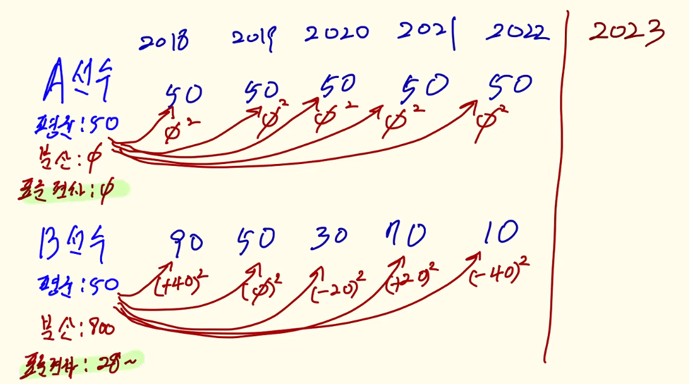
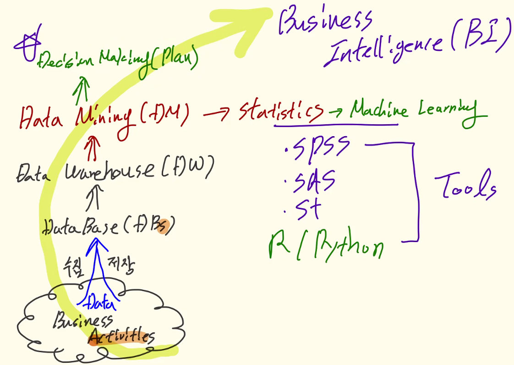
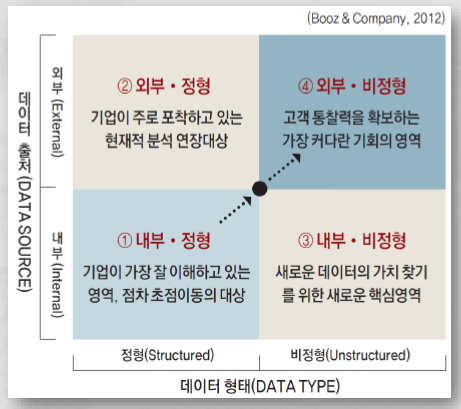
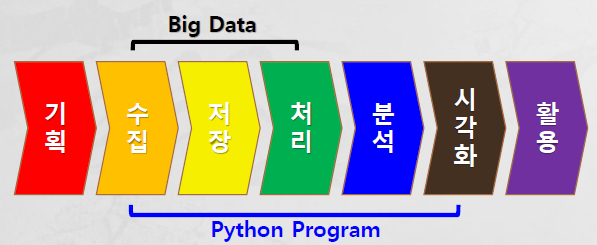
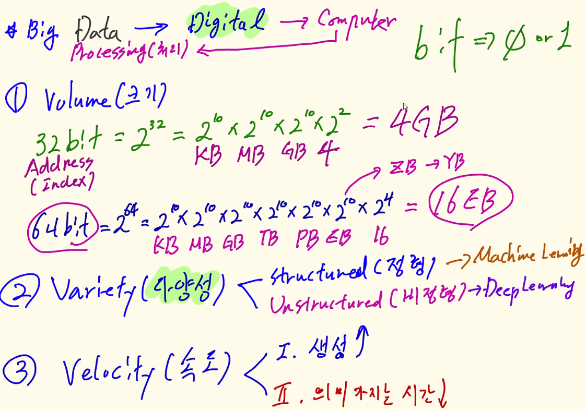

# Python Data Analytics and Visualization 
## 스케쥴 
- Data Analytics: 3일 (9/22~29)
- Machine Learning: 5일 (9/28~10/5)
- Deep Learning: 6일 (10/6~14)
- Sum Up: 1일 (10/17)

## DA Agenda 
1. Data Analytics
2. Anaconda Install and Configuration(Google Colab)
3. Data Type and Operation
4. Data Structure
5. Control Statement
6. Function and Module
7. Class and Package
8. NumPy
9. pandas(Data Prepocessing)
10. Matplotlib
11. seaborn 

## Data Analytics: `과거 행동의 결과들의 특징을 확인하는 일`
- Data : `과거 행동의 결과들`
    - 복수형 (여러개를 칭함)
    - 행동의 결과로 만들어 지는 것 --> 객관적 사실 (행동과 기록이 일치)
    - 과거형
- Analytics: `특징을 확인하는 일` 
    - 통계 (statistics: population의 특징을 확인하는 것)
        - 특징은 2가지
        - 평균 (mean): 중심화 경향치  (데이터가 평균을 중심으로 모여있다)
            - 중앙값 (median), 최빈값 (mode) (빈도)
        - 분산 (var): 산포도 (평균을 기준으로 떨어져 있는 정도의 평균)
            - 표준편자 (std): 평균적으로 떨어져 있는 정도 (변동성, 불확실성/risk, 기량)
            - 범위 (range) (최솟값~최댓값)
        - 데이터의 떨어져 있는 특징과 모여있는 특징을 확인
            - 확인은 수학적인 연산을 통해 한다

        

- Data Analytics
    - `과거 행동의 결과를 보고 미래 행동의 결과에 영향을 주고 싶은 것 `
    - 미래에는 과거의 행동과 다른 행동을 해야 한다. 
        - Decision Making: 미래의 행동을 결정
    - 데이터의 특징을 확인하는 일은 의사결정을 하기위해서다

- Visualization
    - 시각화를 하면 통계의 복잡성을 별도의 설명 없이 이해시킬 수 있다

    

### Decision Making
- Data: Business Activities
- Data Engineering: data를 DB에 수집 저장 하는 것 (DBs)
- Data Warehouse: 전사적인 차원에서 데이터들을 통합해서 보여주는 것 (DB들의 통합)
    - DW에 통합된 데이터들이 너무 많다 그래서..
- Data Mining: 데이터에서 특징을 확인한다 (statistics)
    - 단, 모집단에서 부분집단을 사용하면 통계치가 떨어지기에
    - Machine Learning: 모집단을 전부 활용하려 한다 '

- Decision Making (Plan): Business Activities의 과거행동들의 특징들을 요약해 알려주면 의사결정을 한다 (tools에 의해 자동화 된다)
- Business Intelligence: 경영학에서의 의사결정이다
- Artificial Intelligence: 의사결정도 자동화 시키는 것
    - 모든 AI 모델을 예측 모델이라 부른다 (미래의 행동 제안)

### Data Type & Source

- Type:
    - 정형 (structured): RDB - SQL 
        - type(숫자/문자)
        - size
    - 비정형: 타입이나 사이즈를 지정하지 않아도 처리됨

## DATA SCIENCE

- 비지니스 분석능력: data가 생성된 activities의 이해 
- 컴퓨터 사이언스: Python 
- 수학&통계학 지식

## DATA vs Big Data
### 빅데이터 활용단계

분석 목표 설정 -> 필요한 데이터 정의 -> 데이터 수집 및 전처리 -> 분석 -> 인사이트 도출
- problem -> analytics project -> solution 
- 기획: Data 기반 problem을 해결 가능한가? 
- (전)처리

### Big Data

### Digital Transformation (DT 역량)
 - data 관리 운영