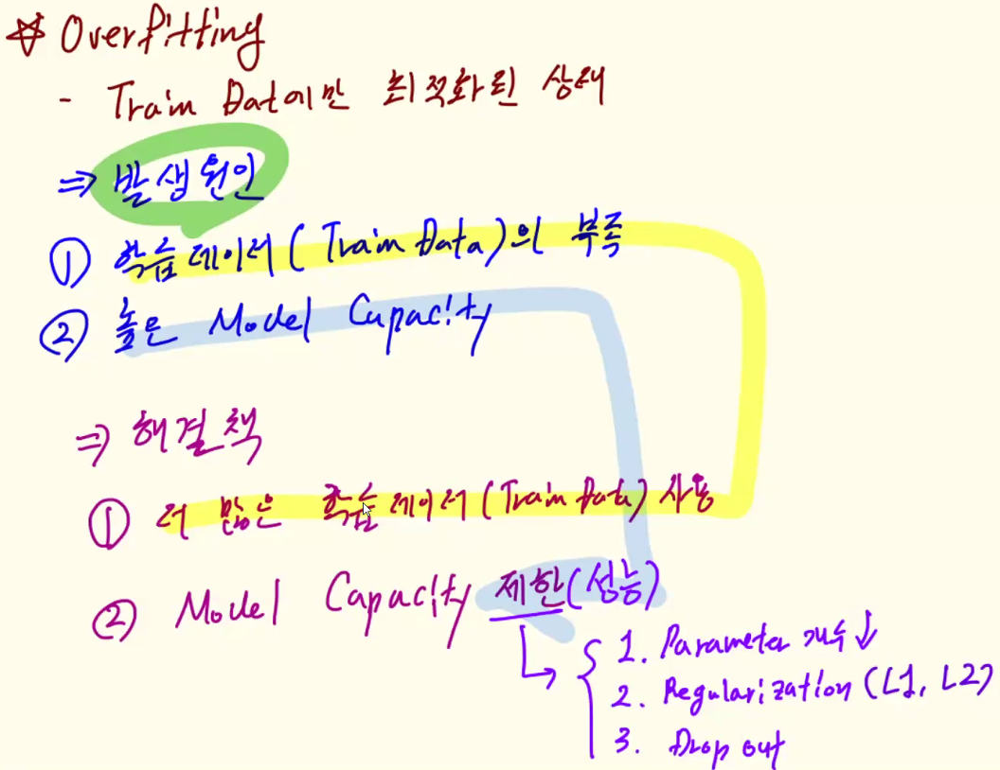
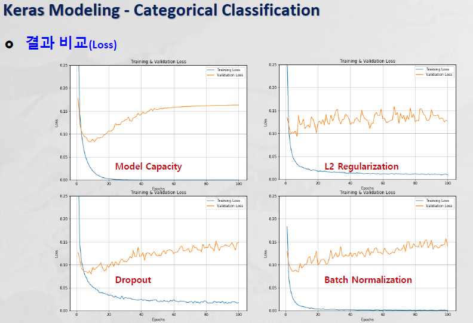

# TensorFlow

## softmax()
- sigmoid 보다 softmax가 더 성능이 좋다 
    - sigmoid(): 함수의 출력값이 각각 0~1 사이의 값을 가짐
    - softmax(): 전체 출력값의 합이 1이 되어야하기 때문에 학습효과가 증가 
    - 한개의 출력값의 변화가 다른 출력값들에게 영향을 주어 경사하강법에 긍정적인 효과를 전달 
    - 누군가가 올라가면 나머지는 내려가기에 y_hat 값이 유력한 쪽으로 확률이 더 올라간다 --> 학습이 훨씬 빠르고 잘 된다 
- 다중 분류의 output layer에 softmax를 쓴다

    
    

## Binary Classification(DNN 모델)
- 이진 분류일 경우에는 output layer에 노드의 갯수가 하나만 있으면 된다 
    - 노드 하나에 0(정상)과 1(사기)이 있기에 

## Categorical Classification 
- categorical cross-entropy error 로 계산하는 게 MSE로 계산하는 것 보다 효율적이다 

# Deep Neural Network 
## Keras Modeling

- Binary Classification
    - IMDB(Internet Movie Database)
- Categorical Classification
    - Handwritten Digits in the M(Mixed)-NIST Database
- Regression Analysis 
    - Boston Housing Price Dataset 

### 실습2: Categorical Classification
- Handwritten Digits in the MNIST Database
- 0~9 까지의 다중분류 
- 손으로쓴 0~9 숫자를 분류해 내는 것 
- 0: black, 1: white

#### 문제점
1. input data reshape 
   - input shape 가 다르다
   - x는 2D (rank2) tensor로 들어간다 
   - input은 한줄로 들어와야 하기에 reshape 해야한다
- 2차원의 이미지를 1차원의 x값으로 바꾸는 reshape 과정 

   

2. x(input data only)
    + y가 없다 
    - y를 labeling 해줘야 한다 

#### Overfiting 

- 학습시키는 데이터(training data)에서는 error가 좋아지는 데 학습시키지 않은 데이터 (validation data)에서는 error가 점점 늘어난다
- train data에만 최적화된 모델의 상태
- 발생원인: 모델이 데이터를 외우는 형태가 되서
    - 학습 데이터(train data)가 부족해서 
    + Model Capacity 가 높아서 
        - parameter의 갯수가 많아져서

#### overfitting 해결책

- 더 많은 학습 데이터 사용 
- model capacity 제한
    - parameter의 갯수 줄이기
    - L2 Regularization (capacity 성능저하)
    - Dropout (capacity 성능 저하)
- Batch Normalization 

#### Model Capacity
- hidden layer 및 node 개수 줄이기 
- hidden layer를 하나로 바꾼다 
    - DNN --> MLP 로 바뀜

-  validation loss 가 줄어 overfitting현상이 줄어든다
- 그리고 성능도 놀랍게 비슷하다 --> hidden layer를 줄여도 상관 없다 

#### Regularization 
> 가중치 계수값에 절대값(L1) 또는 제곱(L2)에 비례하여 비용을 추가하여 작은 가중치값을 취하도록 강제화 

- parameter의 개수를 건들이지 않고 오차함수를 변경한다 
- 규제를 통해 학습을 방해한다 
- 가중치의 제곱에 비례하는 노이즈를 cost function(MSE/CEE)에 추가 (가중치 감쇠)

- L2: Ridge: 제곱값 더해주는 것 (cost function에)
- L1: Lasso: 절댓값 더해주는 것 (cosat function에)

+ train error가 높아져 성능이 나빠졌다 

#### Dropout 
- 훈련과정에서 네트워크의 일부 출력 특성의 연결을 무작위로 제외 시킴

- dense의 fully connected 된 상태에서 학습되는 과정에서 일부 노드의 연결을 끊어 버린다
    - 전체 parameter의 개수가 줄지는 않지만 학습할때는 줄어든 parameter로 한다 

#### Batch Normalization (통계적)
- 주기적으로, 정규분포 형태로 scaling작업을 한다 (평균 작업)
- layer들 사이에 batch normalization을 넣어서 결과들을 정규화해서 다음 layer로 넘긴다 
    - activation 하기점에 
- 활성화 함수의 입력값을 정규화 과정을 수행하여 전달
- Gradient Vanishing 문제 해결 및 더 큰 Learning rate를 사용 가능
- 성능에 영향을 주지 않는다 

- 같이 적용해도 좋다

## Keras Modeling - Regression Analysis 
- regression (y=숫자) DNN
- output layer의 갯수는 1개 
- 수치예측의 마지막 노드의 activation function 없다 --> 고정된 것이 아니기에

Boston Housing Price Dataset

- MAE: Mean Absolute Error: test error를 확인하기 위해 