# Convolutional Neural Network 
- 행렬(convolutional)연산이 추가된 deep learning 

## 합성곱(convolutional) 신경망 알고리즘
- 이미지 처리 작업에 주로 사용
- 함성곱 연산을 이용하여 가중치(W)의 수를 줄이고 연산량을 감소 (modeld performance는 up)
- 여러 개의 Filter(parameter matrix)로 이미지의 특징(feature map)을 추출
+ 이미지가 가지고 있는 특징을 filter가 학습하게 된다 
- local connectivity & parameter sharing
- 말단에 sigmoid 또는 softmax 함수를 적용하여 이미지 분류작업 수행
    -convolution 연산을 할때 activation function이 filter를 학습시킨다
- LeNet, AlexNet, VGGNet, InceptionNet, ResNet 등으로 발전 --> Transfer learning (전의 학습) --> fine tuning (미세조정)

## CNN - Hyperparameter

- Filter
- Stride
- Pooling
- Padding

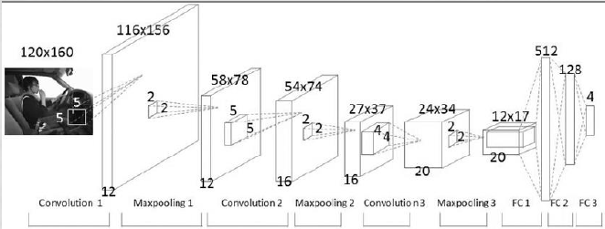

    - CNN Layer or Feature Extraction Layer

- 계속된 convolution을 통해 특징들을 압축시킨다 
- Filter
    - 크기
    - 개수: 5x5의 filter를 12개 쓴 것 
    - 두번째 convolution부터는 입력들어오는 deta의 두깨의 맞춰서 filter도 두깨를 준다 (rank3 tensor)
- pooling
    - convolution연산을 한것에서 절반으로 줄어든다 (2x2)
    - 두깨는 없다 
- FC: DNN Layer: Fully connected (dense)
    - 1자로 펴준다 (flatten)

### Hyperparameter - Filter
- filter를 input_data에 적용하여 특정 맵(feature map) 생성
- filter의 값은 input_data의 특징(feature) 을 학습하는 가중치(w) 행렬
- 동일한 filter로 input_data 전체에 합성곱 연산(convolutional) 적용 

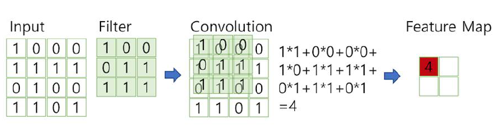
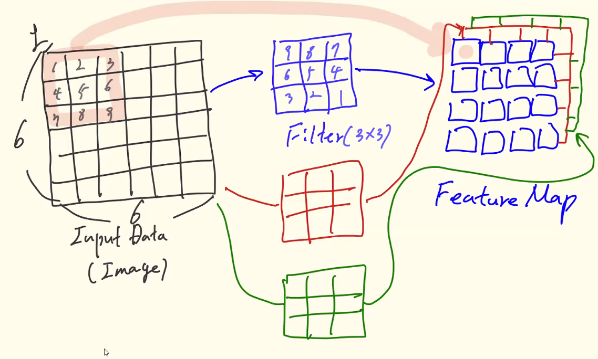

- data의 영역의 있는 숫자를 filter의 숫자와 다 곱해서 합하여 하나의 숫자를 만드는 것 

### Hyperparameter - Stride

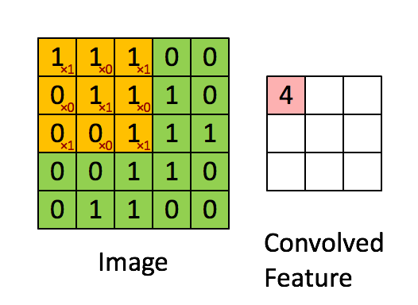

- 5x5 --> 3x3

- Filter를 적용하기 위해 이동하는 위치의 간격 
+ Stride 값이 커지면 출력 특징 맵의 크기가 감소 
- 일반적으로 1칸씩 뛴다

### Hyperparameter - Pooling

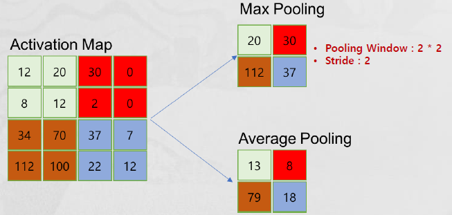

- 가로 및 세로 방향으로 크기를 줄이는 연산 
- pooling window 및 stride 값 지정 
- Maxpooling: 2x2의 공간에서 제일 큰 값 하나만 살리는것
- Averagepooling: 평균값을 뽑는다
- maxpooling 만 쓴다 (더 좋아서)

### Hyperparameter - Padding

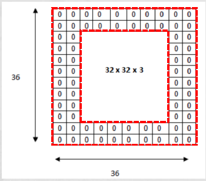

- Padding은 출력 크기를 조정할 목적으로 사용
- 합성곱 연산을 수행하기 전에 Input_Data 주변을 0으로 채우는 것 
- convolution 연산을 하면 작아지게 하기 싫어서 의미없는 0을 채워넣는다 
    - 이렇게 해야 더 깊게 layer를 쌓을 수 있다
- 출력으로 나오는 featuremap이 원본 이미지랑 크기가 달라지지 않는다

## Channel
- n 차원 데이터: n차원 Filter를 사용하여 합성곱 연산 수행
- input_data의 채널 수와 filter의 채널 수는 같아야 함 

    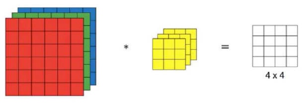

- filter의 크기만 정해주면 갯수 (두깨)는 자동으로 맞춰진다 

## Classification
- CNN의 마지막 단계에 분류를 위한 필터를 적용 (sigmoid or Softmax)

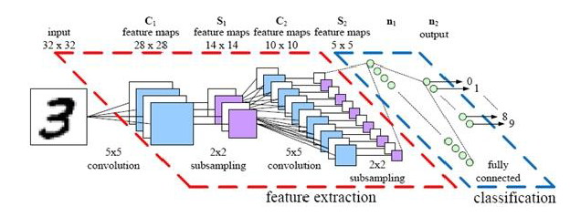

- cnn은 input_data가 2차원 이상으로 들어갈 수 있다 
- feature extraction = CNN
- calssification = DNN 

## 실습 1

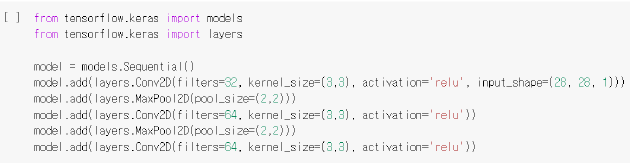

- Kernel_size = filter 크기 

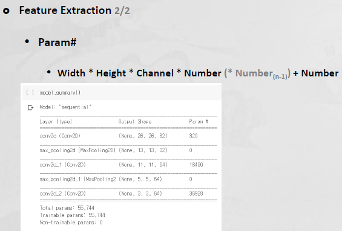

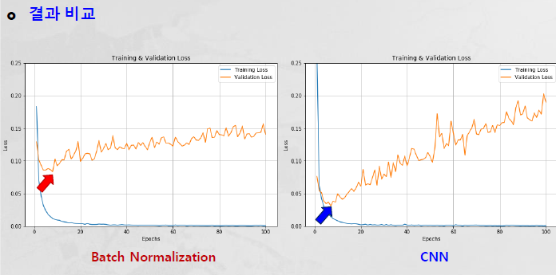

## 실습 2-1
- dogs: 12500, cats: 12500

- 문제
    - image size가 서로 다르다 
    - x_data만 있다 

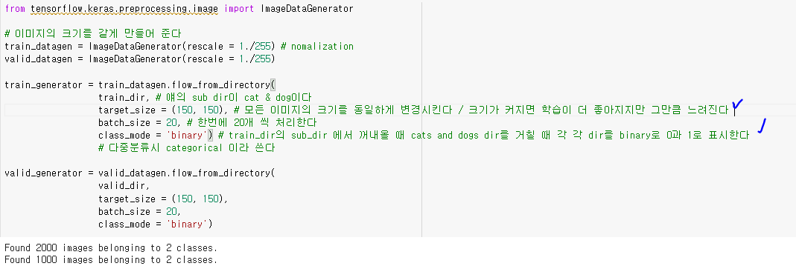

- Flow_from_directory로 image의 사이즈를 통일한다 

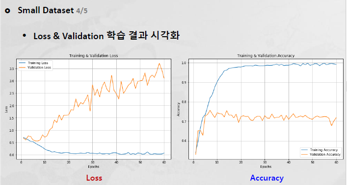

## 실습 2-2 
### Image Augmentation 
- overfitting을 회피하기 위해 더 많은 데이터를 생성하여 사용 
- 오직 train data만 augmentation를 사용한다 

    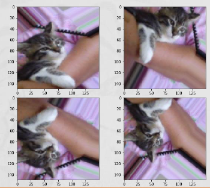

- ImageDataGenerator()
    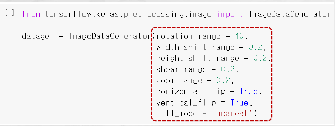
    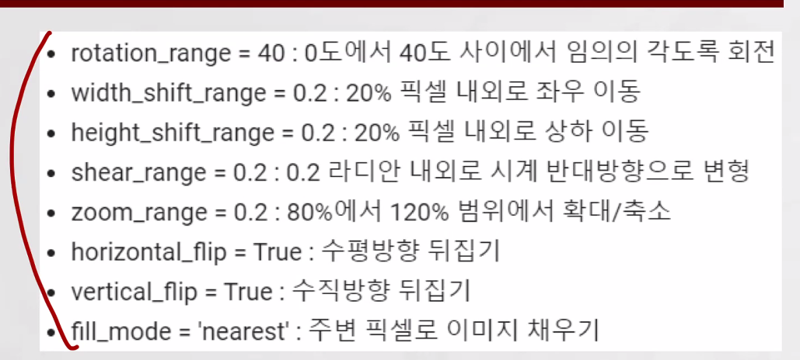
    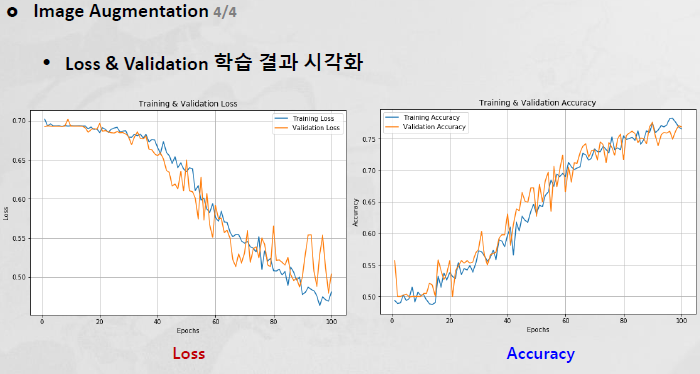

- augmentation 한 이미지를 이용해 학습을 더 하니까 성능이 더 좋아진다

## ImageNet Moment
- imagenet: 100만장이 넘는 이미지를 담고 있는 데이터셋
- ILSVC 경진대회
    - 1000가지의 이미지 클래스를 분류하는 문제

    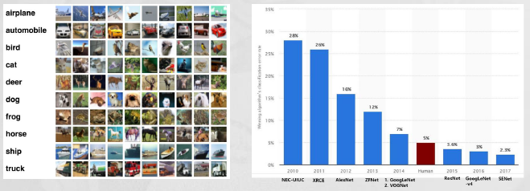

### LeNet
- 얀 르쿤 연구팀에서 개발한 최초의 CNN 구조
- 합성곱(convolution), Subsampling(Max Pooling), Full Connection(Classification)

    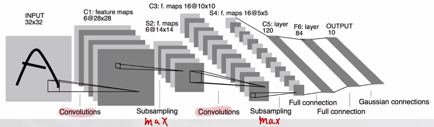

### AlexNet
- 2012 ILSVC 대회 우승 
- LetNet과 유사한 구조이며, 2개의 GPU로 병렬연산 수행 
    - 빠르게 처리

    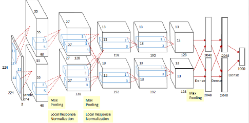

### GoogleNet(InceptionNet)
- 2014
- Inception Module: 총 9개의 가로 방향으로 깊은 구조 
    - convolution과 maxpooling을 많이 하는 것

    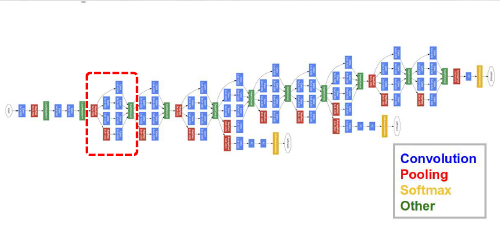

### ResNet
- 2015
- GoogleNet(22 Layers)의 약 7배인 152 Layers로 구성
Layer가 깊어져 학습이 안되는 문제를 skip connection을 통해 해결
- Maxpooling이 없다 --> same padding으로 만듬

### VGGMet
- 2014
- Layer의 개수에 따라 VGG16과 VGG19 두가지 모델로 구성

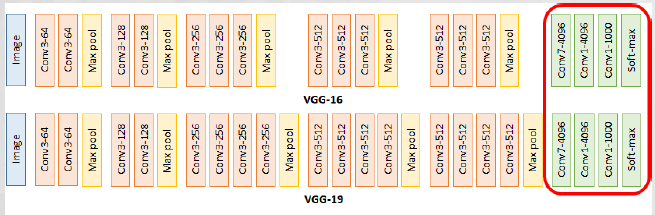

## VGGNet - 실습 2-3 (203)
- feature extration 
    + 사전 학습된 모델을 사용하여 특성 추출(feature Extraction)
        - feature extraction: parameter 재사용
        - classification: parameter 학습
- Transfer learning: 이 사람들이 만든 모델의 parameter를 가져와 쓴다 --> 이게 내가 만든거 보다 성능이 더 좋다  
- fine tuning: 모델의 parameter를 재학습 시키는 것 

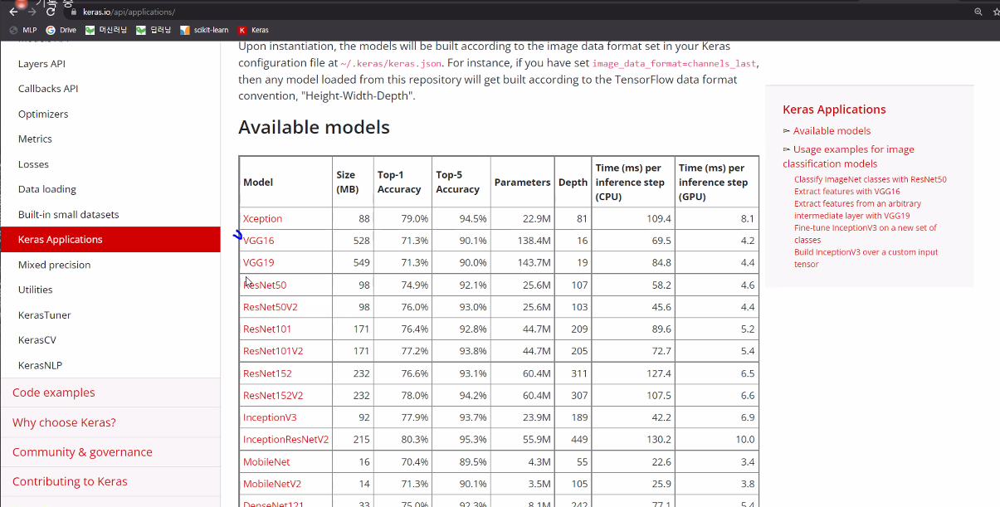

### 방법

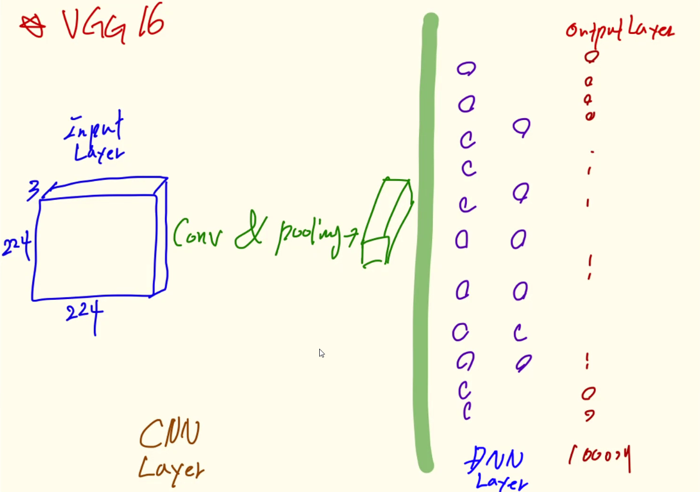
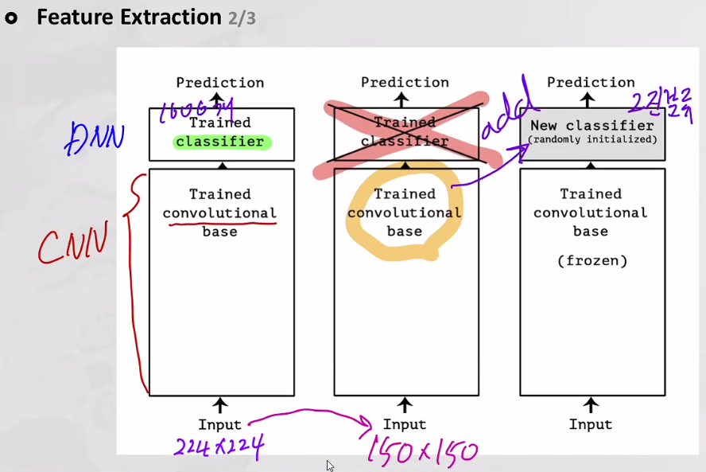

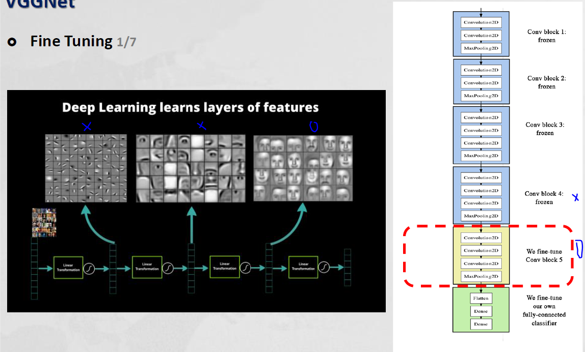

- 앞쪽에 있는 layer들은 객체들의 가까이 있는 것을 학습 시키기에 frozen 시켜 버린다. 재학습을 하지 않고 parameter를 고정시킨다 --> 효율을 위해서 

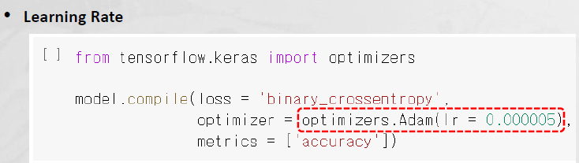

- fine tuning (미세조정) 이라고 부르는 이유는 아주작은 learning rate로 변경하여 재학습 하기 때문

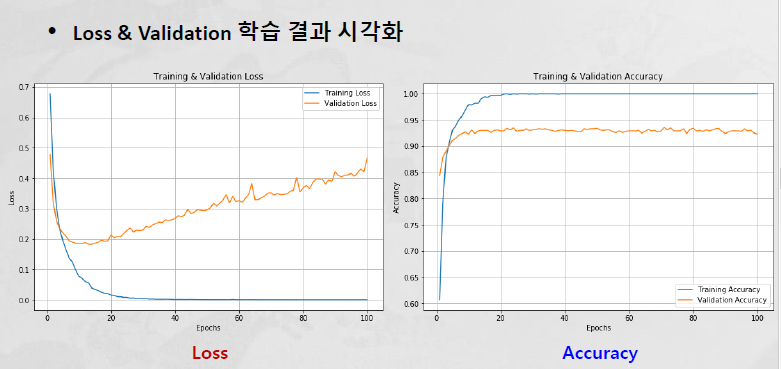
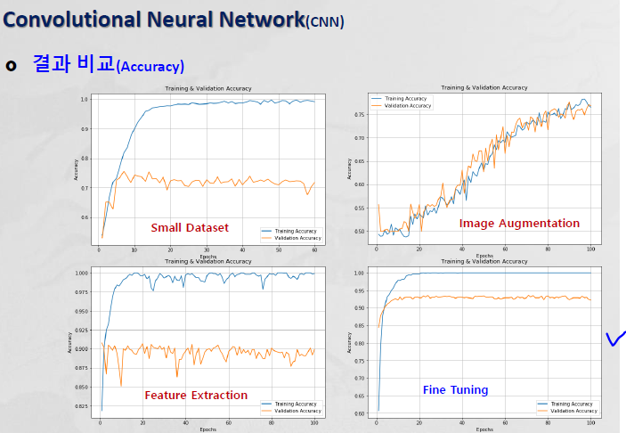

## Image Processing 
### image classification
- 얘를 할때는 무조건 맞는 클래스가 있어야 한다 
- 분류 문제를 할때는 이미지 안에 객체가 어디에 있어도 상관 없다 
### object detection

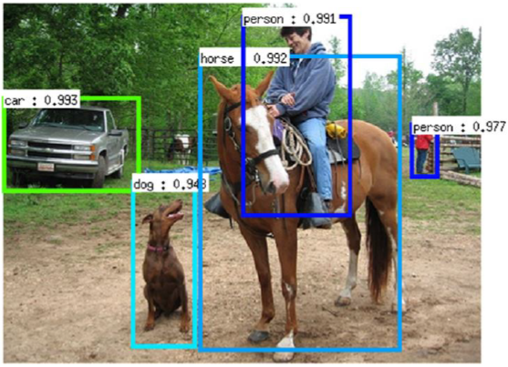

- 이미지 안에 사물을 탐지하는 것
- 이것을 할려면 CNN 방식으로는 안된다 --> label 이 달라져야 한다 

### image segmentation

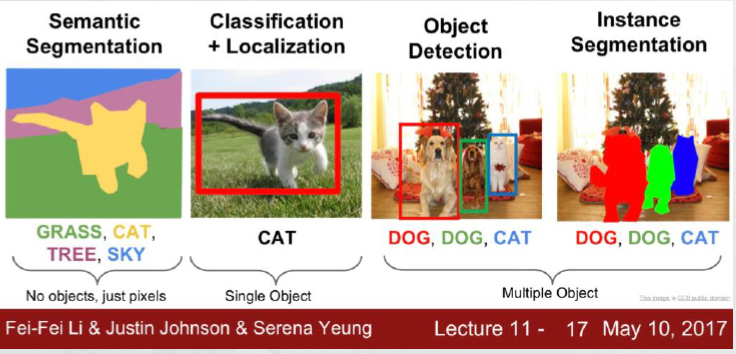

- 정확한 픽셀 단위의 객체의 위치를 파악한다 

### image captioning 

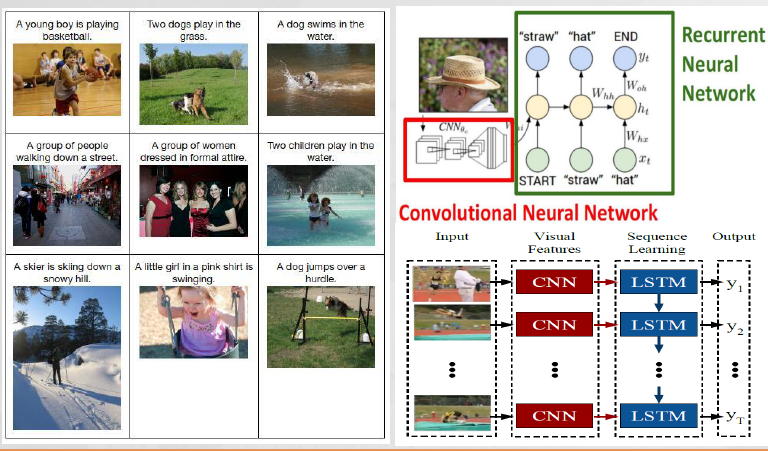

- 이미지 데이터에 대한 설명을 문자로 만들어 주는 것 

