# Recurrent Neural Network
- RNN = LSTM
- 순환 신경망 
- 직전 단계의 기억(short-term-memory)을 사용하여 학습
    - short-term-memory: 이전 단계 처리 결과

    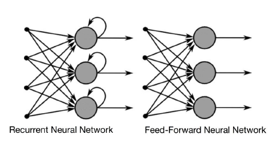

- 입력되는 데이터의 순서의 연결 속성을 학습

## 별도 정의
- RNN은 순서가 있는 데이터를 온전히 파악하기 위하여 은닉층 내에 순환적 구조를 이용하여, 과거의 데이터를 기억해두고 있다가, 새롭게 입력으로 주어지는 데이터와 은닉층에서 기억하고 있는 과거 데이터를 연결 시켜서 그 의미를 알아내는 기능을 수행한다 
- RNN은 원인과 결과, 시간이라는 개념이 들어간것 

## 동작 원리 과정 분석
- Ex) I work at google 문장을 해석하는 RNN 분류기

1. 문장의 각 요소를 단어별로 분리
    - 단어를 벡터로 분리 --> 데이터 전처리 = 형태소 분리
2. 신경망 구조 설계
    - 입력층 - 은닉층 - 출력층 
    + 은닉층: 1계층, tahn 활성화 함수 이용
    + 출력층: 1계층, softmax 함수 이용 
    + 출력층이 분류해내는 분류 클래스로는, 대명사, 명사, 동사, 전치사 이렇게 4가지 유형으로 입력값을 나눈다
3. I가 먼저 입력층에 들어간다. 
    -은닉층과 츨력층을 거쳐 대명사로 분류
4. work
    - 같은 신경망으로 work가 들어가는데, 은닉층에 이전에 넣어준 I라는 값이 남아서 영향을 준다.
    - 동사
5. at
    - 은닉층에 I에 영향을 받은 work가 at에게 영향을 준다
    - 이렇듯, 전의 결과, 전 전의 결과가 계속해서 다음 정보에 영향을 미칠때, recurrent 하게 신경망이 실행되는 것을 RNN이라 한다 

## 순환 신경망 정의
- DNN과 CNN 신경망
    - Layer간의 상태를 기억하지 않고 입력과 출력이 독립적으로 처리
    - 각 hidden layer 마다 독립적으로 가중치(w)를 학습
- 순환 신경망 - 내부 루트가 존재하는 신경망
    - 은닉층의 출력이 계속 순환하면서 입력값과 함께 학습에 사용
        - 은닉층이 하나밖에 없지만 입력의 길이만큼 loop를 돈다
    - 연속적 데이터 처리를 위해서는 이전 단계 처리 정보가 필요
    - 모든 sequence에서 hiddenl layer의 가중치를 공유 

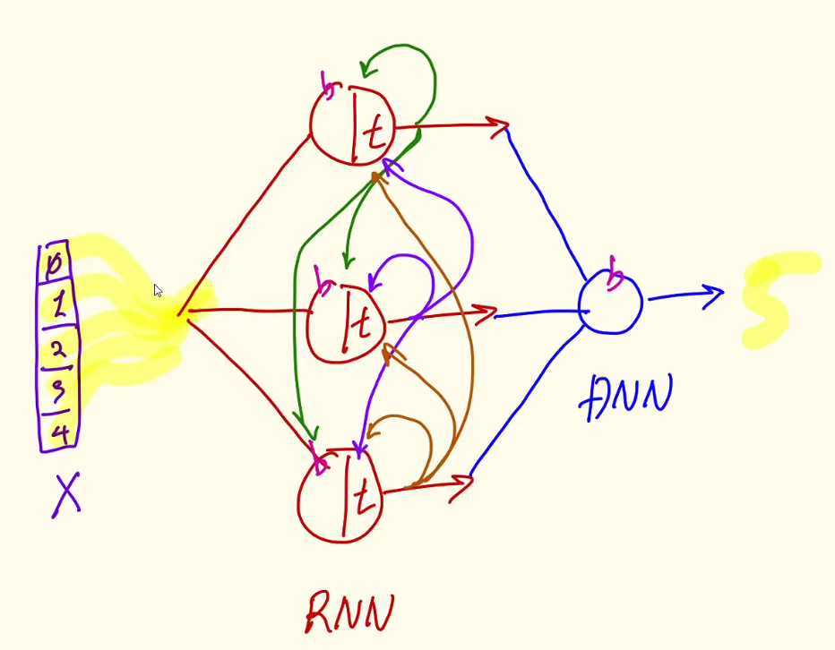

## 단어 정리
- one to one: 이미지 분류
- one to many: 이미지 설명 문장 생성
- many to one: 여러 개의 단어 입력(문장)에 대한 감성 분석(긍정,부정)
- may to many: 기계번역(영어 문장 -> 한글 문장)

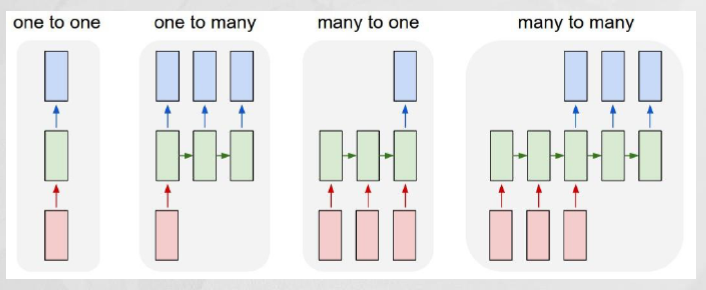

## RNN
- 순차적인 정보를 처리하기 위한 모델 
    - 앞뒤 순서(상호관계)가 존재하는 시계열 데이터
    - 텍스트나 음성 데이터 처리 (번역, 음성인식, 음악, 동영상)

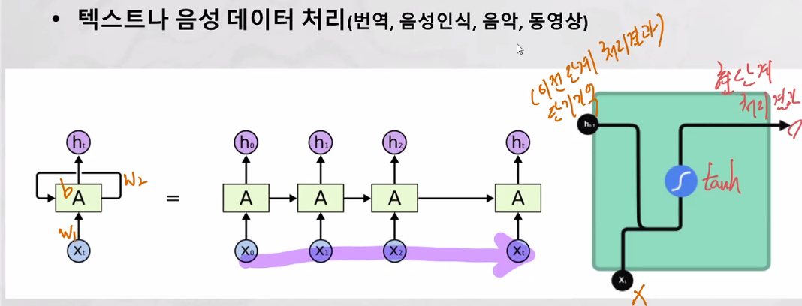
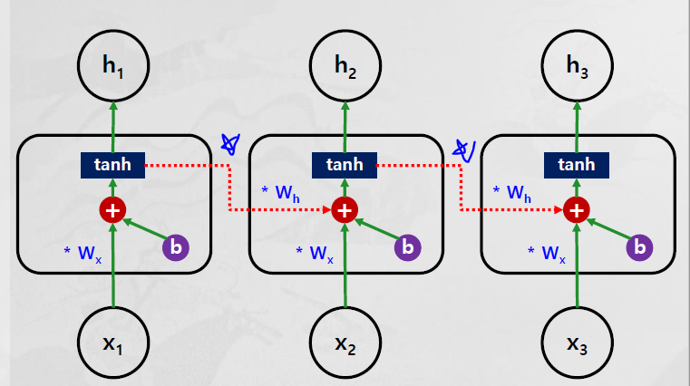

- Wh 가 직전 처리 기억이다 (이전 기억)
- layer은 한개이고 parameter은 3개이다 (Wn, Wh, b)

### 식

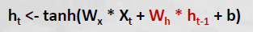

- "+": 직전 기억을 전달
- Wh * h t-1: 단기기억(직전처리결과)
- single layer 가 반복
- sequence data 처리에 적합

- 문제 --> LSTM
    - long-term dependency
        - input 길이가 길어지면 처음 봤던 기억이 소멸된다 
    - BPTT(Back-propagation through time)
        - 역전파 알고리즘으로 학습을 시키는데, loop가 깊어지면  경사소실되는 경우가 발생한다 

## Return Squence
- 이것을 바꿔야지만 output의 갯수를 바꿀 수 있다. 
    - true: 모든 loop의 outuput이 나온다
    - false: 마지막 loop의 output만 나온다 

    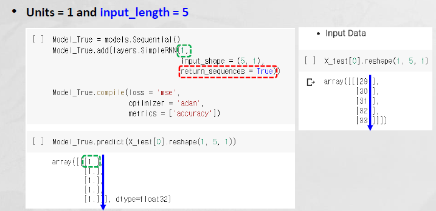

# Long Short-Term Memory 
- 기존 RNN에 Long-Term Memory(Memory Cell) 구조 추가
    - Long-Term Dependency Issue 해결 (입력 데이터가 길어질수록, 학습 능력 하락)
    - Vanishing Gradient 및 exploding gradient Issue 해결
    - memory cell 를 위해 gate구조를 쓴다
- Gate 구조
    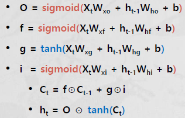

## RNN vs. LSTM

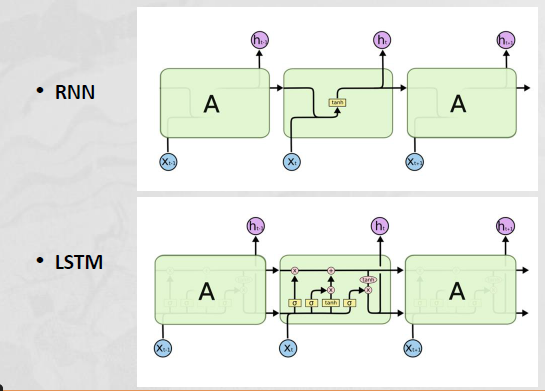

- LSTM
    - 장기 기억과 단기기억을 전부 고려한다 

## 작동방법 

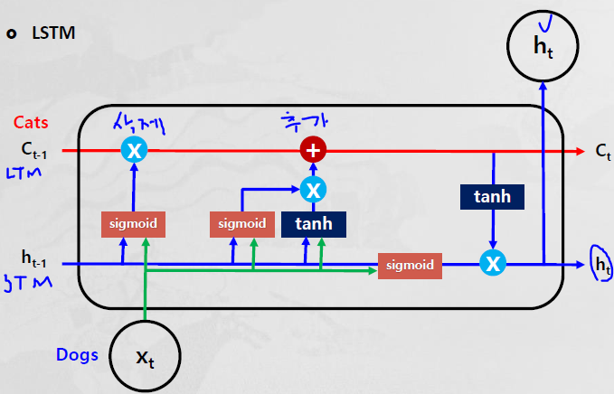

### tanh() vs. sigmoid()

- tanh(): -1~1
    - 정보의 강약 정도
    - 다음 단계에 얼마나 중요한가를 조정
- sigmoid(): 0~1
    - 정보의 반영 비율
    - 다음 단계에 얼마나 반영할지를 조정 

### forget gate
- 새로운 정보(dogs)를 사용하여 과거의 정보(cats)를 잊는(sigmoid) 기능

    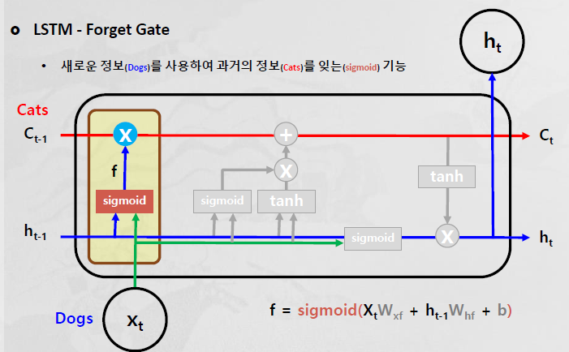

- 장기 기억의 데이터를 지우는 역활을 한다 
- sigmoid로 나온 값을 장기기억에 곱한다 
    - sigmoid의 값이 0.5에 가깝게 나오면 기억이 지워지는 것이고 (dog으로 input)
    - sigmoid의 값이 1에 가깝게 나오면 기억이 유지되는 것이다 (cat으로 input)

### input gate
- 잊혀진 과거의 정보(memory cell)에 새로운 정보(dogs)를 추가하는 기능 

    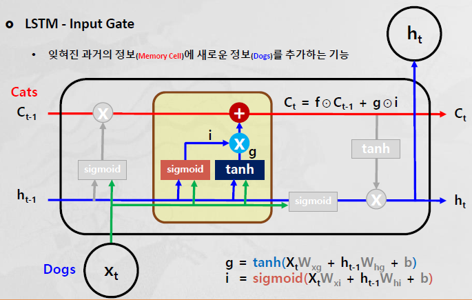

- 장기기억에 sigmoid와 tanh으로 나온 값을 더해준다
- 장기기억에 새로운 내용을 추가한다 

### output gate
- 정보를 출력(ht)하고 상태를 다음 memory cell(Ct)에 전달

    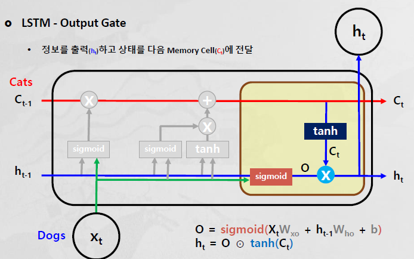

- 장기기억과 단기기억과 이번 단계의 입력을 고려해서 output이 나온다 

### GRU
- LSTM Memory Cell 이 간소화된 버전 
    - 속도는 빠르지만 성능이 나쁘다 

## 실습1
- 시계열(time series) 데이터 분석
    - 주기성(periodicity), 추세(trend), 겨절성(seasonality) 존재
- 서울시 기후 데이터 

- 시계열데이터는 시간 순서에 따라 훈련데이터를 분리 

- self-surpervised: x안에 y가 들어있다  
    - 그래서 학습에 적합하게 x와 y를 재구성 해야한다

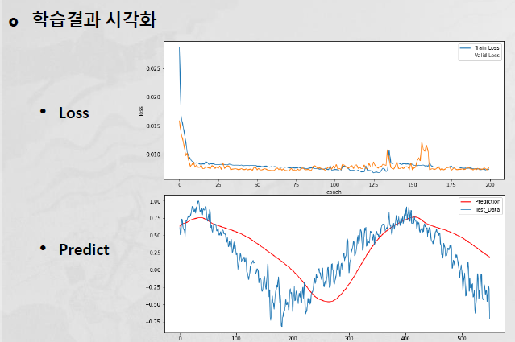

## 실습2 Stacked_LSTM

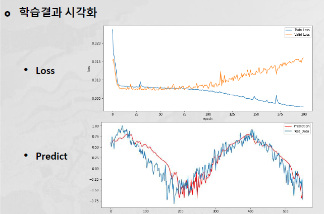

## 실습3 Bidirectional_LSTM model
- parameter를 양쪽으로 학습시켜본다 
    - 2011~2019 & 2019~2011

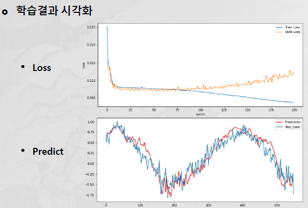