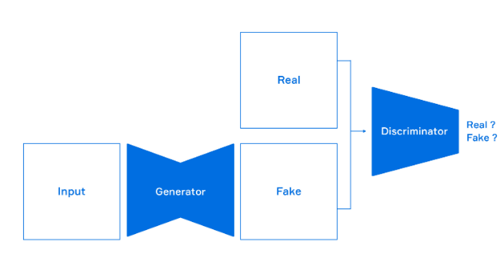

# Generative Adversairal Network
- 생성적, 적대적(경쟁적) 망 
- 두개의 모델이 경쟁을 하면서 학습시키는 방식 
## AutoEncoder
- 비지도학습(x만 사용) / PCA(차원 축소)랑 비슷/ auto=self
- Autoencoder 목적: Latent Space를 학습하는 것
    - 잠재 공간(latent space): 관측 데이터를 잘 설명할 수 있는 공간(manifold)
- 차원 축소(dimensionality Reduction): 관찰 데이터 기반의 잠재 공간 파악하는 것 

    

    - 얼굴의 특징을 latent space라고 한다 
    - 얼굴의 특징을 가지고 있는 잠재 공간을 찾고 싶은 것 
    - 그 특징을 가지고 다시 복원해 낼 수 있나
    - latent space를 학습 시키는것이 autoencoder다 
    - ex) 카메라에서 눈만 크게 만드는 것 

### 정의
- 입력 데이터의 차원축소를 통해 의미있는 잠재 공간을 학습 
- 인코더 학습을 위해 디코더를 사용 
- 인코더와 디코더 두 부분으로 구성
    - 인코더: 인지 네트워크(recognition network)로 입력을 내부 표현으로 변환
    - 디코더: 생성 네트워크(generative network)로 내부 표현을 출력으로 변환
- 입력 데이터(x)와 출력 데이터(x)가 같음
+ 은닉층의 개수를 줄여 제약을 줌
    - 입력 데이터의 축소, 압축 효과
    - 주성분분석(PCA)으로 구현 가능 

    

## Variational AutoEncoder
- 변분추론(cariational inference): 이상적인 확률분포를 모르는 상태에서, 다루기 쉬운(가우시안) 확률분포를 가정하여 모수를 변경하면서 이상적 확률분포에 가깝게 만들어 대신 사용하는 것
- 잠재 벡터의 값을 `가우시안 확률분포` (정규분포) 값의 범위로 제공 
    - 정규분포: 평균과 분산으로 표현 
- autoencoder는 잠재공간의 값을 확정적 값으로 제공 

    

- VAE는 입력 이미지가 통계적 과정을 통하여 생성되었다고 가정
    - 이미지를 2개의 벡터 mean과 log_var로 매핑
    - 이 벡터는 잠재 공간상 확률분포를 정의하고 디코딩을 위한 포인트 샘플링에 사용됨 

        

- 잠재 공간의 정규분포에서 z값을 무작위 샘플링하여 디코더로 생성

    

- VEA는 구조적이고 연속적인 잠재 공간상의 표현(representation)을 생성 

    

- 잠재 공간의 경로를 따라 한 숫자가 다른 숫자로 자연스럽게 변경 

    

## Generative Adversarial Network (GAN)
- 노이즈로부터 새로운 이미지를 만들어 낸다
https://www.naverlabs.com/storyDetail/44

- GAN - 적대적 생성 신경망 (deep fake)

    

- 상반된 목적의 두 신경망 모델이 경쟁을 통하여 학습하고 결과물을 생성 
- 하나는 속이려 하고 다른 하나는 속지 않으려 하는 경쟁상태에서 학습시킨다 
    

    - input: noise
    - generator: 생성
         - 경쟁을 통해 fake image가 real image와 유사하게 만들어 지도록 parameter를 학습시킨다 
    - real & fake: image
    - Discriminator: 판별
        - 데이터가 실제인지 거짓인지 판별 (속지 않기 위해)
   
- 생성자 vs. 판별자
- 생성자는 노이즈 데이터를 기반으로 실제와 비슷한 거진 데이터를 생성
    - 실제에 가까운 거짓 데이터를 생성하는 것이 목적
    - 판별자를 속이지 못한 결과를 입력 받아 반복학습
- 판별자는 입력된 데이터가 실제인지 거짓인지 판별하도록 학습 
    + 생성자의 거짓 데이터에 속지 않는 것이 목적
    - 생성자에게 속은 결과를 입력 받아 반복학습 

    

