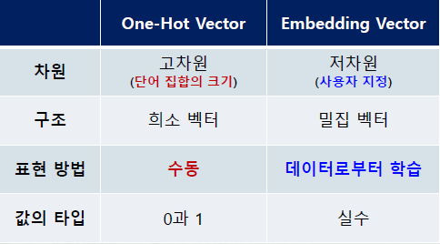

# Natural Language Processing

## NLP 개요
- 학습된 모델로 문장 분류, 문장 요약, 문장 생성, 번역 등의 장업 수행
- 대량의 말뭉치(Corpus)를 딥러닝 모델 학습에 활용
    - 말뭉치: 모델링을 위하여 특정 목적을 가지고 수집한 언어의 표본
- 자연어 처리의 목적은 이해가 아님
    - 연산이나 처리의 영역
- 수학적 연산을 위하여 자연어를 숫자로 변환하는 작업이 필요
- 인간이 사용하는 자연어를 컴퓨터가 연산할 수 있는 벡터로 변환 
    +  vector: 숫자의 나열 

## Prepreocessing
- 자연어 학습을 위하여 수집된 데이터에 대한 전처리 작업이 필요 (cleansing)
- Tokenization
    - Sentence, word, character
    - stop words (불용어)
    + stemming, Lemmatization 
- Encoding(Vectorization)
    - tokenization이 된 것을 숫자로 바꿔준다 
    - 정수 인코딩(integer encoding), 원-핫 인코딩(one-hot encoding)

### Tokenization
- 수집한 말뭉치를 토큰 단위로 나누는 작업
    - 토큰 단위는 의미를 가지는 크기로 정의
- 일반적으로 형태소(morpheme) 단위의 토큰화 수행
    - 형태소란 의미를 가지는 가장 작은 말의 단위를 의미
- 단어 토큰화: 단어를 기준으로 나눈 것
- 문장 토큰화: 토큰의 단위가 문장인 경우 
- 한국어의 경우 조사와 띄어쓰기 등 으로 영어보다 토큰화가 어려움 

### Encpdomg(Vectorization)
- 정수 인코딩
    - 단어를 고유한 정수로 맵핑하는 방식
    - 단어가 2000개라면 각각 단어에 고유한 정수를 인덱스로 부여
- 원핫 인코딩
    - 단어집합 크기의 벡터 차원으로 0과 1을 사용하여 표현
    - 이러한 벡터를 원핫 벡터(one-hot vector)라고 함 

## Language Model

- 언어(단어, 문장)에 존재하는 특징을 표현하기 위해 확률을 할당하는 것 
- 문장(Seqeunce)이 적절한지, 말이 되는지 판단하기 위한 기준
    - P(승객이 버스에 탔다) vs. P(승객이 버스에 태운다)
    - 나는 딥러닝을 ~ p(배운다) vs. P(어렵다) vs. P(고친다) vs. P(가르친다)
- BoW(Bag of Words)
- n-gram
- TF-IDF(Term Frequency - Inverse Document Frequency)

### Bag of Words
- 문장이 가지는 모든 단어(word)를 문맥이나 순서를 무시하고 일괄적으로 `문장에 포함된 단어에 대한 빈도 값을 부여`해 (문장의) **특징**을 추출

- 발생 빈도가 높을 수록 `중요한 단어`로 인식
- 장점 
    + 쉽고 빠른 구축 
    + 예상보다 문장의 특징을 잘 반영
- 단점
    + 언어의 특성상 자주 등장하는 단어에 높은 중요도를 부여 --> TF-IDF
    + 단어의 순서를 고려하지 않아, 문맥 의미 (semantic context) 반영 부족 --> n-gram
    + 희소 행렬(sparse metrix) 을 생성하여 학습 시간 및 성능에 부정적 영향 --> embedding 

### BoW - Feature Vectorization
- M개의 문장(sentnece) 또는 문서(document)
- 모든 단어(term) 추출 시 N 종류의 단어 존재
- M x N 크기의 행렬(term-document matrix) 생성
- unigram 형태로 단어를 하나씩 잘라서 보는 것 
- Ex)
    - A: I like dog
    - B: You like dog
    - C: I hate bug

    

    - 곱하기로 두 문장의 유사도를 비교할 수 있으면
    - A & B = 2
    - B & C = 0
    - C & A = 1

## n-gram
- BoW의 `단어 순서를 무시`하는 단점을 보안
    - 1-gram(Unigram), 2-gram(Bigram), 3-gram(Tigram)
    - 문장을 여러가지 형태로 잘라서 보는 것 
- Ex)
    - Machine Learning is fun and is not boring 

    

## Term Frequency - Inverse Document Frequency (TF-IDF)
- Bow의 `단어의 빈도수만 고려`하는 단점을 보완
    - 개별 문장(문서)에 자주 나타나는 단어에 높은 가중치 부여
    - 모든 문장(문서)에 전반적으로 자주 나타나는 단어에는 패널티(inverse) 부여
- TF Score
    - 특정 문장 (Document)에 등장한 특정 단어 (Term)의 등장 횟수
- IDF Score
    - 특정 단어(Term)가 등장한 문장(Document)의 수
    - 모든 문장에 다 등장하면 중요하지 않다 

- Ex)
    - A: a new book, a used book, a book store
    - B: a dog in a dog house is big
- TF Score: A 

    

- TF Score: B

    

- IDF Score
    
    

- TF-IDF Score

    

## Similarity
- 단어나 문장 간 유사도(similarity)를 비교
    - 단어나 문장을 `벡터로 변화` 후 유사도를 비교
+ Euclidean Distance (거리 기반)
+ Cosine (사잇각 기반)

### Euclidean Distance Similarity
+ 벡터 간의 거리를 계산하여 유사도를 측정
    - 피타고라스 정리 기반 거리 구하기
    - 거리가 가까우면 유사도가 높다

    

+ Cosine Similarity 
    - 두 벡터 간의 사잇각을 계산하여 유사도를 측정

    

## Embedding
- 단어나 문장을 벡터로 변환 후 벡터 공간으로 `끼워 넣는` 의미
    - 학습: 벡터 공간의 크기를 정하고 단어를 그 공간에 위치시키는 것
- Word Embedding은 단어를 희소 표현이 아닌 밀집 표현으로 변환
- 희소 표현 (sparse representation) 
    - 차원이 말뭉치에 따라 결정됨
    - 대부분 값이 0으로 표현되어, 공간낭비 발생 및 단어의 의미를 담지 못함
- 밀집 표현(dense representation)
    - 지정된 차원의 밀집 벡터로, 실수값을 사용하여 표현 

### One-Hot Vector vs. Embedding Vector

- 고차원: 차원이 결정되어 있다 -> 계산만 하면 된다
- 저차원: 차원을 지정한다 -> 데이터로부터 학습해야 한다 (Deep Learning)

## word2vec
- 문자를 숫자화 시킨다 (embeding하는 종류중 하나)
- One-Hot Encoding 및 이전 similarity 방식의 단점 보완
- 문장 내의 `비슷한 위치(neighbor words)`에 있는 단어로부터 유사도 획득
    - neighbor words: 벡터 스페이스 공간산에 비슷한 위치에 있는 words --> 분포 가설 

    

- 각각의 단어 벡터가 단어 간 유사도를 반영한 값을 가지고 있음
- 분산 표현 (distributed representation)
    - 분포 가설: 비슷한 위치에 등장하는 단어는 비슷한 의미를 가짐 

    

### CBOW(Continuous Bag of Words)
- **주변**에 있는 단어를 사용하여 **중간**에 있는 단어를 예측하는 방법
- 2 windows : "The fat cat sat on the mat" Center Word, Context Word
- 윈도우를 이동(sliding Window) 하며 생성된 데이터로 임베딩 학습
### Skip-gram
- ***중간에*** 있는 단어를 사용하여 ***주변***에 있는 단어를 예측하는 방법
- 2 windows : "The fat cat sat on the mat" Center Word, Context Word
- 윈도우 크기만큼 주변 단어를 사용하여 생성된 데이터로 임베딩 학습

#### Skip-gram(2 windows) train_data generation
- "The fat cat sat on the mat"

    

### word2vec deep learning model

    - input 하고 target를 넣어서 가운데 embedding layer를 학습시키는 것이다

## 최근 NLP 동향: Transfer Learning 과 Fine Tuning
- BERT(Bidrectional Encoder Representations from Transformer)
    - 다른 단어와의 관계(attention)를 통하여 임베딩 매트릭스 생성
    - Transformer Self-Attention 구조 사용
+ GPT(Generative Pre-Training)
    - OpenAI의 NLP 모델
    - Masked Language Model 

# CNN 실습 

## YOLO 모델링
- 사람 얼굴 사진과 얼굴이 마스크를 썼는지 안 썼는지에 대한 정보와 위치 정보를 제공하는 데이터 셋을 불러온다 
    - x: 사진
    - y: 정보 

- labelIng 프로그램: 사진(x)에 대한 정보(y)를 만들어 준다 

    

    https://velog.io/@kimsoohyun/YOLO-%EC%9D%B4%EB%AF%B8%EC%A7%80-%EB%9D%BC%EB%B2%A8%EB%A7%81%EC%9D%84-%EC%9C%84%ED%95%9C-labelImg-%EC%82%AC%EC%9A%A9%EB%B2%95#%EC%84%A4%EC%B9%98-%EB%B0%8F-%EC%8B%A4%ED%96%89
    