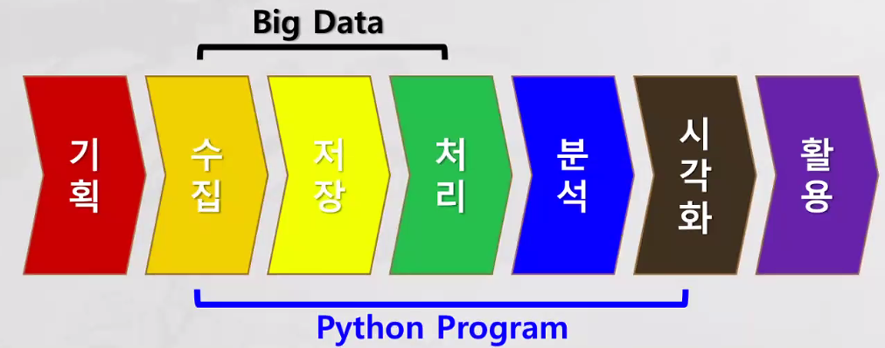
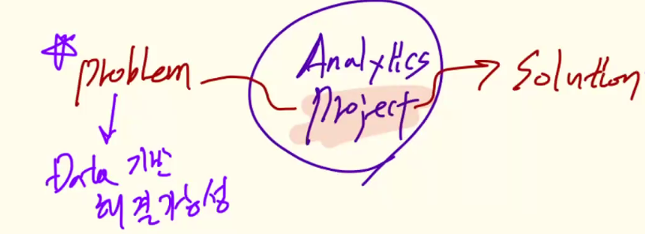

# Project (Management)
- 약속된 시간에 약속된 자원(비용)을 가지고 약속된 산출물을 만들어 내는 것이다

## 주제 선정
> 약속된 산출물을 정하는 것 

- 활용되는 부분에서 산출물이 나오는 것 

- 프로젝트를 실행함에 있어 활동들을 하게 되는데 그러한 활동들이 
    - 기획
    - 수집 
    - 저장 (x) 
    - 전처리
    - 분석
        - EDA (시각화)
        - Modeling (시각화)
    - 시각화

## 정삼각형 이론 (Quality에 영향을 주는 이론)
- 시간 (time)
- 비용 (cost)
- 범위 (scope)

- 위의 셋은 유기적으로 연결되어 있어서 3부분의 관리를 잘 해야한다
    - WBS를 이용하여 관리한다 

- Quality: 수업에서 학습했던 내용을 충분히 반영 했는가? 
