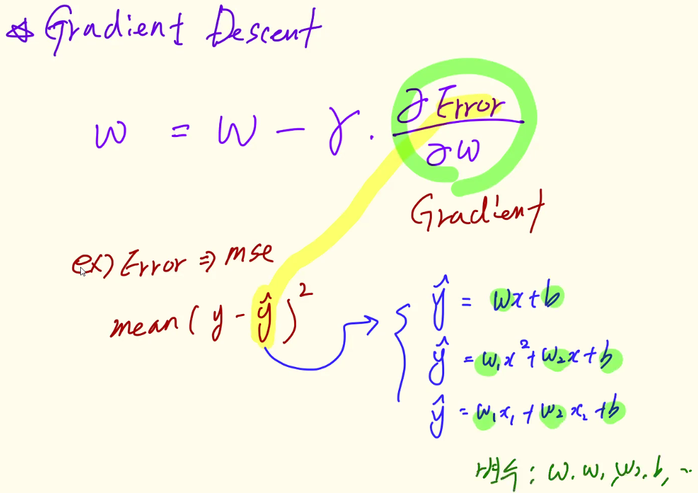
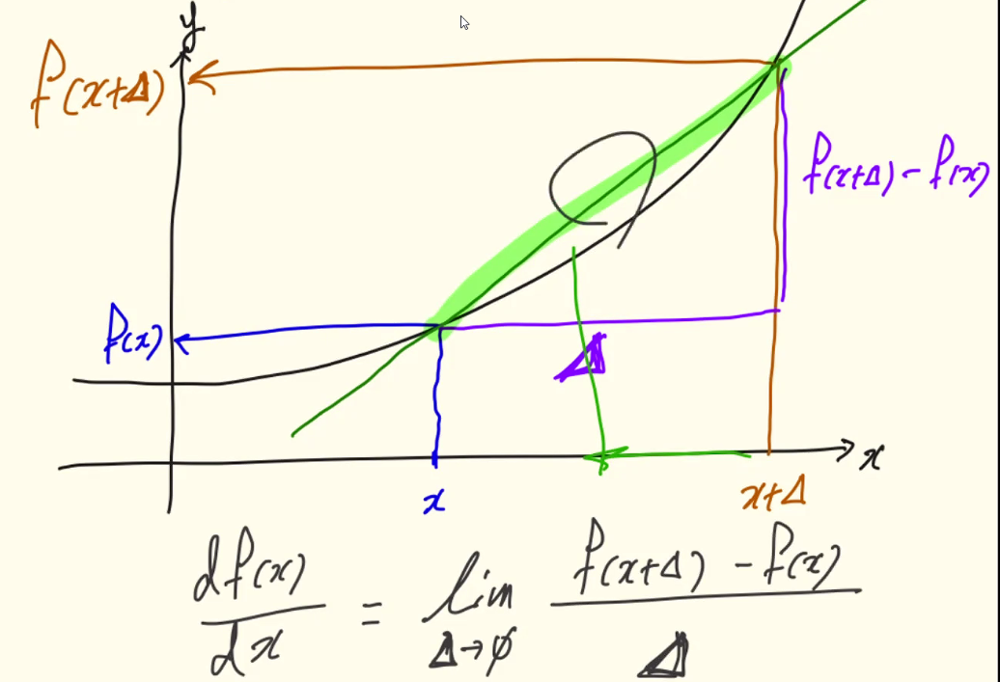
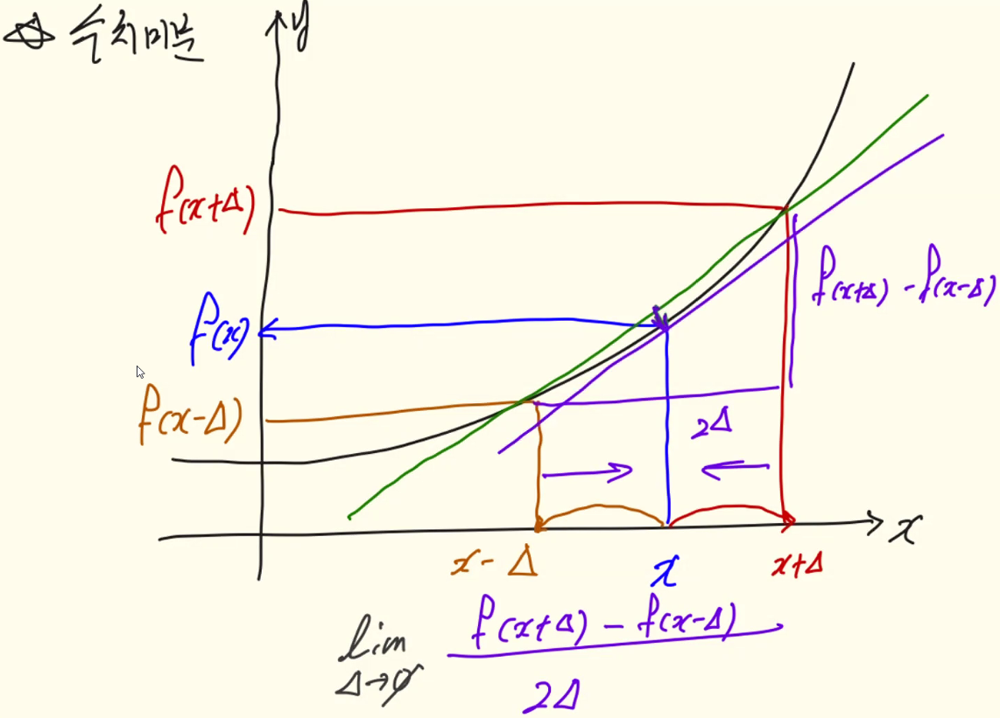
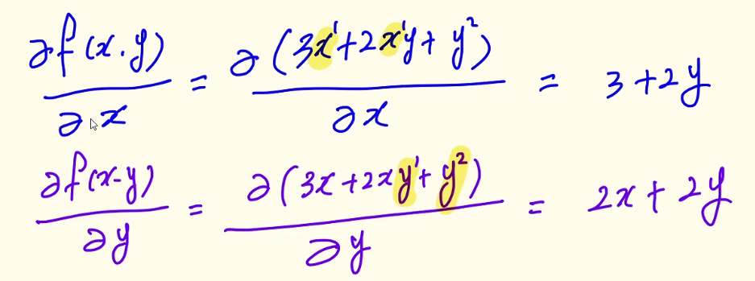

# Deep Learning 
## Agenda
1. Artificial Neural Network (ANN)
2. Error Backpropagation
3. Optimization Method
4. TensorFlow
5. Deep Neural Network (DNN)
6. Convolutional Neural Network (CNN)
7. Recurrent Neural Network (RNN)
8. Long Short-Term Memory (LSTM)
9. Generative Adversarial Network (GAN)

## Brain Storming
- Unstructured Data Modeling (비정형 데이터 모델링)
- 머신러닝 알고리즘에 딥러닝이 포함되어 있다
    - 머신 러닝의 지도학습 '신경망 알고리즘'의 확장이 딥러닝이다 

# Artificial Neural Network
## Neural Network
> 

- 인공 신경망 (Artificial Neural Network)
    - 머신러닝 분야에서 연구되는 학습 알고리즘
    - 수치예측, 범주예측, 패턴 인식, 제어 분야에 응용
- 인간의 뇌 구조를 모방하여 만들어짐 (신경세표: Neuron)
    - 수상돌기 (Dendrite), 시냅스 (Synapse), 신경세포체 (Soma), 축색 (Axon)
        - **수상돌기 = 입력 (x), 축색 = 출력 (y)**
        - **시냅스 = 가중값을 갖는 연결 네트워크 (w), 신경세포체 = 노드 (함수)**

### 생물학적 신경망 vs. 인공 신경망 

- 다중회귀로 자극 (x값을) 다 더해서 y값으로 출력을 준다  
--> logistic regression이랑 별반 다르지 않다 

- activation function = sigmoid 

## Deep Learning 
- 심층 학습: 여러개의 함수들이 hidden-layer 두개 이상으로 연결되어 
- parameter의 개수를 증가시키기 위해서 여러개의 함수를 연결해서 modeling 

## Perceptron = Node = sigmoid 함수
- 정의
    - 인공신경망의 한 종류 (선형 분리기)
    - 가장 간단한 형태의 forward network (왼쪽에서 오른쪽으로 방향성)
    - 1957년 프랑크 로젠블라트에 의해 고안
- 동작원리
    - 노드의 입력값(input)과 가중치(weight)의 곱을 모두 합함
    - 합한 값이 활성화 함수의 임계치보다 크면 1 작으면 0을 출력
    - y = sigmoid(w1x1+w2x2+w3x3+...+b) --> 0~1

### Logic Gate (진리표)
- True: 1 / False: 0

    

- NAND: AND의 반대
- XOR: 두개가 같으면 거짓, 다르면 참

- perceptron으로 학습을 해서 logic gate를 만들어내는데 성공함 

#### perceptron: 

- 학습 parameter의 update

#### Classification - AND
- Learning Algorithm: AND로 동작하기 위한 W와 B의 값을 찾는것 

    

    - W와 B는 경사하강법으로 바뀌면서 학습한다 
    - 초록색 선이 perceptron 함수 
    - true인 지역과 false인 지역을 나누는 것이 선의 목적 

    

#### Perception - AND, OR
- ŷ = sigmoid(WX+b)
    + 수학에서 대문자로 표시된 영문자는 행렬이다 

    

#### Perception - XOR
- XOR은 perceptron으로 학습이 안된다
- 선 하나로 true인 지역과 false인 지역으로 나눌 수 없다 

    

### learning(): 경사하강

` w = w - r (d*Error / d*w)`

- (d*Error / d*w): gradient 
- Error = MSE : mean(y-ŷ)^2

#### 미분
- 일반 미분
    - 접선의 기울기 = 순간 변화량 (밑변/높이)

        

- 수치 미분 

    

    - error 함수가 계속 바뀌기에 수치 미분으로 하는 것

- 편미분 (변화량)
    - 변수가 2개 이상인 가변수 함수 
        - 대상 변수 1개을 제외한 나머지는 상수로 취급해 진행하는 방정식 

            

    - 데이터 분석의 관점에서 변수가 바뀌면 결과가 어떤 변화량을 가지냐를 나타낸다
        + ex) 체중 = 운동량 + 식사량 -> 운동량이 변화에 따른 체중의 변화량을 보고 싶은 것
        - d Error / d w: w의 변화에 따른 error의 변화량을 알고 싶은 것이다 
        - d Error / d b: b의 변화에 따른 error의 변화량을 구하는 것
        - 변화량: Gradient 

###    Multi-Layer Perceptron

- Nonlinear Model

- layer을 많이 하려는 이유는 parameter를 많이 사용하고 싶어서 그런 것
- 다중 퍼셉트론: 퍼셉트론으로 해결할 수 없는 비선형 분리 문제에 필요
- 여러 층(layer)의 퍼셉트론(node)을 쌓아서 동작 (Input - Hidden - Output)

    
    

#### Deep Neural Network (DNN)

