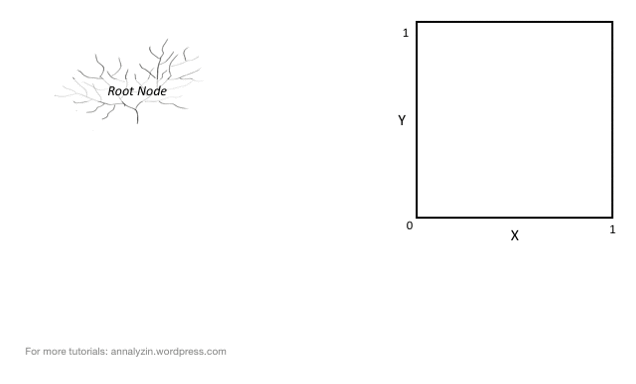

# Decision Tree
> - 나무가 만들어 질때 split되는 rule set을 entropy의 낮은 지점을 찾으며 학습시키는 것

## 정의1
- 가능한 대답이 두가지인 이진 질의 (Binary Question)의 분류 규칙을 바탕으로 최상위 루트 노드 (Root Node)의 질의 겨로가에 따라 가지 (Branch)를 타고 이동하며 최종적으로 분류 또는 예측값을 나타내는 리프(Leaf) 까지 도달
    - 범주형 자료: Classification Tree (분류 나무)
    - 수치형 자료: Regression Tree (예측 나무)
- Rule 기반 의사결정 모델
    + Ex) Rule: IF 흡연 > 5년 AND 운동량 < 3회 THEN "위험"

- 머신이 split을 entropy가 가장 낮아지는 지점에 해서 x와 y를 나눈다
- 모두의 entropy가 0인 상태로 split이 끝난다 
- 분류 규칙도 알아서 정해진다

## 정의2
- Root Node: 최상위 노드
    - Splitting: 하위 노드로 분리되는 것
        - Splitting 학습의 원리: 불순도가 낮아지는 방향으로 발생 
        - 불순도를 정량적으로 측정하는 방식이 entropy
    - Branch: 노드들의 연결 (의사결정나무의 일부분/sub-tree)
- Decision Node: 2개 하위 노드로 분리되는 노드 (split이 발생하는 노드)
    - Parent Node: 분리가 발생하는 노드
- Leaf(terminal node): 더 이상 분리되지 않는 최하위 노드
    - Child Node: 분리가 발생한 후 하위 노드

## 정의3
- 규칙 기반으로 직관적으로 이해하기 쉽고 설명력이 좋은 알고리즘 
    - 각 노드 별로 `불순도`에 기반한 최적의 분류 규칙을 적용
    - 분리 과정을 반복하면서 의사결정나무가 성장
    - 각 리프는 `동질성`이 높은 적은 수의 데이터 포인트를 포함 
- 동질성이 높은 그룹 구성을 위해 재귀적 파티셔닝 수행
    - 1단계: 동질성이 높은 두 그룹으로 나눌 수 있는 이진 질의 적용
    - 2단계: 종료 조건을 만족할 때까지 1단계를 반복

- 과적합 (overfitting) 문제
    - 각 노드는 동질성이 높고 불순도가 낮은 방향으로 분리 
    - 너무 복잡하고 큰 의사결정나무 모델을 생성하여 과적합 문제 발생
- 대응방법 - 가지치기 (pruning)
    - 모델 성능 향상 및 과적합 예방 목적
    - max_depth: 의사결정나무의 성장 깊이를 지정
    + min_samples_leaf: 리프에 들어가는 최소의 샘플의 개수 지정 

## 불순도 계산 방식: Entropy vs. Gini Impurity Index

  

  - x1 과 x2 중 무엇을 써야 하는가?

### Entropy

- 분리 정보 이득이 큰 특징으로 분리 발생
- 분리 정보 이득 = 질문 전 Entropy - `질문 후 Entropy`
    - 분리정보이득이 큰 방향으로 split 
    - 질문후 entropy가 작은 특징으로 split 발생 

- 질문전 Entropy
    
    

- (소득)분리 정보 이득: 1 - 0.966 = 0.034
    - 질문전 = 1
    - 질문후 = 0.966

- (학생)분리 정보 이득: 1 - 0 = 1
    - 질문전 = 1
    - 질문후 = 0

--> 학생의 x를 선택 

### Gini Impurity Index 

- 특징 지니 지수가 클수록 불순도가 낮음
- 지니 불순도 지수가 `작은 특징`으로 의사결정 나무의 노드를 분리

- 지니 지수 적용
    - 두 개의 특징으로 분리된 각 노드의 지니 지수를 계산
    - 두 개의 결과를 사용하여 특징 지니 지수 계산 
    - 지니 불순도 계수 (0~0.5 사이의 값) = 1 - 특징 지니 지수 

    
    

# Random Forest (Ensemble)
> 다양성과 임의성을 이용하여 여러개의 서로 다른 모양의 나무들을 만든다

- 덜 정확한 분류모델 여러 개를 모아서 더 정확한 분류모델을 만들 수 있을까?
    - 앙상블(ensemble): 여러가지 모델을 사용하여 정확도를 개선하는 방법
    - 앙상블: 선형모델 + 의사결정나무 + 신경망모델
- 랜덤 포레스트: 의사결정나무의 앙상블
    - 다수의 의사결정나무들의 결과로부터 모델을 생성
    - 모델 생성에 다양성 (Diversity)과 임의성(random)을 부여
    - `모델 생성에 다양성과 임의성을 부여`
    - 모델 정확도를 높이고 과적합 발생 가능성을 낮춤 
    - 올바른 예측은 강화하고, 잘못된 예측은 상쇄하는 경향 존재 

## 다양성 (Diversity) 
### 다양성 - 배깅 (Bagging)
- Bagging = Bootstrap + Aggregating
- 주어진 Data를 사용하여 `여러 개의 서로 다른 train data`를 생성
    - 생성된 train data 마다 별도의 의사결정 나무 모델 생성
    - Hyperparameter (`n_estimators`)로 의사결정 나무 개수 지정
- 개별 train data는 Bootstrap 방식으로 생성
    + Bootstrap Data는 original data에서 `단순 복원 임의추출법`으로 생성 
    + 동일크기로 복원 추출 하지만 구성이 다르다 
    - n_estimator: 나무의 갯수 

### 댜양성 - Bootstrap
- Original Data vs. Bootstrap Data
- n_estimators = 3

### 다양성 - Aggregating
- 여러 개의 Bootstrap 모델의 결과를 통합
    + Hyperparameter: `n_estimators`
- 분류 모델: 다수결 또는 가중치를 적용하여 통합
    + ex) y_hat = {1,0,0,0,1,1,1,1,1} = 1
- 예측 모델: 평균값 또는 가중평균값으로 통합
    + ex) y_hat = {77,75,76,77,76} = 76.2

## 임의성 - Random Subspace
- 의사결정나무 생성 시 변수 무작위 선택
- 원래 변수(feature)에서 무작위로 입력 변수를 추출하여 적용
- 무작위 입력 변수의 개수를 `1~전체 변수의 개수 사이`에서 지정 
- Hyperparameter: `max_features`
    - 기본값: `sqrt(`변수의 개수`)`

- max_features = 3

- 첫번째: 랜덤하게 x2,x5,x9가 선택되고, 그중에서 entropy가 가장 낮은게 x5이다. 개속 반복 
- split이 필요할 때 마다 지정된 개수만큼 뽑아서 쓴다 

- bagging: 데이터를 뽑아내는 것
- 임의성: 그 데이터에서 random하게 features을 뽑는다 

### Decision Tree vs. Random Forest - Feature Importance

### hyperparameter Tuning

## Cross Validation
- 교차 검증 
    - overfitting을 방지하기 위하여 수행
    - validation을 한번만 수행하면 특정 data에만 최적화 될 수 있음
- 다양하게 training data와 validation data를 변경하면서 모델 평가를 수행 

- 5개 나온 error의 평균을 구한다

### K-Fold Cross Validation
- training data를 무작위로 균등하게 k개의 그룹으로 나누어서 검증
    + (K-1)개의 training fold와 1개의 validation fold를 지정
    + K는 Hyperparameter
    + 일반적으로 K값은 5~10 정도로 선택
    + K개의 결과의 평균을 validation data에 적용하여 평가
- data가 충분히 많다면 K-Fold Cross Validation 수행
- 데이터가 매우 적다면 데이터의 개수만큼 교차 검증을 수행 (LOOCV)
    - LOOCV: leave-one-out cross validation 

# Boosting (Ensemble)
- 랜덤포래스트는 병렬처리 방식으로 나무 여러개가 한번에 학습하지만 
- boosting은 순차적 처리 방식 
- 학습 모델 여러 개를 순차적으로 학습하여 최종 모델 구성 
    - 매우 단순한 학습 모델을 사용
- 단계를 거치면서 이전 단계의 단점을 보안하여 더 좋은 모델을 학습
    - 모델 생성에 순서를 고려
    - adaptive boosting(adaboost)
    - gradient boosting machine (GBM)
    - eXtra gradient boost (XGBoost)
    - lightGBM

## Adaptive Boosting
- 각 학습 단계에서 새로운 Weak Classifier (약한 분류기)을 순차적으로 학습
- 이전 학습 단계 weak Classifier의 단점을 보완하여 학습 진행 
    - 잘못 분류한 Sample의 가중치(weight)를 조정
- train error가 큰 데이터의 선택 확률이 높아지도록 가중치를 조정
    - 오분류된 관측치에 집중
- 조정된 가중치 선택 확률 기반으로 Train Datset 재구성
    - 일반적으로 Decision Tree 를 약한 분류기로 사용
- 학습된 Weak Classifier을 조합하여 최종적으로 성능이 좋은 모델을 생성 