## 복습 
### Decision Tree
- 이진 질의의 분류규칙 
- 단점: 너무 복잡하고 큰 의사결정나무 모델 --> 과적합
    - 해결: pruning
- 나무 계열의 장점: feature importance라는 x의 기어도를 나타냄

### Random Forest 
- 서로 다른 모양의 의사결정 나무들을 만듬
- 가장 많이 사용되는 나무계열 모델
- 다양성: bagging (데이터셋을 조작하여 bootstrap 데이터를 만들고 aggregating을 통해 모델의 결과를 통합)
- 임의성: reandom subspace (feature을 조작하여 변수를 무작위 선택)

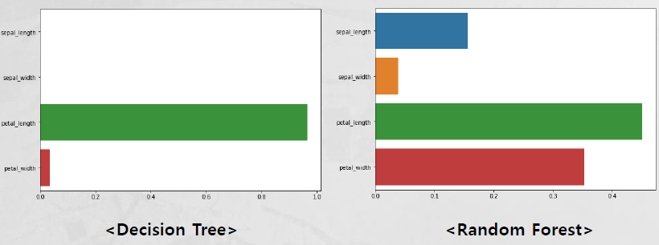 

### Cross Validation
- 교차검증 하는 것

### boosting
- 순차적 처리 방식

# K-means Clustering
> 입력값에 대한 출력값이 정해져 있지 않은 비지도학습 분석법으로 의사 중심점 (Pseudo Center)을 각 군집 내 평균점으로 이동하며 반복 

- 발생했던 사건들의 관계들의 특징을 분석
- 전체 덩어리를 k 개로 묶는 것
- 데이터의 아무곳에 k개의 점을 찍고 그 점에 가까운 데이터들을 군집화 한다. 그리고 군집화되서 묶인 그룹의 평균 거리로 이동한고 이것을 반복한다 

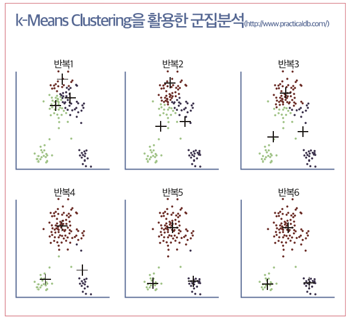

- 군집의 데이터 간의 포함 관계는 어떤가?
- 데이터 간 `유사성(similarity)`을 (거리로) 계산하여 유사성이 높은 개체의 군집을 생성
- 여러 개의 `군집(cluster)`를 생성하여 입력값이 속하는 그룹을 지정
- 동일한 그룹에 속하는 데이터는 유사성이 `높고`, 그룹 간에는 유사성이 `낮음`
    - 많이 나누면 동일 데이터의 유사성은 높아지지만 그룹간의 유사성도 높아져 버려서 적절하게 그룹의 갯수를 정해야 한다

    - 타겟 마케팅 캠페인을 위한 구매 패턴 그룹 세분화
    - 카드 부정사용, 불법 네트워크 침입 등의 이상 행동 탐지
    - 유사한 값을 갖는 특징을 적은 개수의 동질적 그룹으로 단순화 

## K-평균 군집 학습 방법
- 입력된 데이터를 K개의 군집(cluster)로 묶는 분석방법
- 각 군집 내의 데이터들 간의 거리를 최소화
- 각 군집들 간의 거리를 최대화
- 각각의 데이터는 오직 한 개의 군집에만 포함됨
- 최소 k개의 의사 중심점을 지정
- 분류된 데이터들의 평균점을 구하고 이동하는 과정을 반봅
- k-means 군집분석 수행을 위해서는 정량화할 수 있는 정보가 필요 

## K
- 몇 개의 군집으로 분류할 것인가?
    - 주관적으로 비즈니스 의사결정에 도움을 주는 수를 권장
    - 군집의 개수를 늘리면 데이터 간 유사성 증가, 인접 군집과 차이점 감소
- 스크리 도표 (scree plot) 활용
    - 킨크(Kink): 스크린 도표가 급격히 구부러진 부분(군집 내 산포도가 적당한 수준으로 떨어지는 지점)

        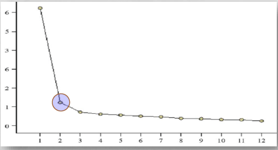
    
## sklearn

+ n_clusters: 군집 개수 지정
+ init: 초기 중심 설정 방식
+ max_iter: 최대 반복 횟수

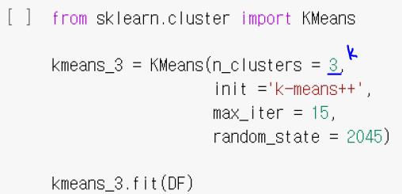

+ scree plot

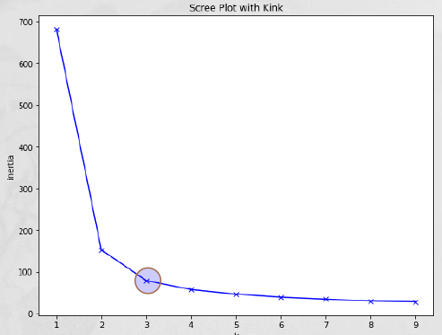

# Principal Component Analysis

- 각 항목을 가장 잘 구별해주는 변수를 찾는 일
    - 데이터 포인트를 가장 잘 구별해주는 `배후의 변수`(주성분)를 찾는 기법 (새로운 변수)
    - 주성분(적은 수의 변수)으로 데이터 세트를 표현 가능(차원 축소 기법)
    - 데이터 세트에서 의미 있는 선(축)을 찾는 과정 
- 주성분은 데이터 포인트가 `가장 넓게 분포`(분산이 큰)하는 차원을 의미
    - 가장 많은 정보를 포함한 차원을 따라 데이터가 넓게 분포
    - 각 차원이 직교인 경우 PCA가 유용

- 주성분 분석의 목적 변수는 기존 변수로 부터 만들어진 "새로운 변수"

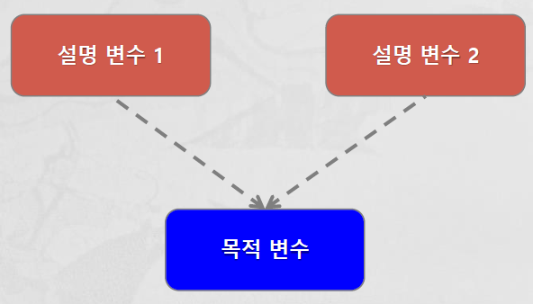

각 항목을 가장 잘 구별해주는 변수를 찾는 일

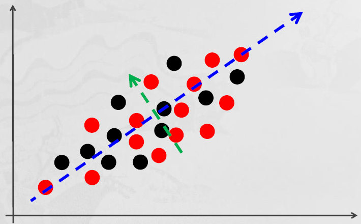

- 파란색: 제1 주성분
- 녹색: 제2 주성분

고차원 공간의 데이터를 저차원 공간으로 변환 (2차원 -> 1차원)

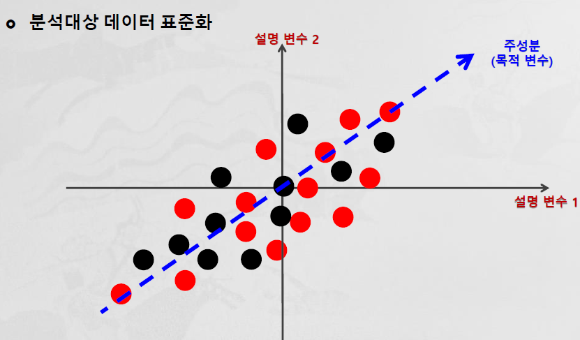

Ex) 영화 인기도 

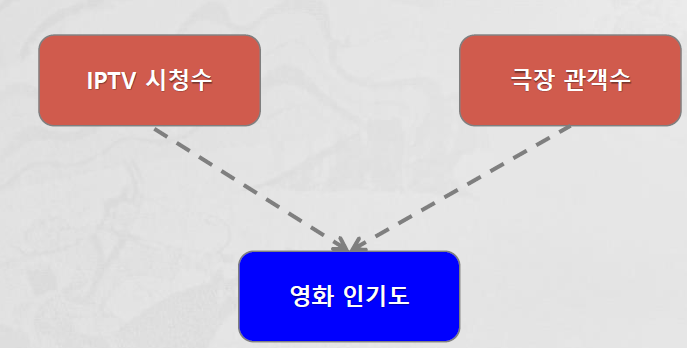

- 종합 영화 인기도를 구하기 위한 주성분 도출

    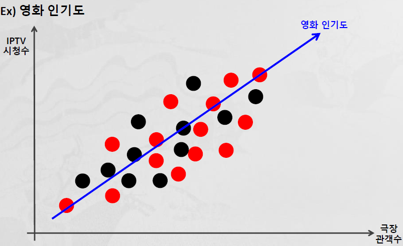

    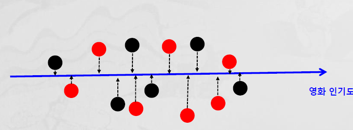