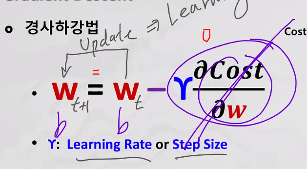

# Machine Learning

## Agenda 
1. Artifical Intelligence
2. Machine Learning (Gradient Descent)
3. Model Validation

##### 지도학습
4. Regression Analysis (수치예측)
5. Logistic Regression (범주예측)
6. Decision Tree
7. Random Forest (Ensemble)

##### 비지도학습
8. K-means Clustering
9. K-Nearest Neighbors

## Artificial Intelligence
- 인공지능이란 인공장치들의 지능을 설계하는 것
    - 인공장치가 인간의 지능을 모방하는 것
    - 지능: 정신노동

- 지능: 인간이 행하는 지적 작업의 주체
    - 생명체가 생존 환경의 변화에 적응하기 위해 인지적 기능을 변화시키는 능력

### History
- 1943년(여명기): 두뇌 논리회로 모델링
- 1956년(태동기): 다트머스 회의에서 AI 용어 탄생
- 1956년~1970년(1차 인공지능 붐): 수동적 대화시스템(지능은 기호처리)
    - 1971년~1979년(1차 빙하기): 프레임(고려해야할 범위)의 문제
- 1980년~1995년(2차 인공지능 붐): 전문가 시스템 활용(지능은 지식)
    - 1996년~2009년(2차 빙하기): 지식 획득 병목의 문제
- 2010년~현재(3차 인공지능 붐): 빅데이터와 딥러닝(지능은 학습)
    - 외부에서 디지털 데이터가 들어오면 특징을 확인하게 되고 그 확인된 특징으로 아웃풋을 내보낸다 

### Type
- 약한 인공지능(ANI: Artificial Narrow Intelligence)
    - 많은 양의 데이터를 처리하여 특정 기능만 수행
- 강한 인공지능(AGI: Artificial General Intelligence)
    - 사람처럼 생각하고 판단하는 범용 인공지능
- 특이점(Singularity) --> Transcendance
    - 인간과 인공지능 사이의 임계점
- 슈퍼 인공지능(ASI: Artificial Super Intelligence)
    - 특이점을 지나 인간의 지능을 넘어선 인공지능 

### Turing Test
- 튜링 테스트
    - 컴퓨터가 지능을 가지고 있는지 여부를 조사
- 질문자가 인간과 컴퓨터에게 같은 질문을 하여 인간의 답과 컴퓨터의 답을 구분할 수 없으면 컴퓨터가 지능을 갖고 있는 것으로 볼 수 있음 
- CAPTCHA (completely automated public turing test to tell competurs and humans apart): 사람과 컴퓨터를 구분

### Moravec's Paradox
- Hans Moravec(1970)
    - 컴퓨터와 인간의 능력 차이를 역설적으로 표현 
    어려운 일은 쉽고, 쉬운 일은 어렵다.
- 지능 검사나 체스에서 어른 수준의 성능을 발휘하는 컴퓨터를 만들기는 상대적으로 쉬운 반면, 지각이나 이동 능력 면에서 한 살짜리 아기만한 능력을 갖춘 컴퓨터를 만드는 일은 어렵거나 불가능하다

## Best Practices & Issues
### Technologies
- 사물인식 
- 사물 인식 및 이미지 보정
- 시각장애인 주변환경 설명
- AI Reconstructs Photos
- Deep Fake
- OpenAI Solving Rubik's Cube
- Amazon Go
- ZoZosuit
- Amazon Alexa 
- Industrial Applications

## Machine Learning (Gradient Descent)
### Learning - Definition
- 학습이란 "어떤 작업에 대해 특정 기준으로 측정한 성능이 새로운 경험으로 인해 향상되었다면, 그 프로그램(AI 모델) 은 어떤 작업에 대해 특정 기중의 관점에서 새로운 경험으로 부터 배웠다 라고 말할 수 있다"
    - 예측
        - 숫자 (수치 예측)
        - 문자 (분류)
    - 특정 기준으로 측정한 성능
        + (정량적) metric 
    - 새로운 경험 
        + parameter(함수)의 변화/변경
- 수학의 함수를 데이터에 학습시키는 것 (특징을 확인)
    - y=wx+b
- 함수가 데이터의 특징을 설명할 수 있게 만든다 
    - 학습된 함수를 모델이라 부른다 
    - 모델 = (분류) 알고리즘

- Learning: `MSE를 최소로 하도록 Parameter를 updata 하는 것`

- 학습 이후 새로운 (미래) 데이터에 대하여 학습된 내용으로 처리하는 것 (의사결정)

### Machine Learning
- 머신이 코드로 명시 (program) 되지 않은 동작을 데이터로부터 학습하여 실행할 수 있도록 하는 알고리즘 
    - 데이터로부터 일관된 패턴 또는 새로운 지식을 찾아내 (학습하)는 방법
    - 학습된 알고리즘(model)을 적용하여 정해진 업무를 처리
- 현실세계의 다양한 문제를 수작업에 의한 프로그래밍으로 대응하기 어려움
    - 개발자가 만든 것 이상을 수행할 수 있다는 것을 의미
- 학습할 수 있는 것과 학습할 수 없는 것을 구분하는 것이 중요

- 사람이 개입하지 않고 주어진 데이터를 가지고 함수를 학습하여 미래 예측할 수 있도록 하는 것 

- 사람이 만든 알고리즘(software) vs. 머신(function)이 학습한 알고리즘(model)

- Supervised Learning: 지도학습 
    - input data: x
    - output data: y (label,정답) 
    - x랑 y가 있어야 함수가 성립 
    - x에 대한 y(정답)이 존재하는 학습
    - 숫자 or 문자 예측 
- Unsupervised Learning: 비지도학습
    - 오로지 x만 있기에 함수형 모델이 아니다 --> 성능이 떨어진다 

### Algorithms

+ 신경망 알고리즘 --> Deep Learning 

## Gradient Descent

> 경사 하강법(Gradient Descent)은 머신러닝 및 딥러닝 알고리즘을 학습시킬때 사용하는 방법 중 하나이며 1차 근삿값 발견용 최적화 알고리즘이다.
> 기본 개념은 함수의 기울기(경사)를 구하여 기울기가 낮은 쪽으로 계속 이동시켜 극값(최적값)에 이를 때까지 반복하는 것이다.

> 해당 함수의 최소값 위치를 찾기 위해 비용 함수(Cost Function)의 경사 반대 방향으로 정의한 Step Size를 가지고 조금씩 움직여 가면서 최적의 파라미터를 찾으려는 방법이다. 
> 여기에서 경사는 파라미터에 대해 편미분한 벡터를 의미하며 이 파라미터를 반복적으로 조금씩 움직이는 것이 관건이다.

> 경사 하강법에서는 학습시 스텝의 크기 (step size)가 중요하다. 학습률이 너무 작을 경우 알고리즘이 수렴하기 위해 반복해야 하는 값이 많으므로 학습 시간이 오래걸린다. 
> 그리고 지역 최소값(local minimum)에 수렴할 수 있다. 반대로 학습률이 너무 클 경우 학습 시간은 적게 걸리나, 스텝이 너무 커서 전역 최소값(global minimum)을 가로질러 반대편으로 건너뛰어 최소값에서 멀어질 수 있다.

- 경사 하강 법

### function

- y^ = wx + b
    - y^: 예측값
    - wx +b: 모델
        - w: 가중치
        - b: 편향
    - y: 지도학습의 output(label)
    - x: input data
- 예측값(y^)과 output(y)를 비교하여 error를 구한다 

### Loss Function() for Regression Analysis
- regression Analysis: y가 숫자인 수치 예측 모델

- Loss Function(): `실제값(y)과 예측값(y^)의 차이`(오차)를 비교하는 지표
    - y: 실제값, y^: 예측값
    - L(y,y^) = (y-y^)2
- ex) Model: y^ = 2x + 1

- 변경된 w와 b에 대한 loss(오차) 비교
    - Cost(Mean Squared Error)는 Loss들의 평균 --> `MSE`
    - Cost(y,y^)=mean(L(y,y^))=`mean((y-y^)^2)`=mean((y-(wx+b))2)

- Ex) Model: y^ = 2x + 1 vs y^ = 3x + 0

### Parameters
- Cost Function() 값(MSE)을 최소로 하는 Parameter(w,b) 값을 찾는 것이 목적
    - y^=wx+b
    - Parameter: Cost(w,b)
- Ex) Cost(2,1)=54.76 > Cost(3,0)=0.81

MSE 그래프

- b의 값을 바꿔서 MSE를 작게 만드는게 목적 

### Gradient Descent 
- learning: MSE를 최소로 하도록 Parameter를 updata 하는 것
- Gradient Descent (경사 하강법): `MSE가 작아지는 방향으로 Parameter를 자동으로 Update 시키는 방식` --> MSE를 0에 가까워지게 하는 것

    - 경사: (편)미분값 --> (접선의)기울기 (b를 기준으로 미분) --> 순간 변화량

        - 접선의 기울기: 부호 & 값의 크기
- 경사값(기울기값)을 가지고 MSE를 작아지게 하는 것

- 감마값(학습률)을 곱하는 것은 너무 많은 변화를 주지 않기 위해

### 편미분(Partial Derivative)

- 겉미분, 속미분

### 경사 하강법

- w 랑 b 둘다 update (learning) 해야한다 

- 섭선의 기울기가 0이 되면 w = w 가 되면서 학습을 할 필요가 없어 멈춰진다. 

- learning (training): `오차값 제곱의 평균 (MSE)을 최소로 만드는 Parameter(w,b) 값을 찾는 과정`

- Hyperparameter: 학습자가 지정 
    - learning rate (감마)을 지정해 준다 (w=w-감마-dw)

    

## Model Validation

- model: 학습된 함수 = Parameter Update 완료
- validation: 검증 = 미래에 사용하기에 적합한가?

### First-Order Model
 ŷ = wx+b의 함수로서는 모델이 괜찮은 함수지만
 데이터의 분포를 설명하기에는 충분하지 않다

### High-Order Model
ŷ = w1 x^2 + w2 x + b

### Model Capacity (역량)
- 모델의 데이터에 대한 설명(표현)력
    - 파란색 모델이 빨간색 모델보다 capacity 가 더 높다
    - 데이터를 더 잘 설명한다 
    - 설명력에 영향을 주는 요인은 parameter의 개수이다
        - 일반적으로 parameter의 개수가 많아지만 설명력이 늘어난다
- 모델의 성능이 다르기에 여러개를 만든다

#### Data 산점도 
- 바닥 면적과 전력 사용량의 상관관계?

#### 1 차 모델 시각화 

#### 2차 모델 시각화 

#### 5차 모델 시각화

#### 9차 모델 시각화 

### 뭐가 좋나
- MSE가 가장 작은 모델이 가장 좋은 모델 

### Training Error 

- 기본적으로 학습은 Gradient Descent에 의해 Training Error를 최소화 하는 방향으로 진행
- training error
    - Training Data에 Model을 적용하여 확인한 실제값과 예측값의 차이 (오차)
    - mean((y-ŷ)^2)
- 여러 개의 Model을 생성 후 각각의 training error(MSE)를 비교
    - 실무 데이터에 적용하기 위한 최적 Model을 선택
    - 하지만 model 생성과 평가에 같은 데이터를 사용하여 부작용 발생 

- 과거의 데이터로 model을 만드는데 미래의 데이터가 과거의 데이터와 비슷할 것을 가정하고 만든다. 
- `training error를 계산하는 것은 model 생성과 평가에 같은 데이터를 사용하여 부작용 발생 가능 (Overfitting)`

### Overfitting
- 학습한 결과가 training data (과거)에만 최적화된 모델을 생성
    - 모델 생성 시 활용하지 않은 (미래) data에서 성능이 급격하게 낮아짐
- 부적합(under fit) vs. 최적합(ideal fit) vs. 과적합(over fit)

overfit vs. idealfit

### 모델 학습 목적
- 일반화된 모델을 생성하는 것 
    - 일반화된: 모델 학습시 사용되지 않은 (미래) 데이터에서도 비슷한 성능 (error)을 제공 가능 

### Generalization Error
- 예측이나 분류를 위하여 실무 데이터에 적용했을때 발생하는 에러
- `현실적으로 측정 불가능한 에러`
- Generalization Error를 추정하기 위하여 Testing Error를 사용 

### Testing Error
- 모델을 학습(모델생성) 후 반드시 평가(모델평가)가 필요
- 모델의 성능평가를 위하여 실제값과 예측값이 필요(지도학습)
- testing error를 활용하여 판단의 객관성 측면에서 학습(생성)된 모델을 비교
    - training data: 학습(모델생성)을 위해 제공되는 데이터
    - testing data: 학습결과를 평가(모델평가)하기 위한 데이터
- 데이터의 크기에 따라서 일반적으로 8:2 또는 7:3 등의 비율로 구성 

