# 복습
## AI
- 디지털 데이터 기반으로 학습시킨 예측 모델을 만드는 것 (학습)
## Machine Learning 
> Machine은 수학의 함수

>함수의 parameter를 최적화 시킨다

- 지도 학습: x & y 가 있다 --> deep learning
    - 회귀분석: y가 숫자인 수치 예측
    - 로지스틱 회귀: y가 문자인 분류
- 비지도 학습: x만 있다  
### 경사 하강
> parameter를 최적화 시키는 것을 자동화 하는 것 
- MSE가 작아지는 방향으로 Parameter를 자동으로 Updata 시키는 방법
- MSE: 오차로 수치 예측을 한다 
- 우리가 만든 parameter의 예측을 결과에 가깝도록 자동화 시킨것 
- 5차 함수에 대한 Parameter의 편미분을 하는 것

    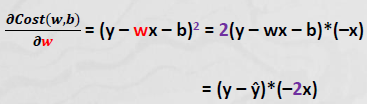

- 경사하강식: 최솟값을 찾는다 
    - γ: Learning Rate or Step Size
    - γ: 학습율을 조정해서 학습 속도에 영향을 준다

        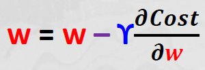

    - Parameter(w,b) 값을 변경하면서 학습을 반복
- Learning: 오차값 제곱의 평균(MSE)을 최소로 만드는 Parameter(w,b) 값을 찾는 과정

## Model Validation
> 충분하게 데이터를 설명하는 최적의 모델을 가져가는 것 (모델 평가)

> 데이터를 training 과 testing 으로 가져간다

### Model Capacity
- 모델의 데이터에 대한 설명력 
- paramter의 개수 up --> model capacity up
- 정략적 측정방식인 MSE를 쓴다

### Training Error
- 과거 데이터만 쓰기에 error가 발생한다 --> Overfitting
- overfitting: 학습한 결과가 Training data에만 최적화 된 모델 --> 성능 저하

### Testing Data
- 데이터를 쪼개서 training data 와 testing data 로 나눈다 
    - Training data: 학습(모델생성)을 위해 제공되는 데이터
    - Testing data: 학습결과를 평가(모델평가)하기 위한 데이터 
- Hyper Parameter: 어떻게 쪼갤지는 학습자가 결정해 줘야 한다 

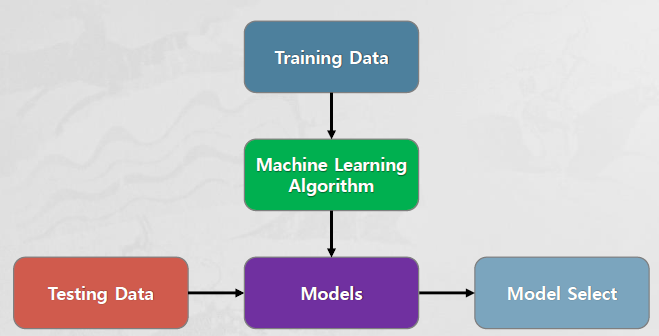

- training data로 학습을 시켜 testing data로 모델을 select 한다 
- 그리고 generalization error가 있는지 확인 

# Validation Approach

> 데이터를 2개로 쪼개는 것이 아니라 3개로 쪼개는 것 

> 모델을 만드는 것만이 학습이 아니라 평가하는 것 까지 학습

- testing error
    - testing data에 최적 Model을 적용해 얻은 실제값과 예측값의 차이(오차)
    - testing error를 사용하여 실무 데이터에 대한 generalization error를 추정

- testing data 역시 모델평가 과정에서 사용되어지는 문제점 발생
    - training data를 training data와 validation data로 분리하여 모델을 평가

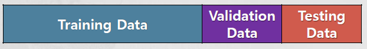

- Training Data로 모델 여러개를 생성 
- Validation Data로 MSE를 측정하고 모델을 select하고 (최종적인 MSE가 generalization error를 가장 잘 추정한다)
- Testing Data로 모델의 generalization error를 추정 

# Regression Analysis 
> 연속형 숫자를 예측하는 모델링

## Supervised Learning - Regression Analysis
- 과거의 결과값을 기준으로 미래의 결과값(수치)을 예측하는 방법
    - 과거 결과값: 지난달 습도가 50일 때, 불량품수량이 4.5
    - 미래 예측값: 이번달 습도가 65일 때, 불량품수량을 예측
- 미래에 발생할 결과값이 "과거의 평균으로 돌아간다(회귀)"는 위미
- 회귀모델: "y ~ wx + b" 를 사용하여 w와 b의 값을 추정
    - x로 y를 설명하려 한다
    - ~ : 설명하라는 뜻
- y: output(종족변수, 반응변수), x: input(독립변수, 설명변수)
    - x의 값에 따라 y의 값이 결정된다는 의미 

Ex) 습도에 따른 불량품수량 예측

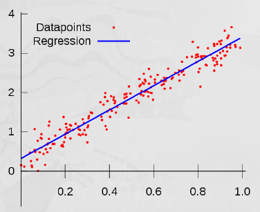

   - linear model
   - 선형 회귀 분석 

상관계수(Correlation Coefficient)

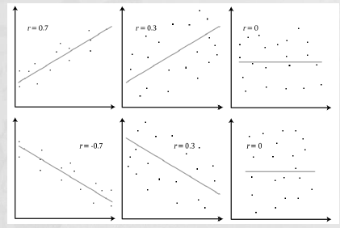

  - -1<=r<=1

  - w가 0 이면 y가 b가되기 때문에 모델을 만드는 의미가 없다 --> 기울기가 없기에

  ## 결정계수 (R^2)
  - 모델의 데이터에 대한 설명력 
  - 0~1 
  - x를 가지고 y를 설명할 수 있는 부분

  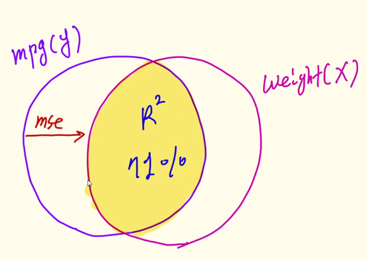
  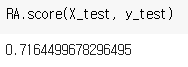

  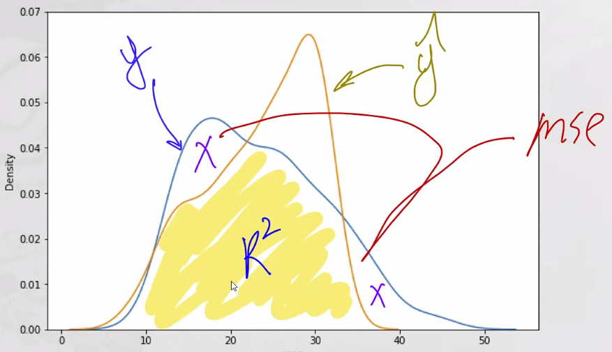

  ## 선형 모델

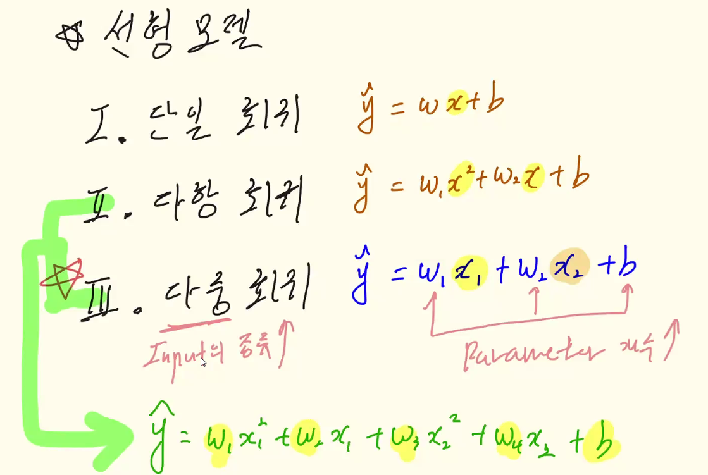

  1. 단일 회귀 (1차 방적식)
  2. 다항 회귀 (2차 방정식)
  3. 다중 회귀 (ŷ = w1x1 + w2x2 + b) --> parameter 의 개수가 증가 --> 모델의 capacity가 증가

  ### 다중 회귀 (Multivariate Regression)
  - input의 종류를 늘려 모델의 capacity를 증가 (다른 변수도 대입)

  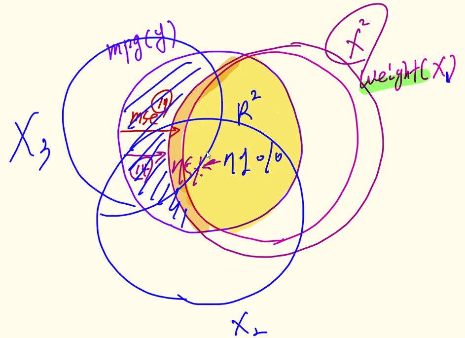

  - 하나의 y를 설명하기 위해 여러종류의 x를 이용

  - 하지만 실제로 R^2가 더 좋아질 지는 모른다 
    - 다중 공선성의 문제: x 사이의 관계가 독립이 아니다

### Multivariate Function

- 공간상의 점과 면사이의 거리를 최소화 시킨다 

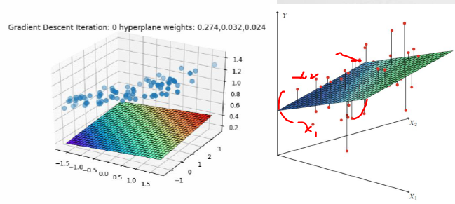

- 다항과 다중 회귀가 합쳐지면 면이 구부러진다 

## Encoding
> 데이터의 표현 방식을 바꾸는 것 (문자 -> 숫자)
- sklearn은 x값을 문자형으로 받지 않는다

- Integer Encoding 
    - from sklearn.preprocessing import `LabelEncoder`
    - 문자형 변수를 숫자형 변수로 변경하여 변수 연산 범위를 확대
    - 'europe': 0, 'japan':1, 'usa':2
- One-Hot Encoding
    - from sklearn.preprocessing import `OneHotEncoder`
    - 하나의 값만 True(1)이고 나머지 값은 False(0)인 인코딩 
    - 어떤 데이터든지 0과 1로 나타낸다 

    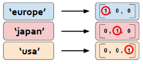

    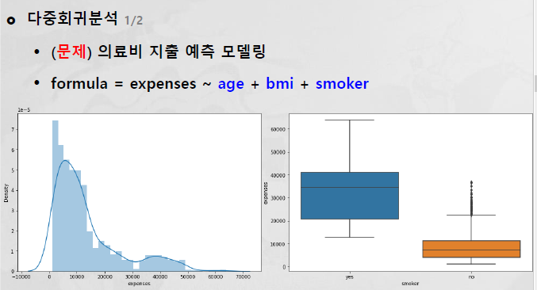

    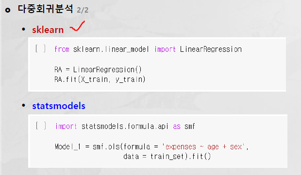