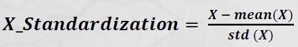
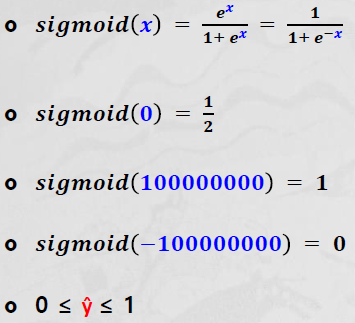

# Regression Analysis - Scaling

- 데이터 전처리 (Data Preprocessing) - Scaling
    - 범위(Scale)가 다른 변수들의 범위(scale)를 비슷하게 맞추기 위한 목적
    - 연속형 변수가 다양한 범위(Scale)로 존재할 때 제곱 오차 계산 시 왜곡 발생 
        - ex) x1은 1에서 10 사이 스케일, x2는 1000에서 100만 사이 스케일
    - 스케일이 더 큰 변수에 맞추어서 가중치를 최적화하는 문제 발생 

- Scaling in Python
    - from sklearn.preprocessing import `MinMaxScaler`
    - from sklearn.preprocessing.import `StandardScaler`
- 범위는 바뀌지만 분포는 바뀌지 않는다

## Normalization(정규화)
- 변수의 스케일을 0~1 사이 범위로 맞추는 것 (min-max sacling)
- 정규화는 변수의 범위가 정해진 값이 필요할 때 유용하게 사용

## Standardization(표준화)
> 평균을 0으로 만들고 분산이 1인 정규분포 모양

- 변수의 평균을 0, 표준편차를 1로 만들어 표준정규분표의 특징을 갖도록 함 
- 표준화는 가중치(weight) 학습을 더 쉽게 할 수 있도록 함

### 정규화 vs. 표준화 

- 단일회귀분석: Output(y)에 영향을 주는 Input(x)이 1개인 경우 
    - (문제) 습도가 53일때 불량수량 예측
    + formula = 불량품수량 ~ 습도
- 다중회귀분석: Input(x)이 여러 개인 경우(y가 하나, x가 여러 개)
    - (문제) 제품의 강도는 생산과정의 온도와 시간에 영향을 받음
    + formula = 강도 ~ 온도 + 시간
- 로지스틱회귀분석: 확률값을 계산하여 분류

# Logistic Regression 
> 분류 문제를 풀기 위해 함수로 예측

- logistic: 확률 (0~1 사이) = sigmoid()
-  ŷ = wx + b --> 0~1

## 분류(classification)
- y가 문자(명목형)
    1. 이진(binary)
       - 범주가 2개
       - y = 0 or 1
    2. 다중(categorical)
       - 범주가 3개 이상 

## Logistic Regression 식

-  ŷ = sigmoid(wx+b) --> 0~1
    -  ŷ 값이 0~1 사이 
    - 0<=ŷ<=1
    
    

## sigmoid()

- sigmoid() 함수를 필터로 사용 

    

    - e = 2.71 = 오일러 상수

    - x = 0 일때

    

    - x가 아무리 크거나 작어도 1과 0을 넘을 수 없다 

    

- Classification(범주예측) 모델
    - output(y)의 수치예측이 아닌 `어떤 범주에 속하는지에 대한 예측`(확률)을 모델링
- Regression(수치예측) 모델에 Sigmoid() 필터(activation function)를 적용하여 구현 
    + 일반적으로 분류 기준을 0.5로 지정(변경가능)
    + 0.5보다 크면 1, 0.5보다 작으면 0으로 분류

- 분류 결과에 대한 추가적인 `신뢰도 검증`이 필요(Model Validation)
    + 혼돈 행렬(confusion Matrix)
    + 정확도(accuracy), 정밀도(precision), 재현율(recall)

## Confusion Matrix 
### logistic regression - model validation
> 맞게 분류된 것과 틀리게 분류된것의 개수를 본다

> 분류 결과에 대한 추가적인 신뢰도 검증이 필요

- 이진 혼돈 행렬(Binary Confusion Matrix)
- positive(양성), negative(음셩) vs. True(맞게 분류), False(틀리게 분류)

- 더 알고 싶은 것을 POSITIVE로 한다 

- 정확도(accuracy)
    - positive와 negative로 맞게 분류된 데이터의 비율
- 정밀도(precision)
    - positive로 분류된 결과 중에서 실제 positive의 비율
    - negative를 positive로 틀리게 분류 시 문제 발생: 스펨메일 필터링
- 재현율(recall)
    - 실제 positive 중에서 positive 로 분류된 비율
    - positive를 negative로 틀리게 분류 시 문제 발생: 코로나 진단검사 

- Bussiness Impact에 따른 뭘 높게 해야 할지 정함

### 정확도(Accuracy)
- 신용카드 (상환 or 연체)
- Positive(상환)와 Negative(연체)로 맞게 분류된 데이터의 비율 --> `X 틀림` --> 재현율이 높은 모델을 만들어야 함
- (TP + TN)/(TP + TN + FP + FN) = 2920명 / 3000명 = 97.33%

### 정밀도(Precision)
- Positive(상환)로 분류된 결과 중에서 실제 Posotive(상환)의 비율
- TP/ (TP + FP) = 2888명 / 2960명 = 97.57%

- negative를 positive로 틀리게 분류 시 문제 발생: 스펨메일 필터링 --> 정밀도를 높게 만들어야 함

### 재현율(Recall) (민감도)
- 실제 positive(상환) 중에서 positive(상환)로 분류된 비율
- TP / (TP+FN) = 2888명 / 2896명 = 99.72%

- positive를 negative로 틀리게 분류 시 문제 발생: 코로나 진단 --> 재현율을 높게 만들어야 함

### `Positive(연체)` 기준
- 정확도(accuracy): (TP+TN)/(TP+TN+FP+FN)=2920명/3000명 = 97.33%
- 정밀도(precission): TP/(TP+FP) =32명/40명 = 80.00%
- 재현율(recall): TP/(TP+FN) = 32명/104명 = 30.77$

--> 모델의 메트릭스를 올바로 했을때는 재현율 이 다르게 나온다 
- 정확도는 biased data 이기에 상관없이 높게 나온다

### Evaluation Method: F1-Score(0~1)
- 정밀도(Precision)와 재현율(Recall)은 Trade-off 관계
- F1-Score: 정밀도(Precision)와 재현율(Recall)의 조화평균 
- recall 과 precision의 관계 

- β 가 1일 때 f1-score 라고 함

## Cross Entropy Error 

- 모든 에러는 실제값과 (y) 예측값의 (ŷ) 차이다 

- 좌표평면에서 b의 값을 바꿔 모델의 위치를 바꿔야 한다 

> sigmoid(wx+b) 함수에서 w는 기울기, b는 좌우이동

- b값 변경

- w값 변경

### Cross-Entropy Error (CEE)
> 로그를 통한 경사하강을 통해 작동된다

- 서로 다른 사건의 확률을 곱하여 Entropy를 계산
- y: 실제값, y_hat: 예측값 (can be incorrect)

- y를 Cross-Entropy의 가중치로 적용 (이진분류: 0 or 1)

    

- y = 1:
    - CEE = -y.log(ŷ) = -log(ŷ)
    - CEE와 ŷ의 관계 (w,b를 바꾸면 CEE가 바뀜)
    - 경사하강을 통해 w,b를 update 시킨다 

    

    - ŷ이 1일때 CEE가 0 
    - 미분을 해서 ŷ값이 1에 가깝게 가도록 한다

- y = 0:
    - CEE = -(1-y)log(1-ŷ) = -log(1-ŷ)
    - CEE와 ŷ의 관계

    

    - ŷ이 0일때 CEE가 0 

### Information Theory (정보 이론)
- Information Gain (정보 이득량 척도)
    - 자주 발생하지 않는 사건 (발생 확률 낮은)은 자주 발생하는 사건보다 전달하는 정보량이 많음 (의미가 크다)
    - 무조건 발생하는 것이 발생하지 않으면 우리에게 주는 의미가 더 크다
        
    - Information Gain (정보 이득량)은 정보의 희귀성(발생가능성)에 반비례
    - I(x)=-log(P(X))
- Degree of Surpise (놀람의 정도)
    - 예상하기 어려운 정보에 더 높은 가치를 매기는 것 

### Entropy(불확실성 척도)
- 이진 분류일때 불순도가 제일 높은 지점은 50:50이다 

- 불확실성(Entropy)이 낮으면 분류 정확도가 높아짐
- Entropy 정의: 불확실성의 정도 
- 정보량(확률변수)의 평균(기댓값)
    - 확률변수: 확률적 법칙에 따라 변화하는 값/기댓값(Expected Value): sum(확률변수*확률변수의 발생확률)

    

- 사건 발생 확률에 기댓값을 곱해준다
    - 원래 사건은 같아야 하는데 
    - 서로 다른 사건의 확율을 곱한다 
    - y & ŷ

    
