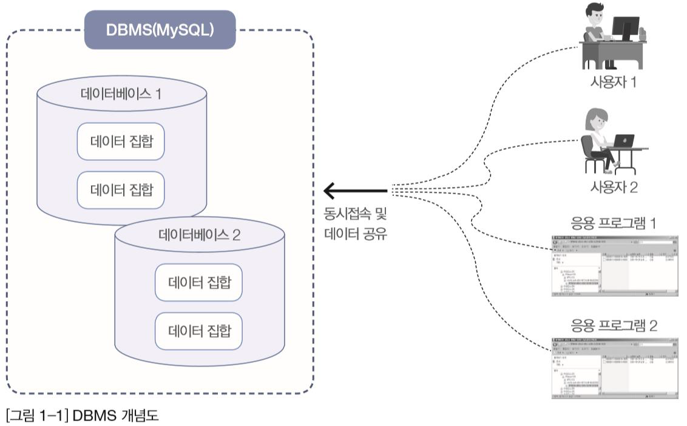
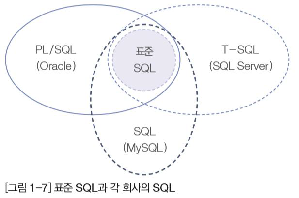
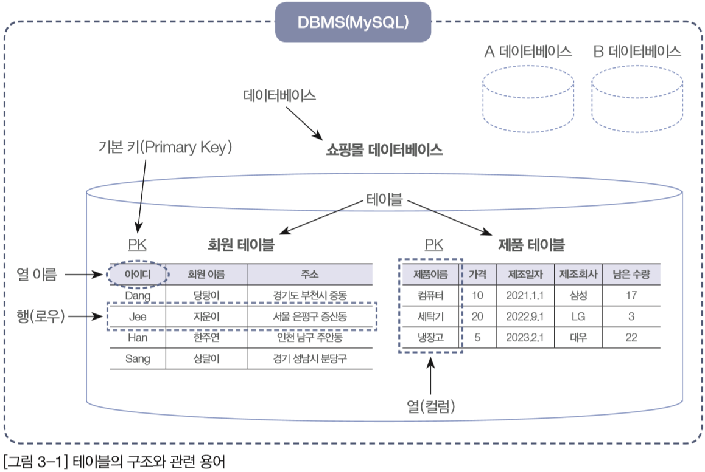
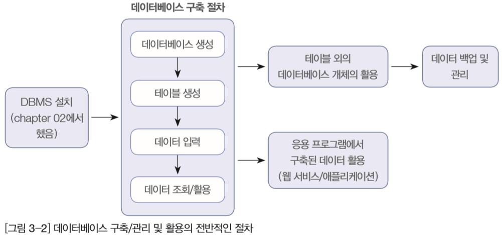

# DBMS와 SQL

## DBMS 개요
---
### 데이터베이스의 정의와 특징 

- DB (database)
  - 데이터의 집합
  - 여러 명의 사용자나 응용프로그램이 공유하는 데이터들
  - 동시에 접근 가능해야 
  - 데이터의 저장 공간 자체 
  - 검색도 가능
  
- (R)DBMS (relational)(database management system)
  - table들 관의 관계 
  - 데이터베이스를 관리/운영하는 역활 
    - 저장
    - 검색
    - 백업 
    - 보안 (권한관리)
    - 안정성 높음 
  
  - 종류
     - oracle (oracle)
     - MSSQL (MSFT)
     - MySQL (oracle)
     - 마리아DB (open)
     - DB2 (IBM)
     - SYBASE
     - SQLite (모바일 기기)
     - postgreSQL (open)

- NoSQL (bigdata)
  - json 형식: dictionary 
    - MongoDB
    - HBASE (하둡)
    - Redis
    - cassandraDB
    - Neo4j

[데이터베이스 랭킹](https://db-engines.com/en/ranking)

- SQL: 데이터베이스의 데이터를 처리하는 언어
  - DDL (data define language)
    - 정의
    - create, alter, drop 
  - DML (data manipulate language)
    - 조작 (검색, 삽임, 변경, 삭제)
    - select(검색), insert(삽입), update(변경), delete(삭제)
  - DCL (data control language)
    - 컨트롤 (권한 주고 뺏고)
    - grant, revuke

- DBMS 개념도 

### DB/DBMS의 특징 
- 데이터의 무결성 (integrigy)
  - 데이터베이스 안의 데이터는 오류가 없어애 한다
  - Constrain(제약 조건)이라는 특성 가짐
- 데이터의 독립성 
  - 데이터베이스 크기 변경, 저장소 변경시 기존 작성된 응용프로그램은 영향을 받지 않아야 한다
- 보안 
  - 데이터베이스를 소유한 사람이나 접근이 허가된 사람만 접근 할 수 있어야 한다 
  - 접근할 때도 사용자의 계정에 따라서 다른 권한 가짐  
- 데이터 중복의 최소화
  - 동일한 데이터가 여러개 중복되어 저장되는 것 방지
- 응용프로그램 제작 및 수정이 쉬워짐 
  - 통일된 방식으로 응용프로그램 작성 가능
  - 유지보수 또한 쉬워짐
- 데이터의 안전성 향상
  - 백업/복원 기능 이용

### 데이터베이스의 발전
1. 파일시스템 
   + 컴퓨터 파일에 기록/저장 - 메모장, 엑셀 활용
   + 컴퓨터에 저장된 파일의 내용은 읽고, 쓰기가 편한 약속된 형태의 구조 사용
   + 데이터의 양이 많아지면 데이터 중복으로 인한 불일치 밎 사용량 위험 
2. 데이터베이스 관리시스템 
   + 대량의 데이터를 보다 효율적으로 관리하고 운영 
   + DBMS: 데이터의 집합인 데이터베이스를 잘 관리하고 운영하기 위한 시스템
3. SQL (Structured Query Language)
   + DBMS에 데이터 구축/관리/활용 위해서 사용되는 언어
   + DBMS를 통해 중요한 정보들을 입력, 관리, 추출 

### python에 DB 연결 & DATA 처리
1. 라이브러리 가져오기
   - import pymysql 
2. 접속하기(DBMS)
   - pymysql.connect()
3. 커서 가져오기: 데이터 관리를 위해 SQL 알아먹게 하기
   - cursor() --> 
   - fetch(): 커서를 통한 데이터를 하나씩 혹은 다 가져오기 
4. SQL 구문 만들기 (CRUD SQL)
   - select, update, delete, insert
5. SQL 구문 실행
   - execute()
6. DB에 Complete 하기
   - commit()
7. DB 연결 해지 (닫기)
   - close()

### SQL 개요 
- SQL (Structured Query Language)
  - 관계형 데이터베이스에서 사용되는 언어 
  - 다른 시스템으로 이식성이 좋음
  - 표준이 계속 발전중
  - 대화식 언어
  - 분산형 클라이언트/서버 구조 

## 요구사항 분석과 시스템 설계 및 모델링
---

### 정보시스템 구축 절차 요약 
> 분석, 설계, 구현, 시험, 유지보수의 5가지 단계

1. 분석
   + 구현하고자 하는 프로젝트의 가장 첫 번째 단계 
   + 시스템 분석 또는 요구사항 분석이라고 불림
   + 요구사항 분석은 현재 우리가 무엇(What)을 할 것인지 결정 
   + 사용자의 인터뷰와 업무 조사 등을 수행
   + 분석의 결과로 많은 문서 작성
2. 설계
   + 시스템 설계 또는 프로그램 설계
   + 구축하고자 하는 시스템을 어떻게(How)할 것인지 결정
   + 대부분의 프로젝트에서 분석과 설계의 과정이 전체 공정의 50% 이상 차지 

### 데이터베이스 모델링

- 데이터베이스 모델링
  - 개념모델링 -> 논리모델링 -> 물리모델링
- 현실세계에서 사용되는 데이터를 MySQL에 어떻게 옮겨 놓을 것인지를 결정하는 과정 
- 저장할 정보는 테이블(table)이라는 형식에 맞춰 저장 

- EX) 쇼핑몰 데이터 베이스의 예 

- 쇼핑몰 데이터모델링 과정
  1. 업무파악
     - 회원등록/수정/탈퇴, 제품등록/수정, 구매
  2. 데티어식별
     - 이름/주소/핸번/성별, 제품명/설명/수량/상태/특성, 구매날짜
  3. 데이터흐름 
     - 회원등록 -> 제품구매, 로그인 -> 제품구매
  4. 데이터베이스 모델링
     - table, table과의 관계  
     - 회원정보 table
     - 제품정보 table
     - 구매 table 
  5. 검증
  6. 데이터 입력

### 필수 용어
> 데이터 < 테이블 < 데이터베이스 < DBMS < SQL

- 데이터
  - 하나하느의 단편적인 정보
  - 정보는 있으나 아직 체계화 되지 못한 상태
- 테이블
  - 데이터를 입력하기 위해, 표 형태로 표현한 것
  - EX) 회원 정보 테이블, 제품 정보 테이블
- 데이터베이스
  - 테이블이 저장되는 저장소
  - 각 데이터베이스는 서로 다른 고유한 이름을 가지고 있음
- DBMS
  - 데이터베이스를 관리하는 시스템 
- 열(=컬럼=필드)
  - 각 테이블은 열로 구성
  - 회원 테이블의 경우에는 아이디, 회원 이름, 주소 등 3개의 열로 구성
- 열 이름
  - 각 열을 구분하기 위한 이름
  - 열 이름은 각 테이블 내에서는 중복되지 않고, 고유해야 함
- 데이터 형식
  - 열의 데이터 형식
  - 테이브릉ㄹ 생성할 때 열 이름과 함께 지정
- 행(=로우=레코드)
  - 실질적인 데이터
  - 회원 테이블의 경우 4건의 행 데이터, 즉 4명의 회원이 존재함 

- 기본 키 (Primary Key) 열
  - 기본 키(=주 키) 열은 각 행을 구분하는 유일한 열
  - 중복이되어서는 안되며, 비어 있어서도 안 됨
  - 각 테이블에는 기본 키가 하나만 지정
- 외래 키 (Foreign Key) 필드
  - 두 테이블의 관계를 맺어주는 키 
- SQL
  - 구조화된 질의 언어
  - 사람과 DBMS가 소통하기 위한 언어 
  
### 데이터베이스 구축/관리 및 활용의 전반적인 절차

### 데이터 활용
- Select()를 사용해 데이터 활용
- 사용할 데이터 베이스 선택
`SELECT열 이름 FROM 테이블 이름 [WHERE 조건]`
  - 모든 데이터 출력하기: 열 대신 `*`
  - 열을 선택해 데이터 출력하기: 열 이름 나열
  - 특정 데이터를 만족하는 데이터 출력하기: WHERE절에 조건 입력
- 새로운 테이블 생성
- 테이블 삭제 
  - DROP TABLE 테이블 이름 

- 뷰(View)
  - 가상의 테이블
  - 실제 행 데이터를 가지고 잇지 않음
- 스토어드 프로시저 (Stored Procedure)
  - SQL문을 하나로 묶어 편리하게 사용하는 기능
  - 다른 프로그래밍 언어와 같은 기능을 담당할 수도 있음
- 트리거 (Trigger)
  - 테이블에 부착되어 테이블에 INSERT나 UPDATE 또는 DELETE 작업이 발생되면 실행되는 코드 

- 백업
  - 현재의 데이터베이스를 다른 매체에 보관하는 작업
- 복원 
  - 데이터베이스에 문제 발생 시 다른 매체에 백업된 데이터를 이용해 원상태로 돌려놓는 작업
- 백업과 복원은 DBA(DataBase Administrator): 데이터베이스 관리자가 해야 할 가장 중요한 일 