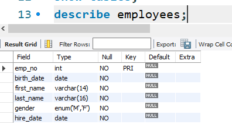

# SQL 기본 
```python
select [출력(필드)], update [할당], insert [value], delete [지울것] from table명 [where];
```


### 명령프롬프트
```python
mysql -u root -p
```
- database 가져오기
- `show databases;`
  - table들 보여주기


## select 문
### <SELECT... from>
- 원하는 데이터를 가져와 주는 기본적인 구문 
- 가장 많이 사용되는 구문
- 데이터베이스 내 테이블에서 원하는 정보 추출하는 명령 


- select 열 이름
- from 테이블 이름
- where 조건 (아무것도 없는 상태)
- group by: 어느 그룹들에 따라 
- having: 조건 (having이 있는 조건)
- order by: 정렬  


### USE 구문 
- select문 학습 위해 사용할 데이터베이스 지정
- 지정해 놓은 후 특별히 다시 use문 사용하거나 다른 DB를 사용하겠다고 명시하지 않는 이상 모든 SQL문은 지정 DB에서 수행 
```python
USE 데이터베이스_이름;
```

### SELECT와 FROM
- selct *
  - 선택된 DB가 employees 라면 다음 두 쿼리는 동일 
    

- Select 열 이름
  - 테이블에서 필요로 하는 열만 가져오기 가능 
    
  - 여러 개의 열을 가져오고 싶을 때는 콤마로 구분
    
  - 열 이름의 순서는 출력하고 싶은 순서대로 배열 가능 


- 주석(Remark)
  + -- 한 줄 주석
    + select first_name, last_name, gender -- 이름과 성별 열을 가져옴
    + from employees;
  + 여러 줄 주석 /**/
    ```
    /* 블록 주석
    select first_name, last_name, gender
    Fromm employees;
    */

### DB, TABLE, 열의 이름이 확실하지 않을 때 조회하는 방법 
- 현재 서버에 어떤 DB가 있는지 보기
  - `show databases;
- 현재 서버에 어떤 table이 있는지 보기
  - 데이터베이스에 있는 테이블 정보 조회
    - show table status;
  - 테이블 이름만 간단히 보기
    - show tables;
- employees 테이블의 열이 무엇이 있는지 확인
  - Describe employees; 또는 DESC employees;




### 특정 조건의 데이터만 조회 - `select from where`

- 기본적인 where 절 
  - 조회하는 결과에 조건을 줘서 원하는 데이터만 보고 싶을 때 사용 
```sql
select * from usertbl where name = '김경호';
```


- 관계 연산자의 사용
  - or: ... 했거나, ...또는
  - and: ...하고, ...하면서, ...그리고
  - 조건연산자 (=, <, >, <=, >=, < >, != 등) 와 관계 연산자 (NOT, AND, OR 등) 를 조합하여 데이터를 효율적으로 추출 가능

- between... and와 in() 그리고 like
  - between...and: 데이터가 숫자로 구성되어 있으며 연속적인 값


  - in(): 이산적인(discrete) 값의 조건


  - like: 문자열의 내용 검색 (문자뒤에 % - 무엇이든 허용 , 한 글자와 매치 ‘_’ 사용)
  


### database 만들어 정보 입력하기 


- 1970년 이후에 출생하고, 신장이 182 이상인 사람의 아이디와 이름을 조회
  
- 속도의 효율성을 높이기 위해선 A조건과 B조건 사이에서의 데이터 량을 생각해야 한다. 
