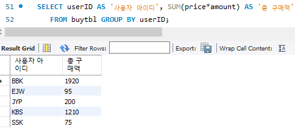
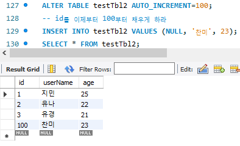

# SQL 기본2

```sql
select 열이름 from 테이블명 where 조건;

insert into 테이블명 values (값1,값2, ...);

update 테이블명 set 열1=값1 where 조건;

delete from 테이블명 where 조건;
```

## 복습

### <use...>
```sql
use 데이터베이스_이름;
```
- use를 사용하고 나서는 모든 SQL문은 use된 DB에서 수행 

### <select... from>
```sql
select 열이름 from 테이블명 where 조건;
```
- 데이터베이스 내 테이블에서 원하는 정보를 추출
- 조건
  - 열이름 = 값1 
    - (name = '김경호')
  - or, and, 조건 연산자 사용 
    - (birthyear=1970)
  - between ... and: 데이터가 숫자로 구성되어 있으며 연속적인 값 / 조건 연산자 상위호환    
    - (height between 180 and 183)
  - in(): 이산적인 값의 조건 / or 연산자 상위호환 
    - (in('경남','경북'))
  - like: 문자열의 내용 검색 / `%` 혹은 `-` 이용 
    - (like '김%')

### DB, TABLE 조회
```sql
show database; 
- 현재 서버에 어떤 DB가 있는지 보기

show table status;
- DB에 있는 테이블 정보 조회

show tables;
- 테이블 이름만 간단히 보기

describe employees;
employees 테이블의 열이 무엇이 있는지 확인
```

## ANY/ALL/SOME, 서브쿼리(SubQuery, 하위쿼리)

### 서브쿼리
- 쿼리문 안에 또 쿼리문이 들어 있는 것
- EX) 김경호보다 키가 크거나 같은 사람의 이름과 키 출력
  - where 조건에 김경호의 키를 직접 써주는 것을 쿼리로 해결 
- 단, 조건에 따른 값이 하나만 나올때 사용 가능 
```sql
select name, height from usertbl where height >= 177;
-->
select name, height from usertbl 
    where height >= (select height from usertbl where name = '김경호');
```


### ANY
- 서브쿼리의 여러 개의 겨로가 중 한 가지만 만족해도 가능 
- SOME은 ANY와 동일한 의미로 사용
- `=ANY(서브쿼리)` == `IN(서브쿼리)`

```sql
SELECT name, height FROM usertbl 
   WHERE height >= (SELECT height FROM usertbl WHERE addr = '경남');
--> 조건의 값이 2개이기에 error 

SELECT name, height FROM usertbl 
   WHERE height >= ANY (SELECT height FROM usertbl WHERE addr = '경남');
--> 170 or 173 == 170 이상인 사람 출력 
```
`= any()` == `in()`
```sql 
SELECT name, height FROM usertbl 
   WHERE height = ANY (SELECT height FROM usertbl WHERE addr = '경남');
   
SELECT name, height FROM usertbl 
  WHERE height IN (SELECT height FROM usertbl WHERE addr = '경남');
```

### ALL
- 서브쿼리의 결과 중 여러 개의 결과를 모두 만족해야 함 
```sql
SELECT name, height FROM usertbl 
   WHERE height >= ALL (SELECT height FROM usertbl WHERE addr = '경남');
--> 170 and 173 == 173 이상인 사람 출력
```


## ORDER BY
---
> 원하는 순서대로 정렬하여 출력
### order by 절
- 결과물에 대해 영향을 미치지는 않고 출력되는 순서를 조절하는 구문 
- 기본적으로 ascending 정렬
- descending으로 정렬하려면 열 이름 뒤에 desc
- order by 구문을 혼합해 사용하는 구문도 가능 
  - 키가 큰 순서로 정렬하되 만약 키가 같을 경우 이름 순으로 정렬 
  - asc는 디폴트 값으므로 생략 가능 
```sql
SELECT name, height FROM usertbl ORDER BY height DESC, name ASC;
-- 키 큰 순서대로 출력하고 키가 같으면 이름 순서대로 출력
```

### DISTINCT: 중복된 것은 하나만 남긴다
- 중복된 것을 골라서 세기 어려울 때 사용하는 구문
- 테이블의 크기가 클수록 효율적
- 중복된 것은 개씩만 보여주면서 출력 


### LIMIT: 출력하는 개수를 제한 
- 일부를 보기 위해 여러 건의 데이터를 출력하는 부담을 줄임 
- 상위 N개만 출력하는 `LIMIT N` 구문 사용
- 개수의 문제보다는 MySQL의 부담을 많이 줄여주는 방법 


### CREATE TABLE ... (SELECT...): 테이블을 복사
- 테이블을 복사해서 사용할 경우 사용
- SELECT 복사할 열 FROM 기존테이블
- 지정한 일부 열만 복사 가능
- PK나 FK 같은 제약 조건은 복사되지 않음 


## GROUP BY 및 HAVING 그리고 집계 함수 
---
### GROUP BY 절 
- 그룹으로 묶어주는 역활
  - 기준으로 할 column을 정하고
  - 사용할 집계함수를 정한다 
- 집계 함수와 함께 사용 
  - 효율적인 데이터 grouping
  - 각 사용자 별로 구매한 개수를 합쳐 출력

    - userID를 기준으로 grouping 
  - 읽기 좋게 하기 위해 별칭 AS 사용 



### group by 와 함께 자주 사용되는 집계 함수


```sql
SELECT AVG(amount) AS '평균 구매 개수' FROM buytbl ;
-- 한 사람당 구매하는 평균 구매 개수

SELECT userID, AVG(amount) AS '평균 구매 개수' FROM buytbl  GROUP BY userID;
-- 각 사람마다 구매하는 평균 구매 개수 
```

VS


- 이름은 키와 별도로 출력되었다 


- grouping 을 하면 각 이름별로 min과 max를 출력한다 


- 서브쿼리를 이용해 해결한다 


- 개수 새기 


### HAVING 절
- WHERE와 비슷한 개념으로 조건 제한하는 것이지만, 집계 함수에 대해서 조건을 제한하는 것
- HAVING절은 꼭 GROUP BY절 다음에 나와야 함


### ROLLUP
- 총합 또는 중간 합계가 필요할 경우 사용
- GROUP BY절과 함께 WITH ROLLUP문 사용 
- EX) 분류(GROUPNAME) 별로 합계 및 그 총합 구하기 


## SQL의 분류
### DML (Data Manipulation Language, 데이터 조작 언어)
- 데이터를 조작 선택 , 삽입 , 수정 , 삭제 하는 데 사용되는 언어
- DML 구문이 사용되는 대상은 테이블의 행
- DML 사용하기 위해서는 테이블이 정의되어 있어야 함
- SQL문 중 SELECT, INSERT, UPDATE, DELETE 가 이 구문에 해당
- 트랜잭션이 발생하는 SQL 도 DML 에 속함
  - 테이블의 데이터를 변경 입력 수정 삭제 할 때 실제 테이블에 완전히 적용하지 않고 , 임시로 적용시키는 것
  - 취소 가능

### DDL (Data Definition Language, 데이터 정의 언어)
- 데이터베이스, 테이블 , 뷰 , 인덱스 등의 데이터베이스 개체를 생성 삭제 변경하는 역할
- CREATE, DROP, ALTER 자주 사용
- DDL은 트랜잭션 발생시키지 않음
- 되돌림(ROLLBACK)이나 완전적용 (COMMIT) 사용 불가

### DCL (Data Control Language, 데이터 제어 언어)
- 사용자에게 어떤 권한을 부여하거나 빼앗을 때 주로 사용하는 구문
- GRANT/REVOKE/DENY 구문


# 데이터 변경을 위한 SQL문

## 데이터의 삽입: insert

### insert문의 기본 
```sql
insert [into] 테이블[(열1, 열2, ...)] values (값1, 값2, ...)
```


- 테이블 이름 다음에 나오는 열 생략 가능 
- 생략할 경우에 values 다음에 나오는 값들의 순서 및 개수가 테이블이 정의된 열 순서 및 개수와 동일해야 함 

### 자동으로 증가하는 auto_increment 
- INSERT에서는 해당 열이 없다고 생각하고 입력
  - INSERT문에서 NULL 값 지정하면 자동으로 값 입력
- 1부터 증가하는 값 자동 입력
- 적용할 열이 PRIMARY KEY 또는 UNIQUE 일 때만 사용가능
- 데이터 형은 숫자 형식만 사용 가능


- 마지막 id가 어딘지 반환


### alter: 테이블 변경 



### 대량의 샘플 데이터 생성 
- insert into ...select 구문 사용
```sql
INSERT INTO 테이블이름 (열 이름1, 열 이름2, ...)
    SELECT문;
```
- 다른 테이블의 데이터를 가져와 대량으로 입력하는 효과
- select문의 열의 개수 = insert 할 테이블의 열의 개수 
- 테이블 정의 까지 생략 하려면 create table ...select 구문을 사용 


- employees DB의 employees 태이블에서 가져온 데이터로 testTbl4 테이블 만들기 


- 특정 항목만 복사하기 


## 데이터의 수정: update
>SET SQL_SAFE_UPDATES = 0; 라고하면 safe update mode 끌 수 었어서 update 나 delete 가능합니다.
- 기존에 입력되어 있는 값 변경하는 구문 
```sql
update 테이블이름
    set 열1=값1, 열2=값2, ...
    where 조건;
```
- where절 생략 가능하나 where절 생략하면 테이블의 전체 행의 내용 변경 
  - 실무에서 실수가 종종 일어남, `주의 필요`
  - 원상태로 북구하기 복잡하며, 다시 되돌릴 수 없는 경우도 있음


- testTbl4에서 'kyoichi' 라는 Fname을 '없음' 으로 바꾼다 


- buytbl의 price를 price*1.5로 바꾼다 

## 데이터의 삭제: delete from
- 행 단위로 데이터 삭제하는 구문 
```sql
delete from 테이블이름 where 조건;
```
- where절이 생략되면 전체 데이터를 삭제함 
  


- 테이블을 삭제하는 경우의 속도 비교 
  - DML문인 DELETE 는 트랜잭션 로그 기록 작업 때문에 삭제 느림
  - DDL문인 DROP 과 TRUNCATE 문은 트랜잭션 없어 빠름
  - 테이블 자체가 필요 없을 경우에는 DROP 으로 삭제
  - 테이블의 구조는 남겨놓고 싶다면 TRUNCATE 로 삭제하는 것이 효율적


- limit으로 제거하고 싶은 개수를 지정 가능 


### 조건부 데이터 입력, 변경
- 기본 키가 중복된 데이터를 입력한 경우
  - 오류로 입력 불가
- 대용량 데이터 처리의 경우 에러 밸생하지 않은 구문 실행
  - INSERT IGNORE문
    - 에러 발생해도 다음 구문으로 넘어가게 처리
    - 에러 메시지 보면 적용되지 않은 구문이 어느 것인지 구분 가능 
  - ON DUPLICATE KEY UPDATE 구문
    - 기본 키가 중복되면 데이터를 수정되도록 하는 구문도 활용 가능 


### 숙제

- 회원 테이블 (columns: id, 플랫폼, 음악 이름, 장르, 횟수)
- 회원 추천음악 테이블 (columns: id, 사용자가 가장 많이 듣는 장르, 그 장르에서 가장 많이 듣는 음악 )
- 회원 예측 결과 저장 테이블 (columns: id, 추천 음악, 들은 횟수)


