# SQL 테이블 만들기 


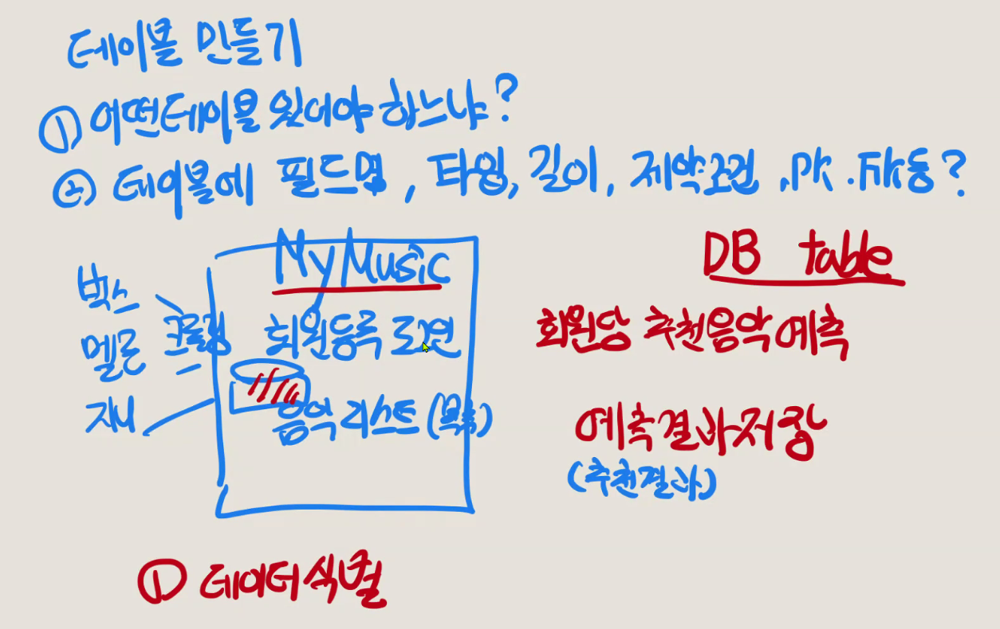

1. 데이터 식별
2. 데이터 흐름 

- 테이블 
1. 회원 table
    - pk 순번 num
    - ID varchar(20)
    - PW varchar pw
    - 핸번 varchar(10)
    - 등록날짜 date
    - 회원상태 char(2)

2. 음악목록 table
    - pk 순번 music num
    - 음악 플랫폼 varchar(3)
    - 음반 이름
    - 곡정보
    - 가수정보
    - 앨범이름
    - 앨범그림
    - 링크 

3. 회원음악듣기 table 
    - pk 듣기 순번
    - 회원 (pk 회원 순번 foriegn)
    - 음악 (pk 음악 순번 foriegn)
    - 날짜 

4. 학습 table

5. 결과 table
   - 회원 
   - 추천 내역 

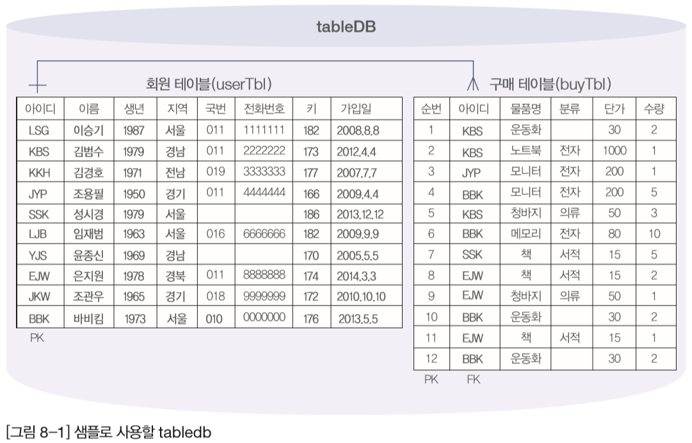


## MySQL Workbench에서 테이블 생성

- Navigator ––> [Schemas] 클릭 'tabledb' 확장 ––>‘Tables’ 마우스 오른쪽 버튼 --> [Create Table] 선택

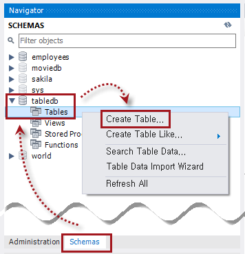

- usertbl 생성 --> userID 열을 기본 키 (Primary key) 로 설정

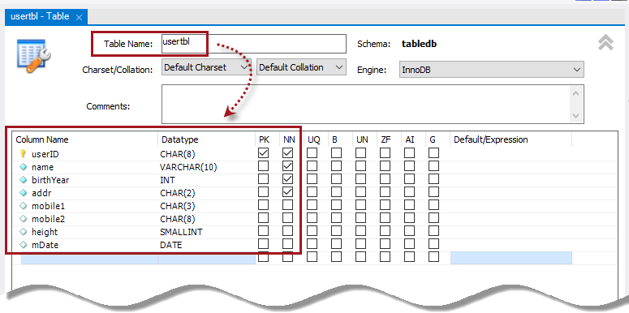


- buytbl 생성 --> num열을 기본 키(Primary Key)로 설정 

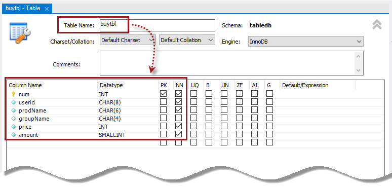


- buytbl 생성 --> num열에 AUTO_INCREMENT, FOREIGN KEY 추가

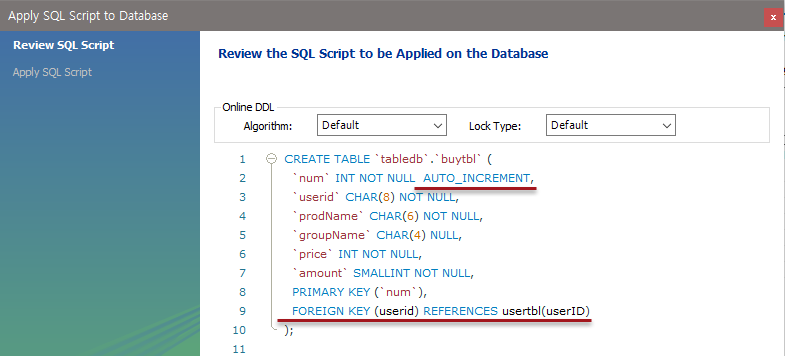


- Navigator에서 usertbl 선택 마우스 오른쪽 버튼 클릭 ––>[Select Rows Limit 1000] 선택
- <Insert new row> 아이콘 클릭한 후, 3 개 행 입력 --> <Apply> 클릭 --> <Finish> 클릭

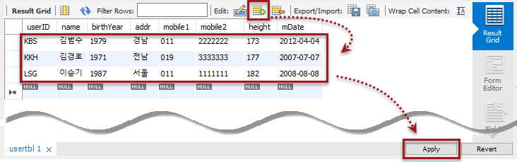


- buytbl 선택 마우스 오른쪽 버튼 클릭 ––> [Select Rows Limit 1000] 선택
- <Insert new row> 아이콘 클릭한 후 , 3 개 행 입력
    - num열은 자동 입력되니 NULL 값은 그대로 둠 --<Apply> 클릭

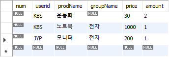


- JYP열 선택 마우스 오른쪽 버튼 ––[Delete Row(s)] 선택
- <Apply> 클릭 --> <Finish> 클릭

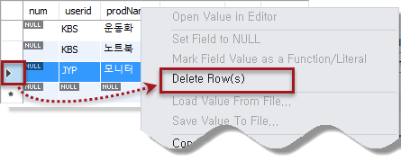


## SQL로 테이블 생성
- usertbl 생성

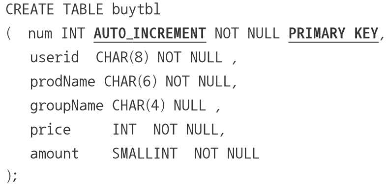

- buytbl 생성

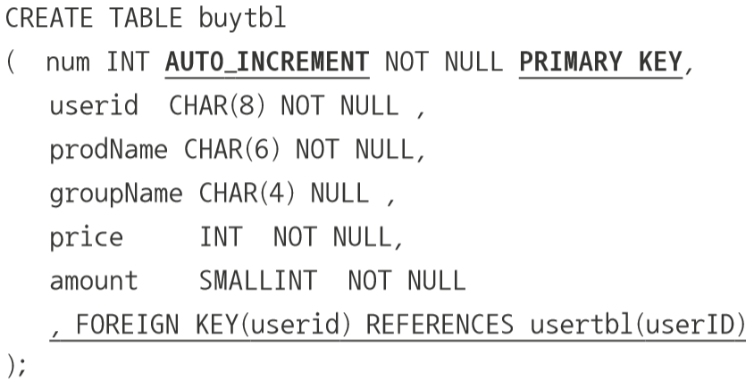

- 회원 테이블 데이터 입력
    - INSERT INTO usertbl VALUES('LSG', ' 이승기 ', 1987, 서울 ', '011', '1111111', 182, '2008 8 8');
    - INSERT INTO usertbl VALUES('KBS', ' 김범수 ', 1979, 경남 ', '011', '2222222', 173, '2012 4 4');
    - INSERT INTO usertbl VALUES('KKH', ' 김경호 ', 1971, 전남 ', '019', '3333333', 177, '2007 7 7');

- 구매 테이블 데이터 입력
    - INSERT INTO buytbl VALUES(NULL, 'KBS', ' 운동화 ', NULL, 30, 2);
    - INSERT INTO buytbl VALUES(NULL, 'KBS', ' 노트북 ', 전자 ', 1000, 1);
    - INSERT INTO buytbl VALUES(NULL, 'JYP', ' 모니터 ', 전자 ', 200, 1);

- 구매 테이블 데이터 입력시 3 번째 행은 앞과 같이 에러 발생하므로 삭제하고 입력

## 제약 조건

- 제약 조건 (Constraint) 이란
    - 데이터의 무결성을 지키기 위한 제한된 조건 의미
    - 특정 데이터를 입력 시 어떠한 조건을 만족했을 때에 입력되도록 제약
    - ex) 동일한 아이디로 다시 회원 가입이 안되는 것

- 데이터 무결성을 위한 제약조건
    - PRIMARY KEY 제약 조건
    - FOREIGN KEY 제약 조건
    - UNIQUE 제약 조건
    - CHECK 제약 조건 (MySQL 8.0.16 부터 지원
    - DEFAULT 정의
    - NULL값 허용 (NOT NULL, NN)

### 기본키 (Primary Key) 제약 조건

- 기본 키 (Primary Key) 란
    - 테이블에 존재하는 많은 행의 데이터를 구분할 수 있는 식별자
    - 중복이나 NULL 값이 입력될 수 없음
    - ex) 회원 테이블의 회원 아이디 , 학생 테이블이 학번
- 기본 키로 생성한 것은 자동으로 클러스터형 인덱스 생성
- 테이블에서는 기본 키를 하나 이상 열에 설정 가능
- 기본키 생성 방법

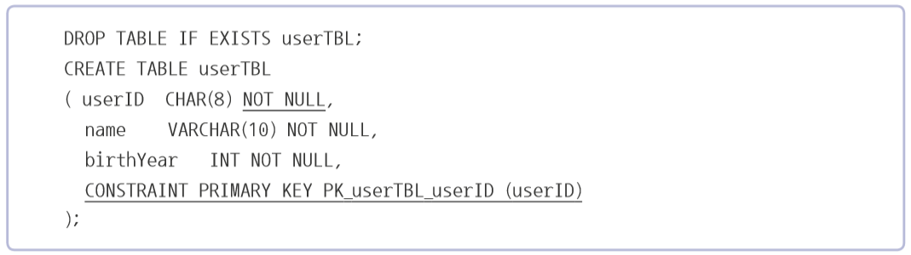

- 제품 테이블

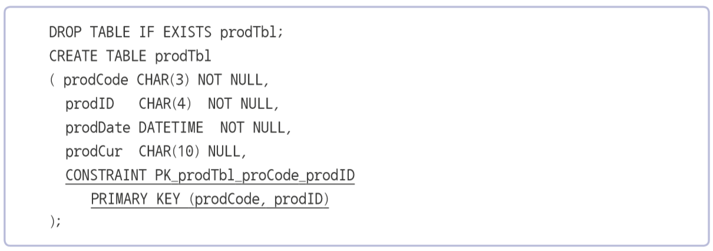

- SHOW INDEX FROM prodTbl

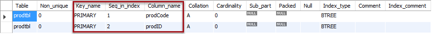


### 외래키 (Foreign Key) 제약 조건

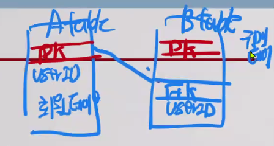
- 두 테이블 사이의 관계 선언하여 데이터의 무결성 보장해주는 역할
- 외래키 관계를 설정하면 하나의 테이블이 다른 테이블에 의존
- 외래키 테이블이 참조하는 기준 테이블의 열은 반드시 Primary Key 이거나
Unique 제약 조건이 설정되어 있어야 함
- 외래키의 옵션 중 ON DELETE CASCADE 또는 ON UPDATE CASCADE
- 기준테이블의 데이터가 변경되었을 때 외래 키 테이블도 자동으로 적용되도록설정

- 외래키 생성 방법
- CREATE TABLE 끝에 FOREIGN KEY 키워드로 설정

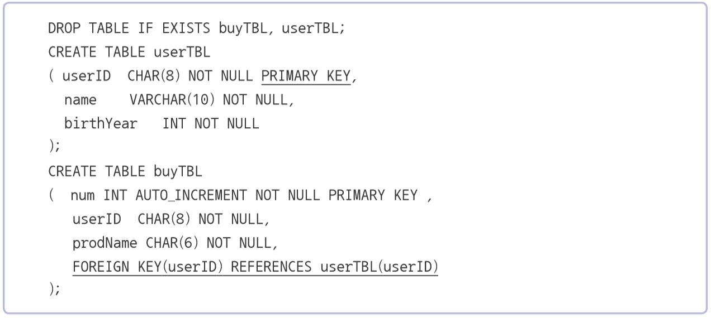

- ALTER TABLE 구문 이용

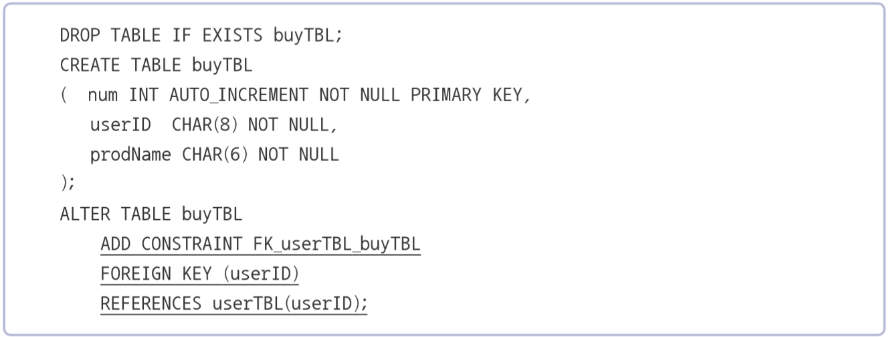


### UNIQUE 제약 조건
- ‘중복되지
않는 유일한 값’을 입력해야 하는 조건
- PRIMARY KEY와 비슷하나 UNIQUE 는 NULL 값 허용
- NULL은 여러 개가 입력되어도 상관 없음
- ex) 회원 테이블 Email 주소 Unique 로 설정

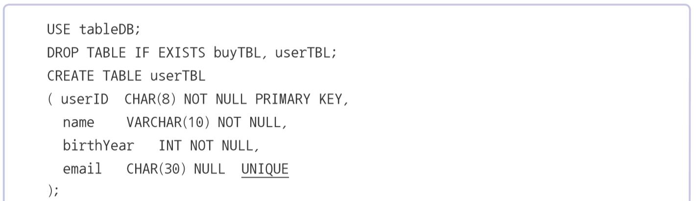


### CHECK 제약 조건
- 입력되는 데이터를 점검하는 기능
- ex) 키 (Height) 제한 마이너스 값이 들어올수 없도록
- 출생년도 제한 1900 년 이후이고 현재시점 이전
- ALTER TABLE 문으로 제약 조건 추가 가능


### CHECK 제약 조건
- 입력되는 데이터를 점검하는 기능
  - ex) 키 (Height) 제한 마이너스 값이 들어올수 없도록
  - 출생년도 제한 1900 년 이후이고 현재시점 이전
- ALTER TABLE 문으로 제약 조건 추가 가능

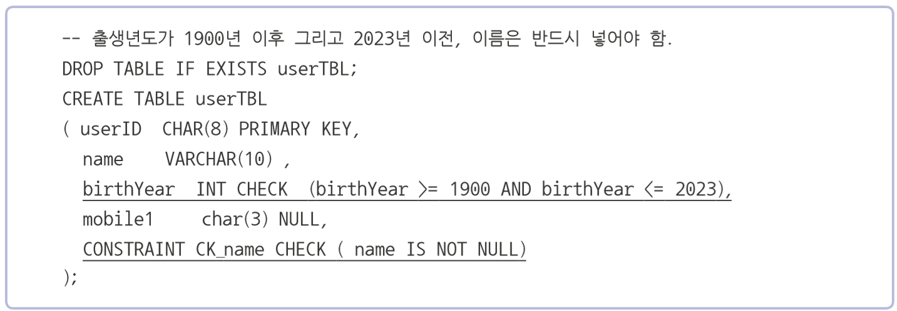

### DEFAULT 정의
- 값 입력하지 않았을 때 자동으로 입력되는 기본 값 정의하는 방법
- ALTER TABLE 사용 시에 열에 DEFAULT 를 지정하기 위해서 ALTER COLUMN 문 사용

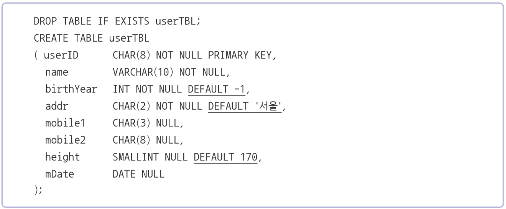

- 디폴트 설정된 열에는 다음과 같은 방법으로 데이터 입력

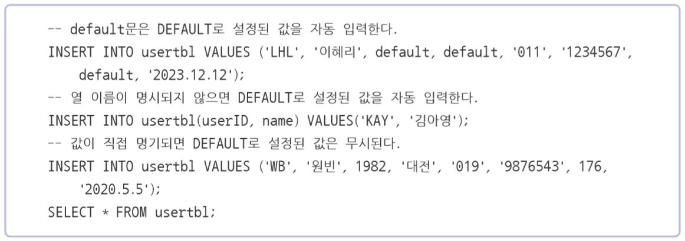
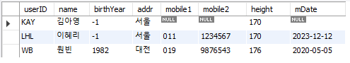

### Null값 허용
- NULL 값을 허용하려면 NULL 을 , 허용하지 않으려면 NOT NULL 을 사용
- PRIMARY KEY 가 설정된 열에는 생략하면 자동으로 NOT NULL
- NULL 값은 ‘아무 것도 없다’라는 의미 , 공백 (‘ ‘) 이나 0 과 다름


## 정리
```sql
-- <실습 1> --

DROP DATABASE IF EXISTS ShopDB;
DROP DATABASE IF EXISTS ModelDB;
DROP DATABASE IF EXISTS sqldb;
DROP DATABASE IF EXISTS tabledb;

CREATE DATABASE tabledb;

CREATE TABLE `tabledb`.`buytbl` (
  `num` INT NOT NULL AUTO_INCREMENT,
  `userid` CHAR(8) NOT NULL,
  `prodName` CHAR(6) NOT NULL,
  `groupName` CHAR(4) NULL,
  `price` INT NOT NULL,
  `amount` SMALLINT NOT NULL,
  PRIMARY KEY (`num`),
  FOREIGN KEY (userid) REFERENCES usertbl(userID)  
);

-- </실습 1> --

CREATE TABLE test (num INT);

-- <실습 2> --

DROP DATABASE tabledb;
CREATE DATABASE tabledb;

USE tabledb;
DROP TABLE IF EXISTS buytbl, usertbl;
CREATE TABLE usertbl -- 회원 테이블
( userID  CHAR(8), -- 사용자 아이디
  name    VARCHAR(10), -- 이름
  birthYear   INT,  -- 출생년도
  addr	  CHAR(2), -- 지역(경기,서울,경남 등으로 글자만 입력)
  mobile1  CHAR(3), -- 휴대폰의국번(011, 016, 017, 018, 019, 010 등)
  mobile2  CHAR(8), -- 휴대폰의 나머지 전화번호(하이픈 제외)
  height    SMALLINT,  -- 키
  mDate    DATE  -- 회원 가입일
);
CREATE TABLE buytbl -- 구매 테이블
(  num INT, -- 순번(PK)
   userid  CHAR(8),-- 아이디(FK)
   prodName CHAR(6), -- 물품명
   groupName CHAR(4) , -- 분류
   price     INT , -- 단가
   amount SMALLINT -- 수량
);

USE tabledb;
DROP TABLE IF EXISTS buytbl, usertbl;
CREATE TABLE usertbl 
( userID  CHAR(8) NOT NULL , 
  name    VARCHAR(10) NOT NULL, 
  birthYear   INT NOT NULL,  
  addr	  CHAR(2) NOT NULL,
  mobile1	CHAR(3) NULL, 
  mobile2   CHAR(8) NULL, 
  height    SMALLINT NULL, 
  mDate    DATE NULL 
);
CREATE TABLE buytbl 
(  num INT NOT NULL , 
   userid  CHAR(8) NOT NULL ,
   prodName CHAR(6) NOT NULL,
   groupName CHAR(4) NULL , 
   price     INT  NOT NULL,
   amount    SMALLINT  NOT NULL 
);

USE tabledb;
DROP TABLE IF EXISTS buytbl, usertbl;
CREATE TABLE usertbl 
( userID  CHAR(8) NOT NULL PRIMARY KEY, 
  name    VARCHAR(10) NOT NULL, 
  birthYear   INT NOT NULL,  
  addr	  CHAR(2) NOT NULL,
  mobile1	CHAR(3) NULL, 
  mobile2   CHAR(8) NULL, 
  height    SMALLINT NULL, 
  mDate    DATE NULL 
);
CREATE TABLE buytbl 
(  num INT NOT NULL PRIMARY KEY, 
   userid  CHAR(8) NOT NULL ,
   prodName CHAR(6) NOT NULL,
   groupName CHAR(4) NULL , 
   price     INT  NOT NULL,
   amount    SMALLINT  NOT NULL 
);


DROP TABLE IF EXISTS buytbl;
CREATE TABLE buytbl 
(  num INT AUTO_INCREMENT NOT NULL PRIMARY KEY, 
   userid  CHAR(8) NOT NULL ,
   prodName CHAR(6) NOT NULL,
   groupName CHAR(4) NULL , 
   price     INT  NOT NULL,
   amount    SMALLINT  NOT NULL 
);


DROP TABLE IF EXISTS buytbl;
CREATE TABLE buytbl 
(  num INT AUTO_INCREMENT NOT NULL PRIMARY KEY, 
   userid  CHAR(8) NOT NULL ,
   prodName CHAR(6) NOT NULL,
   groupName CHAR(4) NULL , 
   price     INT  NOT NULL,
   amount    SMALLINT  NOT NULL 
   , FOREIGN KEY(userid) REFERENCES usertbl(userID)
);

INSERT INTO usertbl VALUES('LSG', '이승기', 1987, '서울', '011', '1111111', 182, '2008-8-8');
INSERT INTO usertbl VALUES('KBS', '김범수', 1979, '경남', '011', '2222222', 173, '2012-4-4');
INSERT INTO usertbl VALUES('KKH', '김경호', 1971, '전남', '019', '3333333', 177, '2007-7-7');

INSERT INTO buytbl VALUES(NULL, 'KBS', '운동화', NULL, 30, 2);
INSERT INTO buytbl VALUES(NULL, 'KBS', '노트북', '전자', 1000, 1);
INSERT INTO buytbl VALUES(NULL, 'JYP', '모니터', '전자', 200, 1);

-- 추가 입력 
INSERT INTO usertbl VALUES('JYP', '조용필', 1950, '경기', '011', '4444444', 166, '2009-4-4');
INSERT INTO usertbl VALUES('SSK', '성시경', 1979, '서울', NULL  , NULL      , 186, '2013-12-12');
INSERT INTO usertbl VALUES('LJB', '임재범', 1963, '서울', '016', '6666666', 182, '2009-9-9');
INSERT INTO usertbl VALUES('YJS', '윤종신', 1969, '경남', NULL  , NULL      , 170, '2005-5-5');
INSERT INTO usertbl VALUES('EJW', '은지원', 1972, '경북', '011', '8888888', 174, '2014-3-3');
INSERT INTO usertbl VALUES('JKW', '조관우', 1965, '경기', '018', '9999999', 172, '2010-10-10');
INSERT INTO usertbl VALUES('BBK', '바비킴', 1973, '서울', '010', '0000000', 176, '2013-5-5');
INSERT INTO buytbl VALUES(NULL, 'JYP', '모니터', '전자', 200,  1);
INSERT INTO buytbl VALUES(NULL, 'BBK', '모니터', '전자', 200,  5);
INSERT INTO buytbl VALUES(NULL, 'KBS', '청바지', '의류', 50,   3);
INSERT INTO buytbl VALUES(NULL, 'BBK', '메모리', '전자', 80,  10);
INSERT INTO buytbl VALUES(NULL, 'SSK', '책'    , '서적', 15,   5);
INSERT INTO buytbl VALUES(NULL, 'EJW', '책'    , '서적', 15,   2);
INSERT INTO buytbl VALUES(NULL, 'EJW', '청바지', '의류', 50,   1);
INSERT INTO buytbl VALUES(NULL, 'BBK', '운동화', NULL   , 30,   2);
INSERT INTO buytbl VALUES(NULL, 'EJW', '책'    , '서적', 15,   1);
INSERT INTO buytbl VALUES(NULL, 'BBK', '운동화', NULL   , 30,   2);


-- </실습 2> --

USE tabledb;
DROP TABLE IF EXISTS buytbl, usertbl;
CREATE TABLE usertbl 
( userID  CHAR(8) NOT NULL PRIMARY KEY, 
  name    VARCHAR(10) NOT NULL, 
  birthYear   INT NOT NULL
);

DESCRIBE usertbl;

DROP TABLE IF EXISTS usertbl;
CREATE TABLE usertbl 
( userID  CHAR(8) NOT NULL, 
  name    VARCHAR(10) NOT NULL, 
  birthYear   INT NOT NULL,  
  CONSTRAINT PRIMARY KEY PK_usertbl_userID (userID)
);

DROP TABLE IF EXISTS usertbl;
CREATE TABLE usertbl 
(   userID  CHAR(8) NOT NULL, 
    name    VARCHAR(10) NOT NULL, 
    birthYear   INT NOT NULL
);
ALTER TABLE usertbl
     ADD CONSTRAINT PK_usertbl_userID 
     PRIMARY KEY (userID);


DROP TABLE IF EXISTS prodTbl;
CREATE TABLE prodTbl
( prodCode CHAR(3) NOT NULL,
  prodID   CHAR(4)  NOT NULL,
  prodDate DATETIME  NOT NULL,
  prodCur  CHAR(10) NULL
);
ALTER TABLE prodTbl
	ADD CONSTRAINT PK_prodTbl_proCode_prodID 
	PRIMARY KEY (prodCode, prodID) ;

DROP TABLE IF EXISTS prodTbl;
CREATE TABLE prodTbl
( prodCode CHAR(3) NOT NULL,
  prodID   CHAR(4)  NOT NULL,
  prodDate DATETIME  NOT NULL,
  prodCur  CHAR(10) NULL,
  CONSTRAINT PK_prodTbl_proCode_prodID 
	PRIMARY KEY (prodCode, prodID) 
);

SHOW INDEX FROM prodTbl;

DROP TABLE IF EXISTS buytbl, usertbl;
CREATE TABLE usertbl 
( userID  CHAR(8) NOT NULL PRIMARY KEY, 
  name    VARCHAR(10) NOT NULL, 
  birthYear   INT NOT NULL 
);
CREATE TABLE buytbl 
(  num INT AUTO_INCREMENT NOT NULL PRIMARY KEY , 
   userID  CHAR(8) NOT NULL, 
   prodName CHAR(6) NOT NULL,
   FOREIGN KEY(userID) REFERENCES usertbl(userID)
);


DROP TABLE IF EXISTS buytbl;
CREATE TABLE buytbl 
(  num INT AUTO_INCREMENT NOT NULL PRIMARY KEY , 
   userID  CHAR(8) NOT NULL, 
   prodName CHAR(6) NOT NULL,
   CONSTRAINT FK_usertbl_buytbl FOREIGN KEY(userID) REFERENCES usertbl(userID)
);


DROP TABLE IF EXISTS buytbl;
CREATE TABLE buytbl 
(  num INT AUTO_INCREMENT NOT NULL PRIMARY KEY,
   userID  CHAR(8) NOT NULL, 
   prodName CHAR(6) NOT NULL 
);
ALTER TABLE buytbl
    ADD CONSTRAINT FK_usertbl_buytbl 
    FOREIGN KEY (userID) 
    REFERENCES usertbl(userID);

SHOW INDEX FROM buytbl ;

ALTER TABLE buytbl
	DROP FOREIGN KEY FK_usertbl_buytbl; -- 외래 키 제거
ALTER TABLE buytbl
	ADD CONSTRAINT FK_usertbl_buytbl
	FOREIGN KEY (userID)
	REFERENCES usertbl (userID)
	ON UPDATE CASCADE;

USE tabledb;
DROP TABLE IF EXISTS buytbl, usertbl;
CREATE TABLE usertbl 
( userID  CHAR(8) NOT NULL PRIMARY KEY, 
  name    VARCHAR(10) NOT NULL, 
  birthYear   INT NOT NULL,  
  email   CHAR(30) NULL  UNIQUE
);
DROP TABLE IF EXISTS usertbl;
CREATE TABLE usertbl 
( userID  CHAR(8) NOT NULL PRIMARY KEY,
  name    VARCHAR(10) NOT NULL, 
  birthYear   INT NOT NULL,  
  email   CHAR(30) NULL ,  
  CONSTRAINT AK_email  UNIQUE (email)
);

-- 출생연도가 1900년 이후 그리고 2023년 이전, 이름은 반드시 넣어야 함.
DROP TABLE IF EXISTS usertbl;
CREATE TABLE usertbl 
( userID  CHAR(8) PRIMARY KEY,
  name    VARCHAR(10) , 
  birthYear  INT CHECK  (birthYear >= 1900 AND birthYear <= 2023),
  mobile1	char(3) NULL, 
  CONSTRAINT CK_name CHECK ( name IS NOT NULL)  
);

-- 휴대폰 국번 체크
ALTER TABLE usertbl
	ADD CONSTRAINT CK_mobile1
	CHECK  (mobile1 IN ('010','011','016','017','018','019')) ;

DROP TABLE IF EXISTS usertbl;
CREATE TABLE usertbl 
( userID  	CHAR(8) NOT NULL PRIMARY KEY,  
  name    	VARCHAR(10) NOT NULL, 
  birthYear	INT NOT NULL DEFAULT -1,
  addr	  	CHAR(2) NOT NULL DEFAULT '서울',
  mobile1	CHAR(3) NULL, 
  mobile2	CHAR(8) NULL, 
  height	SMALLINT NULL DEFAULT 170, 
  mDate    	DATE NULL
);


DROP TABLE IF EXISTS usertbl;
CREATE TABLE usertbl 
( userID  	CHAR(8) NOT NULL PRIMARY KEY,  
  name    	VARCHAR(10) NOT NULL, 
  birthYear	INT NOT NULL,
  addr	  	CHAR(2) NOT NULL,
  mobile1	CHAR(3) NULL, 
  mobile2	CHAR(8) NULL, 
  height	SMALLINT NULL, 
  mDate    	DATE NULL
);
ALTER TABLE usertbl
	ALTER COLUMN birthYear SET DEFAULT -1;
ALTER TABLE usertbl
	ALTER COLUMN addr SET DEFAULT '서울';
ALTER TABLE usertbl
	ALTER COLUMN height SET DEFAULT 170;

-- default 문은 DEFAULT로 설정된 값을 자동 입력한다.
INSERT INTO usertbl VALUES ('LHL', '이혜리', default, default, '011', '1234567', default, '2023.12.12');
-- 열이름이 명시되지 않으면 DEFAULT로 설정된 값을 자동 입력한다
INSERT INTO usertbl(userID, name) VALUES('KAY', '김아영');
-- 값이 직접 명기되면 DEFAULT로 설정된 값은 무시된다.
INSERT INTO usertbl VALUES ('WB', '원빈', 1982, '대전', '019', '9876543', 176, '2020.5.5');
SELECT * FROM usertbl;


-- <실습 3> --

CREATE DATABASE IF NOT EXISTS compressDB;
USE compressDB;
CREATE TABLE normalTBL( emp_no int , first_name varchar(14));
CREATE TABLE compressTBL( emp_no int , first_name varchar(14))
	ROW_FORMAT=COMPRESSED ;

INSERT INTO normalTbl 
     SELECT emp_no, first_name FROM employees.employees;   
INSERT INTO compressTBL 
     SELECT emp_no, first_name FROM employees.employees;

SHOW TABLE STATUS FROM compressDB;

DROP DATABASE IF EXISTS compressDB;

-- </실습 3> --


-- <실습 4> --


-- Workbench 1
USE employees;
CREATE TEMPORARY TABLE  IF NOT EXISTS  temptbl (id INT, name CHAR(5));
CREATE TEMPORARY TABLE  IF NOT EXISTS employees (id INT, name CHAR(5));
DESCRIBE temptbl;
DESCRIBE employees;

INSERT INTO temptbl VALUES (1, 'This');
INSERT INTO employees VALUES (2, 'MySQL');
SELECT * FROM temptbl;
SELECT * FROM employees;

-- Workbench 2
USE employees;
SELECT * FROM temptbl;
SELECT * FROM employees;

-- Workbench 1
DROP TABLE temptbl; 

USE employees;
SELECT * FROM employees;

-- </실습 4> --

USE tabledb;
ALTER TABLE usertbl
	ADD homepage VARCHAR(30)  -- 열추가
		DEFAULT 'http://www.hanbit.co.kr' -- 디폴트값
		NULL; -- Null 허용함

ALTER TABLE usertbl
	DROP COLUMN mobile1;

ALTER TABLE usertbl
	CHANGE COLUMN name uName VARCHAR(20) NULL ;

ALTER TABLE usertbl
	DROP PRIMARY KEY; 

ALTER TABLE buytbl
	DROP FOREIGN KEY buytbl_ibfk_1;


-- <실습 5> --

USE tabledb;
DROP TABLE IF EXISTS buytbl, usertbl;
CREATE TABLE usertbl 
( userID  CHAR(8), 
  name    VARCHAR(10),
  birthYear   INT,  
  addr	  CHAR(2), 
  mobile1	CHAR(3), 
  mobile2   CHAR(8), 
  height    SMALLINT, 
  mDate    DATE 
);
CREATE TABLE buytbl 
(  num int AUTO_INCREMENT PRIMARY KEY,
   userid  CHAR(8),
   prodName CHAR(6),
   groupName CHAR(4),
   price     INT ,
   amount   SMALLINT
);


INSERT INTO usertbl VALUES('LSG', '이승기', 1987, '서울', '011', '1111111', 182, '2008-8-8');
INSERT INTO usertbl VALUES('KBS', '김범수', NULL, '경남', '011', '2222222', 173, '2012-4-4');
INSERT INTO usertbl VALUES('KKH', '김경호', 1871, '전남', '019', '3333333', 177, '2007-7-7');
INSERT INTO usertbl VALUES('JYP', '조용필', 1950, '경기', '011', '4444444', 166, '2009-4-4');
INSERT INTO buytbl VALUES(NULL, 'KBS', '운동화', NULL   , 30,   2);
INSERT INTO buytbl VALUES(NULL,'KBS', '노트북', '전자', 1000, 1);
INSERT INTO buytbl VALUES(NULL,'JYP', '모니터', '전자', 200,  1);
INSERT INTO buytbl VALUES(NULL,'BBK', '모니터', '전자', 200,  5);


ALTER TABLE usertbl
	ADD CONSTRAINT PK_usertbl_userID
	PRIMARY KEY (userID);

DESC usertbl;

ALTER TABLE buytbl
	ADD CONSTRAINT FK_usertbl_buytbl
	FOREIGN KEY (userID)
	REFERENCES usertbl (userID);

DELETE FROM buytbl WHERE userid = 'BBK';
ALTER TABLE buytbl
	ADD CONSTRAINT FK_usertbl_buytbl
	FOREIGN KEY (userID)
	REFERENCES usertbl (userID);

INSERT INTO buytbl VALUES(NULL,'BBK', '모니터', '전자', 200,  5);

SET foreign_key_checks = 0;
INSERT INTO buytbl VALUES(NULL, 'BBK', '모니터', '전자', 200,  5);
INSERT INTO buytbl VALUES(NULL, 'KBS', '청바지', '의류', 50,   3);
INSERT INTO buytbl VALUES(NULL, 'BBK', '메모리', '전자', 80,  10);
INSERT INTO buytbl VALUES(NULL, 'SSK', '책'    , '서적', 15,   5);
INSERT INTO buytbl VALUES(NULL, 'EJW', '책'    , '서적', 15,   2);
INSERT INTO buytbl VALUES(NULL, 'EJW', '청바지', '의류', 50,   1);
INSERT INTO buytbl VALUES(NULL, 'BBK', '운동화', NULL   , 30,   2);
INSERT INTO buytbl VALUES(NULL, 'EJW', '책'    , '서적', 15,   1);
INSERT INTO buytbl VALUES(NULL, 'BBK', '운동화', NULL   , 30,   2);
SET foreign_key_checks = 1;

ALTER TABLE userTBL
	ADD CONSTRAINT CK_birthYear
	CHECK ( (birthYear >= 1900 AND birthYear <= 2023) AND (birthYear IS NOT NULL) );

UPDATE usertbl SET birthYear=1979 WHERE userID='KBS';
UPDATE usertbl SET birthYear=1971 WHERE userID='KKH';

ALTER TABLE userTBL
	ADD CONSTRAINT CK_birthYear
	CHECK ( (birthYear >= 1900 AND birthYear <= 2023) AND (birthYear IS NOT NULL) );
    
INSERT INTO usertbl VALUES('TKV', '태권뷔', 2999, '우주', NULL  , NULL , 186, '2023-12-12');

INSERT INTO usertbl VALUES('SSK', '성시경', 1979, '서울', NULL  , NULL , 186, '2013-12-12');
INSERT INTO usertbl VALUES('LJB', '임재범', 1963, '서울', '016', '6666666', 182, '2009-9-9');
INSERT INTO usertbl VALUES('YJS', '윤종신', 1969, '경남', NULL  , NULL , 170, '2005-5-5');
INSERT INTO usertbl VALUES('EJW', '은지원', 1972, '경북', '011', '8888888', 174, '2014-3-3');
INSERT INTO usertbl VALUES('JKW', '조관우', 1965, '경기', '018', '9999999', 172, '2010-10-10');
INSERT INTO usertbl VALUES('BBK', '바비킴', 1973, '서울', '010', '0000000', 176, '2013-5-5');

UPDATE usertbl SET userID = 'VVK' WHERE userID='BBK';

SET foreign_key_checks = 0;
UPDATE usertbl SET userID = 'VVK' WHERE userID='BBK';
SET foreign_key_checks = 1;

SELECT B.userid, U.name, B.prodName, U.addr, CONCAT(U.mobile1, U.mobile2)  AS '연락처'
   FROM buytbl B
     INNER JOIN usertbl U
        ON B.userid = U.userid ;


SELECT COUNT(*) FROM buytbl;

SELECT B.userid, U.name, B.prodName, U.addr, CONCAT(U.mobile1, U.mobile2) AS '연락처'
   FROM buytbl B
     LEFT OUTER JOIN usertbl U
        ON B.userid = U.userid
   ORDER BY B.userid ;


SET foreign_key_checks = 0;
UPDATE usertbl SET userID = 'BBK' WHERE userID='VVK';
SET foreign_key_checks = 1;

ALTER TABLE buytbl
	DROP FOREIGN KEY FK_usertbl_buytbl;
ALTER TABLE buytbl 
	ADD CONSTRAINT FK_usertbl_buytbl
		FOREIGN KEY (userID)
		REFERENCES usertbl (userID)
		ON UPDATE CASCADE;

UPDATE usertbl SET userID = 'VVK' WHERE userID='BBK';
SELECT B.userid, U.name, B.prodName, U.addr, CONCAT(U.mobile1, U.mobile2) AS '연락처'
   FROM buytbl B
     INNER JOIN usertbl U
        ON B.userid = U.userid
  ORDER BY B.userid;

DELETE FROM usertbl WHERE userID = 'VVK';

ALTER TABLE buytbl
	DROP FOREIGN KEY FK_usertbl_buytbl;
ALTER TABLE buytbl 
	ADD CONSTRAINT FK_usertbl_buytbl
		FOREIGN KEY (userID)
		REFERENCES usertbl (userID)
		ON UPDATE CASCADE
		ON DELETE CASCADE;

DELETE FROM usertbl WHERE userID = 'VVK';
SELECT * FROM buytbl ;

ALTER TABLE usertbl
	DROP COLUMN birthYear ;

-- </실습 5> --

```


## MySQL DB 연동 

### 과정
1. 라이브러리 가져오기
   - `import pymysql`
2. 접속하기
   - `connect()`
   - host, port, user, paswd, db
3. 커서가져오기
   - `cursor()`
4. SQL 구문 만들기 (CRUD SQL)
   - insert(Create), select(R), update(U), delete(D)
5. SQL 구문 실행하기
   - `execute()`
6. DB에 Complete하기
   - `commit()`
7. DB연결 닫기 
   - `close()`


### pymysql 라이브러리 소개 및 설치
- mysql을 python 에서 사용할 수 있는 라이브러리
(pymysql 라이브러리 이외에도 MySQLdb Mysql pytion),
MySQL connector 등 다양한 라이브러리 존재)
- 이 중에서 설치가 가장 쉬운 라이브러리
- !pip install pymysql
- 그리고 import pysysql

### 일반적인 mysql 핸들링 코드 작성 순서 
- PyMySql 모듈 import
- pymysql.connect() 메소드를 사용하여 MySQL 에 연결
- 호스트명, 포트 , 로그인 , 암호 , 접속할 DB 등을 파라미터로 지정
- MySQL 접속이 성공하면 , Connection 객체로부터 cursor() 메서드를 호출하여 Cursor 객체를 가져옴
- Cursor객체의 execute() 메서드를 사용하여 SQL 문장을 DB 서버에 전송

- SQL 쿼리의 경우 Cursor 객체의 fetchall ()(), fetchone (), fetchmany () 등의 메서드를 사용하여 서버로부터 가져온 데이터를 코드에서 활용
- 삽입, 갱신 , 삭제 등의 DML(Data Manipulation Language) 문장을 실행하는 경우 , INSERT/UPDATE/DELETE 후 Connection 객체의 commit() 메서드를 사용하여 데이터를 확정
- Connection 객체의 close() 메서드를 사용하여 DB 연결을 닫음

### PyMySql 모듈
- pymysql.connect() 메소드를 사용하여 MySQL 에 연결
- 호스트명, 포트 , 로그인 , 암호 , 접속할 DB 등을 파라미터로 지정
- 주요 파라미터
    - host : 접속할 mysql server 주소
    - port : 접속할 mysql server 의포트번호
    - user : mysql ID
    - passwd : mysql ID의암호
    - db : 접속할데이터베이스
    - charset='utf8' : mysql에서 select하여 데이타를 가져올 때 한글이 깨질 수 있으므로 연결 설정에 넣어줌