# primary key & foreign key 

## 사용 DB 생성

- `REATE DATABASE student_mgmt DEFAULT CHARSET=utf8 COLLATE=utf8_bin;`

### DEFAULT CHARSET=utf8 COLLATE=utf8_bin
- 문자 인코딩(문자셋)과 관련된 설정
  - 한글 데이터의 정확한 처리를 위해, 데이터베이스/테이블 생성시에 추가
  - 문자셋(Character set)은 각 문자가 컴퓨터에 저장될 때 어떠한 '코드'로 저장될지에 대한 규칙의 집합을 의미
- 콜레이션(Collation)은 특정 문자 셋에 의해 데이터베이스에 저장된 값들을 비교 검색하거나 정렬 등의작업을 위해 문자들을 서로 '비교' 할때 사용하는 규칙들의 집합을 의미

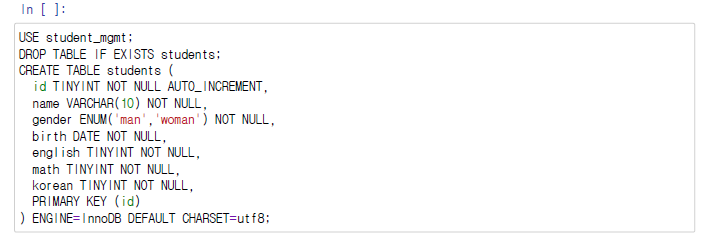

- ENUM 타입: 특정 값만 저장할 수 있도록 저장 가능 값을 지정해주는 데이터 타입
- ENGINE=InnoDB : 스토리지 엔진이 여러 가지 있음 이 중에서 InnoDB로 스토리지 엔진을 정해주는 명령 이명령을 안해줘도 최근 Mysql 버전은 디폴트로 엔진을 InnoDB를 쓴다고 함
- 테이블을 만들때도 DEFAULT CHARSET=utf8 인코딩

## Pandas를 이용한 DB의 select 
- `pd.read_sql()`
- sql 연결객체를 활용하여 쿼리 구문으로 반환된 결과를 데이터프레임으로 바로 생성해 주는 함수

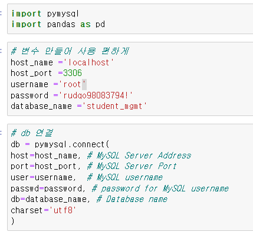

- pandas.read_sql(쿼리, 연결된 db connection 객체)

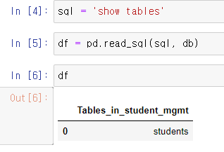

- cusor(), execute(), commit() 들은 자동으로 pandas 프로그램에서 진행

- mysql 워크밴치에서 실행과 같음
  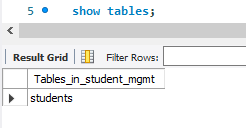

- selet() 해서 table로 가져오기 
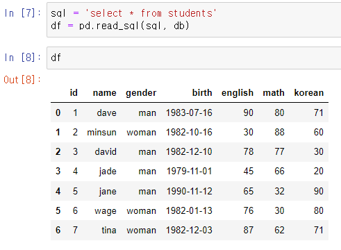

- pandas에서 사용되는 함수 사용 가능

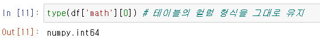

- csv 파일로 저장 후 close()

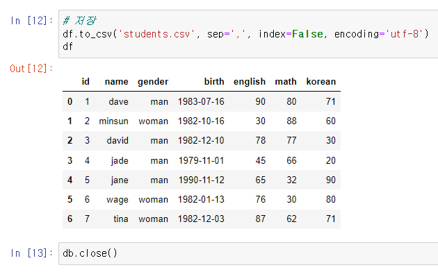

## 외래키 (foreign key)를 만드는 이유
> 두 테이블 사이에 관계를 선언해서, 데이터의 무결성을 보장

- DB 연결 
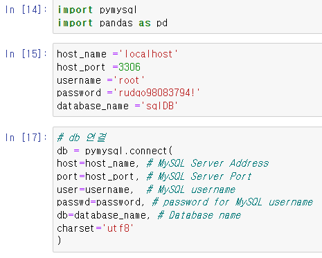
 

- select()로 테이블 가져오기
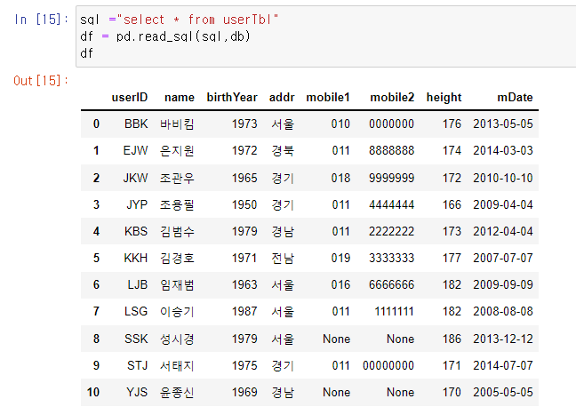

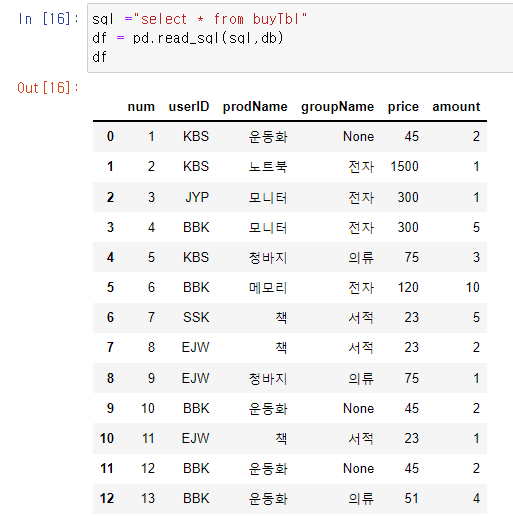

### insert error caused by 외래키 is connected
  
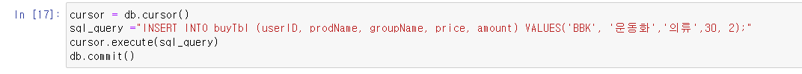
- 테이블을 추가할때는 cusor, execute, commit 필요함

- 에러가 나면 정상임
- CONSTRAINT buyTbl_ibfk_1 FOREIGN KEY (userID) REFERENCES userTbl (userID)
userTbl 에 userID가 STJ인 데이터가 없기 때문에,
  - FOREIGN KEY (userID) REFERENCES userTbl(userID)
  - buyTbl 테이블의 userID 커럼은 userTbl 테이블의 userID를 참조할 때, userTbl 테이블에 userID가 STJ인 데이터가 없으면, 입력이 안됨
  - 데이터 무결성 (두 테이블간 관계에 있어서, 데이터의 정확성을 보장하는 제약 조건을 넣는 것임)
  - 현업에서는 꼭 필요한 경우만 사용하는 경우가 많음 (비즈니스 로직이 다양하기 때문에, 제약을 걸어놓을 경우, 예외적인 비즈니스 로직 처리가 어렵기 때문)

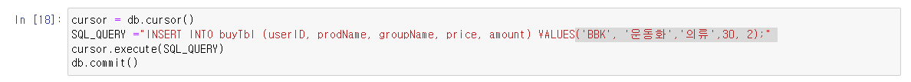
- 에러나면, 가능하면 한번 db connection 닫아주시고, 다시 connection 해주는 편이 좋을 수 있습니다.

### 함수로 설정해 연결 가능

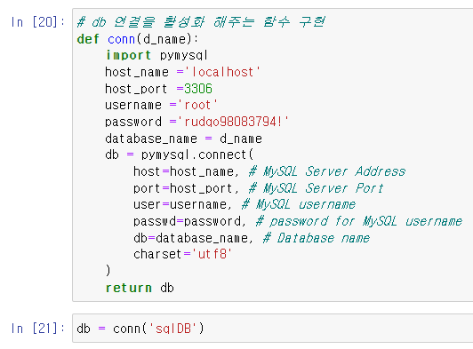

### 무결점 해결
- 이번에는 userTbl 에 userID가 STJ 인 데이터를 넣어준 후에, 다시 buyTbl userID에 STJ 관련 데이터를 넣어줍니다.

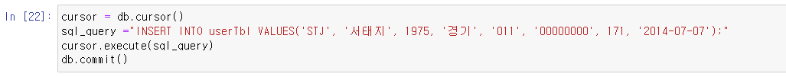

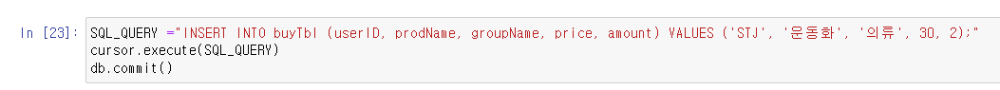

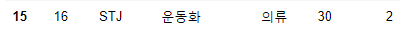
- 추가됨

