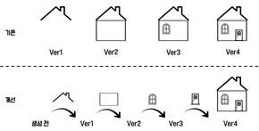
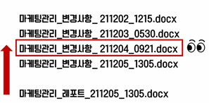
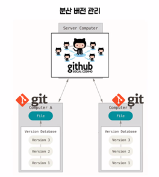
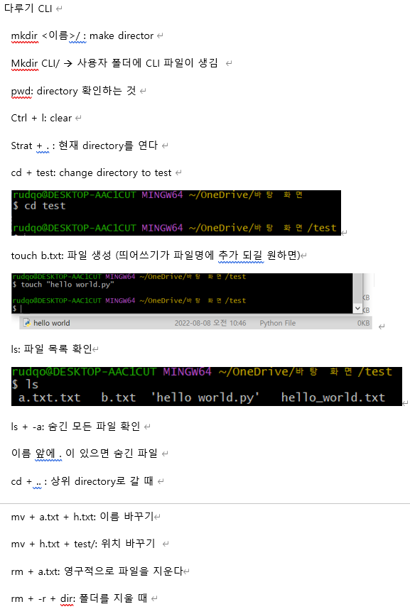
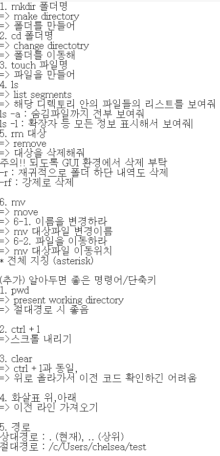
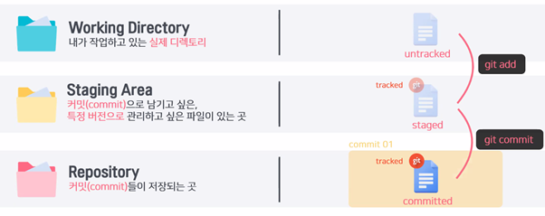
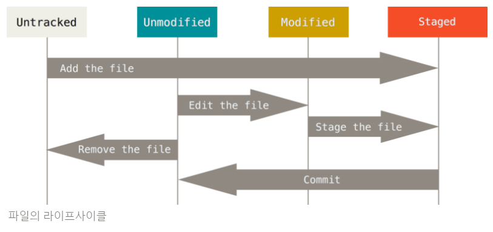
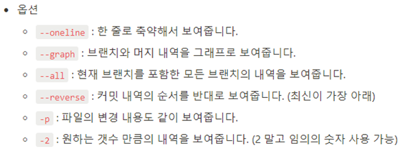
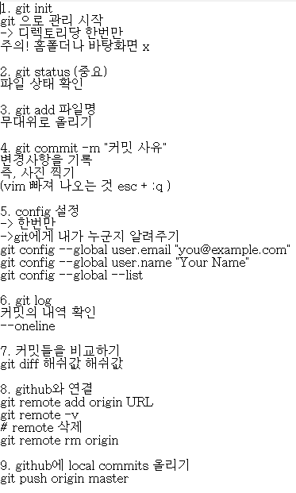
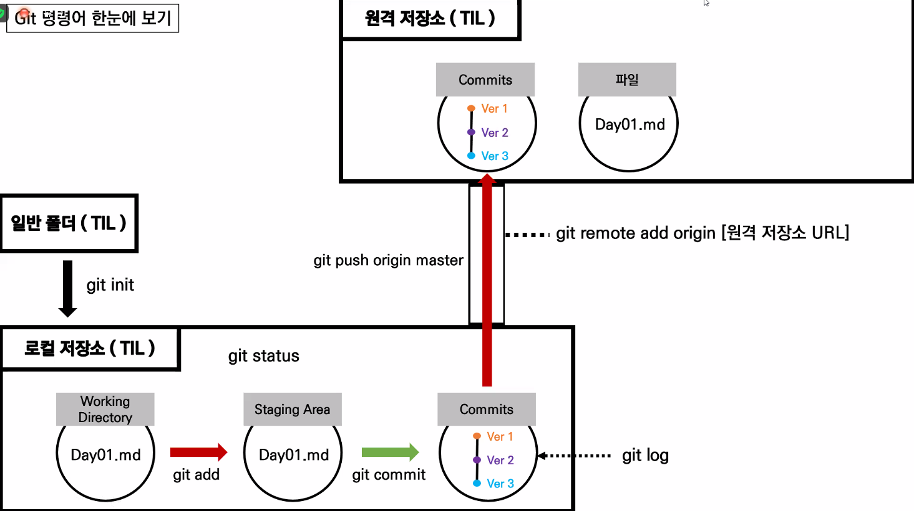

# Git & Github 특강

>2022년 08월 08일 목요일

>[Notion 강의 노트](https://bit.ly/git-dse1920)
## Why Git & Github?
---


> git = 분산 버전 관리 `프로그램` 이고 github = 온라인 저장소 `서비스`

### Git

- 분산 버전 관리 프로그램
* 백업, 복구, 협업을 위해 사용
+ [Git 공식문서](https://git-scm.com/book/ko/v2)
+ EX: git이 관리를 하기 위해 
    + 날짜와 시간을 적고 
    + 변경사항을 기록하는 파일을 만든다 (용량이 적으면 둘다 보관)
    + 맨 나중 파일과, 이전 변경사항만 남긴다 (용량이 많으면)
        
        

        

### Github

- Git을 사용하는 프로젝트의 협업을 위한 웹호스팅 서비스
- 포트폴리오를 자랑할 수 있는 공간
- 1일 1커밋 하기
- [이동욱님 Github 계정](https://github.com/jojoldu)

- 분산 버전 관리: 서버로 연결되어 있는 컴퓨터 마다 버전 관리 파일이 있다 
  

## CLI
---
> CLI (Command Line Interface, 커맨드 라인 인터페이스)는 터미널을 통해 사용자와 컴퓨터가 상호 작용하는 방식을 뜻한다.

### CLI 사용 이유
1. `GUI`는 `CLI`에 비해 사용하기 수비지만 단계가 많고 컴퓨터의 성능을 더 많이 소모
2. 수 많은 서버/개발 시스템이 `CLI`를 통한 조작 환경을 제공 

### Git Bash 사용 이유
- 명령어의 통일을 위해 - 일종의 변역기로 window에서도 UNIX 계열 운영체제의 터미널 명령어를 사용하기 위함 
- 개발자는 UNIX (Linux) 계열 운영체제를 더 많이 사용함 

### 경로
-  **절대 경로**: 루트 디렉토리부터 목적 지점까지 거치는 모든 경로를 전부 작성한 것
    - 윈도우 바탕 화면의 절대 경로 `C:/Users/kyle/Desktop`
-  **상대 경로**:  현재 작업하고 있는 디렉토리를 기준으로 계산된 상대적 위치를 작성한 것 `kyle/Desktop`
   - `./` : 현재 작업하고 있는 폴더를 의미합니다.
   - `../` : 현재 작업하고 있는 폴더의 부모 폴더를 의미합니다.  
  

### 터미널 명령어 정리
| 명령어 |              설명          |
|:----: |    :------------------:    |
| mkdir |        폴더 생성            |
| touch |        파일 생성            |
|   ls  |   현재 폴더의 파일 목록 출력 |
|   cd  |        다른 폴더로 이동     |
|  rm   |    파일 삭제 / 폴더 삭제 (-r 옵션) |



### 예시
```bash
$ mkdir test

$ touch a.txt

$ ls
$ ls -a

$ cd ..
$ cd test

$ rm a.txt
$ rm -r test
```


## Visual Studio Code
---
> Visual Studio Code (비주얼 스튜디오 코드)는 마이크로소프트에서 개발한 텍스트 에디터의 한 종류이다.

### 장점

- Windows, Mac, Linux 운영체제를 모두 지원한다.
- 기존 개발 도구보다 빠르고 가볍다.
- Extension을 통해 다양한 기능을 설치할 수 있어서, 무한한 확장성을 가진다.
- 무료로 사용 가능하다.

### Git Bash 연동하기

1. 터미널을 연다. (Ctrl + `)
2. 화살표를 누르고 *Select Default Profile*을 클릭한다.
3. Git Bash를 선택한다.
4. 휴지통을 눌러서 터미널을 종료하고, 재시작한다.
    - 휴지통은 Kill Terminal 로써, 터미널 자체를 아예 종료한다.
    - 닫기는 Close Terminal 로써, 터미널을 종료하지 않고 창만 보이지 않게 만든다.
5. 기본 터미널이 Git Bash로 열리는지 확인한다.


## Markdown
---
>Markdown (마크다운)은 일반 텍스트 기반의 경량 Markup (마크업) 언어이다.

### Markup (마크업) 이란?

- 마크(Mark)로 둘러싸인 언어를 뜻한다. 마크란 글의 역할을 지정하는 표시이다.
- HTML도 마크업 언어인데, 글에 제목의 역할을 부여할 때 `<h1>제목1</h1>` 과 같이 작성한다.

### 마크다운의 장점과 단점

1. 장점
- 문법이 직관적이고 쉽다.
- 지원 가능한 플랫폼과 프로그램이 다양하다.
2. 단점
- 표준이 없어서 사용자마다 문법이 상이하다.
- 모든 HTML의 기능을 대신하지는 못한다.

### 주의 사항

- 마크다운의 본질은 글에 역할을 부여하는 것이다.
- 반드시 역할에 맞는 마크다운 문법을 작성한다. 글씨를 키우고 싶다고 해서 본문에 제목의 역할을 부여하면 안된다.

### 참고 자료

- [Markdown Guide](https://www.markdownguide.org/basic-syntax/)
- [마크다운 문법 정리](https://gist.github.com/ihoneymon/652be052a0727ad59601)


## Git 기초
---

### Repository 
-	특정 디렉토리를 버전 관리하는 저장소
    - Git init 명령어로 로컬 저장소를 생성
    - .git. 디렉토리에 버전 관리에 필요한 모든 것이 들어있음 
### Commit
-	3가지 영역을 바탕으로 동작
    - Working directory: 현재 작업하고 잇는 실제 디렉토리
    - Staging area: 커밋으로 남기고 싶은, 특정 버전으로 관리하고 싶은 파일이 있는 곳
	- Repository:커밋들이 저장되는 곳 
  
    
    - 분장실 --> 무대 --> 사진 촬영본

    
  ### 문법
- Git init (초기 설정)
    -  현재 작업 중인 디렉토리를 Git으로 관리한다는 명령어 
    - .git 이라는 숨김 폴더를 생성하고, 터미널에는 (master)라고 표기됩니다.
    - 이미 Git 저장소인 폴더 내에 또 다를 Git 저장소를 만들지 않는다. 
  
- Git status 
  - Working Directory와 Staging Area에 있는 파일의 현재 상태를 알려주는 명령어
  - 어떤 작업을 시행하기 전에 수시로 status를 확인하면 좋습니다.
-	Git add
    - Working Directory에 있는 파일을 Staging Area로 올리는 명령어
    - Git이 해당 파일을 추적(관리)할 수 있도록 만듭니다.
    - `Untracked, Modified → Staged` 로 상태를 변경합니다.
- Git commit
    - Git commit -m “ 이유”
    - 변경 사항 입력
- Git log
    - 커밋의 내역(ID, 작성자, 시간, 메시지 등)을 조회할 수 있는 명령어
    
- Git diff 
    - 두 커밋의 차이점을 보여준다 
  


### 요약


