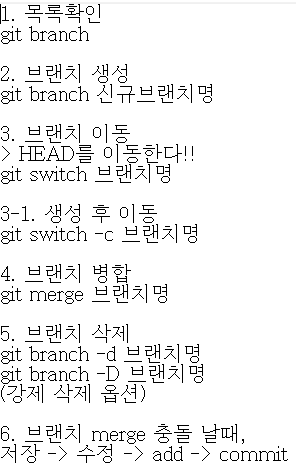
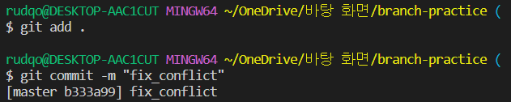

# clone & pull
## 복습 
 - 지금까지는 로컬 저장소의 내용을 원격 저장소에 업로드하는 것을 학습했습니다.

 - 이번에는 반대로, 원격 저장소의 내용을 로컬 저장소로 가져오는 것을 학습합니다.
> 원격 저장소 가져오기

## git clone
>원격 저장소의 커밋 내역을 모두 가져와서, 로컬 저장소를 생성하는 명령어
- clone은 `"복제"`라는 뜻으로, `git clone` 명령어를 사용하면 원격 저장소를 통째로 복제해서 내 컴퓨터에 옮길 수 있다.
- git clone <원격 저장소 주소>의 형태로 작성합니다.
- git clone을 통해 생성된 로컬 저장소는 git init과 git remote add가 이미 수행되어 있습니다

## git pull
> 원격 저장소의 변경 사항을 가져와서, 로컬 저장소를 업데이트하는 명령어
- git pull <저장소 이름> <브랜치 이름>의 형태로 작성합니다.

```
git clone vs git pull

git clone은 git init처럼 처음에 한 번만 실행합니다. 즉 로컬 저장소를 만드는 역할
단, git init처럼 직접 로컬 저장소를 만드는 게 아니라, Github에서 저장소를 복제해서 내 컴퓨터에 똑같은 복제본을 만든다는 차이가 있다

git pull은 git push처럼 로컬 저장소와 원격 저장소의 내용을 동기화하고 싶다면 언제든 사용한다. 단, push는 로컬 저장소의 변경 내용을 원격 저장소에 반영하는 것이고, pull은 원격 저장소의 변경 내용을 로컬 저장소에 반영하는 것. 즉 방향이 다르다
```
## 내 컴퓨터 ↔ Github(원격 저장소) ↔ 강의장 컴퓨터 (예시)
> 두 개 이상의 로컬 저장소에서 하나의 원격 저장소에 접근하는 과정: clone, push, pull


- git clone
    - 바탕화면 우측 마우스 클릭 후
    - git bash 실행
    - `git + clone + URL + 폴더 이름` 입력
    - 바탕화면에 폴더 생성 
    - 폴더에서 vscode 실행 
- git push
    -  clone으로 받은 새로운 원격 저장소에서 파일 업데이트 후 `git push origin master `
- git pull
    - 기존 원격 저장소에서 `git pull origin master` 로 업데이트 

### 주의 사항 
> 만약 TIL-home에서 `pull`이 아니라 `commit`을 먼저한 후 `pull`을 하면
1. 내 컴퓨터와 강의장 컴퓨터에서 서로 다른 파일을 수정한 경우
→ 정상적으로 git pull이 됩니다.
   
2. 내 컴퓨터와 강의장 컴퓨터에서 같은 파일을 수정했지만, 수정한 라인이 다른 경우
→ 정상적으로 git pull이 됩니다
    
3. 내 컴퓨터와 강의장 컴퓨터에서 같은 파일의 같은 라인을 수정한 경우
→ 충돌(conflict)이 발생합니다. 어느 내용을 반영할지 직접 선택해야 합니다.
    

**해결방법**


1. 위의 error에서 겹치는 부분중 남기고 싶은 부분을 제외한 나머지를 지운다.
2. `git add .` --> `git commit` --> `git push` 
3. 2번째 원격 저장소에서 `git pull` 업데이트하면 끝 
```
만약 로컬 저장소와 원격 저장소의 내용이 다르다면 일단 git pull을 통해 동기화를 시키고 새로운 커밋을 쌓아 나가야 합니다.
```

## .gitignore
> 특정 파일 혹은 폴더에 대해 Git이 버전 관리를 하지 못하도록 지정하는 것
### .gitignore에 작성하는 목록 
- 민감한 개인 정보가 담긴 파일 (전화번호, 계좌번호, 각종 비밀번호, API KEY 등)
- OS(운영체제)에서 활용되는 파일

### 주의 사항
- 반드시 이름을 `.gitignore`로 작성합니다. 앞의 점(.)은 숨김 파일이라는 뜻입니다.
- `.gitignore` 파일은 `.git` 폴더와 동일한 위치에 생성합니다.
- **제외 하고 싶은 파일은 반드시 `git add` 전에 `.gitignore`에 작성합니다**

## Branch
---
> 버전 관리의 꽃 = Branch


### Branch 란?
* `브랜치`란 나뭇가지처럼 여러 갈래로 작업 공간을 나누어 독립적으로 작업할 수 있도록 도와주는 Git의 도구입니다.
* 장점
  1. 브랜치는 독립 공간을 형성하기 때문에 원본(master)에 대해 안전합니다.
  2. 하나의 작업은 하나의 브랜치로 나누어 진행되므로 체계적인 개발이 가능합니다.
  3. 특히나 Git은 브랜치를 만드는 속도가 굉장히 빠르고, 용량도 적게 듭니다.
- Error 가 있으면 브랜치를 통해 별도의 작업 공간을 만들고, 그곳에서 되돌리거나 삭제를 한다.
- 브랜치는 완전하게 독립이 되어있어서 어떤 작업을 해도 master에는 영향을 끼치지 못한다.
- 그리고 이후에 에러를 해결했다면 그 내용을 master에 반영할 수 있다.

### 문법


### 예시

1. 
   - master 에다 작업
2. 
3. 
   - master-3 이후 branch online 만듬
4. 
5. 
   - master에다 master-4 작업
6. 
   - login branch로 이동 
7. 
8. 
9.  
    - master-4가 안보이는건 log가 login branch 기준으로 보이기 때문
10. 
11. 
    - login-1을 login branch에다 작성
12. 
    
13. 
    - master로 돌아와 login branch를 병합
14. 
    - conflict이 일어나면 직접 수정후 저장 
15. 
    
## Git Workflow 
> branch를 이용해 협업하는 두 가지 방법
> 1. (Shared repository model)
> 2. (Fork & Pull model)

### 원격 저장소 소유권이 있는 경우 (Shared repository model)

#### 개념 
- 원격 저장소가 자신의 소유이거나 collaborator로 등록되어 있는 경우에 가능합니다.
- master에 직접 개발하는 것이 아니라, `기능별로 브랜치`를 따로 만들어서 개발합니다.
- `Pull Request`를 같이 사용하여 팀원 간 변경 내용에 대한 소통을 진행합니다.
  
#### Flow
1. 소유권이 있는 원격 저장소를 로컬 저장소로 `clone` 받습니다.
   - 각 사용자는 원격 저장소의 소유권을 가져서 `clone`을 통해 저장소를 로컬에 복제
    ``` Bash
    git clone URL
     ```
2. 사용자는 자신이 작업할 기능에 대한 `브랜치를 생성`하고, 그 안에서 `기능을 구현`합니다.
    ``` Bash
    git switch -c feature/login
    ```
3. 기능 구현이 완료되면, 원격 저장소에 해당 브랜치를 `push` 합니다.
    ``` Bash
    git push origin feature/login
    ```
4. 원격 저장소에는 master와 각 기능의 브랜치가 반영되었습니다.
5. Pull Request를 통해 브랜치를 master에 반영해달라는 요청을 보냅니다.
6. 병합이 완료되면 원격 저장소에서 병합이 완료된 브랜치는 불필요하므로 삭제합니다.
7. master에 브랜치가 병합되면, 각 사용자는 로컬의 master 브랜치로 이동합니다.
8. 병합으로 인해 변경된 원격 저장소의 master 내용을 `pull`을 통해 로컬에 받아옵니다.
9. 병합이 완료된 master의 내용을 받았으므로, 기존 로컬 브랜치는 삭제합니다. (한 사이클 종료)
    ``` Bash
    git branch -d feature/login
    ```

### 원격 저장소 소유권이 없는 경우 (Fork & Pull model)
#### 개념
- 오픈 소스 프로젝트와 같이, 자신의 소유가 아닌 원격 저장소인 경우 사용합니다.
- 원본 원격 저장소를 그대로 내 원격 저장소에 `복제`합니다. (이 행위를 `fork`라고 합니다.)
- 기능 완성 후 `Push는 복제한 내 원격 저장소에 진행`합니다.
- 이후 `Pull Request`를 통해 원본 원격 저장소에 반영될 수 있도록 요청합니다.
#### Flow
1. 소유권이 없는 원격 저장소를 `fork`를 통해 내 원격 저장소로 복제합니다.
   
   - Fork 버튼 누르면 자동으로 내 원격 저장소에 복제 
2. `fork` 후, 복제된 내 원격 저장소를 로컬 저장소에 `clone` 받습니다.
   ``` Bash
   git clone https://github.com/edukyle/kakao_clone.git
   ```
3. 이후에 로컬 저장소와 원본 원격 저장소를 동기화 하기 위해서 연결합니다.
   ``` Bash
   # 원본 원격 저장소에 대한 이름은 upstream으로 붙이는 것이 일종의 관례
    git remote add upstream URL
    ```
4. 사용자는 자신이 작업할 기능에 대한 브랜치를 생성하고, 그 안에서 기능을 구현합니다.
    ``` Bash
    git switch -c feature/login
    ```
5. 기능 구현이 완료되면, `복제 원격 저장소(origin)`에 해당 브랜치를 `push` 합니다.
    ``` Bash
    git push origin feature/login
    ```
6. 복제 원격 저장소(origin)에는 master와 브랜치가 반영되었습니다.
7. Pull Request를 통해 복제 원격 저장소(origin)의 브랜치를 원본 원격 저장소(upstream)의 master에 반영해달라는 요청을 보냅니다. 

8. 원본 원격 저장소(upstream)의 master에 브랜치가 병합되면 복제 원격 저장소(origin)의 브랜치는 삭제합니다. 그리고 사용자는 로컬에서 master 브랜치로 이동합니다.
    ``` Bash
    git switch master
    ```
9. 병합으로 인해 변경된 원본 원격 저장소(upstream)의 master 내용을 로컬에 받아옵니다. 
그리고 기존 로컬 브랜치는 삭제합니다. (한 사이클 종료)
    ```Bash
    git pull upstream master
    git branch -d feature/login
    ```

### 요약

> `fork` → `clone` → 브랜치 생성 → `add` → `commit` → 브랜치 `push` → `pull request` 보내기