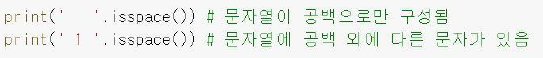
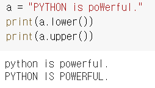

(공통) 객체지향 프로그래밍 
# 객체와 클래스 
> 클래스(class)란 똑같은 무엇인가를 계속해서 만들어 낼 수 있는 설계 도면이고(과자 틀), 객체(object)란 클래스로 만든 피조물(과자 틀을 사용해 만든 과자)을 뜻한다.
- 객체: 속성(상태, 특징) --> **변수** + 행위 (행동, 기능) --> **함수**
- 객체: 클래스 --> 객체 생성 (인스턴스 생성)

## 클래스 상속
---
> 물려주는 클래스(Parent Class, Super class)의 내용(속성과 메소드)을 물려받는 클래스(Child class, sub class)가 가지게 되는 것
- 상속을 받으면 자식 클래스는 부모 클래스의 변수와 함수를 이용 가능 하고, 자식 클래스만 갖는 속성과 행위를 추가 가능 
- 클래스에서 상속을 이용하면 이미 만들어진 클래스의 변수와 함수를 그대로 이 용할 수 있으므로 코드의 재사용성이 좋아짐
  

### 문법
- 부모 클래스를 호출 하려면 `부모 클래스 이름.함수명()` or `super().함수명()`

- 상속받은 Bicycle 클래스의 초기화 함수인 ' init __(self, wheel_size , 를 이용
- super()를 이용할 때는 인자에서 self를 빼야함


# 문자열과 텍스트 파일 데이터 다루기
> 파이썬에서 문자열을 처리하는 방법과 텍스트 파일의 내용을 읽어서 처리하는 방법
## 문자열 다루기
- 텍스트 파일을 읽어서 가져온 문자열은 대부분 문자열 처리를 통해 원하는 형태의 데이터로 변환해서 이용 
- 문자열 처리를 위해서는 문자열 분리, 불필요한 문자열 제거, 문자열 연결 등을 할 수 있어야 함

## 문자열 분리하기
- split(): 문자열을 부분 문자열로 나눈다 
  ```python 
  str.split([sep])
  ```
  - sep을 기준으로 문자열을 분리해 `리스트`로 반환
  - sep이 없으면 문자열 사이의 모든 공백과 개행문자(\n)을 없애고 분리된 항목을 담은 리스트로 반환
  

- maxsplit: split에 추가하면 앞에서부터 원하는 횟수만큼만 문자열을 분리 가능
  ```python
  str.split([sep ,] maxsplit 숫자)
  ```
  - 앞에서부터 n개의 공백(sep)까지만 문자열로 나눠 n+1개의 항목들의 리스트로 반환
   
   

## 필요 없는 문자열 삭제하기
- strip(): 문자열의 `앞뒤` 공백 혹은 개행문자와 같이 불필요한 부분을 지울때 
  ```python
  str.strip([chars])
  ```
  - 문자열의 `앞과 뒤`에서 시작해서 지정한 문자 (chars) 외의 다른 문자를 만날 때까지 지정한 문자 ( 를 모두 삭제한 `문자열`을 반환
  
  - 문자열에서 지우고자 하는 문자가 하나가 아니라 둘이면 strip()를 두 번 사용하면 됨
  - 혹은 둘다 한번에 써서 (순서는 상관 없음)
  
  
- lstrip(): 문자열 앞부분만 삭제
- rstrip(): 문자열 뒷부분만 삭제
  

## 문자열 연결하기
- join(): 리스트의 모든 항복을 하나의 문자열로 만든다.
  ```python
  str.join(seq)
  ```
  - seq: 시퀀스는 리스트나 튜플과 같은 어러 데이터를 순서대로 담고잇는 나열형 데이터 
  - join()메서드는 문자열을 항목으로 갖는 시퀀스 ( 의 항목 사이에 구분자 문자열 ( 을 모두 넣은 후에 문자열로 반환
  

  ## 문자열 찾기
  - find(): 문자열에서 원하는 단어를 찾을 때 사용한다
  ```python
  str.find(search_str)
  ```
    - 문자열에서 찾으려는 search_str과 첫번재로 일치하는 문자열의 위치를 반환
    - 문자열에서 검색 문자열을 찾을 수 없으면 -1
    
    - 범위지정: str.find(search_str, start, end)

- count(): 해당 문자열이 몇 번 나오는지 새기 
  ```python
  str.count(search_str)
  str.count(search_str, start)
  str.count(search_str, start, end)
  ```
  
- startswith() & endswith(): 각각 문자열이 지정된 문자 열로 시작하는지 끝나는지를 검사
    ```python
    str.startswith(prex, start, end)
    ```
    - True & False 로 반환

## 문자열 바꾸기
- replace(): 지정한 문자열을 찾아서 바꾸는 메서드
  ```python
  str.replace(old, new, [count])
  ```
  - 문자열에서 지정한 문자열 (old) 을 찾아서 새로운 문자열(new) 로 바꿈
  - count 는 문자열에서 지정된 문자열을 찾아서 바꾸는 횟수
  - 횟수를 지정하지 않으면 문자열 전체에서 찾아서 바꿈
  - 특정 물자열을 삭제할 때도 사용 (공백으로 바꿈)
    

## 문자열의 구성 확인하기
- 숫자, 문자, 문자 + 숫자, 대문자, 소문자
  





## 대소문자 변경하기
- lower() & upper()
  ```python
  str.lower()
  str.upper()
  ```
  

# 텍스트 파일의 데이터 읽고 처리하기
## 과정
1. 데이터 파일 읽어오기
    1. 파일 형식 확인 (txt, excel, csv ...)
    2. 파일 내용 데이터 형식 확인(sep이 뭔지..)
2. 데이터 전처리 
   1. 데이터 처리할 자료형 결정(list, tuple..)
   2. 테이터 분리 형태 결정 (sep을 , ...)
   3. 연산이 필요한 숫자 데이터 변환
   4. 필요없는 데이터 제거 

* 파일의 내용을 한 번에 읽어오는 것이 아니라 한 줄씩 읽어서 처리
* 파일에서 읽은 내용은 문자열 데이터가 되는데 이 문자열 데이터를 원하 는 형태로 분리하고
* 연산이 필요한 부분은 숫자 데이터로 변환한 후에 처리하는 방법

## Example
---
- 데이터: 어느 커피 전문점에서 나흘 동안 기록한 메뉴별 커피 판매량 
- 원하는 작업: 4일 동안 메뉴당 전체 판매량과 하루 평균 판매량 구하기 

1. 데이터 파일 형식: txt 파일
2. 내용 데이터 형식: 첫줄은 각 항목 이름, 둘째줄 이후로 각 항목의 값
3. 텍스트 파일 읽기 
   