# 모듈
> Module: 코드가 저장된 파일으로 다른 코드에서도 이 파일의 변수, 함수, 클래스를 불러와 이용할 수 있음

## 사용하는 이유
- 모듈로 나누면 코드 작성과 관리가 쉬워 짐 
  - 큰 규모의 프로그램을 작성할때 파일 하나에 전체 코드를 구현하지 않고 기능별로 나눈 후에 여러 파일에서 해당 기능의 코드 구현 
- 이미 작성된 코드 재사용 가능
- 공동작업이 편리해 짐
  - 공동으로 프로그램을 만들 때는 전체 프로그램을 모듈별로 설계하고 개인별로 나누어 코딩한 후 전체 모듈을 통합
  - 모듈별로 구분해 코드를 작성 하면 자신이 맡은 모듈만 신경 쓰면 되므로 공동 작업으 로 인한 복잡성이 줄고 효율은 높아짐

## 생성 및 호출
- 모듈 이름은 확장자(.py)를 제외한 파일 이름  
  - 코드 셀의 코드를 파이썬 코드 파일로 저장하기 (%%writefile [-a] file.py )
    - 현재 디렉토리에 file.py 생성
  - 저장된 파이썬 코드 파일을 불러오기 (%%load file.py)
  - 파이썬 코드 파일 실행하기 (%%run file.py) 모듈 생성 및 호출

### 모듈 만들기
- 모듈 만드는 법: '모듈이름.py'로 저장
- 내장 magic command인 `%%writefile` 을 이용해 코드를 파일로 저장
  
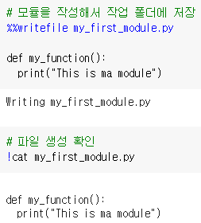

###모듈 불러오기
- import 모듈명
- 모듈을 임포트한 후에는 모듈명 변수 ', 모듈명 함수 ()', 모듈명 클래스 와 같은 형식으로 모듈에서 정의한 내용을 사용
- 만든 모듈을 불러서 함수 실행
  
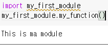

- 불러온 모듈에서 사용할 수 있는 변수, 함수, 클래스를 알고 싶다면 `dir(모듈명)`을 이용 
  
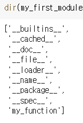

- from: 모듈 내에 있는 변수와 함수, 그리고 클래스를 '모듈명.' 없이 '변수()'... 처럼 직접 호출해 이용 가능
  - `from 모듈명 import 변수명, 함수명, 클래스명`
  
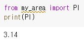

- from 모듈명 import `*` : 모듈의 모든 변수, 함수, 클래스를 바로 모듈명 없이 바로 이용
 - 단, 모듈 my_module1 과 모듈 my_module2 에 모두 있는 func2 함수를 호출하면 나중에 선언해서 불러온 모듈의 함수가 호출됨

### 별명으로 선언
- import 모듈명 as 별명 
- from 모듈명 import 변수명 as 별명
  
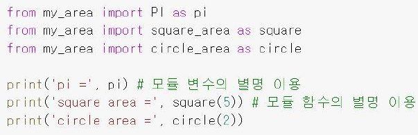

## 모듈을 실행하는 경우
- 모듈을 테스트하기 위해 `직접 수행`하는   경우와 `임포트`해서 사용하는 경우를 구분
  
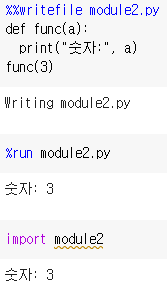

  - 함수만 사용하려고 하는데 그 아래 값까지 같이 나옴 
```python
if__name__ == "__main__":
    <직접 수행할 때만 실행되는 코드>
```
- 같은 모듈에서 코드를 직접 수행할 때만 `if __name__ == "__` 안의 코드가 실행되고, 임포트해서 사용하면 `else` 코드가 실행
  
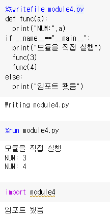

## 내장 모듈
* random: 임의로 숫자(난수)를 발생시키는 모듈
* datetime: 날짜 및 시간 관련 처리 모듈
* calendar: 연도/월/주 등 달력과 관련된 처리 모듈
* [파이썬 표준 라이브러리](https://docs.python.org/3.9/library/)

### 난수 발생 모듈
#### random
`import random`
```python
import random
random.random
```
- `import random`으로 random 모듈을 불러왔고 `random.random()`으로 0~1 사이의 실수중에서 임의의 숫자를 생성
- `random.random()를 실행할 때마다 다른 값이 출력

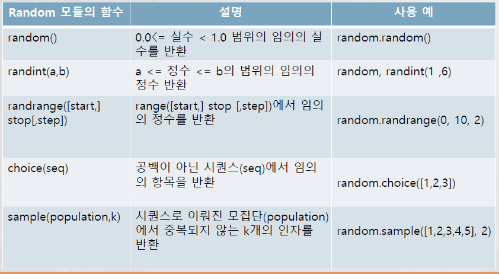

#### randint()
- 특정 범위의 정수 안에서 임의의 정수를 발생 

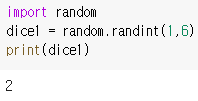
 - 1~6 숫자에서 임의의 숫자 발생

#### randrange()
- 정해진 범위 안에서 특정 수만큼 차이가 나는 정수를 발생기킬 때 이용 

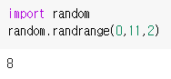

 - 0~10 범위의 임의의 짝수 발생

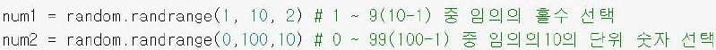

#### choice()
- 시퀀스 (리스트 , 튜플 ) 데이터에서 임의의 항목을 하나 선택할 때 이용

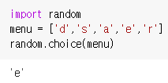

#### sample()
- 시퀀스 (리스트 , 튜플) 로 이뤄진 모집단 데이터에서 정해진 숫자만큼 임의의 인자를 중복 없이 선택하고

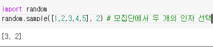

### 날짜 및 시간 관련 처리 모튤
#### datetime
- 날짜를 표현하는 date 클래스, 시간을 표현하는 time 클래스, 날짜와 시간을 표현하는 datetime 클래스
- import datetime을 한 후에는 클래스에서 객체를 생성해 이용하는 방법이 있고 각 클래스의 클래스 메서드를 이용하는 방법
- 객체 생성
```python
import datetime
date_obj = datetime.date (year, month, day)
time_obj = datetime.time (hour, minute, second)
datetime_obj = datetime.datetime (year, month, day, hour, minute, second)
```


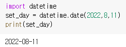 


- 클래스 매서드 이용

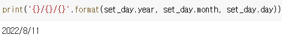

- date 객체는 타입이 date로 그 객체끼리 빼기 연산 가능 
- 뻬기 연산을 수행한 후 데이터 타입은 timedela로 바뀜

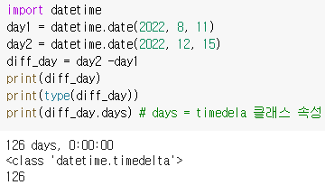

- today(): 오늘 날짜

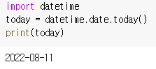

- time(): 시간

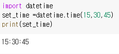

- datetime(): 날짜와 시간 

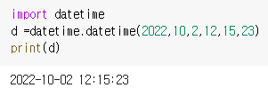

- now(): 지금 날짜와 시간

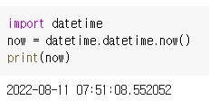

  - %Y, %m, %d 는 각각 연도 , 월 , 일을 나타내고 %H, %M, %S 는 각각 시 , 분 , 초를 나타냄
  - 이 값들은 ’’{: }' 안에 있어야 하며 일부만 사용할 수도 있음

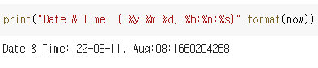

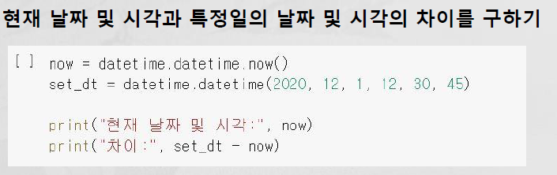

### 달력 생성 및 처리 모듈
- 파이썬 내장 모듈인 calendar 모듈을 이용해 다양한 형태로 달력을 생성해 출력하고 날짜와 관련된 정보 연도 , 월 , 주 를 구하는 방법

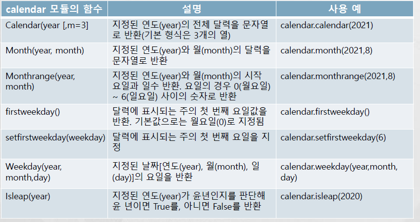

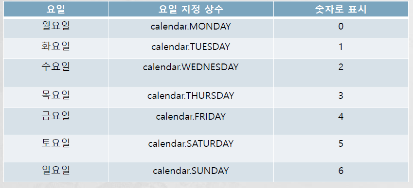

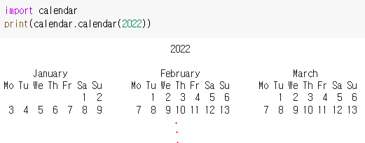

- 달력 출력 양식 변경: calendar()에 'm=숫자' 인자를 추가
- month(): 특정 연도 출력
- monthrange(): 연도와 월을 지정해 그달 1 일이 시작하는 요일과 그달의 날짜 수를 알 고 싶다면

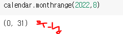

- firstweekday(): 일주일의 시작 요일을 구한다
- setfirstweekday(): 한 주의 시작 요일을 지정한다 
- weekday(y,m,d): 해당 날짜의 시작 요일 반환
- isleap(y): 어떤 연도가 윤년인지 확인