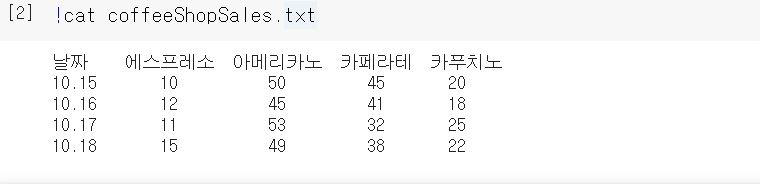
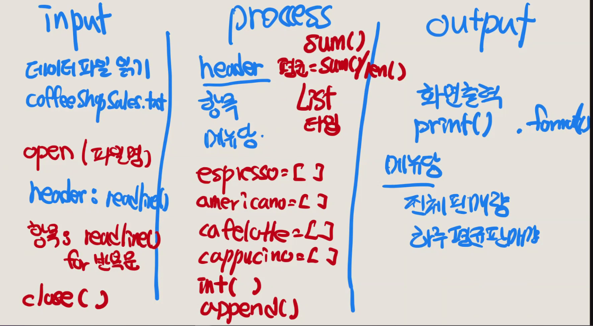
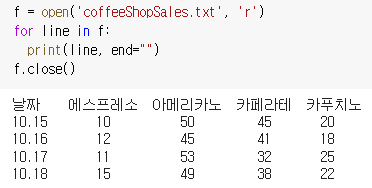
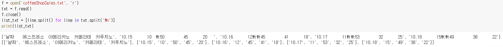
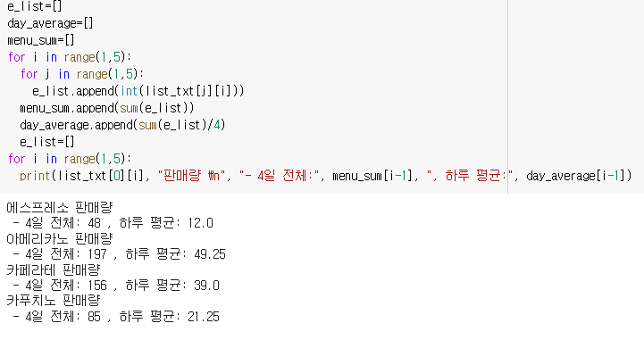

# 텍스트 파일의 데이터 읽고 처리하기
## 과정
1. 데이터 파일 읽어오기
    1. 파일 형식 확인 (txt, excel, csv ...)
    2. 파일 내용 데이터 형식 확인(sep이 뭔지..)
2. 데이터 전처리 
   1. 데이터 처리할 자료형 결정(list, tuple..)
   2. 테이터 분리 형태 결정 (sep을 , ...)
   3. 연산이 필요한 숫자 데이터 변환
   4. 필요없는 데이터 제거 

* 파일의 내용을 한 번에 읽어오는 것이 아니라 한 줄씩 읽어서 처리
* 파일에서 읽은 내용은 문자열 데이터가 되는데 이 문자열 데이터를 원하 는 형태로 분리하고
* 연산이 필요한 부분은 숫자 데이터로 변환한 후에 처리하는 방법

## Example
---
- 데이터: 어느 커피 전문점에서 나흘 동안 기록한 메뉴별 커피 판매량 
- 원하는 작업: 4일 동안 메뉴당 전체 판매량과 하루 평균 판매량 구하기 

1. 데이터 파일 형식: txt 파일
2. 내용 데이터 형식: 첫줄은 각 항목 이름, 둘째줄 이후로 각 항목의 값
3. 텍스트 파일 읽기 
   
4. 코드

