# NumPy & Pandas
## Numpy
> 파이썬으로 과학 연산을 쉽고 빠르게 할 수 있게 만든 패키지
- Numpy를 이용하면 파이썬의 기본 데이터 형식과 내장 함수를 이용하는 것보다 다차원 배열 데이터를 효과적으로 처리 
- [Numpy 홈페이지](http://www.numpy.org)
  
### 배열 생성하기
```python
import numpy as np
np.array()
```
- 배열(Array): 순서가 잇는 같은 종류의 데이터가 저장된 집함 
- Numpy를 이용해 배열을 처리하기 위해서는 우선 Numpy로 배열을 생성 

### 시퀀스 데이터로부터 배열 생성 
> seqdata로 Numpy의 배열을 생성하는 방법
```python
arr_obj = np.array(seq_data)
```
- 시퀀스 데이터(리스트...)를 인자로 받아 NumPy의 배열 객체(arry object)를 생성 

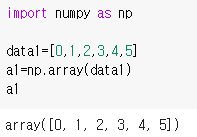
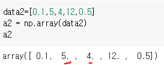

### 배열 객체의 타입을 확인 
- NumPy 배열의 속성을 표현하려면 `ndarray.속성` 같이 작성 
  - ndarray는 NumPy의 배열 객체 

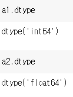

- NumPy에서는 1차원뿐만 아니라 다차원 배열도 생성 

### 범위를 지정해 배열 생성
```python
arr_obj = np.arange(star, stop, step)
```
- start부터 시작해서 stop 전까지 step만큼 계속 더해 NumPy의 배열 생성 
  
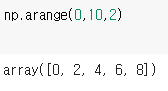

```python
np.arange( ).reshape(m,n)
```
- NumPy 배열의 arange 를 이용해 생성한 1 차원 배열에 '.reshape(m,n) 을 추가하면 m x n 형태의 2 차원 배열 행렬 로 변경

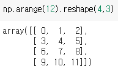

- arange()로 생성되는 배열의 원소 개수와 reshpe(m,n)의 m x n 개수가 같아야 함
- 배열의 형태를 알기위해

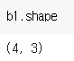

```python
arr_object = np.linspace(start, stop, num)
```
- 범위의 시작과 끝을 지정하고 데이터의 개수를 지정해 NumPy 배열을 생성
  
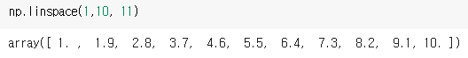]
- 1부터 10까지 동일한 간격으로 나눈 11개의 데이터를 생성

### 특별한 형태의 배열 생성 
- `zeros() & ones()`: 원소가 0 혹은 1인 다차원 배열을 만든다 
  - `arr_zero(one)_n = np.zeros (ones) (n)`

- 단위행령(Identity matrix) 생성
  - `arr_I=np.eye(n)`
  
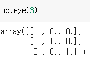

### 배열의 데이터 타입 변환
- NumPy 배열의 형 변환은 astype()으로 할 수 있음
- `num_arr = st_arr.astype(dtype)

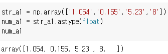

### 난수 배열의 생성 
- random 모듈을 이용해 임의의 숫자인 난수(random number) 생성
```python
ran_num = np.random.rand(d0,d1,...dn)
ran_num = np.random.randit(low,high,size)
```
- rand(): 0~1 사이의 실수 난수를 갖는 NumPy 배열을 생
  - (d1,d2,...dn): 차원을 지정하는 것
- randit(): low~high 사이의 정수 난수를 갖는 배열 생성
  - size는 배열의 형태를 지정하는 것 (d1,d2,...dn) 형식으로 입력 

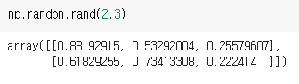
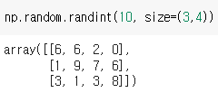

## 배열의 연산 
### 기본 연산 
- NumPy 배열의 형태(shape)가 같다면 덧셈, 뺄셈, 곱셈, 나눗셈 연산을 할 수 있음 

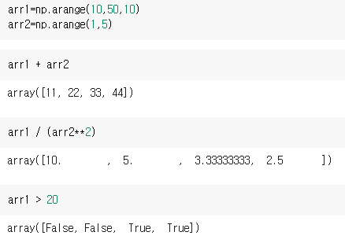

### 통계를 위한 연산 
- 배열의 합, 평균, 표준 편차，분산, 최솟값과 최댓값，누적합과 누적 곱 이 주로 통계 에서 많이 이용하는 메서드
- 이 메서드는 각각 sum(), mean(), std(), var(), min(), max(), cumsum (), cumprod()
  
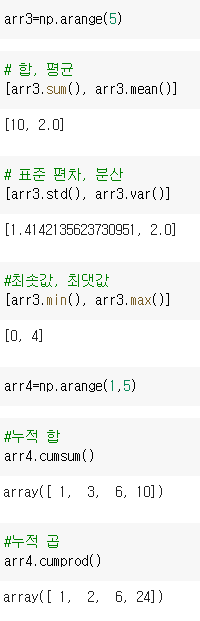

### 행렬 연산 
- NumPy는 배열의 단순 연산뿐만 아니라 선형 대수 (Linear 를 위한 행렬 (2 차원 배열 ) 연산도 지원
- 다양한 기능 중 행렬 곱 , 전치 행렬 , 역행렬 , 행렬식을 구하는 방법

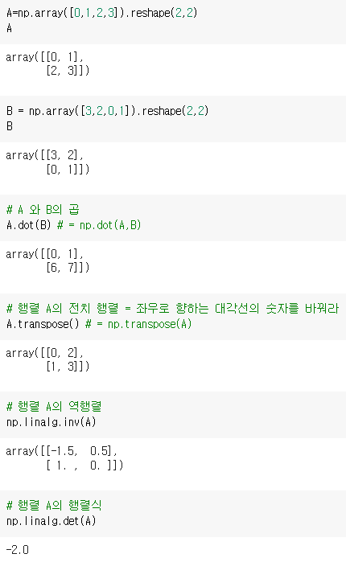

## 배열의 인덱싱과 슬라이싱 
- indexing: 배열의 위치나 조건을 지정해 배열의 원소를 선택하는 것
- slicing: 범위를 지정해 배열의 원소를 선택하는 것 


## 배열의 인덱싱 
### 1차원 배열
- `배열명[위치]`
  
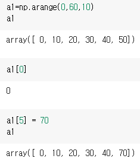
- `배열명[[위치1 ... 위치i]]`: n차원 배열에서 여러 개의 원소를 선택
  
 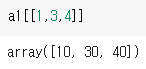 

### 2차원 배열  
- ` 배열명[행_위치,열_위치]`
  
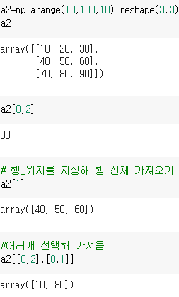

+ 조건을 지정해 배열 원소 가져오기 

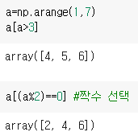

## 배열의 슬라이싱 
- `배열[시작_위치:끝_위치]`
- 2차원: `배열[행시작위치:행끝위치, 열시작위치:열끝위치]`
- 반환되는 원소의 범위는 '시작_위치 ~ 끝_위치 -1' 가 됨
### 1차원
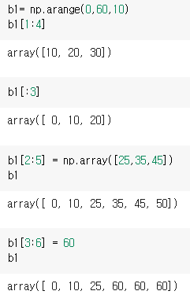

### 2차원
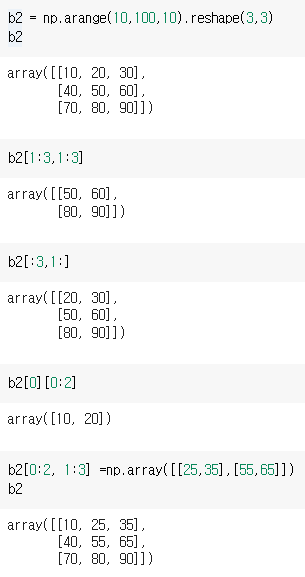