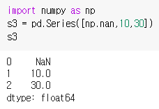

# Pandas
## 정의
- 파이썬에서 데이터 분석과 처리를 쉽게 할 수 있게 도와주는 라이브러리
- NumPy를 기반으로 만들어졌지만 좀 더 복잡한 데이터 분석에 특화
- NumPy가 같은 데이터 타입의 배열만 처리할 수 있는 데 반해 Pandas는 데이터 타입이 다양하게 섞여 잇을 때도 처리 가능
- [Pandas 홈페이지](https://pandas.pydata.org/)

## 구조적 데이터 생성하기
- Series를 활용한 데이터 생성 
```python
import pandas as pd
```
- series()를 이용 하면 series 형식의 구조적 데이터(라벨을 갖는 1차원 데이터)를 생성
```python
s = pd.Seres(seq_data)
```
- seq_data = 리스트를 주로 사용
- 자정하면 인자로 넣은 시퀀스 데이터에 순서를 표기하는 라벨이 자동으로 부여
  - Series 데이터에서는 새로축 라벨을 index라고 하고, 입력한 시퀀스 데이터를 values라고 함


- series 데이터를 출력하면 데이터 앞에 index가 함께 표시
- seris 데이테는 index와 values를 분리해서 가져올 수 있음 
- seris 데이터를 s라고 할때 index 는 s.index로 values는 s.values로 가져온다 


- pandas는 원소의 데이터 타입이 달라도 됨


- `np.nan` NumPy를 임포트한 후에 데이터가 없다고 표시한다
  - Nan = 데이터가 없다는 것을 의미(데이터를 위한 index는 있지만 실제 값은 없음)


- `s = pd.Series(seq_data, index = index_seq)`
  - 인자로 index를 명시적으로 입력면 index에 index_seq가 들어가게 됨 


- `s=pd.Series(dict_data)`: 딕셔너리로 표현 가능
    - 딕셔너리 keys와 values기 각각 Series 데이터의 index와 values로 들어감


## 날짜 자동 생성
- date_range: 원하는 날짜를 자동으로 생성
```python
pd.date_range(start=None, end=None, periods=None, freq='D')
```
- start: 시작 날짜, end: 끝 날짜, periods: 날짜 데이터 생성 시간, freq: 날짜 데이터 생성 주기
- start: 반드시 있어야 함, end & periods: 둘중 하나만 있어도 됨, freq: 입력하지 않으면 달력 날짜 기준으로 하루씩 증기 


- 여러가지 방법


[날짜 자동 생성](https://hyunmin1906.tistory.com/26)


## DataFrame을 활용한 데이터 생성
- Series를 이용해 1차원 데이터를 생성 
- `DataFrame`: 표와 같은 2차원 데이터를 생성하고 Data와 Frame이 있음 
```python
df = pd.DataFrame(data, index=index_data, columns = coulumns_data)
```
- data: 리스트와 딕셔너리 타입의 데이터 , NumPy 의 배열 데이터 , Series 나 DataFrame 타입의 데이터를 입력 할 수 있음
- index:세로축
- coulumns: 가로축
- values: index와 coulumns를 제외한 부분 


- NumPy의 배열 데이터를 입력해 생성한 DataFrame 데이터


- 딕셔너리 타입을로 2차원 데이터 입력
  
  - index는 자동으로 생성됐고 딕셔너리 데이터의 키는 DataFrame에서 columns 로 지정
  - DataFrame 데이터의 열은 입력한 데이터의 순서대로 생성되지 않았음
  - 딕셔너리 데이터가 키 ( 에 따라서 자동으로 정렬됐기 때문
  
- `columns = columns_list`: 키의 순서 지정 가능 


- DataFrame_data.index, DataFrame_data.columns, DataFramedata.values


## 데이터 연산
- Series()와 DataFrame()으로 생성한 데이터끼리는 사칙 연산을 할 수 있음 
- NumPy의 배열과 달리 pandas의 데이터끼리는 서로 크기가 달라도 연산 가능
    - 연산을 할 수 있는 항목만 연산 수행 (못하면 NaN으로 표시)

### Series() 연산


### DataFrame() 연산
- sum(): 합, mean(): 평균, std(): 표준 편차, var(): 분산, min(): 최솟값, max(): 최댓값, cumsum(): 원소의 누적 합, cumprod(): 각 원소의 누적 곱


- mean()과 std()는 연산의 방향을 성정하기 위해 axis 인자 추가 가능 
  - axis = 0: values에서 열별로 연산 수행 (기본값)
  - axis = 1: 행별로 연산 수행 


- describe(): 평균, 표준편차, 최솟값, 최댓값 모두 구하기 


## 데이터를 원하는 대로 선택하기
> 데이터를 원본 훼손 없이 원하는 부분만 선택

- head(n): 처음 n 까지 반환
- tail(n): n부터 끝까지 반환
- DataFrame_data[행시작_위치: 행끝_위치]


- DataFrame_data.`loc`[index_name]: index 행 반환
  - DataFrame_data.`loc`[start_index_name : end_index_name]
  


-  DataFrame_data[column_name]: column 열 반환
  


```python
DataFrame_data[column_name][start_index_naine end_index_name]
```
- DataFram 데이터 중 하나의 원소만 선택
```python
DataFrame_data.loc[index_name] [column_name]
DataFrame_data.loc[index_name, column_name]
DataFrame_data[column_name][index_name]
DataFrame_data[column_name][index_pos]
DataFrame_data[column_name ].loc[index_name]
```


- column의 순서 변경 


## 데이터 통합하기 
### 두개의 데이터를 하나로 통합하기 
- 세로로 증가하는 방향으로 통합하기
  - append() --> index를 증가
  - `DataFrame_data1.append(DataFrame_data2 [,ignore_index =True)`


- 가로로 증가하는 방향으로 통합하기
  - join()  -->  columns를 증가
  - dataFrame_data1.join(DataFrame_data2)
  - 'ignore_index = 를 입력하면 생성된 DadaFrame 데이터에는 데이터 순서대로 새로운 index 가 할당


- 특정 열을 기준으로 통합하기 
  - merge()
  - DataFrame_left_data.merge (DataFrame_right_data)
  - 특정 열: key
  - 왼쪽 데이터와 오른쪽 데이터가 공통된 열을 중심으로 좌우로 통합 
  - 일부만 공통된 값을 갖는 경우
  - DataFrame_left_data.merge(DataFrame_right_data , merge_method ,on= key_label)
  - how: 기준


 
 ## 표 형식의 데이터 파일 읽기
 ```python
 DataFrame_data = pd.read_csv(file_name, options)
 ```
 - pandas의 read_csv()를 이용하면 open, close 없이 표 형식의 텍스트 데이터 파일을 읽을 수 있다 


- 읽어오기


- 한글을 깨지지 않고 불러오기 
`pd.read_csv('sea_rain1_from_notepad.csv', encoding = 'cp949')`

- 데이터를 공백으로 구분
`pd.read_csv('sea_rain1_space.txt',sep=' ')`

- '연도'열을 index로 선택해 DataFrame 형식으로 불러오기 


- pandas에서 제공하는 to_csv 를 이용해 DataFrame 형식의 데이터를 텍스트 파일로 저장하는 방법
`DataFrame_data.to_cvs(file_name, options)`


- 부가기능 추가해서 저장
  - DataFrame 데이터에서 index 에 이름을 추가하고 싶으면 df .index. 문자열 과 같이 작성
