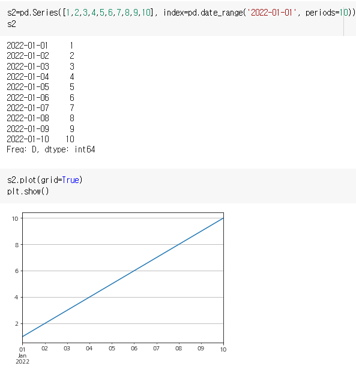

# Matplotlib
- 파이썬에서 데이터를 효과적으로 시각화하기 위해 만든 라이브러리 
- 2차원 선 그래프(plot), 산점도(scatter plot), 막대 그래프(bar chart), 히스토그램(histogram), 파이 그래프(pie chart)
- [matplolib 홈페이지](https://matplotlib.)

## 방법
- matplotlib의 그래프 기능을 이용하려면 서브모듈을 불러와야 함
```python
import matplotlib.pyplot as plt
```
|그래프 종류|문법|
|------|--------|
|선그래프|plt.plot()|
|산점도|plt.scatter()|
|막대그래프|plt.bar()|
|히스토그램|plt.hist()|
|파이그래프|plt.pie()|


## 선 그래프 
---
> 순서가 있는 숫자 데이터를 시각화하거나 시간에 따라 변한는 숫자 데이터를 시각화하는데 많이 사용
```python
plt.plot([x,]y[,fmt])
```
- `plt.plot()`이 선을 그리는 것이고
+ `plt.figure()`이 새로운 캔버스를 만드는 것
* `plt.show()`가 캔버스를 전시해 놓는 것 


### 여러 그래프 그리기
- plot()을 수행하면 그래프 창(figure)이 하나 생성되고 그 안에 하나의 선 그래프를 그림 


- 하나의 plot()에 표시하고자 하는 데이터를 모두 입력하는 방법으로도 하나의 그래프 창에 여러 개의 선 그래프를 그릴 수 있음 
    -  == `plt.plot(x,y1, x, y2, x, y3)`

- 새로운 그래프 창에 그래프 그리기 
- `plt.figure()`


- 그래프 창의 번호 지정
- `plt.figure(n)` --> n번 그래프 창을 지정

- 하나의 그래프 창을 하위 그래프 영역으로 나누기
- `plt.subplot(m,n,p)` --> m x n 행렬로 이뤄진 하위 그래프 중에서 p 번 위치에 그래프가 그려짐


## 그래프의 출력 범위 지정하기 
- 그래프로 데이터를 분석할 때 전체 그래프 중 관심 영역만 확대
```python
plt.xlim(xmin , xmax ) # x 축의 좌표 범위 지정 (xmin ~ xmax)
plt.ylim(ymin , ymax ) # y 축의 좌표 범위 지정 (xmin ~ xmax)
```
- [xmin , xmax ] = plt.xlim () # x 축의 좌표 범위 가져오기
- [ymin , ymax ] = plt.ylim () # y 축의 좌표 범위 가져오기

before


after


## 그래프 꾸미기
- plot()에서 fmt 옵션을 이용하면 그래프의 컬러 , 선의 스타일 , 마커를 지정
```python
fmt = [color][line_style][marker]
```


- plot()의 fmt 옵션에서 컬러, 선의 스타일, 마커 혼합해서 지정


## 라벨, 제목, 격자, 범례, 문자열 표시 
> 그래프의 x 축과 y 축의 라벨 , 그래프 제목 , 격자 , 범례 , 문자열을 표시

- xlabel (문자열) & ylabel (문자열): X 축과 y 축 라벨 각각 추가
- title(문자열): 그래프 제목 추가
- grid(True) or grid(): 격차 추가 
  - grid(False): 이미 있는 격자 제거
- legend(['str1'str2','str3', • • •]): 범례 표시
  - legend()에서 범례의 위치를 지정하지 않으면 자동으로 지정되지만 , loc 옵션으로 범례의 위치를 지정할 수도 있음


- 한글 폰트 지정
```python
import matplotlib as mpl
# 한글 폰트 지정 
mpl.rcParams['axes.unicode_minus']=False
plt.rc('font',family='NanumGothic')
```


## 산점도(scatter)
---
> 두 개의 요소로 이뤄진 데이터 집합의 관계를 시각화하는데 유용함 
```python
plt.scatter(x,y[,s=size_n,c=colors,maker='marker_string',alpha=alpha_f])
```


- 옵션: 마커 크기(S)와 컬러(C)는 전체적으로 혹은 데이터 쌍마다 지정


   


- 데이터마다 마커의 크기와 색깔을 다르게 지정하면 지역별 인구 밀도, 질별 발생률 등을 직관적으로 그래프에 표현 가능 
  1. 주요 도시의 이름, 위도, 경도, 인구밀도를 순서에 맞게 리스트 데이터로 입력 
  2. 데이터로 산점도를 그릴 때, 각 도시의 경도와 위도를 (x,y) 좌표로 지정
  3. 도시별로 마커의 컬러를 다르게 지넝 
  4. 한 마커의 크기는 밀도에 비례하도록 설정하고 마커의 투명도를 중간으로 설정
  5. 마커가 위치한 곳에 도시의 이름을 표시


## 막대 그래프
---
> 값을 막대의 높이로 나타내므로 여러 항목의 수량이 많고 적음을 한눈에 알아 볼 수 있음 
> 여러 항목의 데이터를 서로 비교할 때 주로 이용 
```python
plt.bar(x, height [, width_f , color=colors,
tick_label tick_labels , align=’ (기본) 혹은 edge’, label=labels])
```
- height: 시각화하고자 하는 막대 그래프의 데이터
- x: height의 길이
- width: 옵션으로 [0,1] 사이의 실수 지정해 막대의 폭 조절 (노옵션=0.8)
- color: 옵션으로 fmt 컬러지정 가능
- tick_label: 이름 수정 (노옵션=숫자 라벨)
- align: 그래프의 위치 center 혹은 edge (노옵션=center) 


- `plt.barh()`: 가로 그래프


- index + barWidth: after 그래프를 바로 옆에서 비교하기 위해


## 히스토그램 
---
> 데이터를 정해진 간격으로 나눈 후 그 간격안에 들어간 데이터 개수를 막대로 표시한 그래프 
(도수분포표)

> 데이터가 어떤 분포를 갖는지를 볼 때 주로 이용 

```python
plt.hist(x [,bins=bins_n 혹은 'auto'])
```
- x: 변량 데이터 (키, 몸무게, 시간 등)
- bins: 계급의 개수로 이 개수만큼 자동으로 계급이 생성되어 히스토그램을 그림 (기본: bins=10)
  - 계급: class (60~70,70~80 등으로 나누는 것)
  - 계급의 간격: 10
  - 도수: 각 계급 발생 수 
- bin = 'auto' --> x에 맞게 자동으로 bins에 값이 들어감 


- 출력 결과에서 볼 수 있듯이 hist()는 기본적으로 변량을 10개의 계급으로 나눠 표시


- 도수분포표를 만들 때 60 에서 100 까지 5 간격으로 8 개의 계급으로 나눴으니 bins 옵션에 8 을 입력해서 히스토그램

## 파이 그래프
--- 
> 원 안에 데이터의 각 항목이 차지하는 비율만큼 부채꼴의 크기를 갖는 영역으로 이뤄진 그래프 

> 파이 그래프는 전체 데이터에서 각 항목이 차지한 비율을 비교할 때 많이 이용 

```python
plt.pie(x, [,labels = label_sep , autopct 비율 표시 형식 (ex: %0.1f),shadow = False(기본) 혹은 True, explode = explode_seq , counterclock = (기본) 혹은 False, startangle = 각도 (기본은 0) ])
```
- x: 배열 혹은 시퀀스 형태의 데이터
  
- 다른 그래프와 달리 파이 그래프는 가로와 세로 비율이 1:1로 같아야 그래프가 제대로 보임
  - `plt.figure(figsize=(w,h))`
  - 기본=(6,4)


- autopct: % 표시
- startangle: 부채꼴이 그려지는 시작 각도 
- Counterclock=False: 시계 방향 순서
- explode: 부채꼴이 파이 차트 중심에서 벗어난 정도 (부곽)
- shadow: 그림자 


## 그래프 저장하기
```python
plt.savefig(file_name [,dpi=dpi_n(기본은 72)])
```
- 옵션 dpi에 대입되는 숫자가 클수록 해상도가 높아져서 세밀하게 표현
- 그래프 크기는 figure(figsize=(*,h))를 이용해 변경


## pandas로 그래프 그리기
---
### pandas의 그래프 구조 
> pandas로 생성한 데이터와 pandas의 그래프 그리기 기능을 이용
- pandas의 Series 나 DateFrame 으로 생성 한 데이터가 있을 때 다음과 같은 형식으로 그래프
```python
Series_data.plot([kind='graph_kind'][,option])
DataFrame_data.plot([x=label 혹은 position, y=label 혹은 position,]['kind=graph_kind'][,option])
```
### pandas의 선 그래프
- 인자 없이 s1.plot()을 수행하면 이의 index와 values가 각각 x축과 y축 좌푯값으로 입력되어 그래프를 그림
  - index는 0부터시작되는 값


- pandas의 Series 데이터의 index 값을 변경하면 plot()을 수행할 때 x 좌푯값이 변경된 index 값으로 그려짐 




### pandas의 DataFrame 데이터를 이용해 그래프를 그리는 방법
- pandas의 DataFrame 데이터에 대해 인자 없이 plot() 실행하면 index 는그래프의 x 축 데이터
- 모든 열 데이터 ( 는 각각 그래프의 y 축 데이터
- columns의 경우는 범례로 표시


### pandas의 산점도
- DataFrame_data.plot(kind=’scatter’) 혹은
- DataFrame_data.plot.scatter 를 이용


### pandas의 막대 그래프
- plot(kind='bar') 혹은
- plot.bar() 를 이용 


### pandas의 히스토그램 
- plot(kind=’hist’[, bin=num]) 혹은 
- plot.hist ([bin=num) 를 이용
- 'hist()의 인자로 _bin= 을 넣어서 계급의 개수를 8 로 조정


### pandas의 파이 그래프 
- plot(kind= kind=，，'pie') 혹은 
- plot.pie


- 깔끔한 이미지 및 저장 


- table=True: 그래프 아래 테이블이 생성되었다 

## 정리 
---
- matplodib을 이용해 숫자 데이터를 그래프로 시각화 하는 방법
- 기본인선 그래프를 그리는 것에서 시작해 컬러 선 스타일 , 마커를 지정하는 방법
- 그래프 창 하나에 여러 그래프를 그리는 방법과 여러 개의 창을 나눠 그래프를 그리는 방법
- 라벨, 제목 , 격자 , 문자를 그래프에 추가하는 방법

- 선 그래프뿐만 아니라 산점도 , 막대 그래프 , 히스토그램 파이 그래프를 그리는 방법
- 그려진 그래프를 다른 자료에 사용할 수 있도록 그림 파일로 저장하는 방법
- pandas형식의 데이터를 이용해 시각화 하는 방법