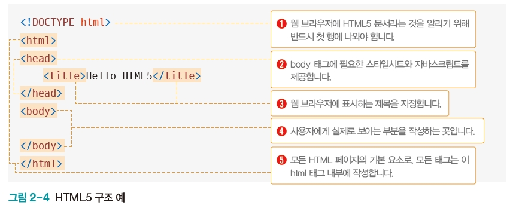

# 웹크롤링
> HTML들을 참고해서 해당 웹크롤러 기술을 활용해 정보를 가져오는것
- HTML 페이지를 가져와서, HTML/CSS 등을 파싱하고, 필요한 데이터만 추출하는 기법 

## 웹(WEB)

- 브라우저: 필요한 파일들(html,js,css)을 받아 해석하고 사용자에게 보여준다
- 웹 서버: 클라이언트의 요청(url)에 따라 적절히 응답해주는 프로그램 
- DB: 사용자의 목록, 정보 등 중요한 데이터들이 저장된 저장소
- 브라우저 + 웹서버: FRONT END (UX/UI 관련)
- WAS + 검색엔진: BACK END (성능, 퍼포먼스)
- 풀스텍: FRONT + BACK END

1. HTTP
2. HTML (태그형식)
   - 구조를 잡는
   - <html> (header, body)
   - </html>
3. CSS (스타일)
   - 디자인 하는
4. JavaScript (기능)
   - 사용자와 동적으로 상호작용하는

## 웹 페이지 기본 구조와 작성 방법

### 태그와 요소
- 요소: HTML 페이지를 구성하는 각 부품 제목 , 본문 , 이미지 등
- 태그: 요소를 만들 때 사용하는 작성 방법
- 파싱/스크래핑: 태그를 제외한 데이터를 가져오는 것 

 
-  `<h1>` &  `</h1>`

- 
: division, 레이아웃을 나눈다

### 속성
- 태그에 추가 정보를 부여할 때 사용하는 것

- 속성 이름: 수많은 h1들을 구별할 수 있게 해준다
- 이미지 속성: 이미지 정보를 추가해 불러온다 

### 주석
- 코드 설명 기록(프로그램의 실행에 영향을 미치지 않음)

- `<!-- 주석 -->`

### HTML5 페이지의 구조

- 스타일시트 = SCC

- `<html>` 태그
  - 웹 페이지의 사용 언어를 구글 검색 엔진에 제공

### HTML5 페이지의 작성과 실행 2: 코드 작성 후 파일로 저장
- [파일] -  [다른 이름으로 저장]
- OO.html 또는 OO.htm 형식으로 저장

- 메모장으로 html 작성하기 
  

### 스타일시트 작성과 실행

- 내부 스타일
  - HTML 페이지 내부에서 style 태그를 사용해 스타일시트를 직접 입력
  - 스타일시트가 짧은 경우
- 외부 스타일
  - 스타일시트를 별도로 생성하고 link 태그의 href 속성을 사용해 불러옴
  - 협업 업무나 프로젝트의 규모가 클 경우 사용 

- 내부 스타일시트 작성과 실행 
  

- 외부 스타일시트 작성과 실행

.png)

### 자바스크립트 작성과 실행 
- 내부 자바스크립트
  - `<script>` 태그를 사용해 HTML 페이지 내부에 코드 작성
- 외부 자바스크립트
  - `<script>` 태그의 src 속성에 파일 경로를 입력해 HTML 페이지로 불러옴

#### 내부 자바스크립트

#### 외부 자바스크립트
