# HTML5 기본 태그

## 글자 태그

- 페이지에서는 글자 태그가 비중이 큼

### 제목과 본문 글자 태그
- 문서의 제목을 표현할 때 사용
- `h`는 Heading을 의미 

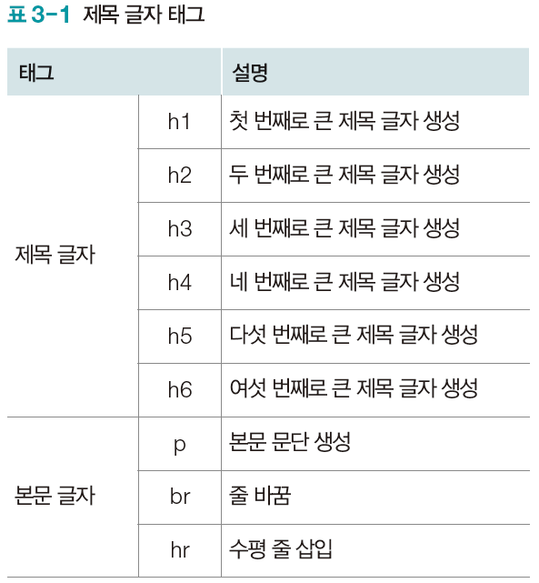

- 제목 표현
  
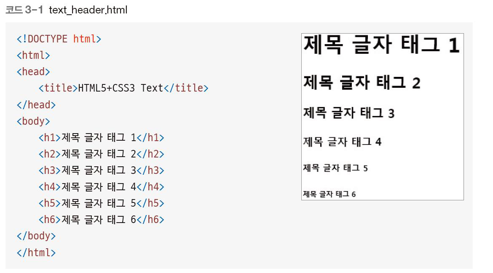

- 본문 단락 구분

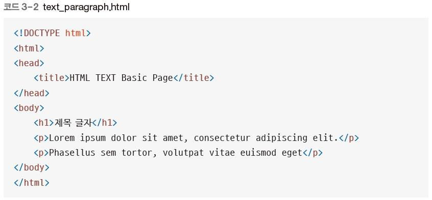
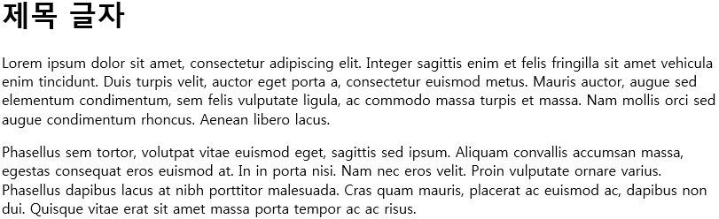

- 제목과 본문 태그의 활용

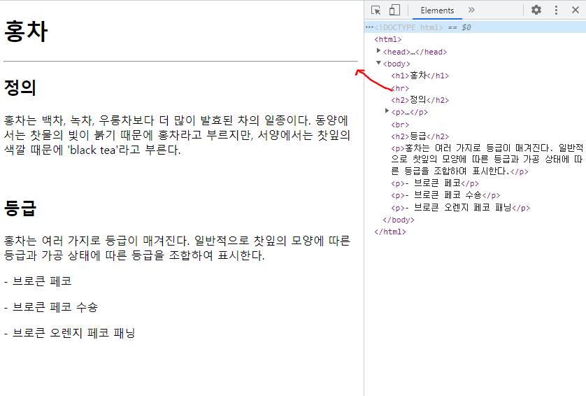

### 앵커태그
- 하이퍼텍스트: 사용자의 선택에 따라 특정 정보로 이동하는 조직된 문서
- a 태그 (Anchor) : 다른 웹 페이지나 웹 페이지 내부의 특정 위치로 이동
- Href: Hyper Reference 를 의미 (link로 이동)

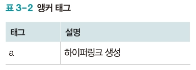
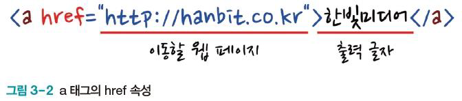

- a 태그의 href 속성
  1. 절대 경로
     - http ://naver.com - 네이버의 메인 페이지
      - /animal.jpg - 현재 웹 사이트 최상위 위치의 animal.jpg 파일
 2. 상대 경로
     - animal.jpg - 웹 페이지가 있는 폴더의 animal.jpg 파일
      - image/animal.jpg - 웹 페이지가 있는 폴더에 포함된 image 폴더의 animal.jpg 파일
      - ../animal.jpg - 웹 페이지가 있는 폴더의 상위 폴더에 있는 animal.jpg 파일
 3. 아이디 경로
     - #name - id 속성이 name 인 태그의 위치로 이동
 4. 메일 경로
     - mailto : hanb@hanbit.co.kr - 해당 주소로 메일 전송

#### 하이퍼링크 설정
1. 특정 웹 페이지에 연결하기
   - 하이퍼링크를 설정한 글자를 클릭하면 해당 웹 페이지로 이동 
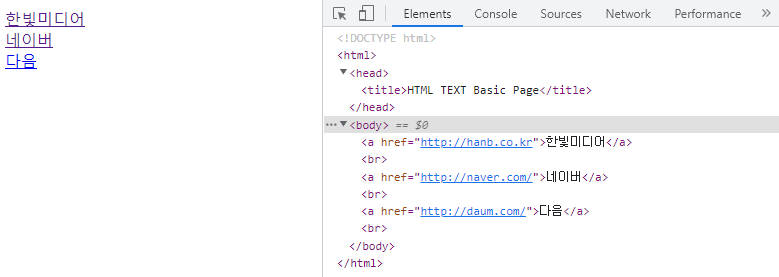

2. 웹 페이지 내부에 연결하기 
    - 하이퍼링크를 설정한 글자를 클릭하면 해당 웹 페이지로 이동 

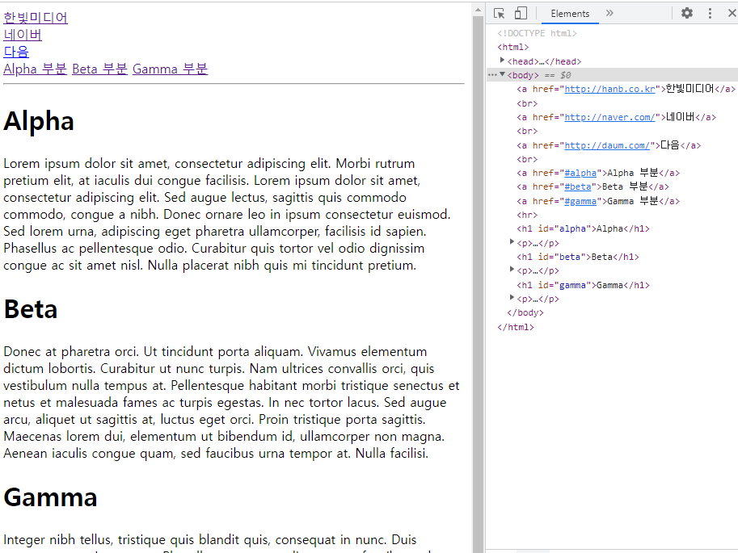

## 글자 모양 태그

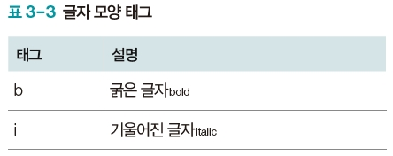
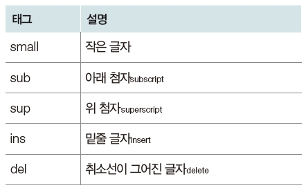

- 글자 모양 태그 내부에 제목 글자 태그와 본문 글자 태그는 넣을 수 없음

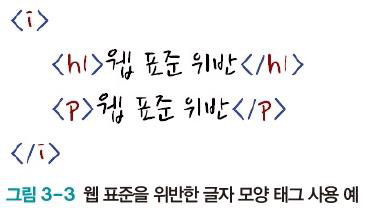

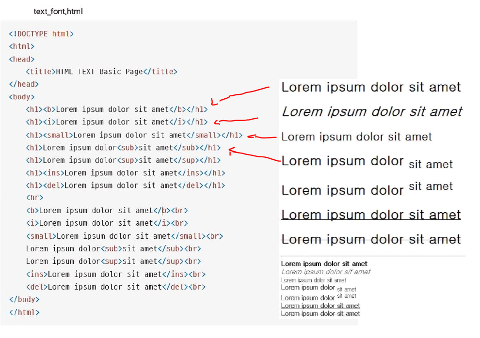

## 목록 태그

### 네비게이션 테그
- 웹 사이트의 다른 웹 페이지로 이동할 수 있는 버튼 

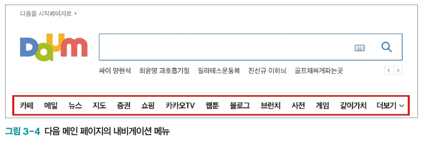

- 내비게이션 메뉴를 만들기 위해 주로 사용되는 목록 태그

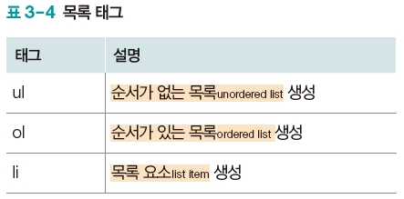

### 목록 태그 활용

1. 순서가 없는 기본(글머리 기호) 목록 만들기
    `<ul>`
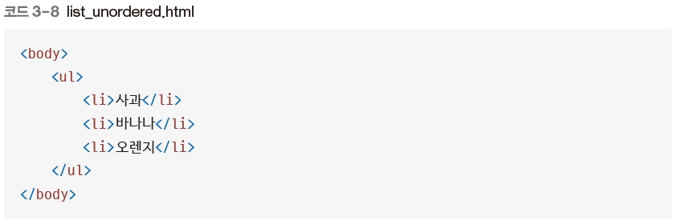

2. 순서가 있는 목록 만들기
    `<ol>`
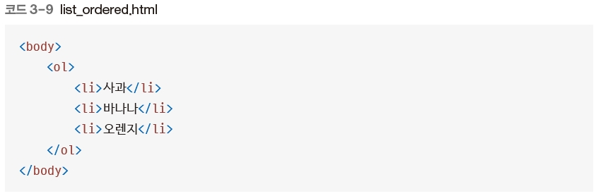

3. 중첩 목록 만들기
   `<li>`
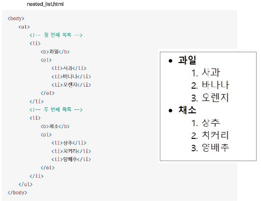

ul > li > ol > li > 사과 

## 테이블 태그

- 테이블 태그

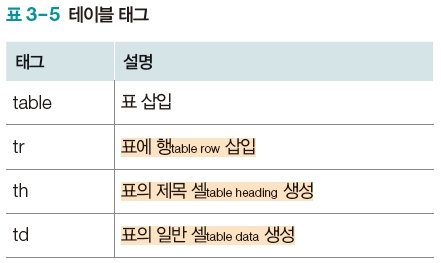

- 시간표 만들기
  
1. 표 만들기

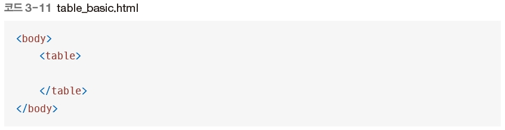

2. 표에 셀 추가하기 

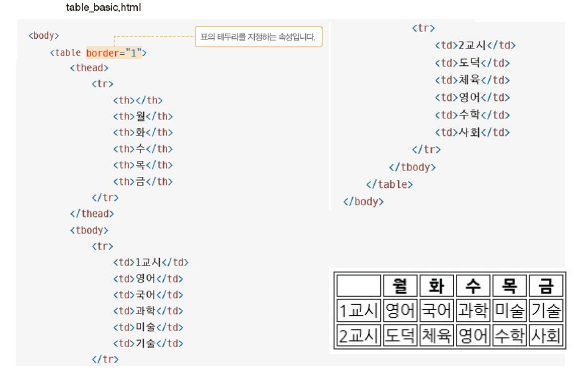

- 테이블 태그의 속성 

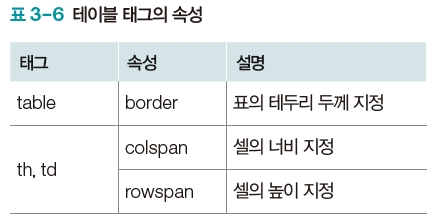

- 행/열 병합 표 생성
  - colspan 속성과 rowspan 속성을 적용 

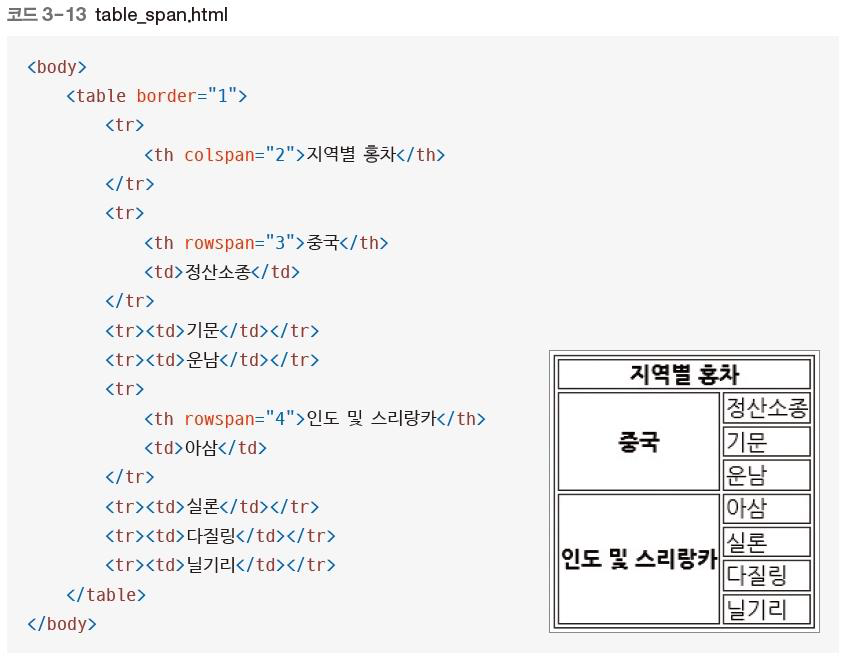

## 미디어 태그
- 이미지, 오디오, 비디오 등 멀티미디어를 넣을 때 사용

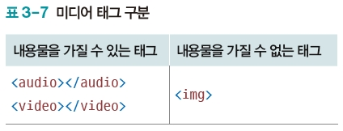

- 이미지, 오디오, 비디오에 필요한 추가 정보는 속성을 사용

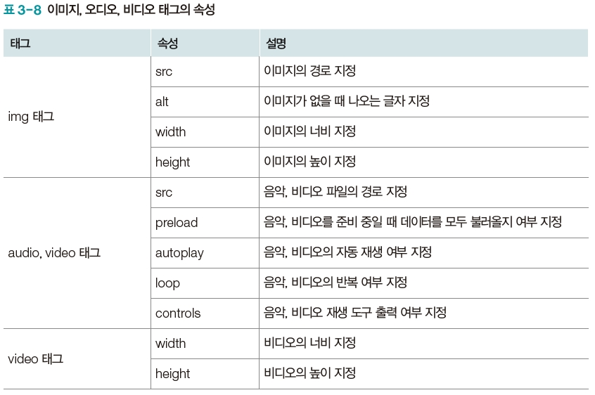]

1. 이미지 삽입하기
   - 이미지 파일 준비: 준비 파일(이미지.jpg)을 HTML 페이지와 같은 폴더에 넣기 

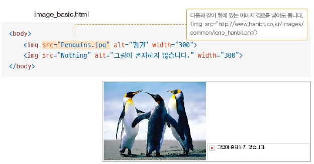
- 상대 경로 vs 절대 경로

2. 음악 삽입하기
    - 음악파일 준비: 준비 파일(오디오.mp3)을 HTML 페이지와 같은 폴더에 넣기 

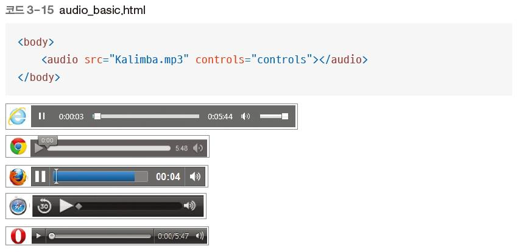

3. 웹 브라우저 제약이 없도록 음악 삽입하기
- `<source>` 태그
- 웹 브라우저마다 지원하는 음악 파일 확장자가 다른 문제 해결
- `<audio>` 태그나 `<video>` 태그 내부에 입력
- ogg 파일 준비 : .ogg 확장자 파일을 HTML 페이지와 같은 폴더에 넣기

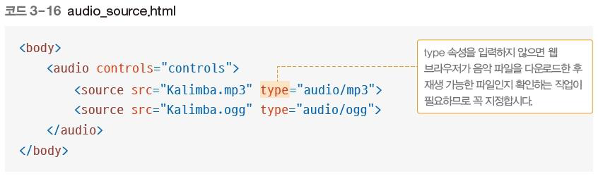

4. 동영상 삽입하기
 - 동영상 파일 준비 : 준비 파일 동영상 .mp4, 동영상 . 을 HTML 페이지와 같은 폴더에 넣기

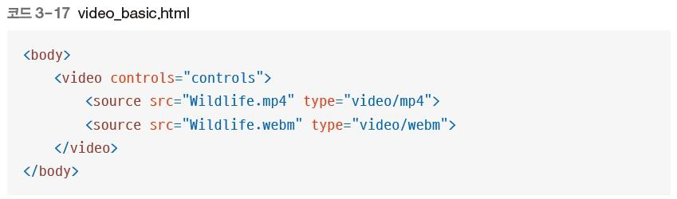

5. 동영상을 불러오는 동안 다른 이미지 보여 주기
- poster 속성
 - `<video>` 태그의 속성
 - 동영상을 불러오는 동안 사용자에게 보여 줄 이미지를 지정
 - 이미지 경로 입력

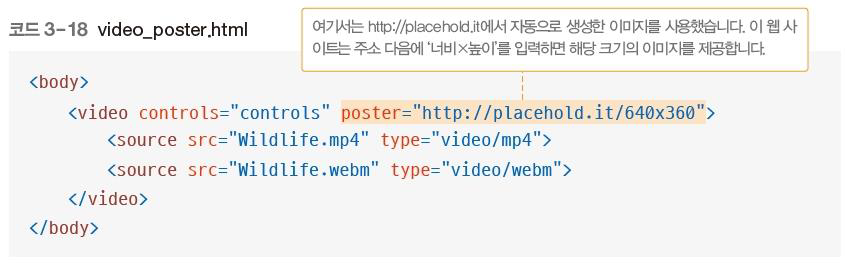

# HTML5 기본 태그

### 입력 양식
- 시용자에게 정보를 입력받는 요소

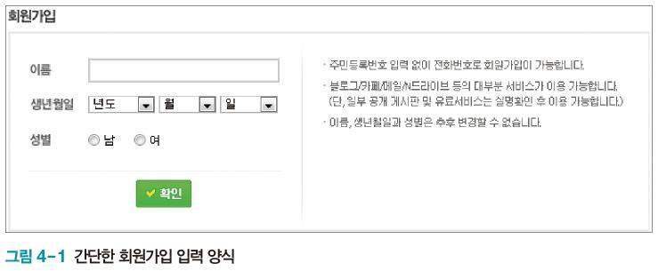

- `<form>` 태그: 영역 생성 

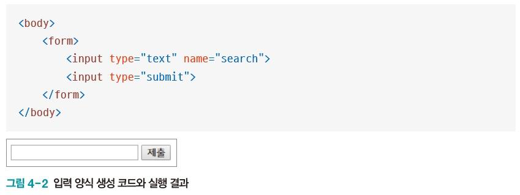

### 데이터 전달 방식

- `<form>` 태그는 method 속성의 방식으로 action 속성 장소에 데이터 전달

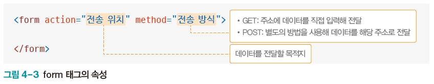

- GET 방식: 주소에 데이터를 입력해서 전달

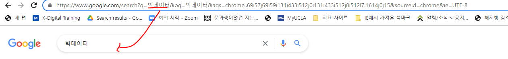
- url에 데이터를 바로 넣는다 

- POST 방식: 주소 변경 없이 비밀스럽게 데이터 전달

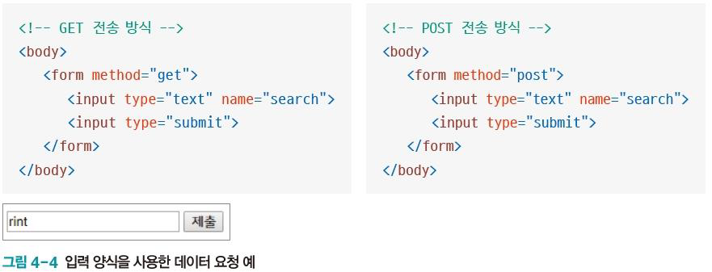

### 입력 양식 종류

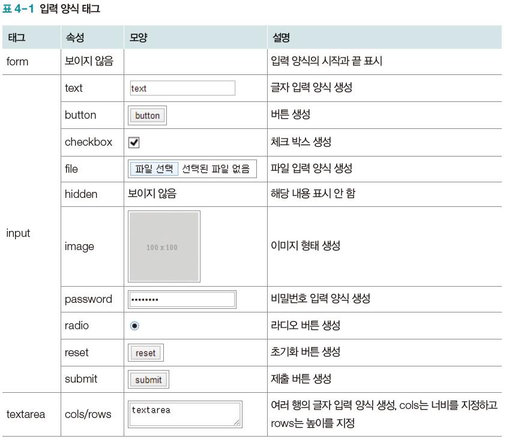

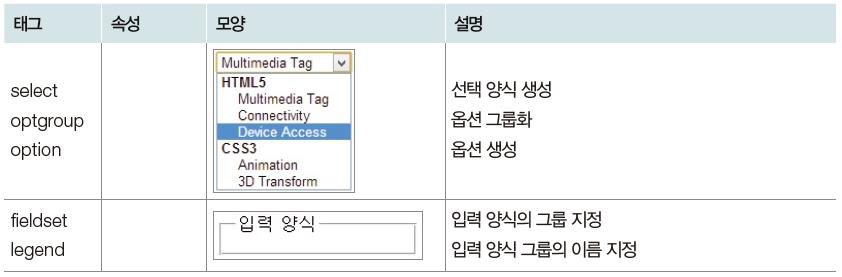

- `<input>` 태그 의 type 속성을 이용해 다양한 기본 입력 양식 생성
- `<input type = ' ' name = ' ' value = ' '>`

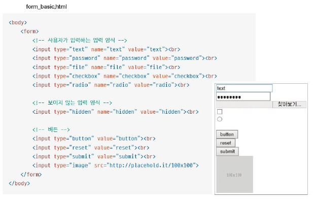

- 라디오 버튼 의 name 속성 을 이용해 여러 대상 중 하나만 선택하는 형태
  - table 로 만들 수 있다
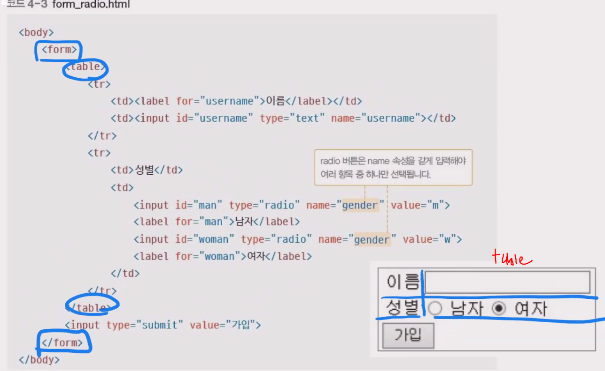

### 선택 가능한 입력 양식 
1. 한 항목만 선택하기 : `<select>` 태그 이용
- 목록으로 보여 주는 항목 중 하나 또는 여러 개를 선택할 때 사용
- 기본적으로 하나만 선택가능
- `<optgroup>`, `<option>` 태그를 함께 사용

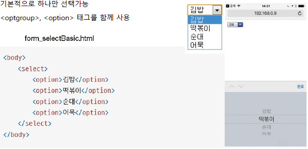

2. 여러 항목 선택하기 : `<select>` 태그의 multiple 속성 사용

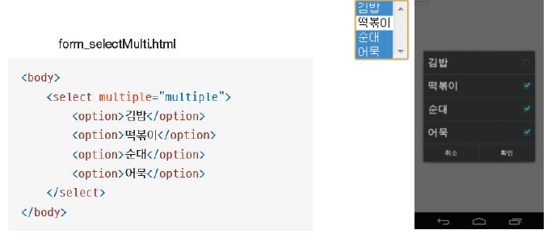

3. 선택 옵션 묶기 : `<optgroup>` 태그 사용

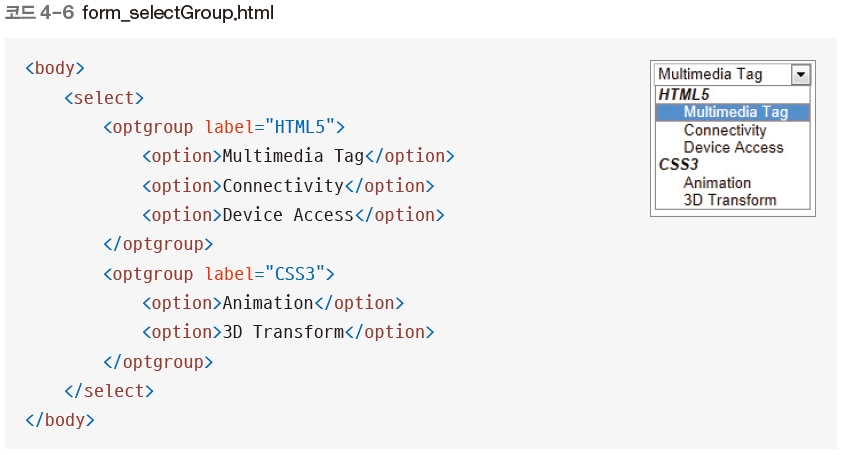

### 연관 있는 입력 양식 그룹으로 묶기
- `<fieldset>` 태그 `<legend>` 태그

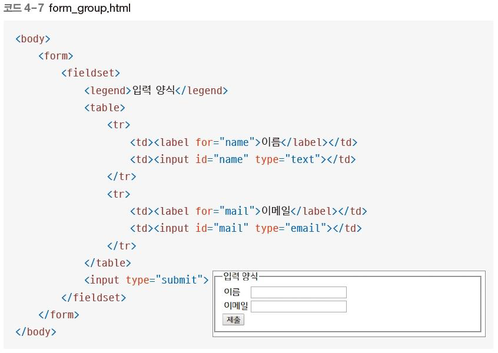

- label태그란?
   - label 태그는 입력 양식창(input, button, textarea 등)을 설명하는 이름표입니다.
   - label 태그에 적힌 텍스트를 선택하면, label과 연결된 입력 양식창이 선택됩니다.
   - for : label태그와 입력양식창을 연결할때 사용합니다. 연결한 입력 양식창의 id를 사용하여 연결합니다.

    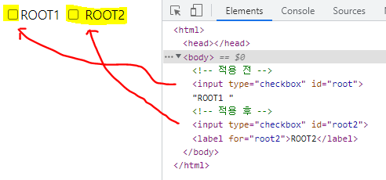
- label 적용 전에는 체크박스 상자를 눌를 경우에만 선택이되는데, label 태그를 적용한 후에는 ROOT2 텍스트를 선택해도 체크박스가 선택됩니다.

## HTML5 문서 구조화

### 공간 분할 태그
- CSS로 원하는 레이아웃을 구성하기 위해 공간 분할

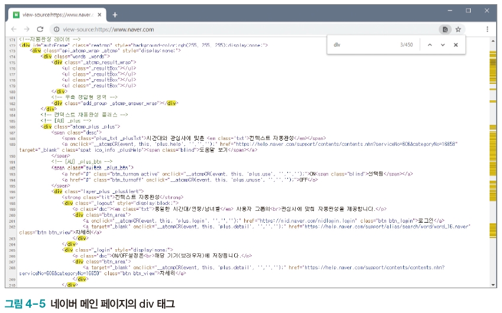

- `
` 태그 , `` 태그

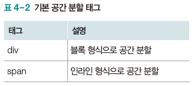

#### 공간 분할 방법
1.  공간을 블록 형식으로 분할하기 
   
   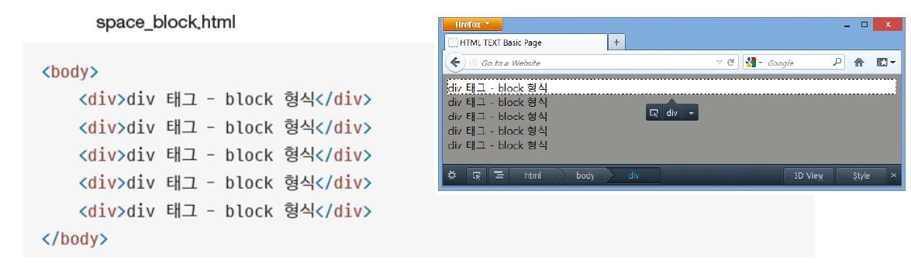

2. 공간을 인라인 형식으로 분할하기
   - 자신의 글자 크기만큼 영역 차지
   - 왼쪽에서 오른쪽으로 쌓임

    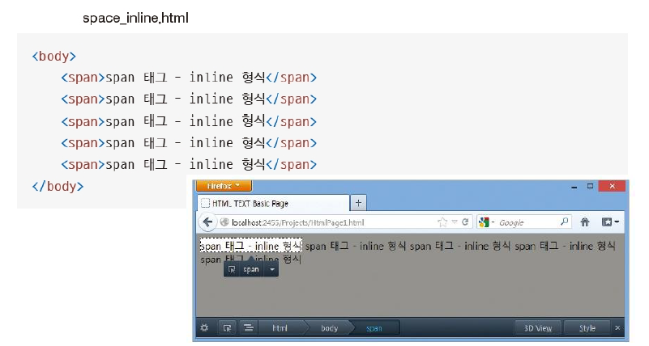

### 시맨틱 태그
- 시맨틱 웹
  - 특정 태그에 의미를 부여한 웹
  - 프로그램이 코드를 읽고 의미를 인식할 수 있는 지능형 웹

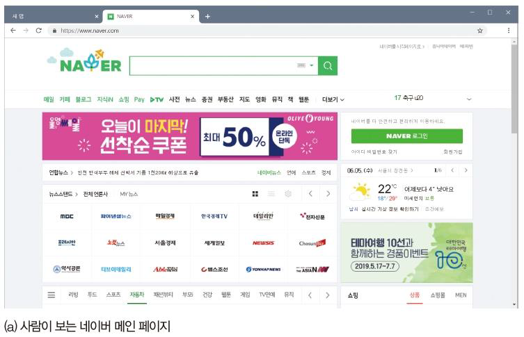
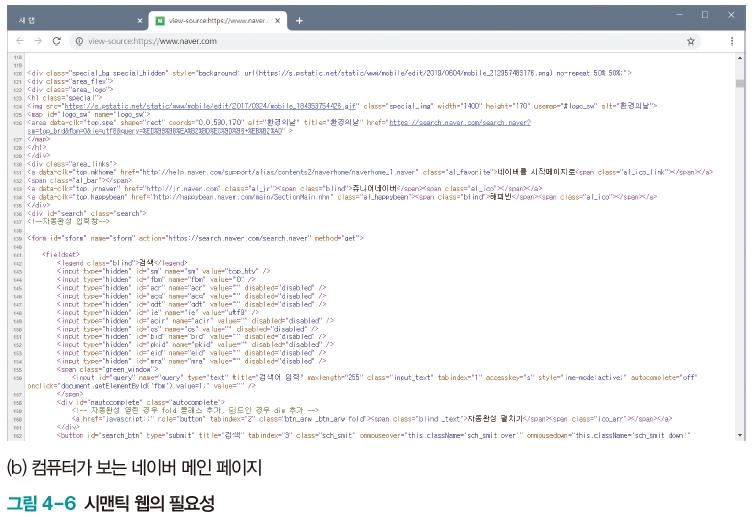

- 시맨틱 태그를 사용한 시맨틱 웹 구현

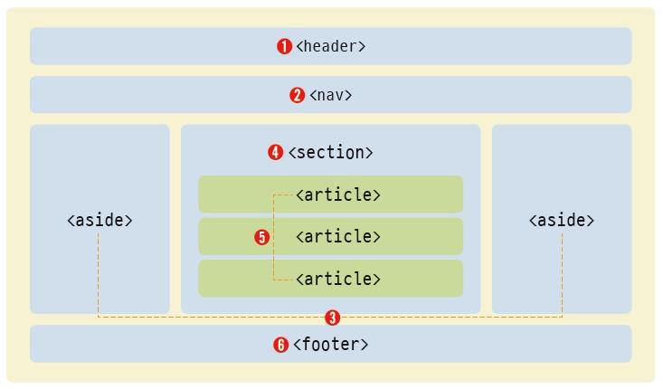
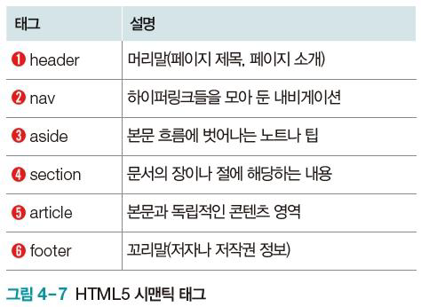

- 시맨틱 태그를 이용한 레이아웃 구성

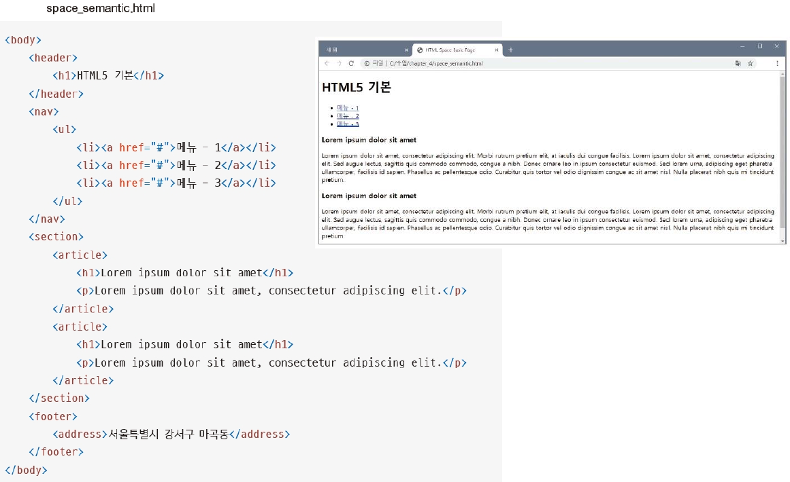