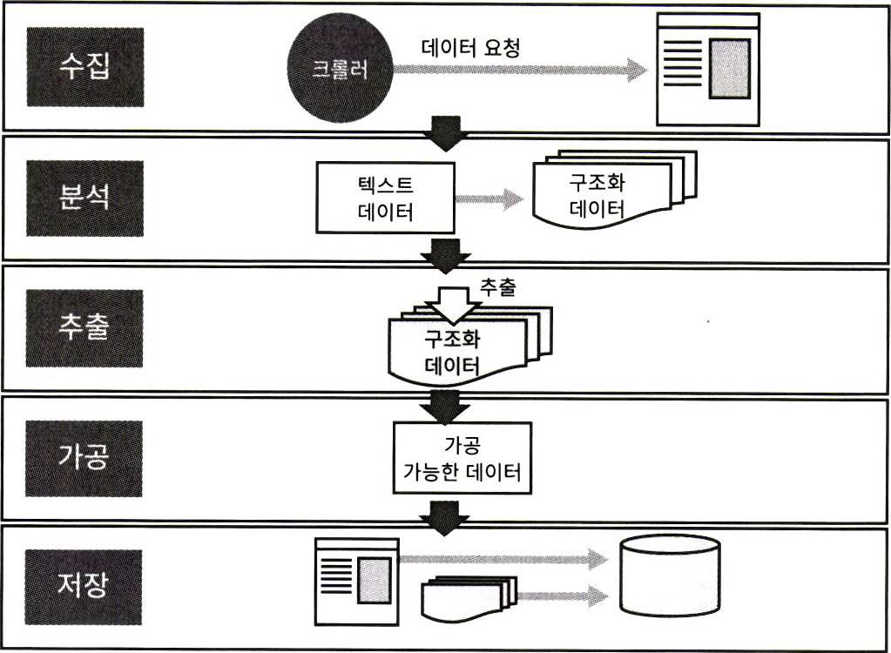

# 크롤링과 스크레이핑 개념


## 크롤러와 크롤링
- 크롤러는 자동으로 웹 페이지에 있는 정보를 수집하는 프로그램
- 크롤러는 사람이 브라우저로 웹 페이지를 조회하고 정보를 수집하는 것
과 비교할 수 없을 정도로 대규모의 정보를 단시간에 수집
- 크롤러로 정보를 수집하는 일을 크롤링

## 스크레이핑 
- 스크레이핑은 수집한 정보를 분석해서 필요한 정보를 추출하는 것 

## 크롤링과 스크레이핑
- 크롤링과 스크레이핑
- 웹 페이지의 정보는 수집 一 분석분석ᅳ 추출 一 가공 一 저장 一 출력 이라는
일련의 흐름


## 크롤링과 스크레이이핑 할때의 주의 사항 

### 웹 사이트에 접근할 때의 주의 사항

- 웹사이트 이용 규약을 확인하고 지킨다
- robots.txt 와 robots 메타 태그의 접근 제한 사항을 지킨다


- 제한이 없더라도 상대 서버에 부하가 가지 않을 정도의 속도로 접근한다
- rel= nofollow 가 설정돼 있으면 크롤러로 접근하지 않는다
- 크롤링을 거부하는 조치가가 있으면 즉시 크롤링을 멈추고 이미 추출한 정보를 모두 삭
제한다

### 수집한 데이터를 다룰 때의 주의 사항
- 수집한 데이터는 저작권을 지켜서 사용하야 함
- 수집한 데이터는 저작권에 문제가 있으면 개인적인 용도로만 사용함
- 수집한 데이터를 기반으로 검색 서비스를 제공하는 경우 , 웹 사이트와 API 등의 사용 규약을 확인하고 문제가 없을 때만 제공함
- 이용 규약이 따로 없을 때도 상대방에서 확인한 뒤에 데이터를 공개

## 크롤러 설계 기본
### 목적과 대상을 명확하게 하기 
- 어떤 정보를 가져올 것이냐? (수집)
- 개발 전에 목적을 명확하게 함
- 대상을 충분하게 분석하는 것

### URL 확인하기

- 사이트맵을 트리구조 페이지 로 제공하는 사이트
   - 사이트맵을 보면 어떤 정보가 어떤 URL 아래에 있는지 쉽게 확인
   - https://www.seoul.go.kr/helper/siteMap.do
- 사이트맵을 XML 로 제공하는 사이트
   - https://www.usa.gov/sitemap.xml
- 사이트맵을 확인할 수 없을 때
   - 카테고리 목록 페이지로 이동하는 링크가 없는지 , 사이트 내부에서 하나하나 찾아봄

### 목적 데이터를 따로 제공하는지 확인하기

- 사이트에 따라서는 불특정 다수의 크롤러가 접근해서 부하를 발생시키는 것을 막기 위해 공식 아카이브 데이터를 제공하기도 함
- https://ko.wikipedia.org/wiki/ 위키백과 데이터베이스 다운로드
- 아키이브 데이터 덤프를 제공해주지 않는 경우라도 웹 API 와 피드를 제공해준다면 이를 활용 크롤러 설계 기본

### 웹 API
- 웹 API 는 특정 URL 에 정해진 매개 변수를 넣어 접근하면 XML 또 JSON 등의 구조화된 데이터를 제공해주는 기능

- https://developers.naver.com/docs/common/openapiguide/apilist.md
- https://developers.kakao.com/

## 크롤러가 가지는 설계할 때의 주의 사항

### 설계가 필요한 부분
- ‘출력 결과로 무엇이 필요한가 가 바로 목적
   - 스프레드시트의 특정 위치에 숫자를 반영
   - 다른 시스템과 연동할 수 있게 API 를 제공
   - 자신의 사이트에서 읽어 들일 수 있는게 피드를 만듬
- 출력 경로관의 관련된 명확한 상세가 있어야 함

### 설계가 필요한 부분
- 크롤로의 각 처리 공정



### 네트워크 요청

- 간격 설정하기
   - 적어도 1 초에 1 번 정도만 요청할 수 있게 하는 것을 권장
- 타임아웃
   - 요청한 사이트로부터 응답이 오지 않는 경우에 타임아웃 설정
   - 3 초동안 응답이 없으면 멈춤
- 재시도
   - 큰문제가 없는데도 오류를 응답하는 경우
   - 재시도할때는 어느 정보의 횟수 제한 (1~3 회 정도 이 있어야 함
   - 재시도 간격도 고려

### 파싱(분석)
- 문자 코드
   - 대부분 UTP 8 로 작성되어 있지만 HTML 소스 코드는 다양한 문자코드로 작성된 경우
가 많음 (EUC KR 등
- HTML/XML 파싱
   - 웹 페이지 중에는 태그가 잘못 구성돼 있거나 속성 값에 큰 따옴표가 처져 있지 않은 경 우도 많음
- JSON 디코드
   - 대부분의 웹 API 는 JSON 형식으로 데이터를 응답

### 스크레이핑과 정규 표현식

- URL 정규화
    - 링크를 추출할 때 링크가 상대 경로인 경우
- 테스트
    - 스크레이핑 라이브러리를 사용하거나 정규 표현식을 사용하더라도 한 번에 원하는 데 이터 추출하는 경우가 적음
    - 테스트 코드를 사용하면 수집 처리와 스크레이핑 처리를 분리하기 쉬움

### 데이터 저장소의 구조와 선택
- 데이터 저장소
    - 파일
    - 문서 데이터베이스 (NoSQL)
    - 관계형 데이터베이스 (RDBMS)
    - 객체 데이터데이스 (NoSQL, RDBMS)
    - 키 값 데이터베이스 (NoSQL)

### 배치(자동화)를 만들 때의 주의점
- 공정분리하기
- 중간 데이터 저장해두기
- 실행 시간 알아 두기
- 중지 조건을 명확하게 하기
- 함수의 매개 변수를 간단하게 하기
- 날짜를 다룰 때의 주의 사항

### 설계 https://wikibook.co.kr/list/)
- 소스 확인하기
  
  
  

- 저장방법

- 파일저장 형식
    - CSV(Comma-Separated Values)
    - TSV(Tab Separated Values)
    - JSON(JavaScript Object Notation)

## 파이썬 언어의 특징

- 파이썬이 크롤링과 스크레이핑에 적합한 이유


- 풍부한 라이브러리 


# 크롤링과 스크레이핑 
## 웹브라우저 실행시키기(webbrowser)

- webbrower 는 자신의 시스템에서 사용하는 기본 웹브라우저가 자동으로 실
행되게 하는 모듈
- 웹브라우저를 자동으로 실행시켜고 해당 URL 인 www.naver.com 로 감

```python
import webbrowser
webbrowser.open("http://www.naver.com")
```