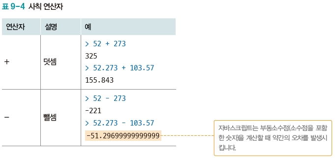
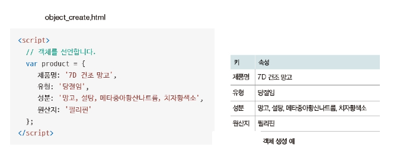

#  자바스크립트
- 웹에서 사용하는 자바 프로그램 언어

## 자바스크립트 기본 용어와 출력 방법 

- 표현식: 값을 만들어 내는 간단한 코드
- 문장: 프로그래밍 언어에 실행할 수 있는 코드의 최소 단위
- 종결: 문장 마지막에 세미콜론 (;) 또는 줄 바꿈

### 자바스크립트 기본 용어 
- 키워드 - 자바스크립트를 처음 만들 때 정해진 특별한 의미가 부여된 단어

- 식별자 자바스크립트에서 변수나 함수 등에 이름을 붙일 때 사용하는 단어

- 식별자 생성 규칙

- 주석 프로그램 진행에 전혀 영향을 주지 않는 코드로 , 프로그램을 설명하는 데 사용

### 출력
- 가장 기본적인 출력 방법 alert( ) 함수를 사용해 웹 브라우저에 경고 창을 띄우기

### 자료형 
- 숫자 
  - 가장 기본적인 자료형
  - 정수와 실수 구분하지 않음 

- 문자열 
  - 문자 집합

- 불(bool)
  - 참과 거짓을 표현할 때 사용하는 자료 

-  비교연산자
   -  두 대상을 비교할 수 있는 연산자 

- 논리 연산자

## 변수
- 값을 저장할 때 사용하는 식별자 
  1. 변수를 선언
  2. 변수를  초기화 (변수에 데이터를 넣는것)

### 메세지 출력(1)
1. HTML 페이지 만들기 

2. 변수 사용하기

## 조건문과 반복문

### 조건문

- if 조건문
  - 조건이 true 이면 문장을 실행하고 false 이면 문장 무시
  - 실행 문장이 한 행이면 중괄호 생략 가능함
  - 실행 문장이 여러 행이라면 중괄호 필요함

### if 조건문으로 참과 거짓 판별

### if 조건문으로 오전과 오후 판별

1. 현재 시간 구하기

2. 오전과 오후 구분하기

### 조건문

- If else 조건문 
  - 두 가지로 분명하게 나뉘는 상황에서 편리하게 사용 가능
- 실행 문장이 한 행이면 중괄호 생략 가능함
- 실행 문장이 여러 행이라면 중괄호 필요함

- 중첩 조건문과 if else if 조건문

### 반복문 
- 배열 (=list)
  - 변수 여러 개를 한꺼번에 다룰 수 있는 자료형
  - 요소 배열 내부에 입력된 자료 하나하나
  - 배열 내부에 다양한 자료형을 입력 가능
  - 배열 전체를 출력하면 요소가 순서대로 표시

- while 반복문
    - 가장 기본적인 반복문
    - if 조건문과 형식이 비슷하지만 ,if 조건문과 달리 불 (bool) 표현식이 참이면 중괄호 안 문장을 계속 실행

- for 반복문
  - for반복문은 원하는 횟수만큼 반복하고 싶을 때 사용
    - ➊ 초기식을 비교합니다

    - ➋ 조건식을 비교합니다 . 조건이 거짓이면 반복문을 종료합니다
    - ➌문장을 실행합니다
    - ➍종결식을 실행합니다
    - ➎ 앞의 ➋ 단계로 이동합니다

## 함수

### 선언과 호출 , 실행 우선순위
- 선언과 호출
 - 함수 코드 집합을 나타내는 자료형
 - 익명 함수 생성 함수 이름을 입력하지 않고 만들기
 - 선언적 함수 생성 함수 이름을 입력해서 만들기

### 함수 선언
1. 익명 함수 선언하기 

2. 선언적 함수 선언하기

### 실행 우선순위
- 가장 마지막에 입력된 값이 저장 

### 매개변수와 (=인자값) 반환 값

- 매개변수
 - 함수의 괄호 안에 집어넣어 함수 쪽에 추가적인 정보를 전달하는 것
- 리턴 값
 - 함수를 실행한 결과를 반환 값

### 콜백 함수 (재귀 함수)
- 매개변수로 전달되는 함수

## 객체 
### 개요
- 객체는 자료형 여러 개를 한 번에 저장
- 배열은 요소에 접근할 때 인덱스를 사용하지만 , 객체는 키를 사용

- 객체 뒤의 대괄호를 사용해 키를 입력하면 객체 속성에 접근

- 객체 뒤의 점(.) 을 찍어 객체 속성에 접근

- for in 반복문
  - 객체 요소를 하나씩 살펴볼 수 있음

### 속성과 메서드
- 요소 (element)
 - 배열에 있는 값 하나하나
- 속성 (property)
 - 객체에 있는 값 하나하나

- this 키워드 (=self)
- 객체에 있는 속성을 메서드에서 사용하고 싶을 때는
자신이 가진 속성임을 분명하게 표시해야 함

