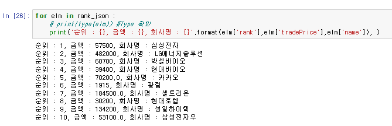

# 크롤링과 스크레이핑 


- 라이브러리
  - 크롤링: `webbrowser`, `urllib`, `requests`
  - 스크래핑: `urllib.parse`, `xml(xpath)`

## 웹브라우저 실행시키기(webbrowser)

- webbrower 는 자신의 시스템에서 사용하는 기본 웹브라우저가 자동으로 실
행되게 하는 모듈
- 웹브라우저를 자동으로 실행시켜고 해당 URL 인 www.naver.com 로 감

```python
import webbrowser
webbrowser.open("http://www.naver.com")
```

- webbrower 의 open 함수는 웹브라우저가 실행된 상태이면 해당 주소로 이동
- 웹브라우저가 실행되지 않은 상태이면 새로이 웹브라우저가 실행되어 해당
주소로 이동
- Open_new 함수는 이미 웹브라우저가 실행된 상태에서 새로운 창으로 해당
주소가 열리도록 함

```python
import webbrowser
webbrowser.open_new("http://google.co.kr")
```

## 웹 페이지 추출하기

### urllib 으로 웹 페이지 추출하기


- 페이지를 추출할 때는 표준 라이브러리 urlib.request 모듈을 사용
- urlib.request에 포함돼 있는 urlopen() 함수에 url을 지정하면 웹 페이지를 추출 
- 가장 직관적이고 복잡한 방식 

  
```python
from urllib.request import urlopen
# urlopen 함수는 HTTPResponse 자료형의 객체를 반환합니다
f = urlopen ('http://hanbit.co.kr')
type(f)
f.read() 
# read() 메서드로 HTTP 응답 본문 (bytes 자료형 을 추출합니다
f.status 
# 상태 코드를 추출합니다
f.getheader(‘Content-Type’) 
# HTTP 헤더의 값을 추출합니다
```


- f.read():  request --> response (HTML)
  - 원본을 그대로 가져온다

### meta 태그에서 인코딩 방식 추출하기 
- HTML 내부의 meta 태그 또는 응답 본문의 바이트열도 확인해서 최종적인 인코 딩 방식을 결정하고 화면에 출력
  - 변환을 한다 (한글 깨짐 고치기, 가독성 높이기)


## 웹 페이지에서 데이터 추출하기
###  정규 표현식으로 스크레이핑하기
- 표준 라이브러리의 re 모듈 사용
  - 필요한 정보 추출 (HTML)
  


### XML(RSS) 스크레이핑 
- 블로그 또는 뉴스 사이트 등의 웹사이트는 변경 정보 등을 RSS 라는 이름의 XML 형식으로 제공
- RSS는 XML 을 기반으로 만들어졌으므로 HTML 보다 간단하게 파싱
- rss라는 이름의 요소를 루트로 하는 트리 구조를 가지고 있음
- 내부에는 피드를 나타내는 channel 요소가 있음
- channel 요소의 앞부분에는 피드의 메타 정보를 나타내는 title 요소와 link 요소 등이 있음

## 데이터 저장하기

### CVS 형식으로 저장하기
- CSV(Common Seperated Values) 는 하나의 레코드를 한 줄에 나타내고 , 각 줄의 값을 쉼표로 구분하 는 텍스트 형식
- 행과 열로 구성되는 2 차원 데이터를 저장할 때 사용
- CSV 형식을 만드 는 가장 쉬운 방법은 str.join () 메서드를 사용
- csv.writer를 사용하면 간단하게 CSV 형식으로 출력
- 한 줄을 줄력할 때 는 writerow 메서드를 사용하며 , 매개변수로 list 또는 tuple 과 같은 반복 가능한 객체

### JSON 형식으로 저장하기 {KEY:VALUE}
- JSON(JavaScript Object Notation) 은 자바스크립트에서 객체를 표현하는 방법을 사용하는 텍스트형식
- JSON 을 사용하면 list 또는 dict 를 조합 한 복잡한 데이터 구조를 쉽게 다룸
- 파이썬은 JSON 형식을 쉽게 다룰 수 있게 json 모듈을 제공
- json.dumps 함수 를 사용하면 list 와 dict 등의 객체를 JSON 형식 문자열로 변환

### 데이터베이스 (SQLite 3) 에 저장하기
- SQLite3 는 파일기반의 간단한 관계형 데이터베이스
- 구문을 사용해 데이터를 읽고 쓸 수 있음
- SQLite는 가볍게 사용할 수 있는 관계형 이터베이스지만 파일을 쓰는 데 시간이 꽤 걸린다는 것이 단점
- 적은 데이터를 다룰 때는 문제 없지만 크롤링한 대량의 데이터를 계속해서 올리면 SQLite 를 사용할 경우 파일을 쓰는 부분이 병목지점으로 작용
- 어떤 프로그램 이 파일을 열고 내용을 쓰고 있을 때는 다른 프로그램에서 해당 파일을 사용할 수 없으므로 동시 처리도 불가능

## 파이썬으로 스크레이핑하는 흐름 

- fetch(url) (HTML)
    - 매개변수로 url 을 받고 지정한 URL 의 웹 페이지를 추출
- scrape(html) (필요한 정보)
    - 매개변수로 html 을 받고 정규 표현식을 사용해 HTML 에서 도서 정보를 추출
- save(db_path, books) (추출정보 저장)
    - 매개변수로 books 라는 도서 목록을 받고 , SQLite 데이터베이스에 저장

## urllib 사용법 및 기본 스크래핑
- `urllib.request` 모듈을 이용하여 간단하게 웹 페이지 요청 및 데이터를 가져올 수 있다
- 데이터를 보낼 때 인코딩하여 바이너리 형태로 보낸다
- `urlretrieve` 함수를 통해 바로 파일에(png,html) 자료를 입력할 수 있다.

### urllib.request 기초 사용법
- 네이버 이미지 다운로드 대상
- 구글 HTML 정보 다운로드 대상
- Header 정보 확인
- 다운로드 정보 파일 저장


### urllib.request 예외 처리
- 기존 소스 코드 변경
- 예외 처리 추가
- 기타 리팩토링

try:
except:
finally:


  - HTTP Header: 클라이언트와 서버가 요청 또는 응답으로 부가적인 정보를 전송하는 것
  - 저장된 날짜는 세계 표준 시간을 기준으로 한다 


- error의 대비책을 많이 만들어 놓는다


## lxml.html 사용
### 네이버 메인 뉴스 정보 스크랩핑
- 신문사 정보 리스트 출력
- CSS 선택자 활용 
- root.xpath


### root.cssselect


## get 방식 데이터 통신

- GET 메소드는 HTTP 프로토콜에서 데이터 전송을 위해 지원하는 7가지 메소드 중 일부이기 때문입니다
- HTTP통신할때 보내는 데이터는 HTTP 패킷이라 하는데 해당 패킷의 구조는 크게 Header 영역과 Body영역으로 나누어 진다.
  - Header에는 크게 여러가지 정보와 어떠한 방식의 메소드를 사용 하였는지에 대해 적게 됩니다.
  - 또한 어떠한 메소드 방식을 사용하였는지에 따라 Body 영역의 사용 유무 및 사용 방법이 달라지게 됩니다. 
- GET방식의 특징으로는 대표적으로 URL에 Parameter를 붙여서 전송한다는 것입니다.


### urlopen 함수의 다양한 함수 
- urllib.request 모듈에 있는 urlopen() 함수는 주어진 url에서 데이터를 가져온다.
- 또한 기본 인증(basic authentication), 쿠키, 프락시 등과 같은 일반적인 상황을 처리하기 위한 약간 더 복잡한 인터페이스도 제공합니다.  

- 사이트 요청 정보 확인
- encar 엔카 사이트 정보 수신
- Get 파라미터 요청
- 수신 데이터 디코딩 (decoding)
- 요청 URL 정보 분석


### RSS 데이터 스크랩핑
- RSS는 블로그나 홈페이지의 변경정보를 xml 형식으로 제공하는 것을 의미
- RSS(Really Simple Syndication) 같은 "사이트 피드": 새 기사들의 제목만, 또는 새 기사들 전체를 뽑아서 하나의 파일로 만들어 놓은 것입니다.
  - 이제 각 사이트들에서 제공하는 RSS파일 주소만 수집하여 확인하면, 자신의 취향에 맞는 새로운 읽을거리를 쉽게 찾아서 읽을 수 있습니다.

- 행정안전부 사이트 RSS 데이터 수신
- RSS란
- 반복문을 활용한 연속 요청
- 요청 URL 정보 분석
- 수신 XML 데이터 확인


## requests 사용 스크랩핑
- requests는 HTTP GET, POST, PUT, DELETE 등을 사용할 수 있으며, 편리한 데이타 인코딩 기능을 제공하고 있다. 
- 즉, 데이타를 Dictionary로 만들어 GET, POST 등에서 사용하면 필요한 Request 인코딩을 자동으로 처리해 준다.

### session 및 cookie 사용

- Requests 요청 정보 Payload
- 세션 활용성화 및 비활성화
- 쿠키 정보 전송
  - 매 페이지 마다 로그인 하지 않게 로그인 정보를 저장
  - 웹사이트(Website) 쿠키: 사용자의 로그인 정보를 저장하여 로그인 시간을 절약하는 데 유용합니다. 
  - 모든 웹사이트 쿠키는 사용자의 정보를 해시 데이터 형태로 저장합니다. 데이터가 해시되면 해당 데이터를 가져온 웹사이트만 읽을 수 있습니다.
  - network > header 에 있음  
- User-Agent 정보 전송
  - 회원을 등록해서 정보를 볼 수 있게 한다
  - 웹 사이트에서는 접근하는 사용자의 정보
  - 기기/브라우저별로 지원정보가 나와있어서 어떤 기기를 이용해서 접근하는지를 알 수 있음
  - 서버 입장에서 유저 에이전씨를 확인해서 정보를 제한적으로 보여줄 수도 있음
- 수신 상태 코드 확인


    - UserAgent가 없으면 20은 실행 불가 (홍페이지 서버에서 접속 차단)



### JSON 수신 데이터 처리
- Httpbin 사이트를 이용한 JSON
- 수신 데이터 처리
- 수신데이터 --> JSON 변환 출력
- Response 다양한 정보 출력

### rest API
- 개발자 도구 송수신 분석
- Rest API란
- POST, PUT
- DELETE
- Requests

## BeautifulSoup 사용 스크랩핑
- 들어가기에 앞서
  1. 웹사이트는 HTML이라는 형식으로 쓰여진 문서이다
  2. requests.get(): HTML 문서에 담긴 내용을 가져 오도록 request(요청) 한다
  3. 위에서 했던 것 처럼 복잡하게 스크랩핑을 해야 하지만....
  4. BS를 사용하면 HTML 문서를 탐색해서 원하는 부분만 쉽게 뽑아낼 수 있다
- BS: 비슷한 분류의 데이터별로 나누어주는(parsing) 파이썬 라이브러리
    - HTML 데이터를 판다스의 dataframe 같이 정리해 놓았다 

### Beautiful Soup 사용법
- Beautiful Soup Selector
- HTML 태크 선택자 이해
- FIND, FIND_ALL (태그)
- SELECT, SELECT_ONE (CSS 선택자)
- 다양한 DOM 접근 방법 (묶음)

### 네이버 이미지 다운로드
- Beautiful Soup 이미지 다운로드
- Naver 이미지 검색 송수신 분석
- Select, Find_all
- 이미지 변환 및 저장
- 예외 처리


### 로그인 처리
- Session 사용 로그인 , 데이터 수집
- 대상 사이트 로그인 과정 분석
- 로그인 후 페이지 이동
- 필요 데이터 추출

## Selenium 사용

### Seleni um 웹 자동화
- Selenium 설명 및 기본 설정
- Driver 설치
- 웹 자동화의 이해
- Selenium 기초
- 다음 사이트 기반

### 웹 크롤링
- 데이터 수집 프로젝트
- 대상 사이트 선정 및 분석
- Explicitly wait
- Implicitly wait
- 필요 정보 추출

- 데이터 수집 프로젝트
- 페이지 전환 추가
- Selenium 성능 개선
- 전체 프로세스 확인

- 데이터 수집 프로젝트
- 이미지 수집
- 엑셀 데이터 작성
- 전체 프로젝트 소스 코드 리뷰
- 기능 개선 및 공부 내용 추천