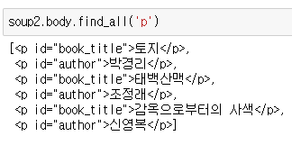
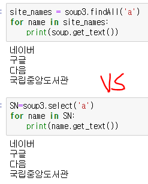

# 웹 크롤링 (크롤링과 스크래핑)

- 수집: 
    1. 크롤러 프로그램이 웹에 (URL로) request 하면
    2. 웹에서 크롤러에게 HTML로 response 한다 
    - `webbrowser.open('URL')`
    - urllib: `urlopen('URL')`
    - request: `request.get('URL')` 

- 분석
    1. 컴퓨터 입장에서의 response된 HTML은 문자열을
    2. 구조화된 HTML (XTL, JSON) 으로 바꾼다
    ==> `BS`:  파싱 (--> lxml)

- 추출
    1. 구조화된 HTML에서 필요한 정보(태그, 속성)를 찾고 
    2. 내용(정보)를 추출한다
    - `Beautiful Soup`: find, select

- 가공
    1. 가공 가능한 데이터 (변환, 전처리(\n) 등)를 처리하고 
    2. Data Frame에 넣어서 처리하기 쉽게 한다

- 저장 
    1. 처리된 데이터를 (파일, csv, excel, txt, SQL)저장 한다 

## BeautifulSoup 사용 스크랩핑
- 들어가기에 앞서
  1. 웹사이트는 HTML이라는 형식으로 쓰여진 문서이다
  2. `requests.get()`: HTML 문서에 담긴 내용을 가져 오도록 request(요청) 한다
  3. 어제 했던 것 처럼 복잡하게 스크랩핑을 해야 하지만....
  4. BS를 사용하면 HTML 문서를 탐색해서 원하는 부분만 쉽게 뽑아낼 수 있다
- BS: 비슷한 분류의 데이터별로 나누어주는(parsing) 파이썬 라이브러리
    - HTML 데이터를 판다스의 dataframe 같이 정리해 놓았다 

### Beautiful Soup 사용법
1. import beautiful soup
2. 구조화 (paser, HTML)
    - 문자열 --> HTML (header, body)
    - data --> data frame
   1. 태그, 속성 찾기 
        - find(), find_all, findAll() (태그)
        - select(), SELECT_ONE (CSS 선택자)
   2. 내용 (정보) 추출 
        - get_text()   

- 다양한 DOM 접근 방법 (묶음)
  - 문서 객체 모델

## 웹브라우저로 웹 사이트 접속하기

### 하나의 웹 사이트에 접속하기 

- 사이트를 하나 지정한 후에 웹 브라우저를 열어서 접속하는 방법

    - open(): 새 탭이 열림 
    - open_new(): 새 창이 열림

- 네이버에서 특정 검색어를 입력해 결과 얻기

  - 구글에서도 검색을 위한 웹 사이트 주소 (www.google.com) 와 검색어를 연결 해 입력하면 검색 결과

### 여러 개의 웹 사이트에 접속하기
- url 주소 리스트와 for 문을 이용

- 여러 단어 리스트와 for문 이용

## 웹 스크랩핑을 위한 기본 지식

### 데이터의 요청과 응답 과정

- HTML의 기본 구조

### 웹 페이지의 HTML 소스 갖고 오기

- 구글 웹페이지의 소스코드 

     request.get: html 가져오기 

  1.  r = HTML
  2.  type(r) = request.models.response

- 응답 객체를 잘 가져왔는지 확인
- HTML 파일 전체 중 일부분 출력
- 

    text: html 출력 

1. type(r.text) = str

- 한번에 수행 가능
  

    request.get('url').text

## HTML 소스코드를 분석하고 처리하기

### 데이터 찾고 추출하기

- HTML 코드를 분석해 원하는 데이터를 추출하는 방법
- HTML 코드를 분석하기 위해서는 HTML 코드 구문을 이해하고 요소별로 HTML 코드를 분류
- Beautiful Soup 라이브러리를 이용해 HTML 소스를 파싱하고 태그나 속성을 통해 원하는 데이터를 추출

- Beautiful Soup 라이브러리를 이용해 HTML 소스를 파싱하고 태그나 속성을 통해 원하는 데이터를 추출 

    html을 lxml 형식으로 파싱을 한다 

- 파싱 결과를 좀더 보기 편하게 HTML 구조의 형태로 확인

- 파싱한 결과에서 BeautifulSoup.find('태그')를 수행 
- HTML 소스코드에서 해당 '태그'가 있는 첫 번째 요소를 찾아서 반환 

    find(): 첫번째 요소 찾아서 반환

- get_text는 HTML 소스코드의 요소에서 태그와 속성을 제거하고 텍스트 문자열만 반환
- get_text는 원하는 HTML 요소를 가져온 후에 마지막 단계에서 요소의 텍스트 부분만 추출할 때 이용

- HTML 코드안의 모든 a 태그를 찾아서 a 태그로 시작하는 모든 요소를 다 반환
- BeautifulSoup.find_all 태그 를 이용

        find_all(): 여러개 오소 찾아서 list로 반환 = findAll()

- 태그 이름의 모든 요소를 반환하는 find_all 의 결과는 리스트 형태로 반환
- get_text는 리스트에 적용할 수 없으므로 for 문을 이용해 항목별로 get_text 를 적용

- HTML 파일을 작성한 후에 html2 변수에 할당

- Beautiful Soup의 다양한 기능을 활용해 HTML 소스로부터 필요한 데이터를 추출
- HTML 소스에서 title 태그의 요소는 BeautifulSoup.title 을 이용해 가져올 수 있음 --> .태그 로 가져오기

- HTML 소스의 body 태그의 요소는 'BeautifulSoup.body'를 이용해 가져올 수 있음 --> body 전체 가져오기

- body 태그 요소 내에 h1 태그의 요소는 'BeautifulSoup.body.h1로 가져올 수 있음

- find_all을 이용
- 변수 html2 에 있는 HTML 소스코드에서 p 태그가 들어 간 요소를 모두 가져올 수 있음

--> 좌표를 정확하게 설정 가능 

- p 태그 중 책 제목과 작가를 분리해서 가져오려면 find() 나 find_all 을 이용
- '태그' 뿐만 아니라 태그 내의 속성 도 함께 지정
- BeautifulSoup.find_all (태그, 속성)
- BeautifulSoup.find (태그, 속성)

- html2 의 HTML 코드의 p 태그 요소 중 id 가 book_title 인 속성을 갖는 첫 번째 요소만 반환

- p 태그 요소 중 id 가 author 인 속성을 갖는 첫번째 요소만 반환

- 조건을 만족하는 요소 전체를 가지고 오려면 find_all()을 이용

- 책 제목과 작가를 포함한 요소를 각각 추출한 후에 텍스트만 뽑는 코드

### 데이터 찾고 추출하기: CSS 선택자 이용

- CSS 선택자 (selector)를 이용
- CSS 선택자는 CSS 에서 원하는 요소를 선택 하는 것으로서 파이썬뿐만 아니라 다른 프로그래밍 언어에서도 HTML 소스를 처리할 때 많이 이용
- Beautiful Soup도 BeautifulSoup.select 태그 및 속성 를 통해 CSS 선택자를 지원
- 'BeautifulSoup.select'의 인자로 태그 및 속성 을 단계적으로 입력하면 원하는 요소를 찾을 수 있음
- `#`: id, `.`: class

- html2 변수에 할당된 HTML 소스에서 body 태그 요소 내에 h1 태그 요 소를 가지고 오기

#### find & select 비교

- select는 리스트로, find는 str으로 
- 그래서 get_text를 할때 리스트 자리를 명시 

- body 태그 요소 중에 p 태그를 포함한 요소를 모두 갖고 오기

- 변수 html2 의 HTML 소스에서 p 태그는 body 태그 요소 내에서만 있음

- 태그 안의 속성과 속성값을 이용해 요소를 세밀하게 구분해 추출
- 태그 안의 속성이 class 인 경우 태그.class 속성값 으로 입력
- 속성이 id 인 경우에는 태그 #id 속성값 으로 입력해 추출
- 그 안에 있는 속성이 id 이므로 p#id 속성값 으로 원하는 요소를 추출

- class 속성이 있는 HTML 소스

- BeautifulSoup.select 태그 몇 속성 에서 태그 안의 속성이 class 인 경우
- '태그.class' 속성값 으로 원하는 요소를 추출
- HTML 소스 파일은 이미 저장돼 있으므로 텍스트 파일을 읽어와서 변수 html3 에 할당

#### find & select 비교

- 읽어온 HTML 소스에서 태그가 a 인 요소를 모두 가져오기

- HTML 소스에서 태그가 a 이면서 class 속성값이 " 인 요소만 가져오기

]

### 웹 브라우저의 요소 검사

- soup3.select('html body a’) =
- soup3.select('body a') =
- soup3.select('html a') =
- soup3.select('a')

- BeautifulSoup.select 태그 및 속성 의 인자로 a 만 입력해 태그 a 를 포함하는 모든 요소를 추출

- HTML 소스에서 태그 a 를 포함하는 요소 중 class 속성이 "portal" 인 요소만 선택

- 태그를 포함하는 요소 중 id 속성이 "naver" 인 요소를 선택

### 줄 바꿈으로 가독성 높이기 

- HTML 소스 코드를 파일 ('br_example_constitution.html)로 저장

    - br을 \w (한칸 띄기)로 바꾸기

- HTML 파일 ('br_example_constitution. 을 읽어서 변수 html_source 에 할당한 후 요소에서 텍스트를 추줄하고 출력

- 추출된 HTML 코드에서 줄 바꿈 태그를 파이썬의 개행 문자 {\n) 로 바꿈
- Beautiful Soup의 replace_with (새로운 문자열) 를 이용
- 기존의 태그나 문자열을 새로운 태그나 문자열로 바꿈
- find_result = BeautifulSoup.find ('태그')
- find_result.replace_with ('새 태그나 문자열')

- HTML 코드에서 br 태그를 파이썬의 개행문자로 바꾸고 싶으면

