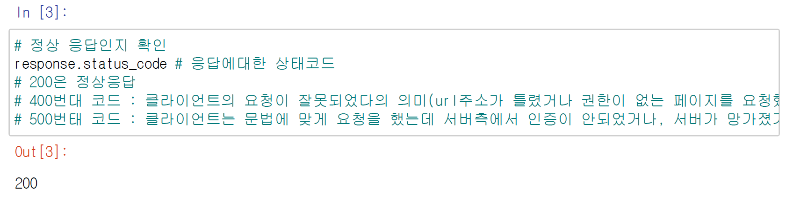
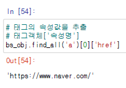

# 파이썬을 이용한 웹 데이터 수집 (크롤링) 실습!

1. 문서 내용 요청 후 읽어오기 `urllib` 패키지
   - `urlopen()` 접속
   - `read()` 데이터 읽어오기
   - text 속성을 사용해서 데이터 일어올 수도 있음
2. 문서에서 원하는 내용 추출하기(파싱)

- BeautifulSoup 패키지 사용 -find()/findAll()

## urllib 패키지 
- url을 넘겨주면 데이터를 텍스트 형태로 반환 (기본 내장 패키지)
  - urllib2, urllib3 다른 버전 사용
  - `requests` 패키지를 사용할 수도 있음

---
- `import requests`:  HTTP 요청을 보내는 모듈

- `requests.get(url)`: urllib의 open()과 read()를 한번에 진행 
  - URL 변수에 저장되어 있는 웹주소로 요청신호를 보냄
  - 서버(tistory)는 해당 페이지의 소스코드를 클라이언트로 전송하면서 응답하게 됨 
  - response 변수에는 http://www.tistory.com의 소스코드(html)가 저장되어 있음
  

  

## 파라미터 전달 방법
- 파라미터란?: 사이트의 문서를 요청할 때 서버로 전달되는 정보
- 함수의 파라미터 처럼 문서를 찾기 위한 정보나 명령을 수행하기 위한 정보를 같이 전달하게 되는데 그 정보를 파라미터라고 함
- 서버에 파라미터 전송방법
  - 파라미터 전송 방법은 url에 ? 뒤에 파라미터=값&파라미터2=값 으로 전송
    - 사이트에 따라서 잘못된 접속으로 인지하고 에러처리할 수 있음
  - 파라미터를 dict로 구성해서 get(params=dict)
- params = {'param1': 'value1', 'param2': 'value2'}
- res = requests.get(URL, params=params)

---

## urllib 패키지 사용한 소스 추출

## 문서에서 원하는 내용 추출하기 (파싱)

- html 문서에서 원하는 내용 추출
  - 필요한 내용만 추출
  - BeautifulSoup 라이브러리 사용
    - 태그 형식으로 된 text를 파싱할 때 사용
  - find()/findAll() 등 함수 사용

### BeautifulSoup

- import bs4
- 데이터를 추출하는데 필요한 기능이 들어 있는 라이브러리 (파싱 라이브러리)
- 외부 라이브러리 : 설치해야 함
- 주피터는 기본 패키지임(설치하지 않아도 됨)
- 파이참 설치방법
    - File/Settings
    - Project Interpreter에서 bs4 검색
    - [Install Package]
---

- 응답객체인 html을 BeautifulSoup(응답객체, 파서기) 함수에 전달
- 'html.parser' = 'lxml'
    - text 형태인 html을 dataframe의 형태인 html로 반환 

## BeautifulSoup 패키지의 파싱 함수

- find(태그,[{속성명:속성값}])
    - 지정한 태그 중 첫번째 만나는 태그만 추출 또는 지정한 태그 중 해당 속성과 속상값을 갖고있는 태그의첫번째 태그
- findAll(태그,[{속성명:속성값}])
    - 지정한 태그 모두 찾아서 추출
    - 첫번째 이외의 태그를 추출할 때 사용
    - list 형태로 반환
- find_all(태그,[{속성명:속성값}])  
    - findAll 함수와 동일

---

- .text = .get_text()

---

- class 

- 모두 class: reply를 반환

- .text 만 붙이면 같은 text를 반환한다 

- 4개 모두 output이 같다 

---

- id

### bs4 형제 노드 찾기

- next_sibling: 다음 태그를 반환

### 속성값 추출하기
####  a 태그의 href 속성 

- 속성값 url을 찾아서 출력하라

- text 출력

- pandas 이용해서 dataframe 만듬

---

- 이 방법으로도 가능
  

- findAll()
  

- select(): 해당 태그를 모두 찾아서 `list`로 반환 
  

- 중복된 div가 많다 

- 그래서 div를 id로 찾아야 한다
  - div는  id로 자세하게 구분되어 있다 

- div 안에서 ul를 찾는다 
- `>`를 쓰면 자손만 찾게 되고
- `공백`은 자손 + 손자가 출력됨
    - 부모, 자손, 손자
  

- id: wrap

- 5가 반환되는 이유

- .class

# 웹 크롤링 시 주의 사항
- 웹 사이트는 언제든지 변경 될 수 있기 때문에 지금 실행하는 코드가 실행되지 않을 수 있다. 

