# Selenium 
## 정의
- 동적 web 페이지 크롤링을 하게 도와준다 
- selenuim 라이브러리 import
- driver -> chromedriver 프로그램 설치
- 웹 자동화
  - 컴퓨터가 id password를 치고 로그인 하게 해 준다.
- 분석/추출 
  1. BS
  2. selenium의 메서드

## 방법

1. Install Selenim and Chrome Driver
2. Selenium의 기본 사용법

## 1. Install Selenium and Chrome Driver

- `!pip install selenium`

- `from selenium import webdriver`
  
- 브라우저 열기 1: 직접 드라이버의 경로를 지정하여 실행 

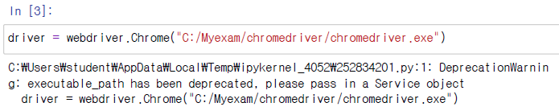

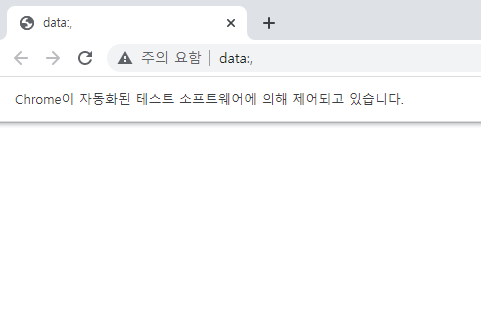

- 브라우져 열기 2: 
    - 환경변수 설정이 되어 있는 상태에서 실행
    - 드라이버 파일이 같은 디렉토리에 있는 경우에 실행

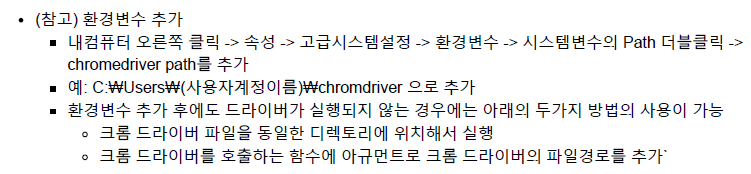

` # driver = webdriver.Chrome()`

## 2. Selenium의 기본 사용법 

1. 셀레니움이란?
2. 웹 드라이버 객체 만들기 및 페이지 이동
3. 윈도우 사이즈 조절
4. 브라우져 스크롤 이동
5. Alert 다루기
6. 입력창에 문자열 입력하기
7. 버튼 클릭하기
8. 텍스트 데이터 가져오기
9. 속성 데이터 가져오기
10. 윈도우 및 브라우져 종료하기

### 2.1 셀레니움이란?

- 셀레니움은
http://www.seleniumhq.org/ (http://www.seleniumhq.org/)
웹페이지에서 자세한 내용과 사용법을확인하실수 있습니다.
- 셀레니움은 브라우져를 자동화하는 툴으로 테스팅을 목적으로 웹 어플리케이션을 자동화하는 목적으로 만들어졌지만 테스팅에 국한되서 사용 되지는 않습니다.
- 웹 기반의 작업들을 자동화하여 업무 효율성을 높일수 있으며 다양한 언어와 다양한 브라우져를 지원합니다.
- http://www.seleniumhq.org/about/platforms.jsp (http://www.seleniumhq.org/about/platforms.jsp)
웹 페이지에서 지원하는 브라우져와 지원하는 OS와 지원하는 언어를 확인하실수 있습니다.
- 셀레니움은 Firefox, Internet Explorer, Safari, Opera Chrome 브라우져를 지원합니다.
- 지원하는 OS로는 Microsoft Windows, Apple OS X, Linux를 지원하며, 지원하는 언어는 C#, Haskell, Java,Javascript, Object-C, Perl, PHP, Python, R, Ruby를 지원합니다.

### 2.2 웹 드라이버 객체 만들기 및 페이지 이동
- driver의 get 함수를 이용하여 크롬 브라우져에서 페이지를 이동할수 있습니다.
- 아래의 코드는 naver웹 페이지로 이동합니다.
- url은 http를 꼭 포함해야 합니다

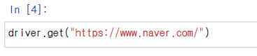

### 2.3 윈도우 사이즈 조절
- driver의 set_window_size 함수를 이용하여 윈도우 사이즈를 조절할수 있습니다.
- 함수내의 첫번째 파라미터는 가로 사이즈를 나타내며 두번째 파라미터는 세로 사이즈를 나타냅니다.
- 사이즈의 단위 는 픽셀입니다.

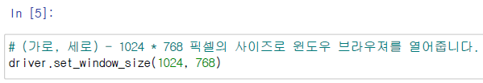

### 2.4 브라우져의 스크롤 위치 이동
- 브라우져의 스크롤 위치 이동은 selenium의 webdriver에 따로 기능이 없기 때문에 javascript 코드를 실행 하여 브라우져 스크롤 위치를 이동시킬수 있습니다.
- javascirpt의 window.scrollTo 함수의 첫번째 파라미터는 가로축 위치를 나타내며 아 래 코드와 같이 200으로설정을 하면 왼쪽에서 200픽셀만큼의 브라우져 스크롤 위치를 이동함을 의미합니다.
- 두번째 파라미 터는 세로축의 위치를 나타내며 아래의 코드와 같이 300으로 지정을 하면 위에서 아래로 300픽셀 만큼 스크롤이 내려감을 의미합니다.

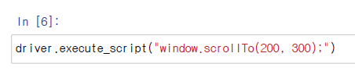

### 2.5 Alert 다루기
- 크롤링이나 자동화를 하는 중간에 alert 메시지가 나오는 경우가 있습니다.
- 이럴때 크롤링이나 자동화를 계속 하게 하기 위해 alert 메시지를 다룰줄 알아야 합니다

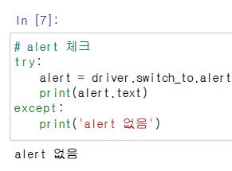

- alert 임의로 실행시켰을 때

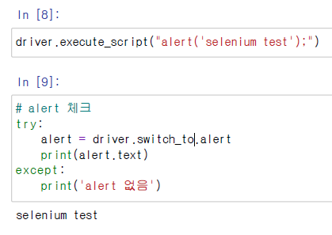
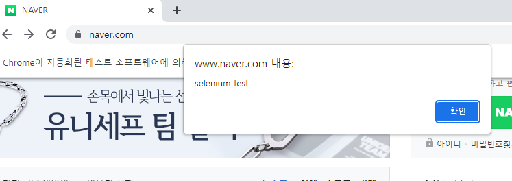

- 확인 버튼 누르기

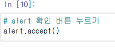

### 2.7 버튼 클릭하기
- selenium driver의 css selector와 click 함수를 이용하여 웹페이지의 input 태그에 문자열을 입력할수 있습니다.

- 돋보기 (검색 버튼) 누름 
  
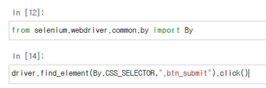

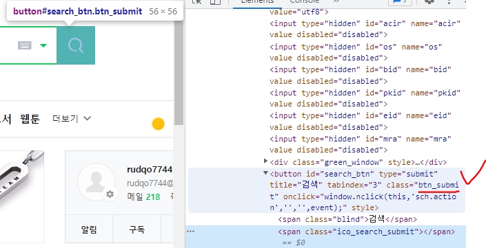

### 2.8 텍스트 데이터 가져오기
- text 변수를 사용
- find_element(By.CSS_SELECTOR,'classname'): 여러개의 엘리먼트를 선택
- find_elements(By.CSS_SELECTOR,'classname'): 여러개의 엘리먼트를 선택

- 메인 베너 타이틀 가져오기

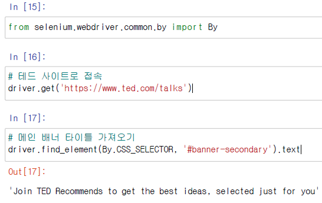

- 컨텐츠 리스트 제목 가져오기

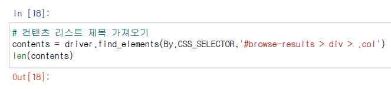

- 첫번째 컨텐츠 제목 가져오기

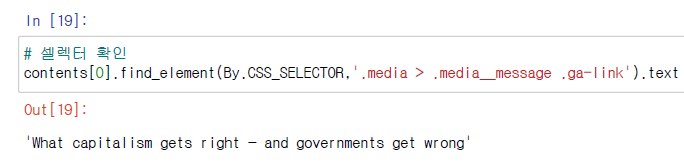

- 전체 컨텐츠 제목 가져오기

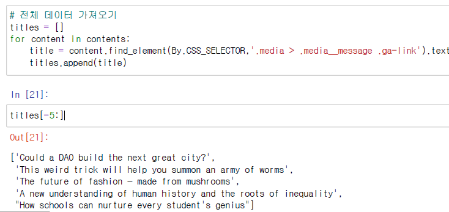

- 언어 옵션 리스트 출력

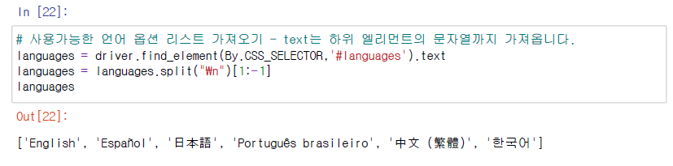

- 한국어 선택 후 결과 컨텐츠 제목 가져오기
  
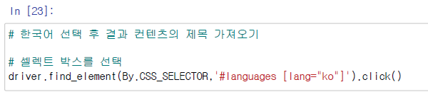

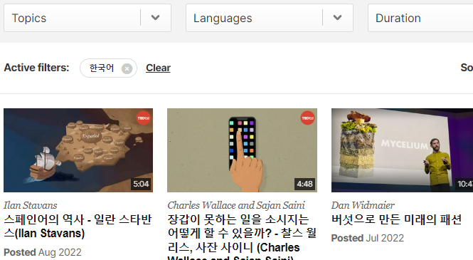

- 과부화를 방지하기 위해 time 을 들여 가져오기

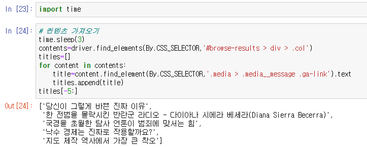

### 2.9 속성 데이터 가져오기
- get_attribute 함수를 이용

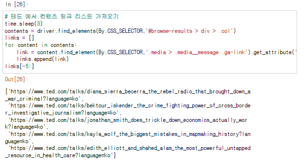

### 2.10 윈도우 및 브라우져 종료하기
selenium dirver의 quit 함수를 이용하여 윈도우 창을 닫을수 있습니다

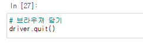

## 네이버 기사 크롤링

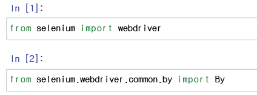

- 원하는 페이지로 이동해서 기사 제목 크롤링 하는 함수

.png)

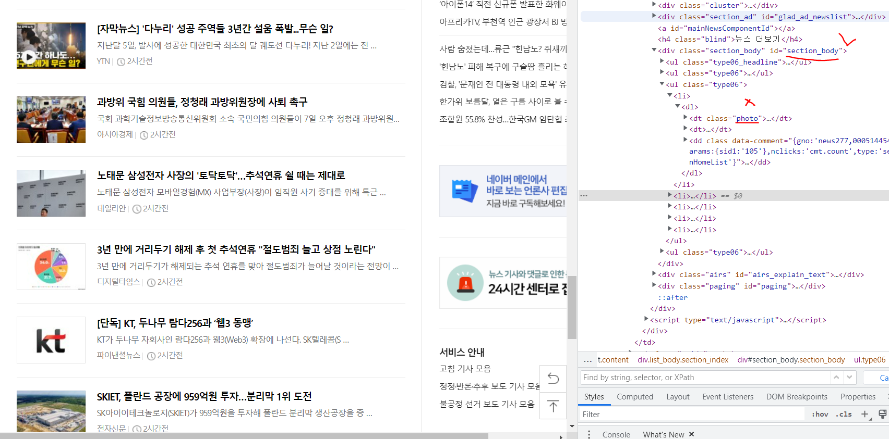

- 페이지 1~5 까지 자동으로 크롤링
  - %% time: 걸린 시간을 출력

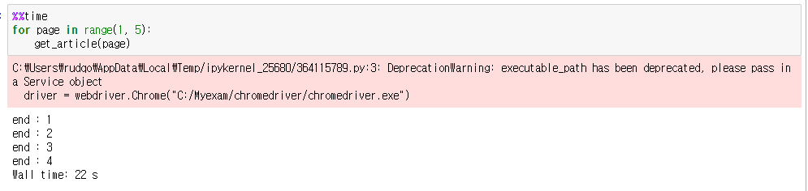

- 가져온 기사 제목 출력

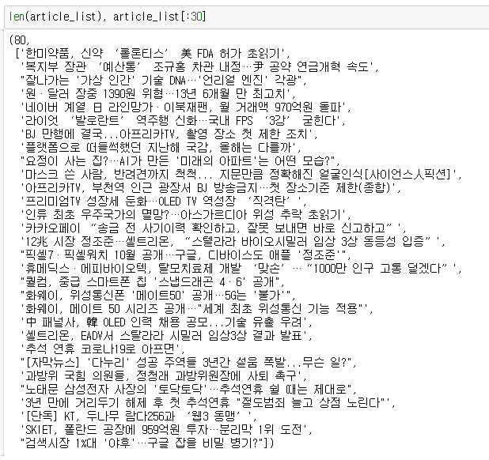

- Pandas로 DataFrame 만들기

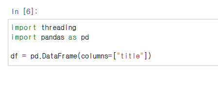

- `df.loc[len(df)] = {"title":title}`: DataFrame에 추가하기

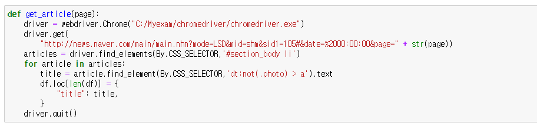

- 1~5 페이지까지 실행

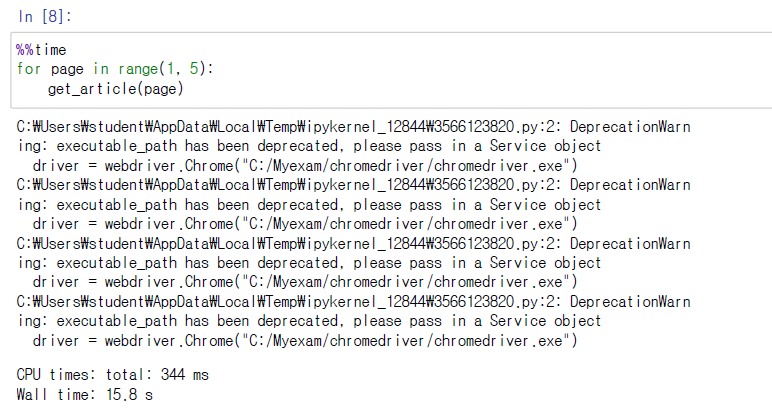

- 출력

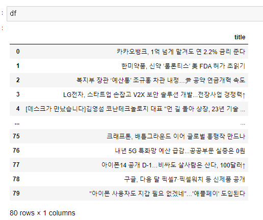

- csv 파일로 저장

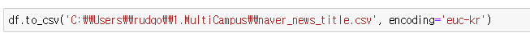

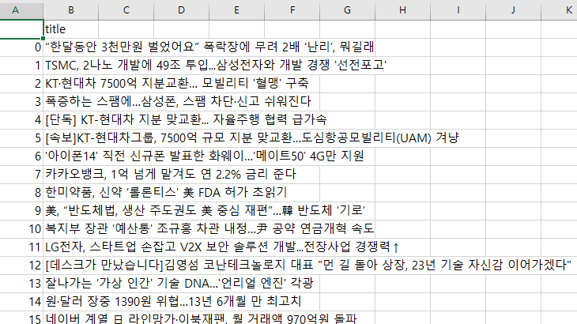