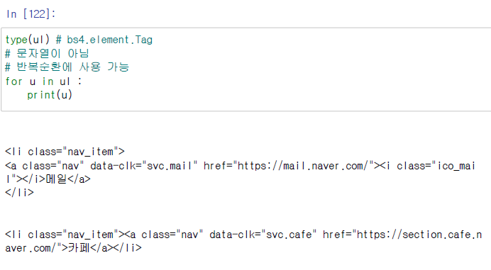
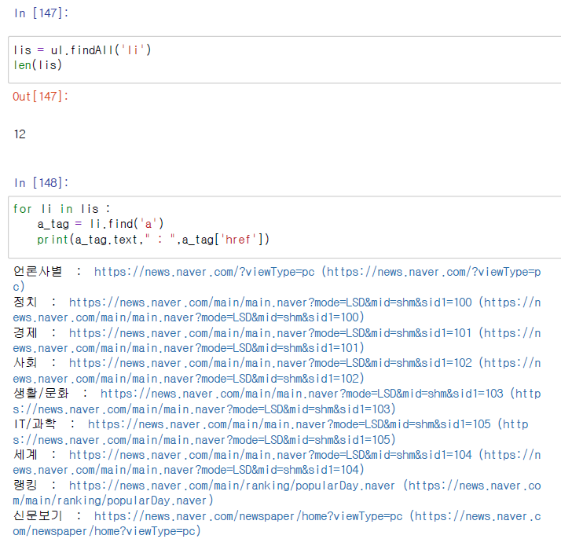

# 사이트 웹크롤링

1. 사이트 분석 
   - 원하는 데이터 확인 --> 데이터 식별
     - 위치(HTML), 데이터 형식 
2. 설계: 수집 -> 분석 -> 추출 -> 가공 -> 저장 
3. 프로그램 구현
   - 파이썬: 라이브러리 import --> 메서드() / 함수선언 --> 함수호출 

## 사이트 분석
1. 네이버 메뉴 (메뉴명 url)

2. 네이버 뉴스에서 (title, 내용(기사))
3. 네이버 뉴스 메뉴 (뉴스메뉴명, url)

## 설계
1. 수집: requests.get() or urllib urlopen()
2. 분석: bs4.BeautifulSoup 
   - 파싱: html.parser
3. 추출: find() or select()
   - 속성: ['href']
   - div -> ul -> li or
   - class 값 id 값
4. 가공: DataFrame `pandas`
5. 저장: csv  `.to_csv(파일 경로, 이름, encoding=euc-kr)`
- 함수, 반복문, 조건문 

## 프로그램 구현 

### 네이버 베너 크롤링

- 네이버 전체 메뉴 크롤링

- 수집한 데이터를 cvs로 저장
  1. 항목별로 list에 저장
  2. 항목들을 dict로 구성
  3. dict를 데이터프레임으로 생성
  4. 데이터프레임을 csv로 저장

### 네이버 뉴스 크롤링 
- 네이버 뉴스는 네이버 정책에 따라 모든 언론사들의 뉴스가 랜덤하게 배치됨
    - 단, 로그인 후 구독을 추가하면 구독한 언론사들의 뉴스가 나옴
    - 헤드라인 뉴스는 표면적으로는 제공되지 않는다

### 네이버 뉴스섹셩 메뉴와 섹션별 url 추출

