# 미니 프로젝트: 각 음악차트 top 100 곡정보 가져오기

1. 웹 사이트 (대상 사이트) 분석
   - 데이터 식별(데이터 내용, 위치, 형식 등)

2. 수집, 분석, 추출, 가공, 저장 !설계!

3. 프로그램 (파이썬) 구현 --> 라이브러리 (BS, SELE)

## 1. 웹 사이트 분석

### 멜론

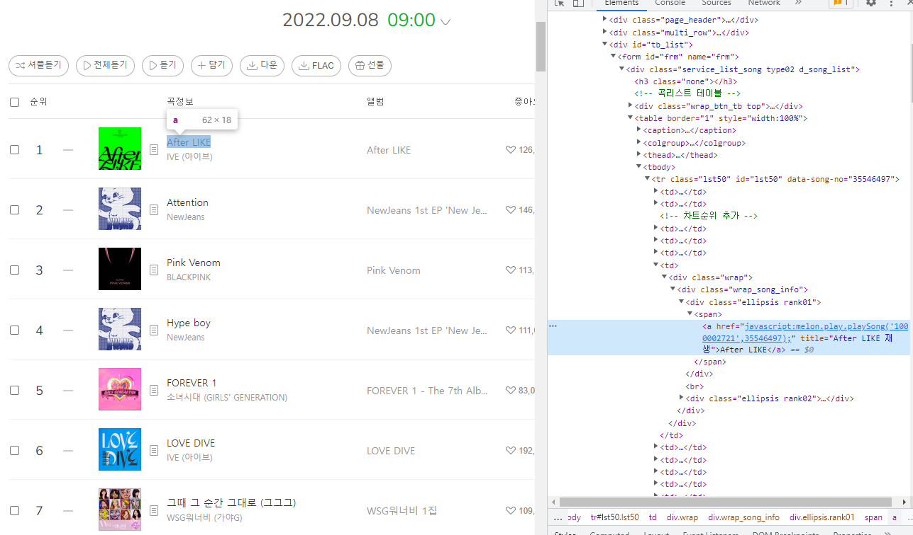

div id='tb_list' > tr class='lst50 > div class="wrap t_center (순위) > div class='ellipsis rank01' (곡 이름) > div class='ellipsis rank02' (가수) 

## 2. 수집, 분석, 추출, 가공, 저장 !설계!

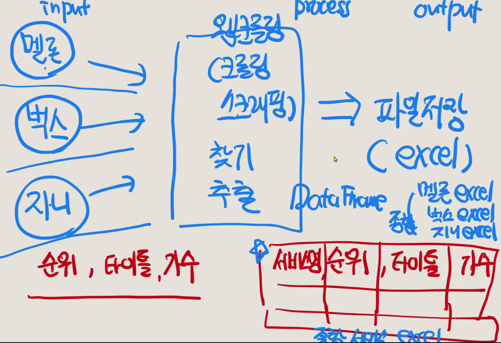

## 3. 프로그램 (파이썬) 구현

### 멜론 크롤링 결과를 엑셀로 저장하기

1. Selenium 으로 driver 실행하고 BS로 html 파싱
   
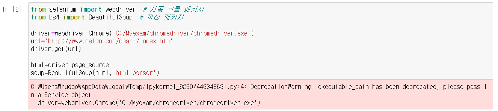

2. 반복문을 이용해 곡과 가수명을 song_data에 저장하기

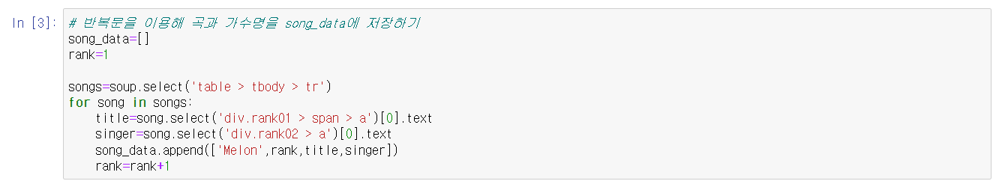

- table 안에 있는 100 개의 tr로 for loop를 돌린다

    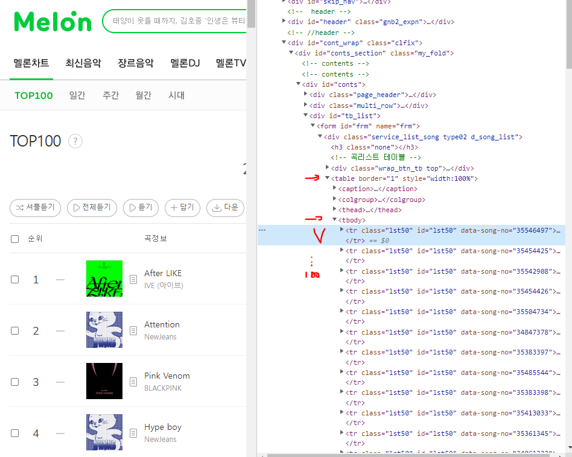

- 각 class 의 곡 정보(제목,가수)를 text로 가져온다
- rank는 for loop에서 따로 더해서 리스트에 추가

    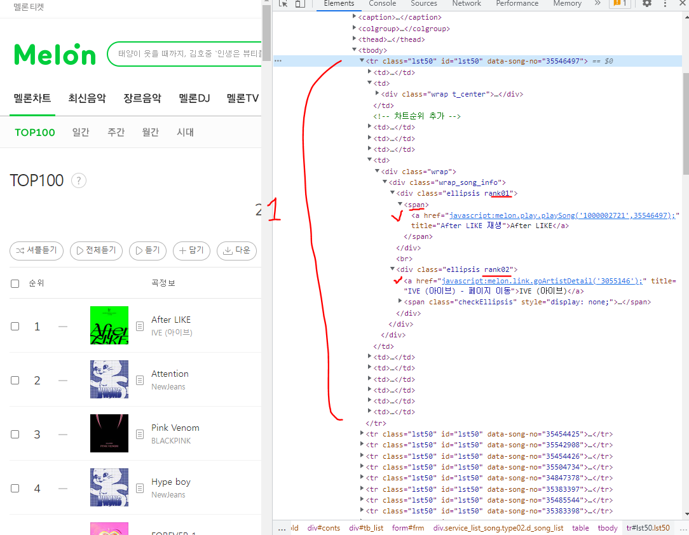

- rank01만 쓰고 앞을 생략하는 이유는 select를 쓸때 공백이 들어가면 같은 이름이 아니라 하위 태크로 인식하기 때문이다
  - 그래서 앞의 이름을 빼고 뒤에꺼만 빼서 쓸 수 있다. (다른 class에서 rank01을 쓰는게 없으면)
  - 아니면 find()를 써라

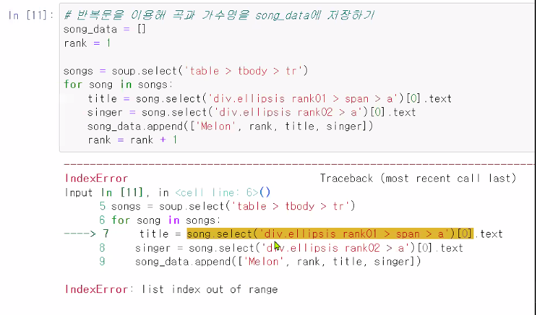

    - 그래서 에러가 난다

1. song_data 리스트를 이용해 데이터프레임 만들기

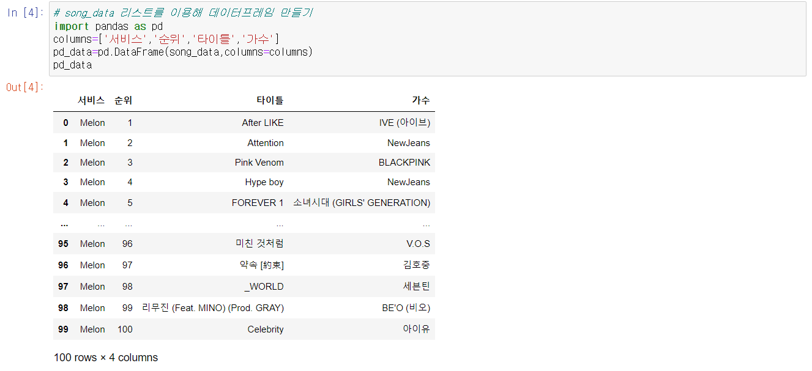

- columns 이름을 만들고 데이터 기입

4. 크롤링 결과를 엑셀파일로 저장하기

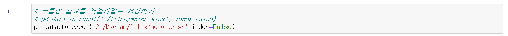


### 벅스 크롤링 결과를 엑셀 파일로 저장하기 

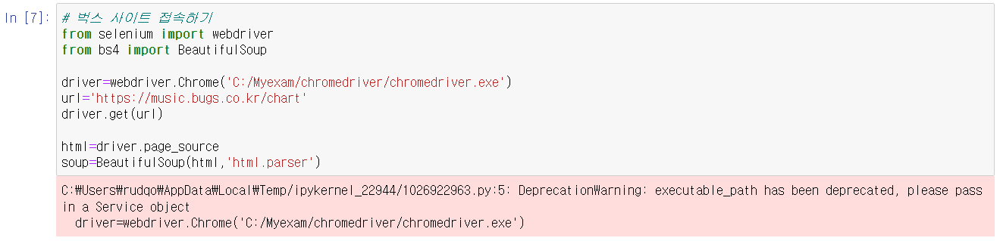


1.  단계별 태그로 곡 정보 찾기

- 자세하게 태그 경로를 설정해야 한다
  
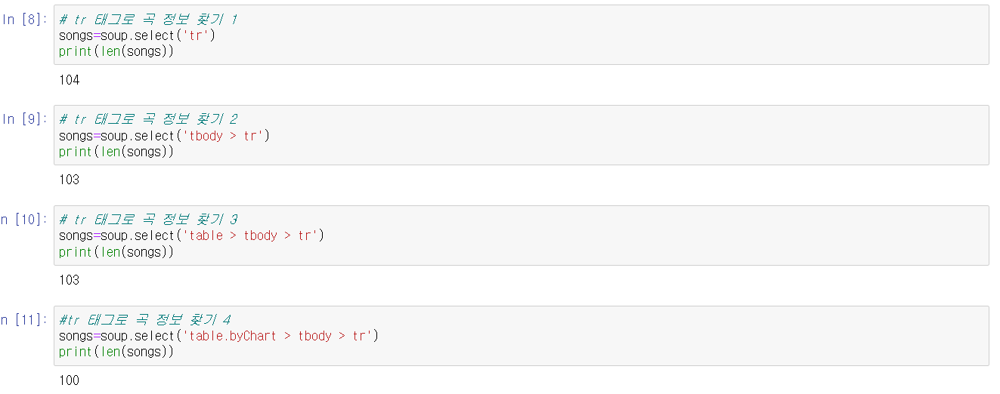

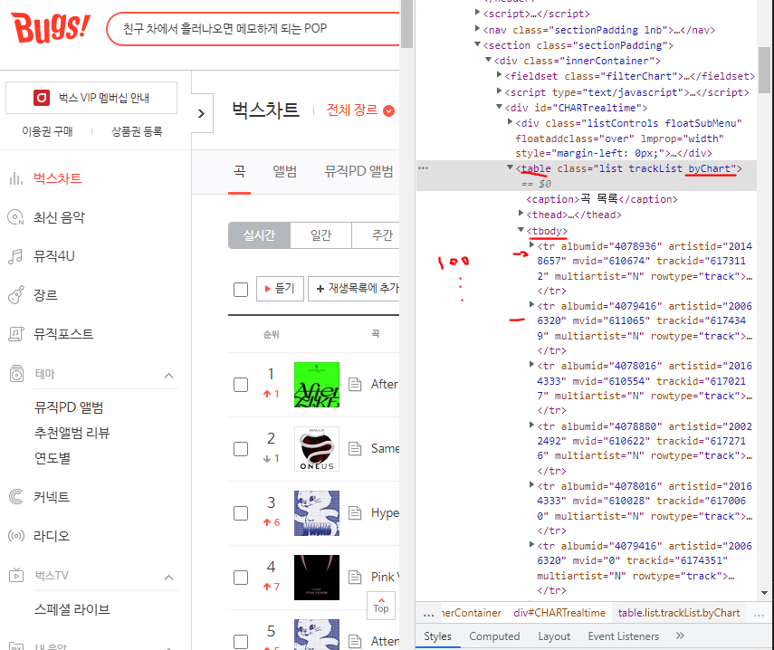

2. 단계별 벅스 사이트에서 곡 제목 찾기 

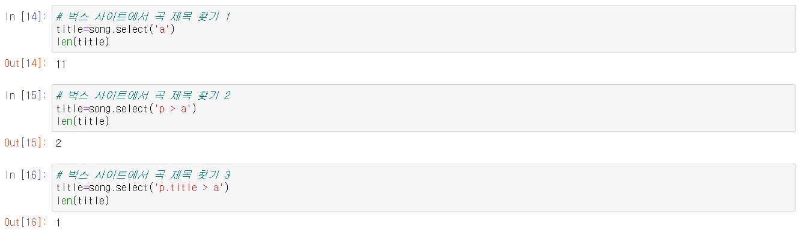

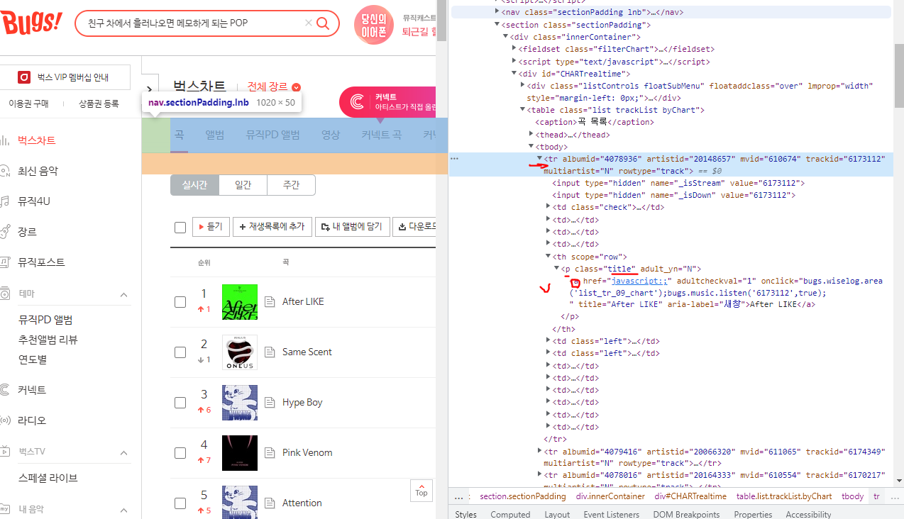

- 정보 출력

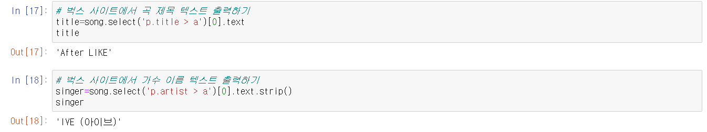

3. 벅스 100위 노래 순위 정보 가져오기

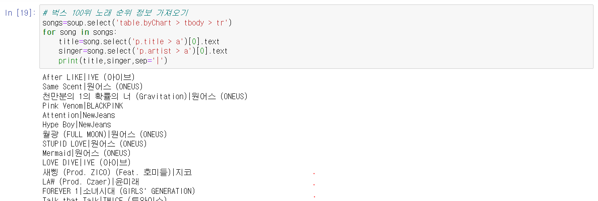

4. 반복문을 이용해 곡과 가수명을 song_data에 저장하기

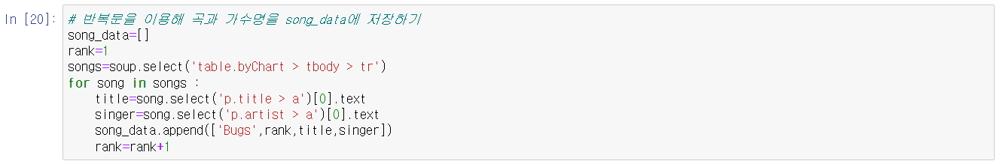

5. song_data 리스트를 이용해 데이터프레임 만들기

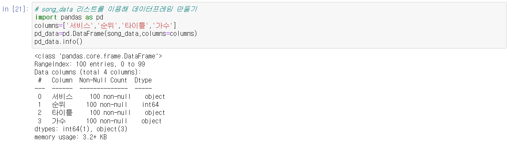

6. 크롤링 결과를 엑셀 파일로 저장하기

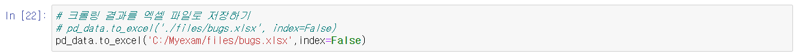

7. 벅스 인기차트를 크롤링한 결과를 엑셀 파일로 저장하기(전체 코드)

```python
from selenium import webdriver
from bs4 import BeautifulSoup
import pandas as pd

driver=webdriver.Chrome('C:/Myexam/chromedriver/chromedriver.exe')
url='https://music.bugs.co.kr/chart'
driver.get(url)

html=driver.page_source
soup=BeautifulSoup(html,'html.parser')

song_data=[]
rank=1
songs=soup.select('table.byChart > tbody > tr')
for song in songs:
    title=song.select('p.title > a')[0].text
    singer=song.select('p.artist > a')[0].text
    song_data.append(['Bugs',rank,title,singer])
    rank=rank+1
    
columns=['서비스','순위','타이틀','가수']
pd_data=pd.DataFrame(song_data,columns=columns)
# pd_data.to_excel('./files/bugs.xlsx', index=False)
pd_data.to_excel('C:/Myexam/files/bugs.xlsx',index=False)
```

### 지니 크롤링 결과를 엑셀 파일로 저장하기 

1. 지니 사이트에 접속하기

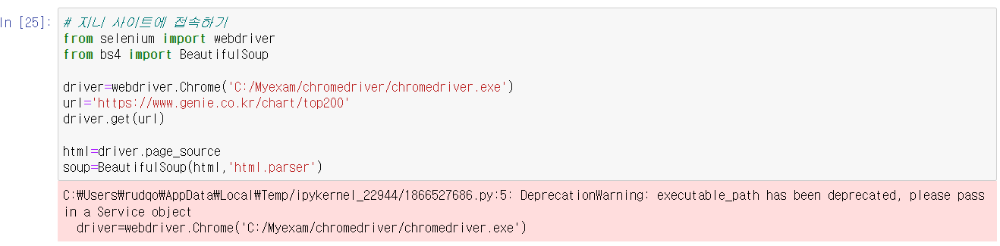

2. 지니 사이트에서 곡 정보 찾기

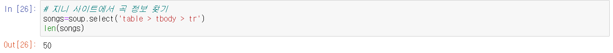

3. 지니 사이트에서 곡 제목 찾기

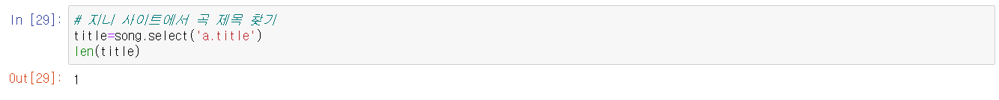

- 개행문자 strip()

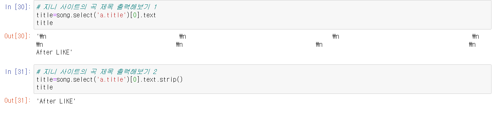

4. # 지니 사이트의 가수명 출력해보기 

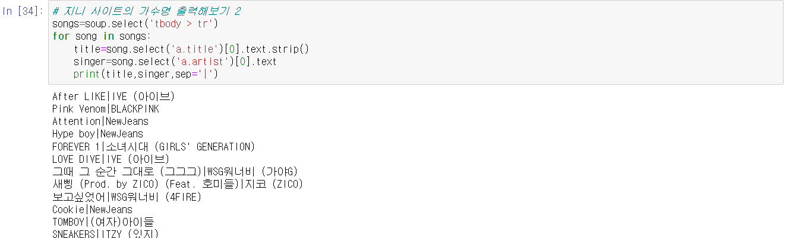

5. 반복문을 이용해 곡과 가수명을 song_data에 저장하기

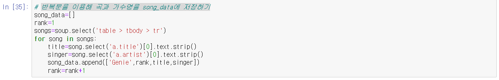

6. song_data 리스트를 이용해 엑셀 파일로 저장하기

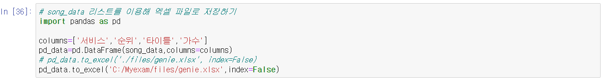

7. 지니 인기차트를 크롤링한 결과를 엑셀 파일로 저장하기(전체코드)

```python
from selenium import webdriver
from bs4 import BeautifulSoup
import pandas as pd

driver=webdriver.Chrome('C:/Myexam/chromedriver/chromedriver.exe')
url='https://www.genie.co.kr/chart/top200'
driver.get(url)

html=driver.page_source
soup=BeautifulSoup(html,'html.parser')

song_data=[]
rank=1
songs=soup.select('tbody > tr')
for song in songs:
    title=song.select('a.title')[0].text.strip()
    singer=song.select('a.artist')[0].text
    song_data.append(['Genie',rank,title,singer])
    rank=rank+1
    
columns=['서비스','순위','타이틀','가수']
pd_data=pd.DataFrame(song_data,columns=columns)
# pd_data.to_excel('./files/genie.xlsx', index=False)
pd_data.to_excel('C:/Myexam/files/genie.xlsx',index=False)
```

### 멜론, 벅스, 지니 크롤링 엑셀 파일 통합하기

1. 크롤링 결과가 담긴 엑셀 파일 통합하기
   
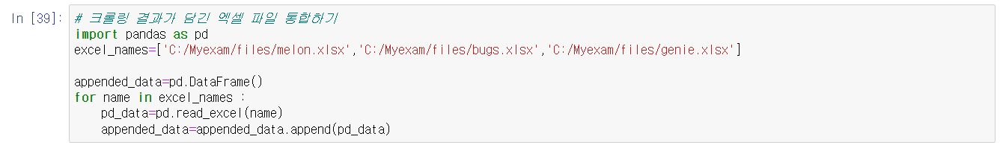

2. 크롤링 결과 확인하기

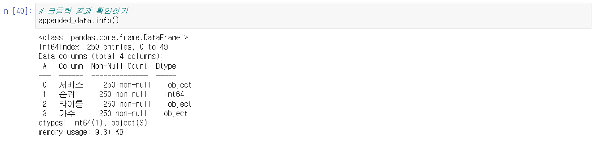

3. 통합한 크롤링 결과를 엑셀 파일로 저장하기

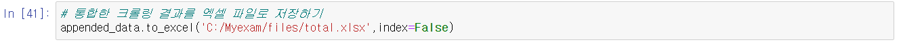

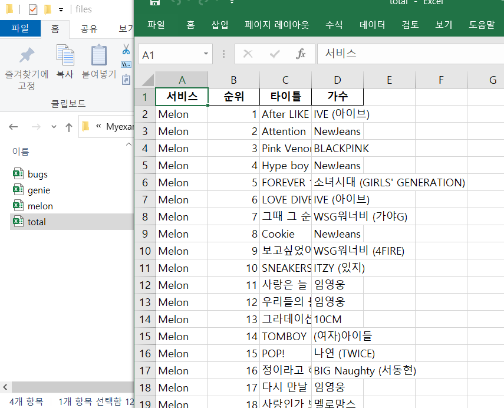