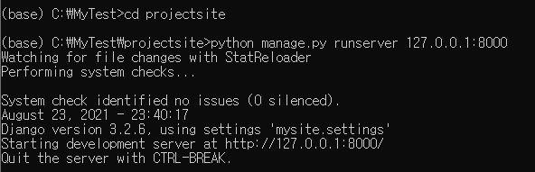

# Django 웹 프레임워크

## 복습

### 웹프로그램

- 요청 응답 프로토콜: HTTP / HTTPS
- 웹 클라이언트 에서 request
  - URL + PARAM
  - 브라우저
- 웹 서버에서 에서 response 
  - HTML(결과내용 응답)
  - 사이트 홈페이지 서버 

### 웹 서버 프로그램 

- 웹 서버 
  - 웹 클라이언트에서 온 url + parm 요청을 분석 및 요청 전달
  - 요청 결과 내용 html로 변환 (렌더링) 및 클라이언트 보냄
- 웹 애플리케이션 서버 
  - 요청 내용 수행 
  - 요청 결과 내용 보냄
- DB
  - 요청 결과 보냄  

### 장고 프레임워크

- 웹 서버 프로그램을 파이썬으로 만들고 다루기
- 일반적: MVC 패턴 (model (DB) - view (template) - controller (기능))
- 파이썬으로 만드는 장고 MVT 패턴 (model (DB) - view (기능) - template (viewer)) 
  - DB: sqlite3
  - 기능: 함수 & 클래스 메서드
  - viewer: HTML (데이터를 렌더링한)
---

## 장고 MVT 패턴 

- 웹 클라이언트
  - reqeust를 하면 URLcoㅜf 가 view로 요청을 보냄

- view
  - model에게 C.R.U.D 를 요청
  - 탬플릿 렌더링
  - 웹 클라이언트로 response 

- model
  - DB와 ORM (클래스 형태) 으로 상호 작용 

- template
  - 렌더링: 주어진 데이터로 태그를 기입해 html을 만든다

## MVT 코딩 순서

1. 프로젝트 뼈대 만들기
   - 명령어로 틀을 만든다
   - 프로젝트 및 앱 개발를 위한 디렉토리와 파일 생성 
2. 모델 코딩
   - DB에 관련된 테이블 생성 - 객체
3. URLconf 코딩
   - URL 및 view 매핑 (정의)
   - index.html
4. 템플릿 코딩
   - 화면 UI 개발 
   - .html 만들기 (index.html)
5. 뷰 코딩하기
   - 기능, 로직 개발 

## Django 웹 프레임워크의 일반적인 특징

- MVC 패턴 기반 MVT (웹서버를 구현하는 프레임워크)
  - 장고는 MVC (Model-view-controller)를 기반으로 한 프레임워크
  - 장고에서는 View를 Template, Controller를 View라고 함
- 객체 관계 매핑
  - 장고의 객체 관계 매핑 ORM (Object-Relational Mapping)은 데이터베이스 시스템과 데이터 모델 클래스를 연결시키는 다리와 같은 역활 
  - 장고 프레임워크가 내부적으로 mysql에 가서 처리를 자동으로 해준다 

- 자동으로 구성되는 관리자 화면
  - 장고는 웹 서버의 콘텐츠 , 즉 데이터베이스에 대한 관리 기능을 위하여 프로젝트를 시작하는 시점 에 기본 기능으로 관리자 화면을 제공
  - 회원 관리
- 우안한 URL 설계
    - 웹 프로그래밍에서 URL 디자인은 필수인데 , 장고에서는 유연하면서도 강력한 기능을 제공 . 장고에서는 우아한 Elegant URL 방식을 채택하여 URL 을 직관적이고 쉽게 표현

- 자체 탬플릿 시스템
  - 장고는 내부적으로 확장이 가능하고 디자인이 쉬운 강력한 템플릿 시스템을 갖고 있음 . 
  - 이를 통해 화면 디자인과 로직에 대한 코딩을 분리하여 독립적으로 개발 진행
- 캐시 시스템
  - 동적인 페이지를 만들기 위해서 데이터베이스 쿼리를 수행하고 템플릿을 해석하며, 관련 로직을 실행해서 페이지를 생성하는 일은 서버에 엄청난 부하를 주는 작업

- 다국어 지원
    - 다국어 장고는 동일한 소스코드를 다른 나라에서도 사용할 수 있도록 텍스트의 번역, 날짜 시간 숫자의 포맷 , 타임존의 지정 등과 같은 다국어 환경을 제공
- 소스 변경사항 자동 반영
    - 장고에서는 py 파일의 변경 여부를 감시하고 있다가 변경이 되면 실행 파일에 변경 내역을 바로 반영

## 장고에서의 애플리케이션 개발 방식

- 웹 사이트의 전체 프로그램 또는 모듈화된 단위 프로그램을 애플리케이션
- 즉, 프로그램으로 코딩할 대상을 애플리케이션이라고 부름
- 사이트에 대한 전체 프로그램을 프로젝트 (project) 라고 함
- 모듈화된 단위 프로그램을 애플리케이션 (application) 이라 부름

### MVC 패턴 기반 MVT
- 일반적인 MVC 패턴
- 개발시 일반적으로 언급되는 MVC(Model View Controller) 패턴이란 데이터 Model, 사용자 인터페이스 View, 데이터를 처리하는 로직 Controller 을 구분해서 한 요소가 다른 요소들에 영향을 주지 않도록 설계하는 방식

- 장고의 MVT 패턴
- View를 Template, Controller 는 View 라고 표현
- MVC 대신에 MVT(Model View Template) 패턴이라고 함
- 모델(Model): 데이터베이스에 저장되는 데이터를 의미
- 템플릿(template): 사용자에게 보여지는 UI 부분
- 뷰(view): 실질적으로 프로그램 로직이 동작하여 데이터를 가져오고 적절하게 처리한 결과를 템플릿에 전달하는 역할을 수행

- urlconf 라는 기준을 따라서 view에서 분석을 한다
  - 예) 첫번째 페이지를 달라는 것
- 분석을 바탕으로 model에게 요청하면
- model이 db에서 데이터를 빼서 view에게 전달하면 
- template을 rendering 한다

### 장고 MVT 패턴

- 클라이언트로부터 요청을 받으면 URL.conf 를 이용하여 URL 을 분석
- URL 분석 결과를 통해 해 당 URL 에 대한 처리를 담당할 `뷰` 를 결정
- 뷰는 자신의 로직을 실행하면서 . 만일 데이터베이스 처리가 필요하면 `모델` 을 통해 처리하고 그 결과를 반환
- 뷰는 자신의 로직 처리가 끝나면 `템플릿` 을 사용하여 클라이언트에 전송할 HTML 파일을 생성
- 뷰는 최종 결과로 HTML 파일을 클라이언트에게 보내 응답

### Model 데이터베이스 정의 (models.py)
- 모델이란 사용될 데이터에 대한 정의를 담고 있는 장고의 클래스
- 장고는 ORM 기법을 사용하여 애플리케이션에서 사용할 데이터베이스를 클래스로 매핑해서 코딩할 수 있음
- 장고는 테이블 및 컬럼을 자동으로 생성하기 위해 필요한 많은 규칙

### URL.conf URL 정의 (urls.py)
- 파이썬의 URL 정의 방식은 전통적인 자바나 PHP 계열의 URL 보다 직관적이고 이해하기가 쉬움 .
- 이런 방식을 우아한 (Elegant URL) 이라고 부르는 것
- URL을 정의하기 위해서는 urls.py 파일에 URL 과 처리 함수 뷰 View 라고 부름 를 매핑하는 파이썬 코드를 작성하면 됨

### View 로직 정의 (view.py)
- 뷰는 웹 요청을 받아서 데이터베이스 접속 등 해당 애플리케이션의 로직에 맞는 처리를 하고 , 그 결과 데이터를 HTML 로 변환하기 위하여 템플릿 처리를 한 후에 , 최종 HTML 로 된 응답 데이터를 웹 클라이언트로 반환하는 역할
- 간단한 뷰 현재의 날짜와 시간 변환

### Template 화면 UI 정의 (*.html)
- 개발자가 응답에 사용할 **.html 파일을 작성하면 , 장고는 이를 해석해서 최종 HTML 텍스트 응답을 생성하고 , 이를 클라이언트에게 보내줌
- 클라이언트 보통 웹 브라우저 는 응답으로 받은 HTML 텍스트를 해석해 서 우리가 보는 웹 브라우저 화면에 UI 를 보여주는 것
- 템플릿 파일은 **.html 확장자를 가지며 , 장고의 템플릿 시스템 문법에 맞/게 작성
- 장고에서 템플릿 파일을 찾을 때는 TEMPLATES 및 INSTALLED_APPS 에서 지정된 앱의 디렉토리를 검색
- 이 항목들은 프로젝트 설정 파일인 settings.py 파일에 정의되어 있음

### MVT 코딩 순서
- 모델, 뷰 , 템플릿 셋 중에서 무엇을 먼저 코딩해야 하는지에 대해 정해진 순서는 없음
- MVT 방식에 따르면 화면 설계는 뷰와 템플릿 코딩으로 연결되고 , 테이블 설계는 모델 코딩에 반영 .
- 그렇기 때문에 독립적으로 개발할 수 있는 모델을 먼저 코딩하고 , 뷰와 템플릿은 서로 영향을 미치므로 모델 이후에 같이 코딩하는 것이 일반적

1. ## 프로젝트뼈대 만들기 : 프로젝트 및 앱 개발에 필요한 디렉토리와 파일 생성
2. ## 모델 코딩하기 : 테이블 관련 사항을 개발 (models.py (코딩), admin.py (설정) 파일)
3. ## URLconf 코딩하기 : URL 및 뷰 매핑 관계를 정의 (urls.py (전체&애플리케이션) 파일
4. ## 템플릿 코딩하기 : 화면 UI 개발 (templates/ 디렉토리 하위의 **.html 파일들)
5. ## 뷰 코딩하기 : 애플리케이션 로직 개발 (views.py 파일
장고에서의 애플리케이션 개발 방식

## 애플리케이션 설계

- index.html :최근에 실시하고 있는 질문의 리스트를 보여줌
- detail.html : 하나의 질문에 대해 투표할 수 있도록 답변 항목을 폼으로 보여줌
- results.html : 질문에 따른 투표 결과를 보여줌

- Question 테이블 설계

- Choice 테이블 설계

## 프로젝트 뼈대 만들기 

- 프로젝트 뼈대의 최종 디렉토리

- db.sqlite3: mysql, mongodb
- mysite: defualt
  - urls.py 코딩 
- polls: application
  - models.py 코딩
  - views.py 코딩
  - templates dir 만들기 
    - index.html
    - detail.html
    - results.html

### 프로젝트 뼈대 만들기 순서 명령

1.  `django admin startproject mysite` // mysite 라는 프로젝트를 생성함
2. `python manage.py startapp polls` // polls 라는 애플리케이션을 생성
3. `notepad settings.py` // 설정 파일을 확인 및 수정
4. `python manage.py migrate` // 데이터베이스에 기본 테이블을 생성
5. `python manage.py runserver` // 현재까지 작업을 개발용 웹 서버로 확인

### 프로젝트 생성
- mysite라는 프로젝트 만듬 

`(base) C:\MyTest>django admin startproject mysite`

- mysite 구성

- mysite 디렉토리 이름 변경
  
`(base) C:\MyTest>move mysite projectsite`

### 애플리케이션 생성
- 프로젝트 루트 디렉토리 projectsite 으로 이동해서 polls 라는 애플리케이션을 만드는 명령을 실행

`(base) C:\MyTest>cd projectsite`

`(base) C:\MyTest projectsite>python manage.py startapp polls`

- polls라는 애플리케이션 폴더 확인

`(base) C:\MyTest projectsite polls>dir`

### 프로젝트 설정 파일 변경

- 프로젝트에 필요한 설정 값들은 settings.py 파일에 지정
- settings.py 파일은 프로젝트의 전반적인 사항들을 설정해주는 곳으로 ,루트 디렉토리를 포함한 각종 디렉토리의 위치 , 로그의 형식 프로젝트에 포함된 애플리케이션의 이름 등이 지정되어 있음

- ALLOWED_HOSTS 항목을 적절하게 지정
    - ALLOWED_HOSTS = ['192.168.35.61', 'localhost', '127.0.0.1’]
    - 내컴을 쓰고 있으면 defualt 값을 사용하기에 변경 X
- 애플리케이션들은 모두 설정 파일에 등록 (polls 애플리케이션도 등록)
    - INSTALLED_APPS =[ ~, 'polls.apps.PollsConfig ’, ]

- 프로젝트에 사용할 데이터베이스 엔진
    - 장고는 디폴트로 SQLite3 데이터베이스 엔진을 사용하도록 설정
- 타임존 지정 기본은 세계표준시 (UTC) 로 되어 있음 . 한국시간을 변경
    - #TIME_ZONE = 'UTC'
    - TIME_ZONE = 'Asia/Seoul'

.png)

### 기본 테이블 생성
- migrate 명령은 데이터베이스에 변경사항이 있을 때 반영해주는 명령 
  - settings.py가 변경되었기에 실행 

`(base) C:\MyTest projectsite>python manage.py migrate`

### 작업 확인하기

- 프로젝트의 뼈대에 해당하는 프로젝트 디렉토리 , 애플리케이션 디렉토리를 비롯해 관련 파일들 그리고 사용자 및 그룹 테이블을 만들었음
- 확인을 위해서 웹 서버를 실행하고 , 그 웹 서버에 접속
- 장고에서는 개발 과정 도중에 현재 상태를 확인해볼 수 있도록 runserver 라고 하는 간단한 테스트용 웹 서버를 제공

- 웹 서버를 실행하기 위해서 다음 명령을 입력합니다 . 하나의 창에서 작업 해도 되지만 runserver 용으로 별도의 cmd 창을 열어 사용하는 것이 편리

`(base) C:\MyTest projectsite>python manage.py runserver 127.0.0.1:8000`

`(base) C:\MyTest projectsite>python manage.py runserver`

`(base) C:\MyTest projectsite>python manage.py runserver 0:8000`

- runserver가 정상적으로 실행되었다면 , 웹 브라우저를 열고 IP 주소는 runserver 가 동작하는 서버 IP 주소를 입력

`http://127.0.0.1:8000/`

### Admin 사이트 접속 

- 기본적으로 제공하는 Admin 사이트에 접속해서 테이블이 생성 확인
- 브라우저의 주소창에 IP 주소와 포트번호 동일 , URL 경로만 /admin 추가

`http://127.0.0.1:8000/admin`

- 로그인하려면 username, password 를 넣어야 되는데 아직 생성하지 않았음
- Admin 사이트에 로그인하기 위한 관리자 슈퍼유저 를 생성

`(base) C:/MyTest projectsite>python manage.py createsuperuser`

- http://127.0.0.1:8000/admin
- 로그인 창에서 username, password 입력

- 사용자 확인

- Admin 사이트에서 Users 와 Groups 테이블을 포함하여 새롭게 만들 테이블에 대한 데이터의 입력 , 변경 삭제 등의 작업을 할 수 있음
- Admin 화면에서 기본적으로 Users 와 Groups 테이블이 보이는 것은 이미 settings.py 파일에 django . contrib.auth 애플리케이션이 등록되어있기 때문
- 즉 장고에서 기본으로 제공하는 auth 앱에 Users 와 Groups 테이블이 미리 정의

### 골격 생성
- 애플리케이션을 MVT 패턴 방식으로 개발할 수 있도록 골격 생성
  
 `(base) C:/MyTest>tree /F projectsite` 

 