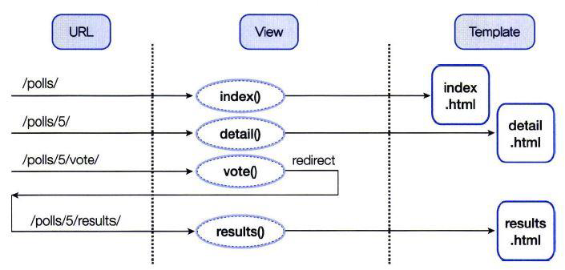
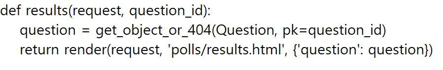

# Django 웹 프레임웨크 2

## 애플리케이션 개발하기 - Model 코딩 

### Model 코딩
- 모델 작업은 데이터베이스에 테이블을 생성하는 작업
1. `notepad models.py` // 테이블을 정의함 (클래스 생성)
2. `notepad admins.py` // 정의된 테이블이 Admin 화면에 보이게 함
3. `python manage.py makemigrations` // 데이터베이스에 변경이 필요한 사항을 추출함
4. `python manage.py migrate` // 데이터베이스에 변경사항을 반영함
5. `python manage.py runserver` // 현재까지 작업을 개발용 웹 서버로 확인함

### 테이블 정의

- polls 애플리케이션은 Question 과 Choice 두 개의 테이블이 필요
- 테이블은 `models.py` 파일에 정의

#### question table

#### choice table 

#### class 선언

### Admin 사이트에 테이블 반영

- models.py 파일에서 정의한 테이블도 admin 사이트에 보이도록 등록
  - admin 사이트에서 데이터를 더 편하게 입력 가능하게 하기 위해 등록
- `admin.py` 파일에 등록
   

- models.py 모듈에서 정의한 Question, Choice 클래스를 임포트 하고, admin.site.register () 함수를 사용하여 임포트 한 클래스를 Admin 사이트에 등록

### 데이터베이스 변경사항 반영 

- 테이블의 신규 생성 , 테이블의 정의 변경 등 데이터베이스에 변경이 필요
한 사항이 있으면 , 이를 데이터베이스에 실제로 반영해주는 작업
- 변경사항을 데이터베이스에 반영

`(base) C:/MyTest projectsite>python manage.py makemigrations`

- makemigrations 명령에 의해 polls/migrations 디렉토리 하위에 마이그레이션 파일들이 생김

- 마이그레이션 파일들을 이용해 migrate 명령으로 데이터베이스에 테이블을 생성

`(base) C:/MyTest projectsite>python manage.py migrate`

### 작업 확인 

- 정상적으로 잘 처리되었는지 확인하기 위해 Admin 사이트에 접속
- 하나의창에서 작업해도 되지만 runserver 용으로 별도의 cmd 창을 열어 사용하는 것이 편리

`(base) C:/MyTest projectsite>python manage.py runserver 127.0.0.1:8000`

`(base) C:/MyTest projectsite>python manage.py runserver`

`(base) C:/MyTest projectsite>python manage.py runserver 0:8000`

- Questions와 Choices 테이블을 만든 모델이 정상적으로 등록

### 데이터 입력

## 애플리케이션 개발하기 - View 및 Template

### 처리 흐름 설계
- 사용자에게 보여지는 페이지가 3개이므로, 3개의 템플릿 파일이 필요
- 127.0.0.1:8000/polls/ . . .

- url.py
- views.py
- template.py

- index
- detail
- vote 
- results

- URL/뷰 매핑을 URLconf 라고 하며 urls.py 파일에 작성

- 로직의 흐름상 URLconf 를 먼저 코딩한 후에 뷰 템플릿 또는 템플릿 , 뷰 순서로 코딩하는 것이 일반적

- urls.py 작성 // URLconf 내용을 코딩 !!!!
- views.index() 함수 작성 // index.html 템플릿도 같이 작성
- views.detail () 함수 작성 // d etail.htm l 템플릿도 같이 작성
- views.vote 함수 작성 // 리다이렉션 처리 들어있음
- view s.results0 함수 작성 // results.htm l 템플릿도 같이 작성

### URLconf 코딩

- URLconf 설계 내용에 따르면 , Admin 사이트까지 포함해서 5 개의 URL 과 뷰가 필요
- 전체 URLconf --> mysite

- urls.py(C:\MyTest projectsite mysite ) 파일에 코딩

- urls.py(C:\MyTest projectsite mysite polls) 파일에 코딩
- 각각의 설정 --> polls

### 템플릿

### views.py

### 뷰 함수 index() 및 템플릿 작성 

- 뷰함수와 템플릿은 서로에게 영향을 미치기 때문에 보통 같이 작업
- 내용을 구현하기 위해 템플릿 파일 index.html

- 내용을 구현하기 위해 템플릿 파일 index.html

- 위의 값의 결과는 아래값
- 템플릿 프로그램 언어를 쓴다 (파이썬하고 비슷)
  - ~문의 시작이 있으면 end~가 있어야 함

### 뷰 함수 detail() 및 템플릿 작성
- 3 개의 질문 중 하나를 선택했을 때 , 질문에 대한 답변 항목을 보여주고 투표하도록 하는 화면
- 템플릿 파일인 detail.html

- pollls\views.py 에 detail() 함수 작성

### 뷰 함수 vote() 및 리다이렉션 작성
- vote() 뷰 함수의 호출과 연계된 URL 은 detail.html 템플릿 파일에서받음
- vote 버튼을 누르면 vote() 뷰 함수가 호출되는 것
  - 리다이렉션: 다시 요청하는 것

- views.py 파일을 열고 vote() 뷰 함수의 내용 입력

### 뷰 함수 results() 및 리다이렉션 작성
- results() 뷰 함수의 호출과 연계된 URL 은 votes() 뷰 함수의 리다이렉트 결과
- 폼 데이터를 처리한 후에 그 결과를 보여주는 페이지로 리다이렉트시 켜주기 위해 votes() 뷰 함수에 실행

- views.py 파일을 열고 results() 뷰 함수의 내용을 추가

- 템플릿은 투표 결과로 각 질문마다 투표 카운트를 보여주는 화면
- 템플릿 파일 results.html

### 작업 확인하기
- 웹 서버를 실행하기 위해 하나의 창에서 작업해도 되지만 runserver 용으로 별도의 cmd 창을 열어 사용하는 것이 편리

`(base) C:\MyTest projectsite>python manage.py runserver`

- 웹 브라우저에서 http://127.0.0.1:8000/polls

