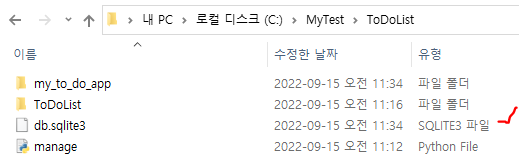
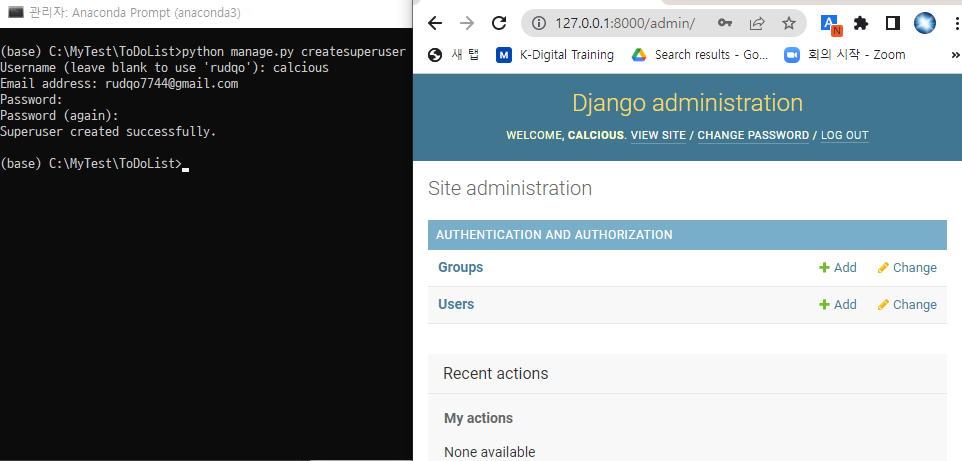
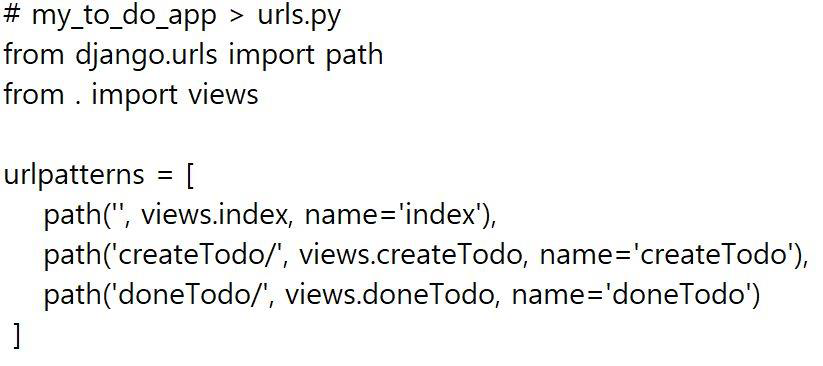
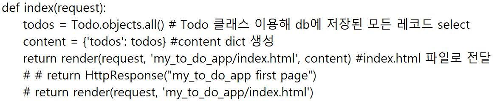

# Django 웹 프레임워크 프로젝트: To-Do-List 구현 


## 장고에서의 애플리케이션 개발 방식


### MVT 코딩 순서
- `프로젝트 뼈대 만들기`: 프로젝트 및 앱 개발에 필요한 디렉토리와 파일 생성
- `모델 코딩하기`: 테이블 관련 사항을 개발 (models.py (코딩), admin.py (설정) 파일)
- `URLconf 코딩하기`: URL 및 뷰 매핑 관계를 정의 (urls.py (2개: 전체&애플리케이션) 파일)
- `템플릿 코딩하기`: 화면 UI 개발 (templates/ 디렉토리 하위의 *.html 파일들)
- `뷰 코딩하기`: 애플리케이션 로직 개발 (views.py 파일)

### 프로젝트 뼈대 만들기 명령어 순서 
- **>** `django admin startproject ToDoList` // ToDoList 라는 프로젝트를 생성
- **>** `python manage.py startapp my_to_do_app` // my_to_do_app 라는 애플리케이션을 생성
- **>** `notepad settings.py` // 설정 파일을 확인 및 수정
- **>** `python manage.py migrate` // 데이터베이스에 기본 테이블을 생성 (데이터 베이스 변경시에만)
- **>** `python manage.py runserver` // 현재까지 작업을 개발용 웹 서버로 확인

### Model 코딩
- 모델 작업은 데이터베이스에 테이블을 생성하는 작업
- **>** `notepad models.py` // 테이블을 정의함
- **>** `notepad admins.py` // 정의된 테이블이 Admin 화면에 보이게 함
- **>** `python manage.py makemigrations` // 데이터베이스에 변경이 필요한 사항을 추출함
- **>** `python manage.py migrate` // 데이터베이스에 변경사항을 반영함
- **>** `python manage.py runserver` // 현재까지 작업을 개발용 웹 서버로 확인함

## 프로젝트 뼈대 만들기
### Anaconda Prompt 관리자 권한으로 실행 
- 원하는 directory로 이동

### 프로젝트 생성
- ToDoList 라는 프로젝트 만듬

`(base) C:\MyTest>django admin startproject ToDoList`


- ToDoList 구성


- 프로젝트 생성 완료


### 애플리케이션 생성
- 프로젝트 루트 디렉토리 ToDoList 으로 이동해서 my_to_do_app 라는 애플리케이션을 만드는 명령을 실행

`(base) C:\MyTest>cd ToDoList`

`(base) C:\MyTest ToDoList>python manage.py startapp my_to_do_app`


- my_to_do_app라는 애플리케이션 폴더 확인

`(base) C:\MyTest ToDoList my_to_do_app>dir`


- 앱 생성 완료

.png)

### 프로젝트 설정 파일 변경

- 프로젝트에 필요한 설정 값들은 settings.py 파일에 지정
- settings.py 파일은 프로젝트의 전반적인 사항들을 설정해주는 곳으로 , 루트 디렉토리를 포함한 각종 디렉토리의 위치 , 로그의 형식 프로젝트에 포함된 애플리케이션의 이름 등이 지정되어 있음


- ALLOWED_HOSTS 항목을 적절하게 지정
  - 내 서버에 접속할 수 있는 클라이언트를 설정
- ALLOWED_HOSTS = ['192.168.35.61', 'localhost', '127.0.0.1’]
  - 내컴은 티폴트 값이기에 빈칸으로 놔둠 
- 애플리케이션들은 모두 설정 파일에 등록
    - (my_to_do_app 애플리케이션도 등록)
    - INSTALLED_APPS =[ ~, 'my_to_do_app ’,]
- 프로젝트에 사용할 데이터베이스 엔진
- 장고는 디폴트로 SQLite3 데이터베이스 엔진을 사용하도록 설정
- 타임존 지정 기본은 세계표준시 ( 로 되어 있음 . 한국시간을 변경
    - #TIME_ZONE = 'UTC'
    - TIME_ZONE = 'Asia/Seoul'

#### 설정값
- ALLOWED_HOSTS
  
   

- 새로 만든 애플리케이션 파일 등록

   

- DB 엔진 설정
    - 기본 설정(sqlite3) --> 장고가 알아서 db 처리


- mysql로 db 변경 하려면... 


- 타임존 지정
  


### 기본 테이블 생성 

- migrate 명령은 데이터베이스에 변경사항이 있을 때 반영해주는 명령

`(base) C:\MyTest ToDoList>python manage.py migrate`


`(base) C:\MyTest ToDoList>dir`




### 작업 확인하기
- 프로젝트의 뼈대에 해당하는 프로젝트 디렉토리 , 애플리케이션 디렉토리를 비롯해 관련 파일들 그리고 사용자 및 그룹 테이블을 만들었음
- 확인을 위해서 웹 서버를 실행하고 , 그 웹 서버에 접속
- 장고에서는 개발 과정 도중에 현재 상태를 확인해볼 수 있도록 `runserver`라고 하는 간단한 테스트용 웹 서버를 제공

- 웹 서버를 실행하기 위해 하나의 창에서 작업해도 되지만 runserver 용으로 별도의 cmd 창을 열어 사용하는 것이 편리

`(base) C:\MyTest ToDoList >python manage.py runserver`


### Admin 사이트 접속


- 로그인하려면 username, password 를 넣어야 되는데 아직 생성하지 않았음
- Admin 사이트에 로그인하기 위한 관리자 슈퍼유저 를 생성

`(base) C:\MyTest ToDoList>python manage.py createsuperuser`

- superuser 계정 로그인 성공 



- 사용자 확인 


- Admin 사이트에서 Users 와 Groups 테이블을 포함하여 새롭게 만들 테이블에 대한 데이터의 입력 , 변경 삭제 등의 작업을 할 수 있음
- Admin 화면에서 기본적으로 Users 와 Groups 테이블이 보이는 것은 이미 settings.py 파일에 django . contrib.auth 애플리케이션이 등록되어있기 때문
- 즉 장고에서 기본으로 제공하는 auth 앱에 Users 와 Groups 테이블이 미리 정의

### 골격 생성 
- 애플리케이션을 MVT 패턴 방식으로 개발할 수 있도록 골격 생성

`(base) C:\MyTest>tree /F ToDoList`


## 애플리케이션 개발하기 - Model 코딩 
---
### Model 코딩
- 모델 작업은 데이터베이스에 테이블을 생성하는 작업
- **>** `notepad models.py` // 테이블을 정의함
- **>** `notepad admins.py` // 정의된 테이블이 Admin 화면에 보이게 함
- **>** `python manage.py makemigrations` // 데이터베이스에 변경이 필요한 사항을 추출함
- **>** `python manage.py migrate` // 데이터베이스에 변경사항을 반영함
- **>** `python manage.py runserver` // 현재까지 작업을 개발용 웹 서버로 확인함

### 테이블 정의 

- todo 테이블을 만들어서 models.py에 저장 
- my_to_do_app 애플리케이션은 Todo 테이블이 필요
- 테이블은 `models.py` 파일에 정의 


- 단 장고에서는 테이블을 class로 만든다


### Admin 사이트에 테이블 반영 

- models.py 파일에서 정의한 테이블도 admin 사이트에 보이도록 등록
- `admin.py` 파일에 등록


  - models.py 모듈에서 정의한 toDo 클래스를 임포트하고 , admin.site.register () 함수를 사용하여 임포트 한 클래스를 Admin 사이트에 등록


### 데이터베이스 변경사항 반영
 - 테이블의 신규 생성 , 테이블의 정의 변경 등 데이터베이스에 변경이 필요한 사항이 있으면 , 이를 데이터베이스에 실제로 반영해주는 작업
- 변경사항을 데이터베이스에 반영

`(base) C:\MyTest ToDoList>python manage.py makemigrations`


- makemigrations 명령에 의해 my_to_do_app/migrations 디렉토리 하위에 마이그레이션 파일들이 생김


- 마이그레이션 파일들을 이용해 migrate 명령으로 데이터베이스에 테이블을 생성

`(base) C:\MyTest ToDoList>python manage.py migrate`


### 작업 확인하기
- 웹 서버를 실행하기 위해 하나의 창에서 작업해도 되지만 runserver 용으로 별도의 cmd 창을 열어 사용하는 것이 편리

`(base) C:\MyTest ToDoList >python manage.py runserver`


- Todos 테이블을 만든 모델이 정상적으로 등록


## 애플리케이션 개발하기 - View 및 Template
---

### URLconf 코딩
- URLconf 설계 따르면 , Admin 사이트까지 포함해서 URL 과 뷰가 필요

- ***전체***
  - urls.py(C:\MyTest ToDoList ToDoList ) 파일에 코딩
  - urlpatterns = [ ~ path('', my_to_do_app.urls ’)), ~]


&nbsp;

- ***애플리케이션***
  - urls.py(C:\MyTest ToDoList my_to_do_app ) 파일에 코딩




### index 템플릿 작성

뷰함수와 템플릿은 서로에게 영향을 미치기 때문에 보통 같이 작업

- 애플리케이션에 템플릿 작성 


- 내용을 구현하기 위해 템플릿 파일 index.html
- HTTP 가 작성되어 있다 


### 뷰 코딩을 위한 기능 작성

- 애플리케이션에서 views.py 작성


&nbsp;

&nbsp;

&nbsp;


- 뷰 코딩을 위해 views.py 에 index() 함수 정의



- db 에 저장된 데이터를 index.html 파일로 전달해서 열기 

&nbsp;

&nbsp;

&nbsp;

- 뷰 코딩을 위해 views.py 에 기능 함수 정의


- createtodo: 데이터를 저장 
- todo: 데이터를 보여주고 저장하는 기능 

&nbsp;

&nbsp;

&nbsp;

### 작업 확인하기
- 웹 서버를 실행하기 위해 하나의 창에서 작업해도 되지만 runserver 용으로 별도의 cmd 창을 열어 사용하는 것이 편리

`(base) C:\MyTest ToDoList >python manage.py runserver`


### 작업 확인하기
- 웹 브라우저에서 http://127.0.0.1:8000


- 데이터 입력


- DB 에서 데이터 확인
  - 데이터 베이스 접속

`(base) C:\MyTest ToDoList>python manage.py dbshell`

sql 문
```sql
.tables
select * from my_to_do_app_todo;
```


- 1: 완료 - 보이지 않음
- 2: 미완료 - 보임