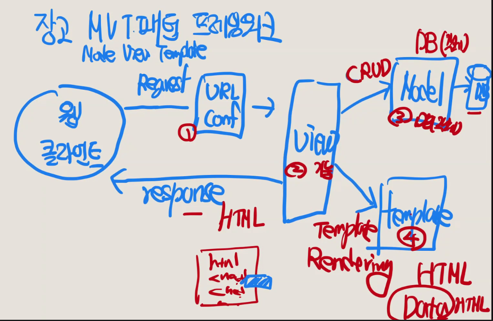
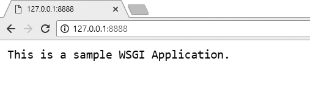

# 웹 프로그래밍

## Brainstorming

- pc 입장이 아닌 서버 입장에서 프로그래밍 한다 

- full stack
  - front end
    - 웹 서버
  - back end
    - 웹 애플리케이션
    - DB

- 웹 클라이언트
  - 웹 서버에 request

- 웹 서버
  - 웹 클라이언트에 response
  - 웹 APP 서버에게 웹 클라이언트의 요청 내용 전달
  - 처리된 내용을 HTML로 작성 

- 웹 어플리케이션 서버
  - DB로 연동 
  - 처리 결과 웹 서버로 전달 

- DB
  - 처리 결과 APP 서버로 보냄

### 웹 프로그래밍의 이해
- HTTP(S) 프로토골로 통신하는, 클라이언트와 서버를 개발
- 웹 클라이언트와 웹 서버를 같이 개발 및 웹 클라이언트 또는 웹 서버 하나만 개발
- 웹 서버를 개발하는 경우가 많아서 파이썬 웹 프로그래밍이라고 하면 우선적으로 장고(Django)와 같은 웹 프레임워크를 사용하여 웹 서버를 개발 

### 웹 프로그램 프레임워크 
- 방법론
- best practice 
- 장고 프레임워크 <-- 파이썬 라이브러리 
- 웹 서버 + 웹 애플리케이션 + DB를 동시에 사용한다

### 장고 프레임워크

### MVT 코딩 순서
- model (DB) - view (기능/함수) - template (HTML)

1. 프로젝트 뼈대 만들기
2. 모델 코딩하기
   - DB 만들기
3. URLconf 코딩하기
   - 파라미터 만들기
4. 탬플릿 코딩하기
   - data를 HTML에 렌더링 
5. 뷰 코딩하기
   - 함수/기능 만들기 

## 웹 프로그래밍의 이해
- HTTP(S) 프로토골로 통신하는, 클라이언트와 서버를 개발
- 웹 클라이언트와 웹 서버를 같이 개발 및 웹 클라이언트 또는 웹 서버 하나만 개발
- 웹 서버를 개발하는 경우가 많아서 파이썬 웹 프로그래밍이라고 하면 우선적으로 장고(Django)와 같은 웹 프레임워크를 사용하여 웹 서버를 개발 

## 정의
- 웹 브라우저와 웹 서버 간에도 서로 통신하기 위해서는 규약(HTTP)이 필요하다

- 물리적인 하나의 컴퓨터에는 여러개의 서버가 동작할 수 있습니다.
각각의 서버들은 포트라는 값으로 구분돼서 동작합니다.
- ex)웹 포트: 80번, 이메일 포트 : 25번, FTP 포트 : 21번 등등..

- 인터넷은 한마디로 네트워크들의 네트워크라고 할 수 있다. 수많은 인터넷의 결합체임
 
- 이러한 인터넷은 보통 TCP/IP라는 약속으로 연결되어 있다
인터넷 중 "웹"에서는 서로 통신하기 위해 HTTP(HyperText Transfer Protocol)를 사용

### HTTP란
- 서버와 클라이언트가 인터넷상에서 데이터를 주고 받기위한 프로토콜
- 어떠한 종류의 데이터도 전송할 수 있도록 설계되어있습니다.

### HTTP 작동방식
- HTTP: 서버/클라이언트 모델
작동방식을 간단하게 설명하자면 요청과 응답으로 이루어져 있다

- 클라이언트가 먼저 서버에 요청을 보낸다.
- 요청받은 서버가 클라이언트에게 응답을 보낸다.

- 이러한 방식을 무상태 프로토콜
  - 요청과 응답의 과정이 끝나면 연결을 끊는다.
  - 클라이언트가 바로 다음 요청을 해도 아까 요청한 클라이언트인지 알 수 없음.
  - 장점: 불특정 다수 대상 서비스에 적합
  - 단점: 연결을 끊기때문에 클라이언트가 이전에 뭘 했는지 알 수 없다.
  - 연결을 끊으면 정보도 사라지기 때문에
정보를 유지할 수 있는 쿠키(Cookie)같은 기술이 등장

### URL
- Uniform Resource Locator 
U- RL은 웹상에서 문서와 다른 자원들의 위치를 나타내기 위해 사용하며, 크게 세가지 부분으로 나눠짐
 
1. 프로토콜 종류
2. 자원이 있는 서버의 IP주소, 도메인주소, 포트번호
3. 자원위치

- 물리적인 서버찾기위해 IP나 도메인가 필요핟 그리고 해당 서버안에 있는 소프트웨어 서버를 찾기 위해 포트값이 필요합니다.

- 컴퓨터도 마찬가지로 하나의 IP가 존재하고, 여러개의 포트가 존재한다.
 
- 또한, 각 서버는 각 하나의 포트만 차지하고 있고 포트번호가 서버마다 각각 달라야 합니다.

- 하나의 물리서버에는 여러개의 소프트웨어 서버가 동작할 수 있는데,
포트값(0보다 큰 숫자) 이 각각 다르게 동작해야 합니다.
   - http 서버는 기본포트값 : 80번

### 웹 동작
1. 클라이언트가 원하는 서버에 접속
2. 클라이언트가 서버에 요청
3. 서버가 요청에 따른 응답 결과를 클라이언트한테 응답
4. 응답이 끝나고 나면 서버와 클라이언트의 연결이 끊김

#### 요청 데이터 포맷
- 클라이언트가 서버에 요청할때 정해진 규칙이 있다
- 웹 브라우저는 요청 메시지라는 것을 갖는다
- 요청 메시지는 요청 헤더, 빈줄, 요청 바디 이렇게 세부분으로 나뉜다

1. 요청헤더

- 요청 메서드 : GET, POST 등등..
- 요청 URI : 요청하는 자원의 위치 명시
- HTTP 프로토콜 버전 : 웹브라우저가 사용한는 프로토콜 버전 명시

2. 요청 바디

GET방식은 요청 바디가 없다.(자원 등 가져가야 할 부분을 URI에 붙인다.)
POST나 PUT사용시 들어온다.

#### 응답 데이터 포멧
1. 응답헤더
- 응답 HTTP 프로토콜 버전 / 응답 코드 / 응답 메시지
- 날짜/웹 서버 이름 버전/콘텐츠/타입 등등..
 
2. 응답바디
- 응답 리소스 데이터

##### 요청 메소드 종류

- GET : 정보를 요청하기 위해서 사용한다. (SELECT)
- POST : 정보를 밀어넣기 위해서 사용한다. (INSERT)
- PUT : 정보를 업데이트하기 위해서 사용한다. (UPDATE)
- DELETE : 정보를 삭제하기 위해서 사용한다. (DELETE)
- HEAD : (HTTP)헤더 정보만 요청한다. 해당 자원이 존재하는지 혹은 서버에 문제가 없는지를 확인하기 위해서 사용한다.
- OPTIONS : 웹서버가 지원하는 메서드의 종류를 요청한다.
- TRACE : 클라이언트의 요청을 그대로 반환한다. 예컨데 echo 서비스로 서버 상태를 확인하기 위한 목적으로 주로 사용한다.

## 다양한 웹클라이언트
### 웹 브라우저를 사용하여 요청

- 브라우저는 주소창에 입력된 문장을 해석하여 웹 서버에게 HTTP 요청을 보내는 웹 클라이언트의 역활을 수행 

웹 브라우저 요청에 대한 웹 서버의 응답

### 리눅스 Curl 명령을 사용하여 요청
- 리눅스 curl 명령을 HTTP/HTTPS/FTP 등 여러 가지의 프로토콜을 사용하여 데이터를 송수신할 수 있는 명령
- curl 명령 요청에 대한 웹 서버의 응답

### Telnet을 사용하여 요청
- 리눅스의 telnet 프로그램을 사용하여 HTTP 요청을 보낼 수도 있음 

- telnet 명령은 터미널 창에서 입력하는 내용을 그대로 웹 서버에 전송 

- telnet 프로그램이 웹 클라이언트의 역할을 수행
- 응답 메시지를 수신한 후,
telnet 프로그램을 종료하기 위해
마지막 두 라인을 입력

### 직접 만든 클라이언트로 요청

- 직접 만든 클라이언트 요청에 대한 웹 서버의 응답
- 웹 클라이언트의 형태는 달라도 동일한 요청에 대해서 동일한 응답을 받는 것을 확인

## HTTP 프로토콜

### HTTP 메시지의 구조 
- 스타트라인은 요청 메시지일 때 요청라인 request line 이라고 하고
- 응답 메시지일 때 상태라인 status line 이라고 함
  

- 요청라인으로, 요청 방식 method, 요청 URL, 프로토콜 버전으로 구성

### HTTP 처리방식
######### 시험 나옴 ########
- HTTP 메소드 종류
- GET 방식은 지정한 URL 의 정보를 가져오는 메소드로 , 가장 많이 사용
- POST의 대표적인 기능은 리소스를 생성하는 것으로 , 블로그에 글을 등록 하는 경우가 이에 해당
- PUT은 리소스를 변경하는 데 사용

### GET과 POST 메소드

- 현실적으로 가장 많이 사용하는 메소드는 GET과 POST 2가지

- 파이썬의 장고 프레임워크에서도 폼의 데이터는 POST 방식만을 사용하
고 있음 

### 상태코드
- 서버에서의 처리 결과는 응답 메시지의 상태라인에 있는 상태 코드 Status code 를 보고 파악할 수 있음

- 자주 사용되는 상태 코드

## URL 설계
### URL 구성 항목

- 구성항목
  - URL 스킴 : URL 에 사용된 프로토콜을 의미
  - 호스트명: 웹 서버의 호스트명으로, 도메인명 또는 IP 주소로 표현
  - 포트번호: 웹 서버 내의 서비스 포트번호. 생략 시에는 디폴트 포트번호로, http 는 80 을, https 는 443 을 사용
  - 경로: 파일이나 애플리케이션 경로를 의미
  - 쿼리스트링: 질의 문자열로 , 앰퍼샌드 로 구분된 이름 값 쌍 형식으로 표현
  - 프라그먼트: 문서 내의 앵커 등 조각을 지정

- URL은 웹 클라이언트에서 호출한다는 시점에서 보면
- 웹 서버에 존재하는 애플리케이션에 대한 API(Application Programming
Interface) 라고 할 수 있음

- URL을 바라보는 또 한 가지 측면은 REST 방식으로 URL 을 설계하는 것
- REST 방식이란 웹 서버에 존재하는 요소들을 모두 리소스라고 정의하고 ,
URL 을 통해 웹 서버의 특정 리소스를 표현한다는 개념

### 간편 URL

- 간편 URL 은 쿼리스트링 없이 경로만 가진 간단한 구조의 URL 을 말함 
- 검색 엔진 의 처리를 최적화하기 위해 생겨난 간편한 URL 은 URL 을 입력 하거나 기억하기 쉽다는 부수적인 장점도 있어 , 검색 엔진 친화적 URLsearch engine friendly url 또는 사용자 친화적 URLuser friendly url 이라고 부르기도 함

### 파이썬의 URL
- URL 을 정의하 기 위해 정규표현식 Regular Expression 을 추가적으로 사용할 수 있음 

## 웹 애플리케이션 서버

- 웹 서버 및 웹 애플리케이션 서버라는 용어는 SW 측면의 서버 프로그램을 의미

- 웹서바: server
  

- 웹 애플리케이션 서버: WAS

- 기술의 발전에 따른 웹 서버 기술의 변화

### 정적 페이지 vs 동적 페이지

- 정적 static, 동적 dynamic 이란 용어는 사용자가 페이지를 요청하는 시점에 페이지의 내용이 유지되는가 또는 변경되는가를 구분해주는 용어 .
- 동적 페이지에는 프로그래밍 코드가 포함되어 있어서 페이지 요청 시점에 HTML 문장을 만들어내는 것
웹 애플리케이션 서버

### 전통적인 CGI 방식의 요청 처리
- CGI 방식의 근본적인 문제점은 각각의 클라이언트 요청에 대하여 독립적인 별도의 프로세스가 생성
- 요청이 많아질수록 프로세스가 많아지고 , 프로세스가 많아질수록 비례적으로 프로세스가 점유하는 메모리 요구량도 커져서 시스템에 많은 부하를 주는 요인

### CGI 방식의 대안 기술

- CGI 방식의 대안 기술 중 하나는 별도의 애플리케이션 (CGI 프로그램과
같은 역할을 하는 프로그램 을 Perl, PHP 등의 스크립트 언어로 작성하고 ,
- 스크립트를 처리하는 스크립트 엔진 인터프리터 을 웹 서버에 내장시켜 서 CGI 방식의 단점이었던 별도의 프로세스를 기동시키는 오버헤드를 줄이는 방식

### 애플리케이션 서버 방식

- 웹 서버와 웹 애플리케이션 서버가 분리됨에 따라 , 서로의 역할도 구분하여 사용하는 것이 좋음 .
- 정적 페이지를 처리하는 경우에 비해서 동적 페이지를 처리하는 경우가 수 배에서 수십 배의 메모리를 소비하기 때문 

### 애플리케이션 서버 방식에서의 서버 간 구성도 

### 웹 서버와의 역할 구분

- 서버와 애플리케이션 서버의 역할과 HW 배치

- 웹 서버와 웹 애플리케이션 서버 프로그램이 함께 필요하며 , 이 두 개의 서버를 동일한 HW 박스에서 기동시키는 것도 충분히 가능한 구성 .
- 서비스 운용 관리 측면에서 하나의 HW 박스에 구성하는 것이 좀 더 간편한 방식이기 때문

## 웹 라이브러리 구성 
- urllib 패키지에는 웹 클라이언트를 작성하는 데 사용되는 모듈들이 있으며 , 가장 빈번하게 사용하는 모듈
- http 패키지는 크게 서버용과 클라이언트용 라이브러리로 나누어 모듈을 담고 있음
- 쿠키 관련 라이브러리도 http 패키지 내에서 서버용과 클라이언트용으로 모듈이 구분

- 사용웹 클라이언트를 위한 파이썬 표준 라이브러리가 있지만 , 실제 프로 젝트에서는 외부 라이브러리인 requests, beautifulsoup4 등을 더 많이 사용하는 편임
- 좀 더 간편하고 이해하기 쉬운 문법을 제공하기 때문
- Python Shell 실행 파이썬 언어는 2 가지 실행 방법을 제공
    - python 명령어로 파이썬 스크립트 파일 즉 , py 파일을 실행하는 방법 (> python example.py).
- 파이썬 쉘 모드에서 라인 단위로 실행하는 것 . 파이썬 쉘 모드로 진입하려면 python 명령어만 입력 (>python

### Urllib.parse 모듈

- scheme : URL에 사용된 프로토콜을 의미
- netloc: 네트워크 위치 . user password@host :port 형식으로 표현되며 , HTTP 프로토콜인 경우는 host:port 형식 .
- path :파일이나 애플리케이션 경로를 의미 .
- params : 애플리케이션에 전달될 매개변수입니다 . 현재는 사용하지 않음 .
- query : 질의 문자열 또는 매개변수로 , 앰퍼샌드 로 구분된 이름 값 쌍 형식으로 표현 .
- fragment : 문서 내의 앵커 등 조각을 지정

#### urllib

- url 인자로 지정한 URL 로 연결하고 , 유사 파일 객체를 반환
- url 인자는 문자열이거나 , Request 클래스의 인스턴스가 올 수 있음
- url 에 file 스킴을 지정하면 로컬 파일을 열 수 있음
- 디폴트 요청 방식은 GET 이고 , 웹 서버에 전달할 파라미터가 있으면 질의 문자열을 url 인자에 포함해서 보냄
- 요청 방식을 POST 로 보내고 싶으면 data 인자에 질의 문자열을 지정해주면 됨
- 옵션인 timeout 은 응답을 기다리는 타임아웃 시간을 초로 표시
웹 클라이언트 라이브러리

### http.client 모듈

- http.client 모듈 사용 시 코딩 순서

- GET, POST 이외의 방식으로 요청을 보내거나 , 요청 헤더와 바디 사이에 타이머를 두어 시간을 지연시키는 등 urllib.request 모듈로는 쉽게 처리 할 수 없는 경우 혹은 HTTP 프로토콜 요청에 대한 저수준의 더 세밀한 기능이 필요할 때는 http.client 모듈을 사용함

## 웹 서버 라이브러리
### 간단한 웹 서버 
- 웹 서버 라이브러리

### HTTP Server 및 BaseHTTP RequestHandler 클래스

- 원하는 웹 서버를 만들기 위해서는 기반 클래스를 임포트하거나 상 속받
아야 함 .
- 이처럼 기반이 되는 클래스가 바로 HTTPServer 및 BaseHTTPRequestHandler 클래스
- Python my_httpserver.py

### SimpleHTTPRequestHandler

- Simple 웹 서버 실행 화면
- Python -m http.server 8888

- 디렉토리 리스트가 나오는 것은 SimpleHTTPRequestHandler 의
do_GET () 메소드가 디렉토리 리스트를 반환하도록 구현

### CGIHTTPRequestHandler 클래스

## CGI/WSGI 라이브러리
### CGI 관련 모듈
- 웹 서버가 사용자의 요청을 애플리케이션에 전달하고 애플리케이션의 처리 결과를 애플 리케이션으로부터 되돌려받기 위한 , 즉 웹 서버와 애플리케이션 간에 데이터를 주고받기 위한 규격을 CGI(Common Gateway Interface) 라고 함

### WSGI 개요
- CGI 방식은 요청이 들어올 때마다 처리를 위한 프로세스가 생성되는 방
식이라 서 , 짧은 시간에 수천 , 수만의 다량 요청을 받으면 서버의 부하가 높아져서 프로세스가 멈추거나 다운될 수도 있음
- 이러한 CGI 의 단점을 해결하고 , 파이썬 언어로 애플리케이션을 좀 더 쉽게 작성할 수 있도록 웹 서버와 웹 애플리케이션 간에 연동 규격을 정의
한 것이 WSGI 규격

### WSGI 서버의 애플리케이션 처리 과정

### wsgiref.simple_server 모듈

- 이 모듈은 WSGI 스펙을 준수하는 웹 서버 일명, WSGI 서버 에 대한 참조 reference 서버, 즉 개발자에게 참고가 될 수 있도록 미리 만들어 놓은 WSGIServer 클래스와 WSGIRequestHandler 클래스를 정의
- 장고의 runserver 도 이들 클래스를 사용하여 만든 테스트용 웹 서버
- python my_wsgiserver.py

## 정리
- 웹프로그램의 이해
- 다양한 웹 클라언트
- 웹 클라이언트 라이브러리
- 웹 서버 라이브러리
- CGI/WSGI 라이브러리