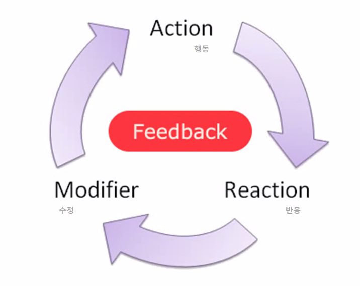

# UX / UI 서비스 기획

## 수업에 관하여 

### 콘텐츠를 개발한다는 것은
- 우리의 삶을 더 편하게 만드는 것 
- UX 콘텐츠는 모바일만 있는 것이 아니다...
- UX 콘텐츠들이 많아 짐에 따라 문화들의 융합이 일어났다
- 기술을 통한 행복한 삶 만들기
- 우리는 기초적인 단계 앱 개발을 위한 [기획]과 [실행]을 한다

### 기획
1. 문제 찾고 조사하기
2. 생각을 구체화하기
3. 해결방안 찾기
4. 시각화 하기 

## UX/UI의 이해 
### UX (User Experience)
- 사용자 경험이라는 총체적인 관점으로 컨셉을 잡고 개발방향을 정하기
    - 사용자의 니즈에 의한 개발 방향 

### UI (User Interface)
- UX를 구현하는 제작단계에서 사용자에게 최적화되도록 디자인하기 
    - 사용자의 니즈를 충족시켜 주는 것
    - GUI: 그래픽 안에서 추가적인 기능을 하도록 하는 것 
### 디자이너
- 의도, 기획, 실행 
- 기획자와 디자이너가 합처진다 

## UX/UI 사례
- 은행에서 은행강도의 행동 지연을 위해 문을 안쪽으로 열게 했다.
- 범죄 예방 디자인: 공간 디자인의 색상을 파란색으로 했더니 범죄율이 낮아졌다. 하지만 우리 나라에서는 문화적으로 달랐기에 적용되지 않았다 
  - 사용자에 대한 조사가 중요하다 

## SNS 소개하기 (관심있는 문화를 돋보이게 하는 구성)
### 인스타그램
- 스토리 올리는 기능을 여행 일지의 목적으로 사용한다
- 포스팅 했던 스토리를 종합해서 올리는 하이라이트 기능을 사용하여 사진들을 엮어서 올린다. 
- 친구에게 보여주는 목적도 있지만 사진첩에 중구난방으로 있는 사진들을 정리하고 코멘트를 붙여서 올려 놓는게 나중에 봤을때 훨씬더 회상하기가 좋다. 
- 여행 자료들을 아카이브 시켜놓는다 

## UX/UI의 세가지 요소
### 사용성과 기능성 
- 과거 물자가 귀해서 선택을 강요 받던 시대에서는 기능성에 중심을 주었지만, 지금은 선택을 하는 사용자의 사용성이 중요하다 

### 피드백 

- 행동에 대한 반응과 수정 
- 즉각적인 반응과 적용 --> 컨텐츠의 성공
  - 현상의 이해 
  - 니즈의 변화파악
  - 소비자 만족제고

### 의미의 전달
- 숨어있는 정보를 찾기 위해서 다양한 리서치와 모델평가를 진행한다
  - 다양한 리서치과정을 통해 의미있는 정보를 캐내야 한다 
- 의미를 캐내는 과정은 스토리, 스토리텔링이 중요하다
  - 서비스를 사용하는 사람을 감동시켜야 한다 
- 주장하기 위해서는 근거를 대지만 느낌을 전달하려면 인간성을 입증해야 한다 
  - 유머와 재미 감동으로 인간적ㅇ니 감성에 어필해야 한다 

## 문고리 디자인 하기
- 특별한 상황을 설정한다
  - 손을 사용하여 문을 열 수 없는 모든 상황
  - 은행의 보안 목적과 다르게 밀고 나가는 게 신속해야 하는 상황 (배달, 택배)
- 사용자의 행동을 인식한다
  - 발로 가볍게 누른다 
- 적합한 디자인을 시행한다.

## 문화 콘텐츠란
- 재미있는 문화적인 요소를 디지털매체를 통해 사람들에게 전달하여 상업적 이윤을 창출하는 것 
### UI
- 명령어나 기법을 이용한 사용자 인터페이스 
  - voice
  - geusture 
  - eye tracking
  - brain waves

### 스마트 문화의 특징
- 수평적 구조와 아이디어가 핵심 
