# 알고리즘 특강
> 자료구조와 알고리즘 기본을 탄탄하게 

- 자료구조 기본개념 (요리 재료)
- 기본 알고리즘 (재료 다듬기)
- 파이썬 프로그래밍
- 현업 알고리즘 문제 테스트 

- 취업시 필요한 것
  - 도메인 지식(전문 지식) + 인공지능/빅데이터 + 코딩능력 --> 자료구조/알고리즘
  - 프로그래밍 능력 --> 체력 --> 네트워크, DB, 자료구조/알고리즘 
  
  tech4321!

## chapter1: 자료구조와 알고리즘 소개
  - 자료구조: 그릇(자료)을 효율적으로 관리하는 방법
    - 컴퓨터 분야에서 효율적으로 접근하고 수정할 수 있도록 자료를 구성 · 관리 · 저장하는 것

    - 선형 자료구조
      - 리스트 
        - (순차) 선형 리스트: 
          - 배열: 따다닥 붙어 있음/틈이 없다/데이터의 삽입*삭제 오버헤드0/ 메모리(공간) 절약/ 모든 데이터의 접근 빠름
          - 데이터의 수정 삭제가 없고 양이 적으면 이게 좋다 
          - 예) 신문데이터, 고전소설 연대별 --> 시계열 데이터
        - (단순) 연결 리스트: 
          - 노리적 따다닥/물리적 멀리/ 노드(데이터+링크) /삽입/삭제 오버헤드 x 
          - 삽입/삭제가 빈번하고, 데이터 양이 많으면 이게 좋다
        - (원형) 연결 리스트: 
          - 꼬리가 다시 머리를 무는 형상
      - 스택: 한쪽이 막힌 구조 
        - push(), pop(), top / isStackFull(), isStackEmpty()
      - 큐: 
        - 일반 큐: 양족이 뚫린 구조
        - 원형 큐

    - 비션형 자료구조
      - 트리: 개념/ 이진 탐색 트리
      - 그래프: 개념/ 인접 행렬

  - 알고리즘: 목적지까지 최적의 이동 경로를 찾는 방법
    - 컴퓨터 분야나 수학 등 관련 분야에서 어떤 문제를 해결하기 위해 정해진 일련의 단계적인 절차나 방법

    - 정렬: 선택 정렬
    - 검색: 순차 검색, 이진 검색
    - 재귀 --> 스스로 이해. 실습
  


### 자료구조의 종류
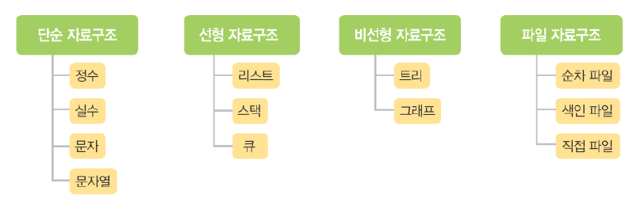
- 선형: 데이터를 한 줄로 순차적으로 표현한 형태. 
  - 선형 리스트, 연결 리스트, 스택, 큐

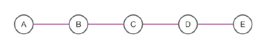

- 비선형: 하나의 데이터 뒤에 여러 개가 이어지는 형태
  - 트리와 그래프 

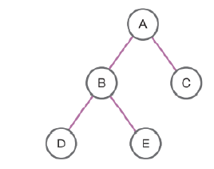


### 알고리즘
- 어떤 문제를 해결해 가는 논리적인 과정
- 예) 트럭에는 최대 7 톤의 무게를 실을 수 있고 단 1 회만 운송할 수 있다면 , 선호도 합이 최대가 되도록 동
물을 태우는 방법은?

- 표현법 
  - 일반 언어 표현: 일반적인 자연어를 사용해서 설명하듯이 알고리즘을 표현
  - 순서도를 이용한 표현: 여러 종류의 상자와 상자를 이어 주는 화살표를 이용해서 명령 순서를 표현
  - 의사코드를 이용한 표현: 프로그램 코드와 일반 언어의 중간 형태 (여러가지의 코드를 변환될 수 있다)
  - 프로그램 코드로 표현: 실제로 사용하는 프로그래밍 언어의 코드로 바로 작성 가능
  - 혼합 형태: 복잡한 알고리즘은 일반 언어 , 의사코드 , 순서도 , 그림 등을 종합적으로 활용해서 표현

- 알고리즘 성능 측정
  - 알고리즘을 소요 시간을 기준으로 알고리즘 성능을 분석 방법이 ‘시간 복잡도 (Time Complexity)'

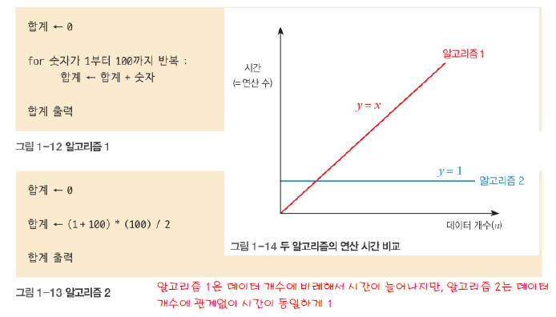

- 알고리즘 성능 표기
  - 빅 오 표기법 Big Oh Notation) 으로 O(f(n)) 형태
  - 대표적인 함수는 O(1), O(log n), O(n), O(n log n), O(n 2 ), O(n 3 ), O(2 n ) 정도가
  + 오른쪽으로 갈 수록 좋은 알고리즘이지만 구현이 어렵다 
  + 또한 데이터 건수가 작기에 시간의 차이가 별로 없어서 왼쪽으로 빨리 구현하는게 좋을 수 도 있다.
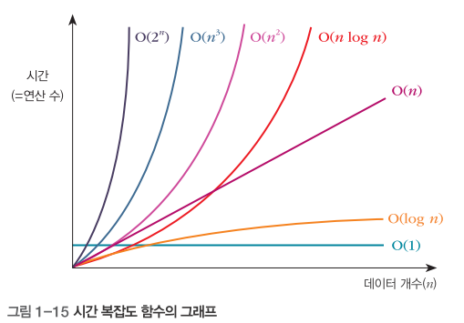
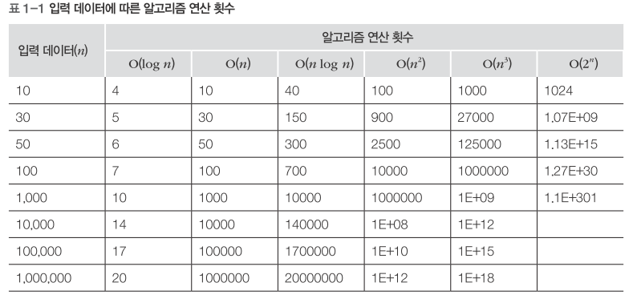


### 자료구조와 알고리즘과 프로그램의 관계
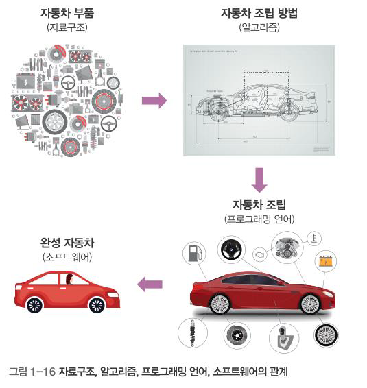
- 자료구조 --> 알고리즘 --> 프로그래밍 언어 --> 소프트웨어


## Chapter3: 선형 리스트
---
### 정의 
- 데이터를 일정한 순서로 나열한 자료구조
- 순차 리스트(Ordered List)라고도 함
- 선형 리스트는 입력 순서대로 저장하는 데이터에 적당

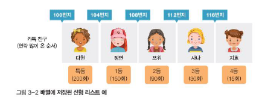
- 카톡으로 연락 온 친구를 배열을 이용하여 표현 
  - 배열: 빈틈이 없이 붙어있다 

### 선형 리스트의 원리
- 데이터 삽입
  - 미나의 데이터를 중간에 삽입해야 한다
  
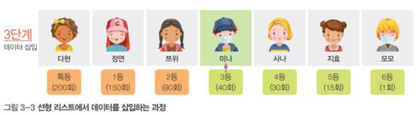

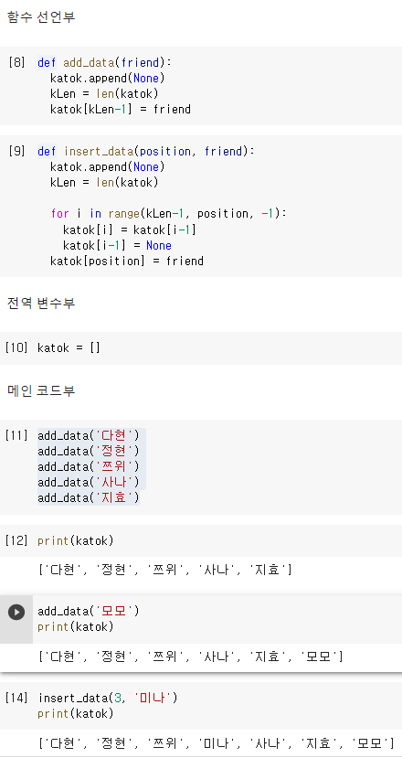

- 데이터 삭제
  - 앞의 데이터를 삭제하면 뒤에있는 데이터가 순차적으로 앞으로 온다

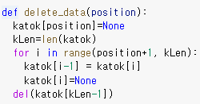

- 선형 리스트 일반 구현 
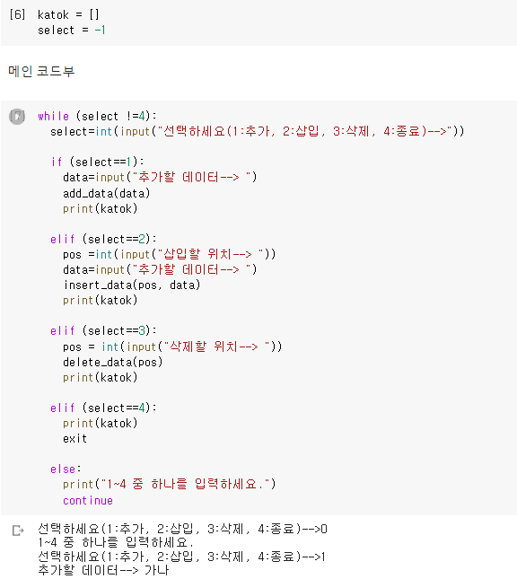


## 단순 연결 리스트 
---
### 개념 
> 데이터를 화살표로 연결한 것 
- 노드들이 물리적으로 떨어진 곳에 위치
- 각 노드의 번지도 순차적이지 않음 
- 화살표로 표시된 연결(링크, Link)을 따라가면 선형 리스트 순서와 같음 

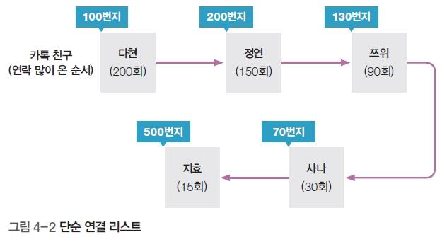

- 데이터를 삽입/삭제할 때
  - 선형 리스트는 많은 작업이 필요 (오버헤드 발생)
    - 데이터량이 적으면 효율
  - 단순 연결 리스트는 해당 노드의 앞뒤 링크만 수정하면 되므로 오버헤드가 거의 발생하지 않음
    - 데이터량이 많으면 효율

### 단순 연결 리스트의 원리
- 노드 구조
  - 단순 연결 리스트는 다음 데이터를 가리키는 링크가 더 필요
  - 노드 ( 는 데이터와 링크로 구성된 항목

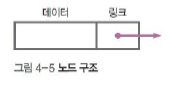
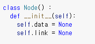

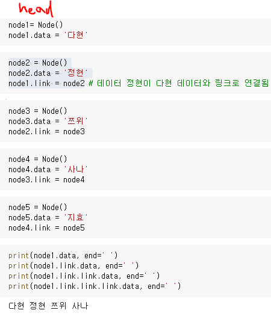
- 첫번째 노드 (head) 있으면 된다 

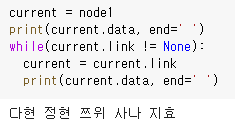
- current 변수를 만들어 while 을 만든다 


### 삽입

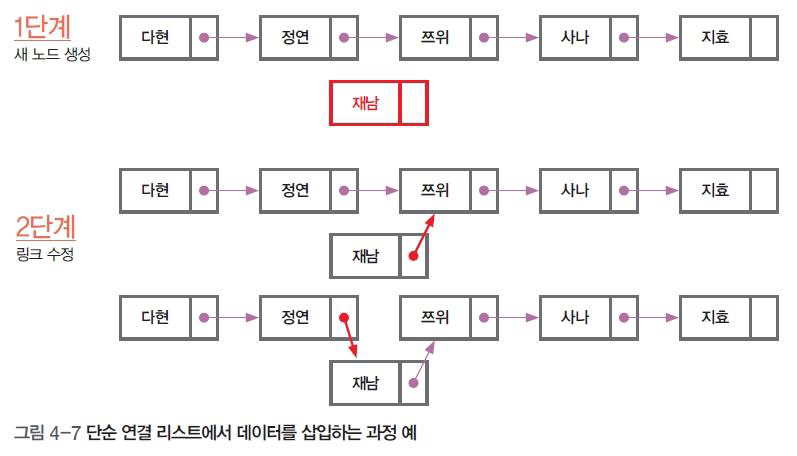
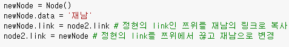

### 삭제 

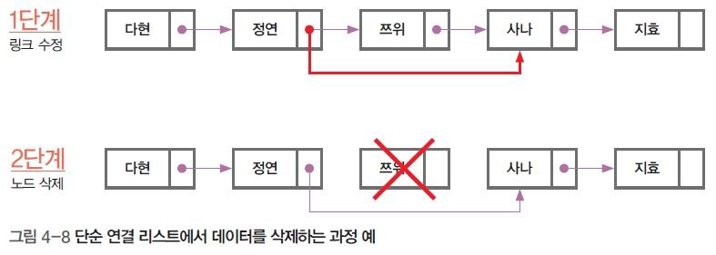
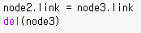


## 실무버전 연결 리스트 일반 구현 
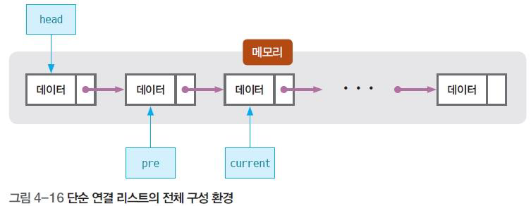
- head: 첫 번째 노드를 가리킨다
- current: 지금 처리 중인 노드를 가리킨다
- pre: 현재 처리중인 노드의 바로 앞 노드를 가리킴
  
- 무조건 head는 따로 만든다

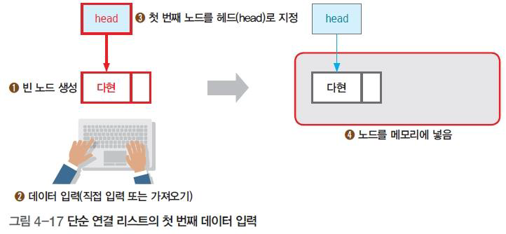
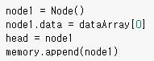

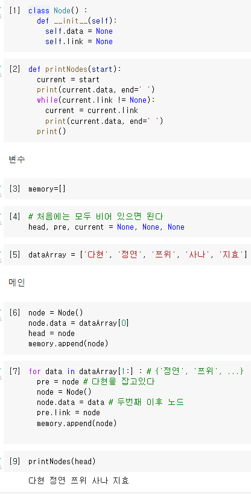


### 삽입: 첫번째 노드
- 새 노드(화사)를 생성한다
- 새 노드의 링크로 ehad 노드가 가리키는 노드를 지정한다 
- 헤드 노드를 새 노드로 지정한다 
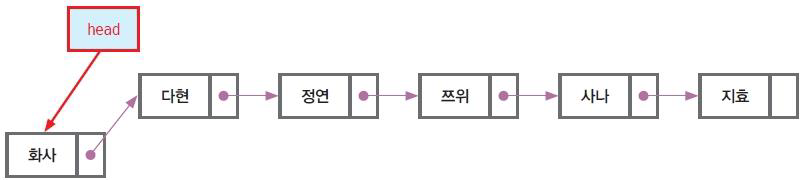
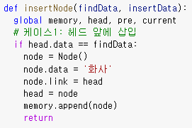

### 삽입: 중간 노드 삽입 
- 헤드에서 시작해서 current 노드가 사나인지 확인
- current 노드를 pre 노드로 지정하고, 현재 노드를 다음 노드로 이동한다. 그리고 현재 노드가 사나인지 확인한다.  
- 현재 노드가 사나일때 까지 반복한다
- 현재 노드가 사나라면 우선 새 노드를 생성한 후 이전 노드의 링크를 새 노드의 링크로 지정한다
- 이전 노드의 링크를 새 노드로 지정한다.

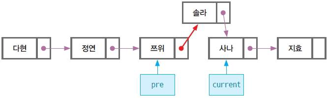
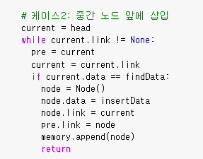


### 삽입: 마지막 노드 삽입
- 중간 노드 삽입 과정과 동일하므로 없는 데이터인 재남을 찾는다.
- 마지막 노드까지 재남을 찾지 못했다면 우선 새 노드를 생성 후 current 노드의 링크를 새 노드로 지정한다. 

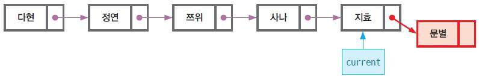
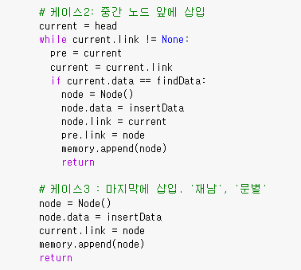


### 노드 삭제
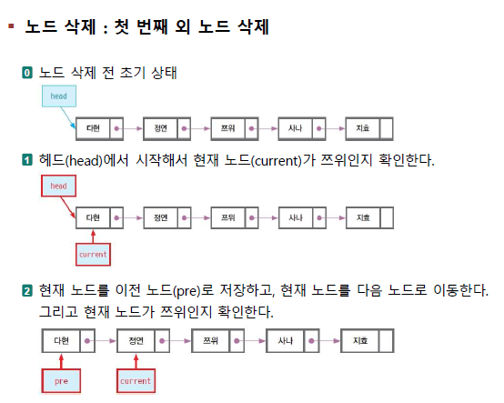
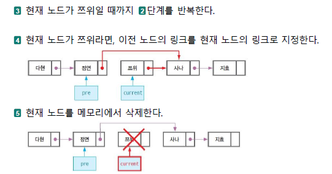
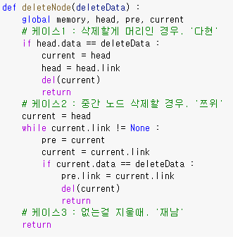


### 노드 검색
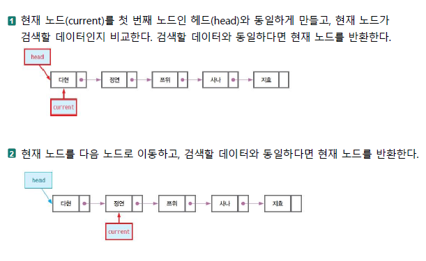
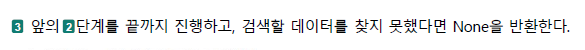
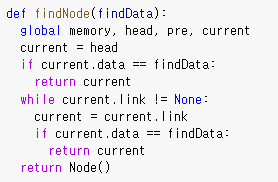


### 연결 리스트 최종본
```python
## 함수
class Node() :
    def __init__(self):
        self.data = None
        self.link = None

def printNodes(start) :
    current = start
    print(current.data, end=' ')
    while (current.link != None):
        current = current.link
        print(current.data, end=' ')
    print()

def insertNode(findData, insertData) :
    global  memory, head, pre, current
    #케이스1 : 헤드 앞에 삽입  '다현', '화사'
    if head.data == findData :
        node = Node()
        node.data = '화사'
        node.link = head
        head = node
        memory.append(node)
        return
    # 케이스2 : 중간노드 앞에 삽입. '사나', '솔라'
    current = head
    while current.link != None :
        pre = current
        current = current.link
        if current.data == findData :
            node = Node()
            node.data = insertData
            node.link = current
            pre.link = node
            memory.append(node)
            return
    # 케이스3 : 마지막에 삽입. '재남', '문별'
    node = Node()
    node.data = insertData
    current.link = node
    memory.append(node)
    return

def deleteNode(deleteData) :
    global memory, head, pre, current
    # 케이스1 : 삭제할게 머리인 경우. '다현'
    if head.data == deleteData :
        current = head
        head = head.link
        del(current)
        return
    # 케이스2 : 중간 노드 삭제할 경우. '쯔위'
    current = head
    while current.link != None :
        pre = current
        current = current.link
        if current.data == deleteData :
            pre.link = current.link
            del(current)
            return
    # 케이스3 : 없는걸 지울때. '재남'
    return

def findNode(findData):
    global memory, head, pre, current
    current = head
    if current.data == findData :
        return current
    while current.link != None :
        current = current.link
        if current.data == findData:
            return current
    return Node()

## 변수
memory=[]
head, pre, current = None, None, None
dataArray = ['다현', '정연', '쯔위', '사나', '지효']

## 메인
node = Node()
node.data = dataArray[0]
head  = node
memory.append(node)

for  data in dataArray[1:] : # ['정연', '쯔위'.....
    pre = node
    node = Node()
    node.data = data
    pre.link = node
    memory.append(node)

printNodes(head)

# insertNode('다현', '화사')
# printNodes(head)
# insertNode('사나', '솔라')
# printNodes(head)
# insertNode('재남', '문별')
# printNodes(head)

# deleteNode('다현')
# printNodes(head)
# deleteNode('쯔위')
# printNodes(head)
# deleteNode('재남')
# printNodes(head)

fNode = findNode('사나')
print(fNode.data)
fNode = findNode('재남')
print(fNode.data)
```


## Chapter5: 원형 연결 리스트
---
> 시작 위치와 다음 위치가 계속 이어진 후 마지막에 다시 시작으로 돌아오는 형태

### 개념
- 단순 연결 리스트와 구조와 구현 코드가 상당히 유사
- 리스트 형태가 원(Circle) 형태로 구성(계속 회전하면서 연속 가능)
- 오버헤드가 발생하지 않음

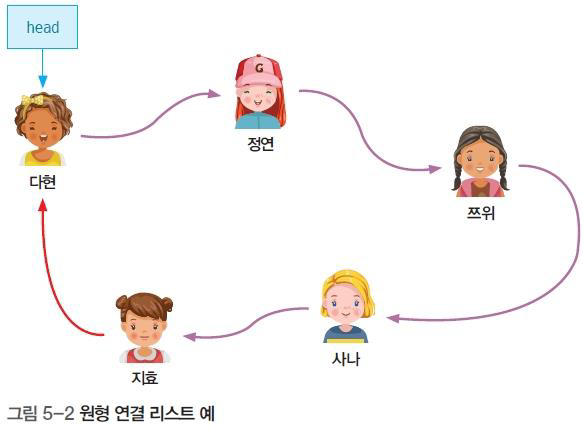
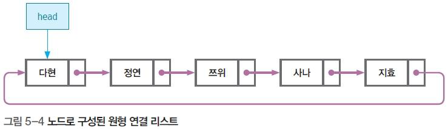
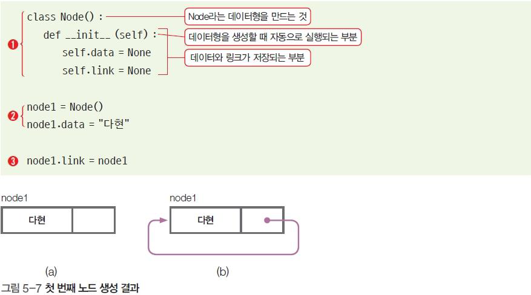
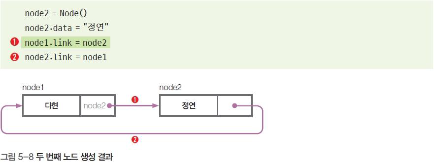


## 스택
---

### 개념
- 아이스크림 콘에 여러 가지 맛을 쌓을 때, 가장 먼저 넣은 맛을 가장 나중에 먹을 수 있는 구조 
- 스택(Stack) 자료구조는 한쪽 끝이 막힌 형태(ex : 한쪽 끝이 막힌 주차장, 종이컵 수거함 등)
- 입구가 하나이기 때문에 먼저 들어간 것이 가장 나중에 나오는 구조(선입후출, 후입선출)

### 원리
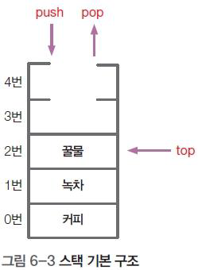

- 스택에 데이터를 삽입하는 작동 : push


- top의 초깃값 = -1

- 스택에 데이터를 추출하는 작동 : pop

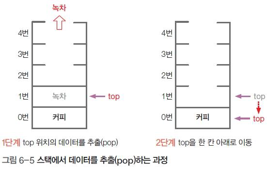

- 스택에 들어 있는 가장 위의 데이터 : top


### 생성
- 배열 크기를 지정한 후 빈 스택 생성

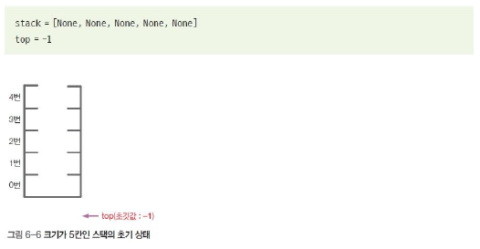

- 데이터 삽입: push
  
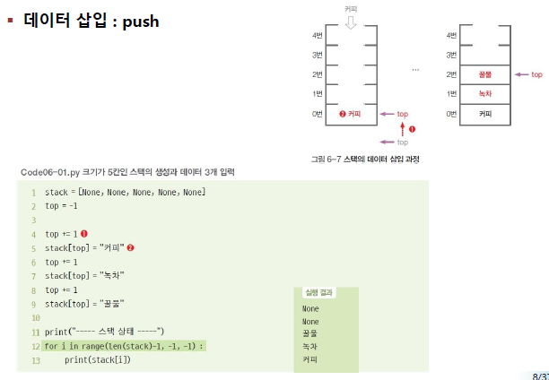

- 데이터 추출: pop

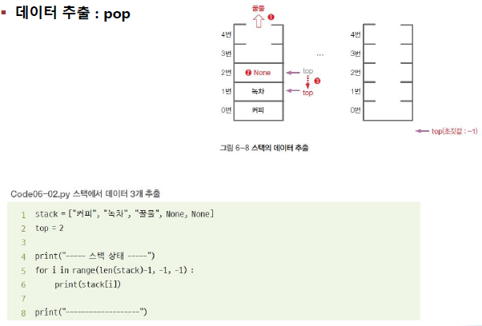

### 스택이 꽉 찾는지 확인하는 함수

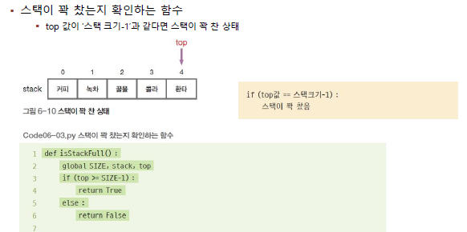


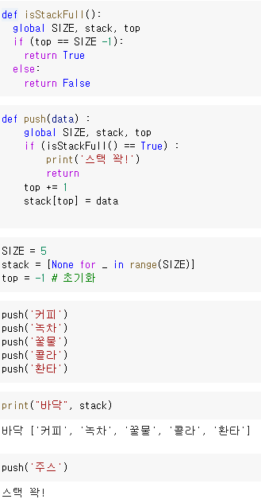

### 데이터 추출 과정
- 스택이 비었는지 확인하는 합수 

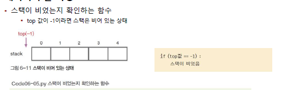
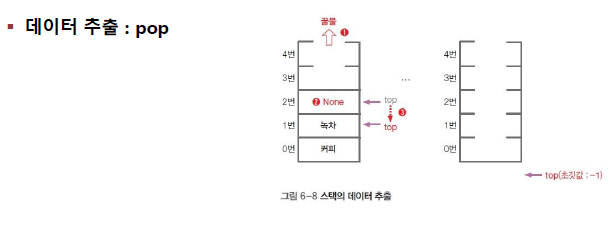


### 데이터 확인
- top 위치의 데이터를 확인만 하고 스택에 그대로 두는 것 : 픽


### 완성본
```python
## 함수
def isStackFull() :
    global SIZE, stack, top
    if (top == SIZE-1) :
        return True
    else :
        return False

def push(data) :
    global SIZE, stack, top
    if (isStackFull()) :
        print('스택 꽉!')
        return
    top += 1
    stack[top] = data

def isStackEmpty() :
    global SIZE, stack, top
    if (top == -1) :
        return True
    else :
        return False

def pop() :
    global SIZE, stack, top
    if (isStackEmpty()) :
        print('스택 텅~')
        return None
    data = stack[top]
    stack[top] = None
    top -= 1
    return data

def peek() :
    global SIZE, stack, top
    if (isStackEmpty()) :
        print('스택 텅~')
        return None
    return stack[top]

## 변수
SIZE = 5
stack = [None for _ in range(SIZE)]
top = -1

## 메인
push('커피')
push('녹차')
push('꿀물')
push('콜라')
push('환타')
print('바닥:', stack)

push('게토레이')
print('바닥:', stack)

retData = pop()
print('팝 -->', retData)

retData = peek()
print('다음 나올 음료 -->', retData)

retData = pop()
print('팝 -->', retData)
retData = pop()
print('팝 -->', retData)
retData = pop()
print('팝 -->', retData)
retData = pop()
print('팝 -->', retData)
print('바닥:', stack)

retData = pop()
print('팝 -->', retData)
print('바닥:', stack)
```


# 코딩 테스트

## 문제


## 풀이

```python
ARRAY_LENGTH = 5  # 배열의 행과 열 크기(고정)

def replaceData(numData): # numData	2차원 정수 배열
    retData = [] # 조건에 따라서 전처리된 2차원 배열

    ###########   여기부터 코딩 (1) ---------------->
    retData = numData[:]
    for i in range(5) :
        for k in range(5) :
            if (retData[i][k] < 0) :
                retData[i][k] = 0
            if (retData[i][k] > 100) :
                retData[i][k] = retData[i][k] % 100
    ###########   <-------------- 여기까지 코딩 (1)

    return retData


# 2x2 크기의 배열의 최대합을 구한다.
def getMaxSum(numData): # 요구 사항에 맞춰 처리된 2차원 정수 배열
    maxSum = 0 # 최대합

    ###########   여기부터 코딩 (2) ---------------->
    for i in range(4) :
        for k in range(4) :
            hap = numData[i][k] +numData[i][k+1] + numData[i+1][k] + numData[i+1][k+1]
            if (maxSum < hap) :
                maxSum = hap
    ###########   <-------------- 여기까지 코딩 (2)

    return maxSum

## 전역 변수 선언 부분
numData =[] # 5x5 배열
ARRAY_LENGTH = 5 # 배열의 행과 열 크기(고정)

def main() :
        global numData

        loadData() # 2차원 배열 읽어오기

        ## 원본 출력
        print(' ----- 초기 배열 -----')
        printData()

        # 1. 데이터 치환 작업
        numData = replaceData(numData)
        print(' ----- 치환 후 배열 -----')
        printData()

        # 2. 최대 합 구하기.(2x2 크기)
        maxSum = getMaxSum(numData)
        print('최대 영역의 합: %d' % maxSum)

       
## 함수 선언 부분
def  loadData() : # 데이터 불러오기
    global numData

    ###########
    # 제공 데이터 세트 1 
    # 5x5 숫자 배열. 
    ###########
    numData = \
    [
        [ 5, 7, -5, 100, 73 ],
        [ 35, 23, 4, 190, 33 ],
        [ 49, 85, 662, 39, 81 ],
        [ 124, -59, 86, 46, 52 ],
        [ 27, 7, 8, 33, -56 ] 
    ]
    
    

def printData() :
        for i in range(0, ARRAY_LENGTH) :
                for k in range(0, ARRAY_LENGTH) :
                        try :
                                print("%5d" % numData[i][k], end='')
                        except :
                                pass
                print()
        print('--------------------------------------')

## 메인 함수 호출 ##
if __name__ == "__main__" :
    main()
```

## output

