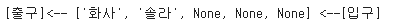
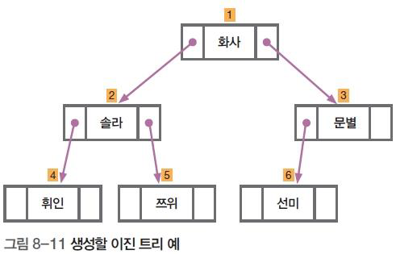
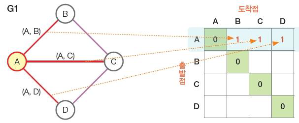
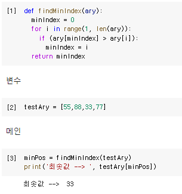
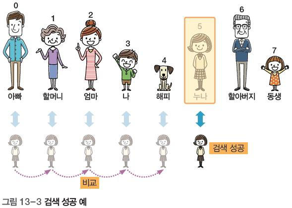

# 자료구조와 알고리즘2

## 정리

### 자료구조: 요리의 재료 + 다듬는 법

#### 선형 
- 리스트
  - 순차 리스트 (=선형 리스트)
    - 배열. 따닥 붙어있다. 공간절약. 접근빠름. 삽입/삭제시 오버헤드O
    - 시계열 데이터: 신문기사...
  - 단순 연결 리스트
    - 논리 따닥. 물리적 멀리. 노드(데이터+링크). 공간 추가필요. 접근 느림. 오버헤드X. 마지막 링크= None
  - 원형 연결 리스트
    - 마지막이 헤드와 연결됨 
- 스택
  - 한쪽이 막힌 구조. FILO (first in last out). push(). pop(). top. isStackFull(). isStackEmpty()
  - A --> B --> B. 괄호검사. 컴파일러 구문분석
- 큐
  - 일반큐
    - 양쪽이 뚫린 파이프 FIFO
    - enQueue(), deQueue(), front, rear... 오버헤드
    - 스케쥴러 
    - 비었다: front==reaer, 꽉참: rear == SIZE-1...
  - 원형큐
    - 꼬리와 머리를 잇기. %SIZE, top = rear = 0, 1칸 사용 X
    - 꽉참: rear+1 == front
#### 비선형
- 트리
  - 이진 탐색 트리 
    - 작은거 왼쪽, 큰거 오른쪽
    - root, node, 차수, 서브트리... 이진트리, TreeNode(left, data, right) --> 이진 탐색 트리
- 그래프
  - 인접 행렬 (2차원 배열)
  - 길찾기, 도로망도 구현하기


### 알고리즘: 요리법
#### 정렬: 순서대로 나열 
- 선택 정렬
  - 방2개/ 방2개 --> 퀵정렬 공부하기 

#### 검색
- 순차 검색: 데이터 정렬 X
- 이진 검색:데이터 정렬 o O(log n)
- 재귀

## 큐
---
> 먼저 들어간 것이 먼저 나오는 구조 / 입구와 출구가 따로 있는 원통 형태 

### 구조와 용어
- 큐에 데이터를 삽입하는 작동 : enQueue(인큐)
- 데이터를 추출하는 작동 : deQueue(데큐)
- 저장된 데이터 중 첫 번째 데이터 : front(머리)
- 저장된 데이터 중 마지막 데이터 : rear(꼬리)


- enQueue

.png)

- deQueue


```python
## 변수
SIZE=5
queue = [None for _ in range(SIZE)]
front = rear = -1

## 메인
# enQueue
rear += 1
queue[rear] = '화사'
rear += 1
queue[rear] = '솔라'
print('[출구]<--', queue, '<--[입구]')

# deQueue
front += 1
data = queue[front]
queue[front] = None
print('식사 손님:', data)

front += 1
data = queue[front]
queue[front] = None
print('식사 손님:', data)
print('[출구]<--', queue, '<--[입구]')
```




### overflow: 큐가 꽉/ 큐 텅 확인


```python
## 함수
def isQueueFull() :
    global SIZE, queue, front, rear
    if (rear == SIZE-1) :
        return True
    else :
        return False

def enQueue(data) :
    global SIZE, queue, front, rear
    if (isQueueFull()) :
        print('큐 꽉!')
        return
    rear += 1
    queue[rear] = data

def isQueueEmpty() :
    global SIZE, queue, front, rear
    if (front == rear) :
        return True
    else :
        return False

def deQueue() :
    global SIZE, queue, front, rear
    if (isQueueEmpty()) :
        print('큐 텅~')
        return None
    front += 1
    data = queue[front]
    queue[front] = None
    return data

def peek() :
    global SIZE, queue, front, rear
    if (isQueueEmpty()) :
        print('큐 텅~')
        return None
    return queue[front+1]
## 변수
SIZE=5
queue = [None for _ in range(SIZE)]
front = rear = -1

## 메인
enQueue('화사')
enQueue('솔라')
enQueue('문별')
# enQueue('휘인')
# enQueue('선미') # 원더걸스
print('[출구]<--', queue, '<--[입구]')

# enQueue('재남')
# print('[출구]<--', queue, '<--[입구]')

retData = deQueue()
print('식사손님 :', retData)
retData = peek()
print('준비하세요....', retData)
retData = deQueue()
print('식사손님 :', retData)
retData = deQueue()
print('식사손님 :', retData)
retData = deQueue()
print('식사손님 :', retData)
print('[출구]<--', queue, '<--[입구]')
```


.png)

### 기능 통합 버전 개선
- 꽉 차고 나간 상태에서 다시 들어올 수 있게 하는 방법
- 1명이 들어올 때 마다 한명씩 앞으로 땡긴다 


```python
## 함수
def isQueueFull() :
    global SIZE, queue, front, rear
    if (rear != SIZE-1) :
        return False
    elif (rear == SIZE-1 and front == -1) :
        return True
    else :
        for i in range(front+1, SIZE) :
            queue[i-1] = queue[i]
            queue[i] = None
        front -= 1
        rear -= 1
        return False

def enQueue(data) :
    global SIZE, queue, front, rear
    if (isQueueFull()) :
        print('큐 꽉!')
        return
    rear += 1
    queue[rear] = data

def isQueueEmpty() :
    global SIZE, queue, front, rear
    if (front == rear) :
        return True
    else :
        return False

def deQueue() :
    global SIZE, queue, front, rear
    if (isQueueEmpty()) :
        print('큐 텅~')
        return None
    front += 1
    data = queue[front]
    queue[front] = None
    return data

def peek() :
    global SIZE, queue, front, rear
    if (isQueueEmpty()) :
        print('큐 텅~')
        return None
    return queue[front+1]
## 변수
SIZE=5
queue = [None for _ in range(SIZE)]
front = rear = -1

## 메인
enQueue('화사')
enQueue('솔라')
enQueue('문별')
enQueue('휘인')
enQueue('선미') # 원더걸스
print('[출구]<--', queue, '<--[입구]')


retData = deQueue()
print('식사손님 :', retData)
retData = deQueue()
print('식사손님 :', retData)
print('[출구]<--', queue, '<--[입구]')

enQueue('제니')
print('[출구]<--', queue, '<--[입구]')
enQueue('재남')
print('[출구]<--', queue, '<--[입구]')

enQueue('집에가')
print('[출구]<--', queue, '<--[입구]')
```


### 100만개의 큐를 앞으로 땡기면  overhead 발생
## 원형 큐
- 순차 큐를 구부려서 끝을 이은 원형 큐
- 오버헤드가 발생하지 않음 


- 초기화
  - rear = front = 0
- 비었다
  - front == rear
- 꽉참
  - (rear +1) % SIZE = front


```python
## 함수
def isQueueFull() :
    global SIZE, queue, front, rear
    if ( (rear+1)%SIZE == front) :
        return True
    else :
        return False

def enQueue(data) :
    global SIZE, queue, front, rear
    if (isQueueFull()) :
        print('큐 꽉!')
        return
    rear = (rear + 1) %SIZE
    queue[rear] = data

def isQueueEmpty() :
    global SIZE, queue, front, rear
    if (front == rear) :
        return True
    else :
        return False

def deQueue() :
    global SIZE, queue, front, rear
    if (isQueueEmpty()) :
        print('큐 텅~')
        return None
    front = (front + 1) % SIZE
    data = queue[front]
    queue[front] = None
    return data

def peek() :
    global SIZE, queue, front, rear
    if (isQueueEmpty()) :
        print('큐 텅~')
        return None
    return queue[(front + 1) % SIZE]
## 변수
SIZE=5
queue = [None for _ in range(SIZE)]
front = rear = 0

## 메인
enQueue('화사')
enQueue('솔라')
enQueue('문별')
enQueue('휘인')
enQueue('선미') # 원더걸스
print('[출구]<--', queue, '<--[입구]')


retData = deQueue()
print('식사손님 :', retData)
retData = deQueue()
print('식사손님 :', retData)
print('[출구]<--', queue, '<--[입구]')
#
enQueue('제니')
print('[출구]<--', queue, '<--[입구]')
enQueue('재남')
print('[출구]<--', queue, '<--[입구]')
#
enQueue('집에가')
print('[출구]<--', queue, '<--[입구]')
```

## 트리 (비선형)
---
> 컴퓨터의 상위 폴더 안에 하위 폴더들이 계속 이어져 있는 구조와 같은 구성
- 나무를 거꾸로 뒤집어 놓은 형태 


- 루트: 맨 위
- 차수: 자식의 개수
- 부모/자식 노드는 상대적이다 
- 리프노드: 차수가 0인 노드

- 이진트리: 모든 노드의 자식이 최대 2개인 트리(자식이 2개 이하의 구성)


- 왼쪽 서브 트리
- 오른쪽 서브 트리 

### 종류
- 포화 이진트리: 자리가 꽉 차 있다
- 완전 이진트리: 이빨은 빠졌지만 번호가 맞다
- 일반 이진트리: 이빨도 빠지고 번호도 안맞다
- 편향 이진트리: 한쪽으로만 가는 트리 


### 노드 구조


- 높이가 2고 데이터가 6인 완전 이진 트리 생성 




### 이진 삼진 트리 
- 이진 트리 중 활용도가 높은 트리로, 데이터 크기를 기준으로 일정 형태로 구성 


- 이진 탐색 트리 특징
1. 왼쪽 서브 트리는 루트 노드보다 모두 작은 값을 가진다
2. 오른쪽 서브 트리는 루트 노드보다 모두 큰 값을 가진다
3. 각 서브 트리도 ➊ , ➋ 특징을 갖는다
4. 모든 노드 값은 중복되지 않는다 . 즉 , 중복된 값은 이진 탐색 트리에 저장할 수 없다


### 이진 탐색 트리에서 데이터 검색
1. 찾고자 하는 마마무를 루트 노드의 데이터와 비교한다 . 마마무가 루트 노드의 데이터보다
작아 왼쪽으로 이동한다 .


2. 왼쪽 서브 트리에서도 동일하게 처리한다 . 찾고자 하는 마마무가 왼쪽 서브 트리의 루트
노드보다 커 오른쪽으로 이동한다 .


3. 오른쪽 서브 트리에서도 동일하게 처리한다 . 그런데 여기에서는 마마무를 찾았으므로
종료한다 .


### 이진 탐색 트리에서 데이터 삭제 


## 그래프
---
> 버스 정류장과 여러 노선이 함께 포함된 형태 또는, 링크드인(Linked in)과 같은 사회 관계망 서비스의 연결 등의 형태
- 여러 노드가 서로 연결된 자료구조

### 무방향 그래프
- 간선에 방향성이 없는 그래프 
  


### 가중치 그래프
- 간선마다 가중치가 다르게 부여된 그래프


### 깊이 우선 탐색의 작동 

- 그래프의 모든 정점을 한 번씩 방문하는 것을 그래프 순회(Graph Traversal)라고 함
- 그래프 순회 방식은 깊이 우선 탐색, 너비 우선 탐색이 대표적


### 그래프의 인접 행렬 표현 (2차원 배열)
- 그래프를 코드로 구현할 때는 인접 행렬을 사용
- 인접 행렬은 정방형으로 구성된 행렬로 정점이 4개인 그래프는 4×4로 표현


==


- 무방향 그래프의 인접 행렬은 대각선을 기준으로 서로 대칭된다.


# 알고리즘

## 정렬
> 순서대로 데이터가 나열되어 있는 것 
- 중요 알고리즘 중 하나인 정렬(soft)은 자료들을 일정한 순서대로 나열한 것 

### 정렬 알고리즘 종류
- 오름차순 정렬이든 내림차순 정렬이든 결과의 형태만 다를 뿐이지 같은 방식으로 처리됨
- 정렬하는 방법에 대한 정렬 알고리즘은 수십 가지
    - 선택 정렬(Selection Sort)
    - 삽입 정렬(Insertion Sort)
    - 버블 정렬(Bubble Sort)
    - 퀵 정렬(Quick Sort)

### 선택 정력
- 여러 데이터 중에서 가장 작은 값을 뽑는 작동을 반복하여 값을 정렬
- 최솟값 찾기
  1. 배열의 첫 번째 값을 가장 작은 값으로 지정한다.
  2. 가장 작은 값으로 지정한 값을 다음 차례의 값과 비교하여 가장 작은 값을 변경하거나 그대로 두는 방법으로
  3. 마지막 값까지 비교를 마친 후 현재 가장 작은 값으로 지정된 값을 가장 작은 값으로 결정한다.



- 완전 버전
```python
import random
def findMinIndex(ary) :
    minIndex = 0
    for i in range(1, len(ary)) :
        if (ary[minIndex] > ary[i]) :
            minIndex = i
    return  minIndex

## 변수
before = [random.randint(10, 200) for _  in range(200)]
after = []

## 메인
print('정렬 전-->', before)
for i in range(len(before)) :
    minPos = findMinIndex(before)
    after.append(before[minPos])
    del(before[minPos])
print('정렬 후-->', after)
```


### 두 변수 값 교환
- 알고리즘을 구현할 때는 두 변수 값을 교환해야 하는 경우가 종종 생기는데, 원칙적으로 한 번에 두 변수의 값을
교환할 수 없으므로, 임시 공간을 사용해야 함


### 개선된 선택 정력 구현(데이터 4개를 정렬하는 예)
- 데이터가 4개이므로 (b)와 같이 총 3회의 사이클이 필요함


- 먼저 사이클1 중 맨 앞의 값을 가장 작은 값으로 지정한 후 나머지 값과 비교해서 제일 작은 값을 찾음
  


```python
import random
def selectionSort(ary) :
    n = len(ary)

    for i in range (0, n-1) :
        minIndex = i
        for k in range(i+1, n) :
            if (ary[minIndex] > ary[k]) :
                minIndex = k
        ary[i], ary[minIndex] = ary[minIndex], ary[i]

    return ary


## 전역
dataAry = [random.randint(10, 200) for _  in range(20)]


## 메인
print('정렬 전-->', dataAry)
dataAry = selectionSort(dataAry)
print('정렬 후-->', dataAry)
```


## 검색
--- 
- 순차검색: 정렬이 안된 상태에서 찾기
  - 비효율적임
- 이진 검색: 정렬된 상태에서 빠르게 원하는 것을 찾을 수 있음 
    - 효율적임 
- 어떤 집합에서 원하는 것을 찾는 것으로, 탐색이라고도 함
- 검색에는 순차 검색, 이진 검색, 트리 검색 등이 있음
- 검색에 실패하면 -1을 반환하는 것이 일반적임

### 순차검색

```python
## 함수
import random
def seqSearch(ary, fData) :
    pos = -1
    size = len(ary)
    for i in range(size) :
        if (ary[i] == fData) :
            pos = i
            break
    return  pos

## 전역
dataAry = [random.randint(10, 200) for _  in range(20)]
findData = random.choice(dataAry)

## 메인
print('배열-->', dataAry)
position = seqSearch(dataAry, findData)
if position == -1 :
    print(findData, '없어요 ㅠㅠ')
else :
    print(findData, '는', position, '위치에 있음!!')
​
```


### 이진 검색
- 이진 검색은 전체를 반씩 잘라 내서 한쪽을 버리는 방식을 사용


1. 전체의 첫 데이터를 ‘시작’으로 지정하고, 마지막 데이터를 ‘끝’으로 지정한 후 시작과 끝의 중앙인 누나를 할머니와 비교한다.


2. 끝은 그대로 두고 시작을 중앙(누나)의 바로 오른쪽 이모로 옮긴다. 중앙(누나)의 오른쪽 그룹에서 다시 시작과
끝의 ½ 위치인 새 중앙(엄마)을 할머니와 비교한다.


3. 시작은 그대로 두고 끝을 중앙(엄마)의 바로 왼쪽인 할머니로 옮긴다. 중앙(엄마)의 왼쪽 그룹에서 다시 시작과
끝의 ½ 위치인 새 중앙(이모)을 할머니와 비교한다.


4. 끝은 그대로 두고 시작을 중앙(이모)의 바로 오른쪽으로 옮긴다. 중앙(이모)의 오른쪽 그룹에서 다시 시작과 끝의 ½ 위치인 새 중앙(할머니)을 할머니와 비교한다.


Big 0 표기법: log n 
```python
## 함수
import random
def binSearch(ary, fData) :
    pos = -1
    start = 0
    end = len(ary) -1
    while (start <= end) :
        mid = (start + end) // 2
        if fData == ary[mid] :
            pos = mid
            break
        elif fData > ary[mid] :
            start = mid + 1
        else :
            end = mid - 1

    return pos

## 전역
dataAry = [random.randint(10, 200) for _  in range(10)]
dataAry.sort()
findData = random.choice(dataAry)

## 메인
print('배열-->', dataAry)
position = binSearch(dataAry, findData)
if position == -1 :
    print(findData, '없어요 ㅠㅠ')
else :
    print(findData, '는', position, '위치에 있음!!')
```


## 재귀 호출
---
> 양쪽에 거울이 있을 때 거울에 비친 자신이 무한 반복해서 비치는 것 또는 마트료시카
인형처럼 동일한 작동을 무한적으로 반복하는 알고리즘을 말함

### 개념
- 재귀 호출(Recursion)은 자신을 다시 호출하는 것

- 일반적인 프로그램에서는 무한 반복을 마치고 되돌아가는 조건을 함께 사용함
    - 10회 반복 후 호출한 곳으로 다시 돌아가는 조건을 사용하는 예


- 7 행의 return 문을 만나면 어디로 돌아가는가 함수의 재귀 호출 방식 이해
  - 복사본이 있다고 생각하라
  


### 1~10 더하기 예제
```python
def addNumber (num):
  if num == 1:
    return 1
  return num + addNumber(num-1)

print(addNumber(10))
```


- 호출 하면서 동시에 계산한다고 생각하면 반환의 상상이 필요 없다.

### 펙토리얼 구하기


### countdown

